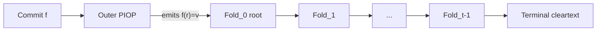

# The proving protocol

Akita is a **lattice-based** polynomial commitment scheme (PCS) for multilinear
polynomials. It follows the standard PCS interface — **commit**, then **open** —
but both steps live natively over a cyclotomic ring, not over the base field a
PIOP usually speaks. This page first bridges that gap, then sketches commit and
the leveled opening, then zooms into one fold. Deeper topics live in the
subpages linked at the end.

## From a field opening to a ring claim

A PIOP compiler typically asks the PCS to prove an evaluation over a
**field**: it supplies a multilinear polynomial
$f : \{0,1\}^\mu \to \mathbb{F}_q$ with $N = 2^\mu$ coefficients and a claim
$f(\mathbf{r}) = v$ at a public point $\mathbf{r} \in \mathbb{F}_{q^k}^\mu$ and
value $v \in \mathbb{F}_{q^k}$. Coefficients stay in the base field
$\mathbb{F}_q$ because that is where committed data is cheap; the point lives in
an extension large enough for soundness.

Lattice commitments, however, work over the power-of-two cyclotomic ring
$R_q = \mathbb{Z}_q[X]/(X^d + 1)$. Akita therefore does not run commit/open on
the raw field claim. Two reductions turn it into a claim about a multilinear
polynomial **over $R_q$**:

- **Extension-opening reduction** ($k > 1$). A short sum-check turns the mixed
  base-field / extension-point claim into an evaluation of a *packed* polynomial
  over $\mathbb{F}_{q^k}$ with $\log k$ fewer variables; at $k = 1$ it is a
  no-op. See [Extension-opening reduction](./extension-opening-reduction.md).
- **Field-to-ring embedding.** A conjugation-fixed subfield embedding $\psi$
  packs $d/k$ extension-field coefficients into one ring element, turning the
  $\mathbb{F}_{q^k}$ claim into a claim over $R_q$ with $\log(d/k)$ fewer
  variables. A trace identity ties the ring-valued opening back to $v$ and is
  checked internally. See
  [Root fold and ring switching](./root-fold-ring-switch.md).

**From here on, commit and open are about objects over $R_q$.** That is the
native domain of the rest of this page.

## Commit

Let $F$ be a multilinear polynomial **over the ring** $R_q$, given by a table of
$N$ ring coefficients. Choose a block length $M := 2^{r_{\mathsf{pos}}}$. The
table occupies $B := \lceil N/M\rceil$ blocks
$\mathbf{f}_i \in R_q^M$ for $i \in [B]$, with zeros only after the end of the
table in the final block. A group of such polynomials opened at the **same
point** may share one commitment.

Commitment is **two-tier Ajtai** (each tier at its own ring dimension):

1. **Block and decompose.** Each block is gadget-decomposed into commit digits
   $\mathbf{s}_i := \mathbf{G}_{b,M}^{-1}(\mathbf{f}_i)$ (balanced base-$b$
   digits).
2. **Inner commitment ($A$).** Form the inner Ajtai image
   $\mathbf{t}_i := \mathbf{A}\,\mathbf{s}_i$, then digit-decompose it to
   $\hat{\mathbf{t}}_i := \mathbf{G}_{b_1,n_A}^{-1}(\mathbf{t}_i)$.
3. **Outer commitment ($B$).** Concatenate
   $\hat{\mathbf{t}} := (\hat{\mathbf{t}}_i)_{i\in[B]}$ and form the public
   outer image $\mathbf{u} := \mathbf{B}\,\hat{\mathbf{t}}$.

The verifier holds only the **outer commitment** $\mathbf{u}$. The inner images
$\hat{\mathbf{t}}_i$ are *not* on the commitment wire: they are returned to the
prover as **hints** and re-enter the protocol as witness.

Think of $\mathbf{u}$ as the commitment to the original polynomial. Opening it is
a recursion of $t$ folds (see [Open](#open) below): each fold builds a new
witness, commits to it with the *same* two-tier Ajtai scheme, and reduces the
current claim to a claim on that new witness. The hints therefore chain — the
hints produced when committing one fold's witness are exactly the pieces of
witness the *next* fold consumes. At the root fold, the hints
$\hat{\mathbf{t}}_i$ from this original commitment supply the partial witness for
level 0.

The full layout ($A$ inner, $B$ outer, $D$ opening) and the dense vs.
one-hot backends are in [Setup and commitment](../commitment.md).

## Open

Opening proves a field-domain evaluation claim against that commitment. Akita
does not check it against the full committed table in one shot. The opening is a
**recursion of folds**: each fold takes one evaluation claim on a committed
witness and emits one claim on a *smaller* newly committed witness; after $t$
folds a **terminal** level reveals the remaining witness and checks the last
claim in the clear. Committing a group at one point lets a single recursion
discharge all of their claims together (batching).

The proof is therefore a leveled proof: 
The wire proof is therefore a **leveled proof**: a chain of per-fold payloads
(plus the terminal), not one monolithic opening. Fold 0 is
[`prove_root`](../../../crates/akita-prover/src/protocol/core/root_fold.rs);
levels $1..t-1$ and the terminal are
[`prove_suffix`](../../../crates/akita-prover/src/protocol/core/suffix.rs). Both
call the shared
[`prove_fold`](../../../crates/akita-prover/src/protocol/core/fold.rs).

*Protocol skeleton:* commit, then an outer PIOP (e.g. Jolt) emits the evaluation
claim; each fold preserves a single-claim invariant; the terminal closes the
recursion with direct checks.

Every hand-off preserves a single-claim **invariant**. Prover and verifier hold triple
$(\mathbf{u}^{(j)}_{\mathsf{pub}}, r^{(j)}, v^{(j)})$
and the prover has the polynomial w^j, where the u is the commitment and the claim is 
$\widetilde{w}^{(j)}(r^{(j)}) = v^{(j)}$ on a committed witness $w^{(j)}$ over the field. The state threaded between folds is the  — commitment payload, point,
and claim value. A fold's job is exactly to trade that triple for the next one
at smaller witness size; the sections below spell out how.

## Proving one fold
Before each fold, here we implicitley reduce the claim over the field-based to the ring-based (refer to the previous section) so the claim for each fold reduces $\widetilde{w}^{(j)}(r^{(j)}) = v^{(j)}$ to a claim on a newly
committed $w^{(j+1)}$. It returns one level proof for the verifier plus
prover-side state threaded to the next fold — including the new commitment's
hints, which become $\hat{t}$ there. Concretely, one fold does three things:

1. **Generate the new witness and build the relation instance.** This produces a
   public `RingRelationInstance` and a secret `RingRelationWitness`, assembled
   from four pieces:
   - $\hat{z}$ — the folded witness;
   - $\hat{e}$ — digit decomposition of the current witness's partial evaluation
     at $r^{(j)}$;
   - $\hat{t}$ — hints carried in from the current commitment;
   - $\hat{r}$ — the relation-quotient remainder from ring switching (see
     [Root fold and ring switching](./root-fold-ring-switch.md)).

   These four pieces are stacked into one witness vector
   $\mathbf{z} := (\hat{z}, \hat{e}, \hat{t}, \hat{r})$ and bound by a single
   **matrix–vector relation**
   $$M \cdot \mathbf{z} = y + (X^d + 1)\,\hat{r}.$$
   The rows of $M$ enforce four checks at once:
   - **$\mathbf{a}^{\!\top}\hat{z}$** — the leading *evaluation* row: the folded
     witness, paired against the opening point $\mathbf{a}$, reproduces the
     claimed value (this is the evaluation claim being folded);
   - **$A\hat{z}$** — the folded witness is consistent with its *inner*
     commitment;
   - **$B\hat{t}$** — the carried hints are consistent with the *previous outer*
     commitment;
   - **$D\hat{e}$** — the opening digits are consistent with the evaluation.

   The three commitment-consistency families are evaluated together as one fused
   scan $A\hat{z} + B\hat{t} + D\hat{e}$, while the remainder $\hat{r}$ absorbs
   the cyclotomic wrap-around $(X^d + 1)$ so the identity holds exactly over
   $R_q$.

2. **Commit to the new witness.** Non-terminal folds commit $w^{(j+1)}$ and
   absorb the commitment into the transcript; its hints stay prover-side for the
   next fold.

3. **Produce the sumcheck proofs** over the newly committed
   $\widetilde{w}^{(j+1)}$:
   - **Stage 1** — digit range check (the next witness is bounded);
   - **Stage 2** — fused ring relation (binds previous witness to next and emits
     the next claim);
   - **Stage 3** — optional setup-product offload for a faster verifier.

   Stages are detailed in [Sumcheck stages](./sumcheck-stages.md). After they
   finish, the fold has reduced to
   $\widetilde{w}^{(j+1)}(r^{(j+1)}) = v^{(j+1)}$.

## The fold proof: `AkitaLevelProof`

[`AkitaLevelProof`](../../../crates/akita-types/src/proof/levels.rs) is the
wire payload for one level. Intermediate and terminal variants differ mainly in
whether a successor commitment exists.

| Field | Intermediate | Role |
|---|---|---|
| `extension_opening_reduction` | optional | Extension-opening reduction when the opening geometry needs it; can fire on **both** root and suffix. See [Extension-opening reduction](./extension-opening-reduction.md). |
| `v` | yes (opening folds only) | Public D-block payload $v = D\cdot\hat{e}$. Sent on the wire for non-terminal folds; the terminal drops the D-block. Not the claim value $v^{(j)}$. |
| `fold_grind_nonce` | yes | Fiat–Shamir grind nonce for fold-$\ell_\infty$ rejection. |
| `stage1` | yes | Digit range-check proof; emits $s_{\mathsf{claim}}$. |
| `stage2` | yes | Fused relation sumcheck. Intermediate stage 2 also carries `next_w_commitment` (the next commitment) and `next_w_eval` (the next claim value $v^{(j+1)}$). Terminal stage 2 carries a cleartext `final_witness` instead. |
| `stage3_sumcheck_proof` | optional | Setup product sumcheck under verifier offloading. |

So the proof for one intermediate fold mainly consists of: the commitment to
the next witness (inside stage 2), the partial-evaluation commitment payload
`v`, and the sumcheck proofs.

## Subpages

- [Multilinear evaluation reduction](./trace-open-reduction.md)
- [Opening points and digit-innermost layout](./opening-points-layout.md)
- [Root fold and ring switching](./root-fold-ring-switch.md)
- [Sumcheck stages](./sumcheck-stages.md)
- [Extension-opening reduction](./extension-opening-reduction.md)
- [The distributed prover](./distributed-prover.md)
