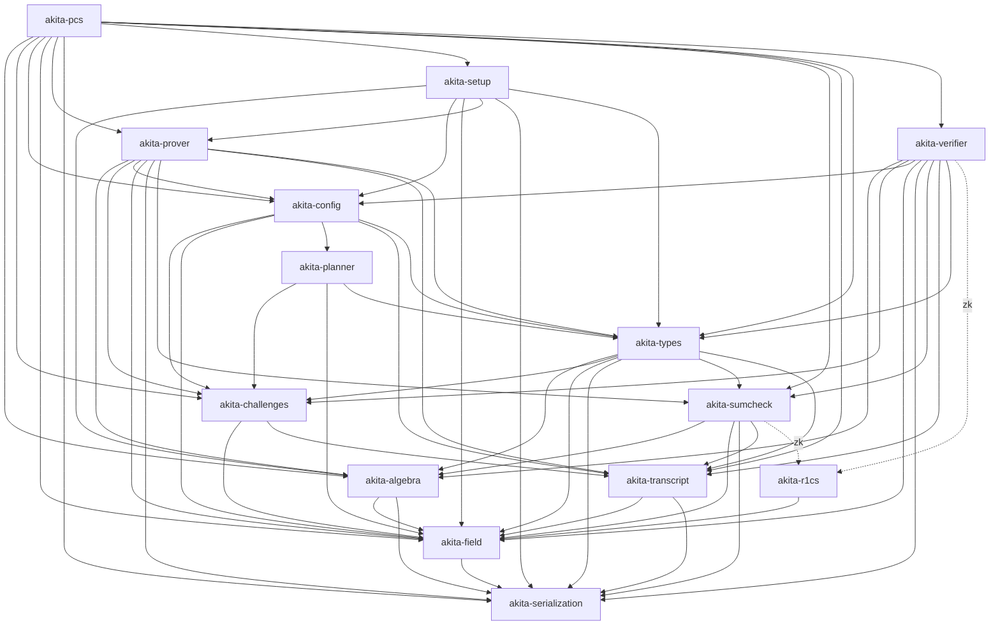

# Akita Crate Graph

Akita is split into small workspace crates so verifier-oriented consumers can
depend on public proof replay without pulling prover-only polynomial backends,
setup expansion, examples, or benchmark harnesses. This graph is derived from the
`crates/*/Cargo.toml` path dependencies; keep it in sync when edges change.
`AGENTS.md` is the authoritative prose description of crate ownership.

There is **no** `akita-scheme` crate: the end-to-end `AkitaCommitmentScheme`
orchestration lives in `akita-pcs`.

## Dependency Layers

Dotted edges (`akita-r1cs`) are enabled only by the `zk` feature.

## Ownership Rules

- `akita-planner` is the `Cfg`-free schedule owner: shipped generated tables,
  on-demand compact→`LevelParams` expansion, and the schedule-search DP. It sits
  **below** `akita-config` and names no `CommitmentConfig` type. It depends only
  on `akita-types`, `akita-challenges`, and `akita-field`.
- `akita-config` owns concrete runtime presets and the single `CommitmentConfig`
  policy trait. It **depends on `akita-planner`**: `CommitmentConfig::runtime_schedule`
  is a one-line delegation to `akita_planner::get_schedule`, which selects a
  shipped table on a hit and runs the DP on a miss. There is no opt-in
  `test-utils` wrapper; runtime DP fallback is the default for every preset.
- `akita-verifier` stays prover-free (no polynomial backends, no setup
  expansion) and is directly `<Cfg>`-generic: it depends on `akita-config` and
  therefore reaches `akita-planner` **transitively**. The schedule-search DP is
  consequently verifier-reachable and must reject malformed input with
  `AkitaError`, never panic (see the Verifier No-Panic Contract in `AGENTS.md`).
- `akita-prover` owns polynomial backends, prover setup artifacts, NTT/matrix
  kernels, the explicit compute-backend operation traits, recursive and
  ring-switch witness construction, proving orchestration, and the
  Akita-specific sumcheck stage provers.
- `akita-types` owns inert shared protocol data: proof/setup/claim shapes,
  opening-point and layout math, schedule contracts, SIS sizing (`akita_types::sis`),
  and transcript append traits. It should not grow planner search or prover
  algorithms (the generated table *representation* and search live in
  `akita-planner`).
- `akita-r1cs` owns the deferred R1CS relations used only by the `zk` path; it is
  an optional dependency of `akita-sumcheck` and `akita-verifier` and is not on
  the transparent prove/verify path.
- `akita-pcs` is the broad umbrella crate: it owns the end-to-end
  `AkitaCommitmentScheme` orchestration, re-exports the full public surface, and
  hosts examples and integration tests. Verifier-only integrations should not use
  it; prefer `akita-verifier` + `akita-types` + `akita-config`.

CI runs `scripts/check-crate-deps.sh` to guard the important one-way boundaries
(notably that `akita-prover`/`akita-verifier` source does not name
`akita_planner::` paths directly, even though they link it transitively through
`akita-config`). Add new forbidden edges there whenever a crate gets split
further.
