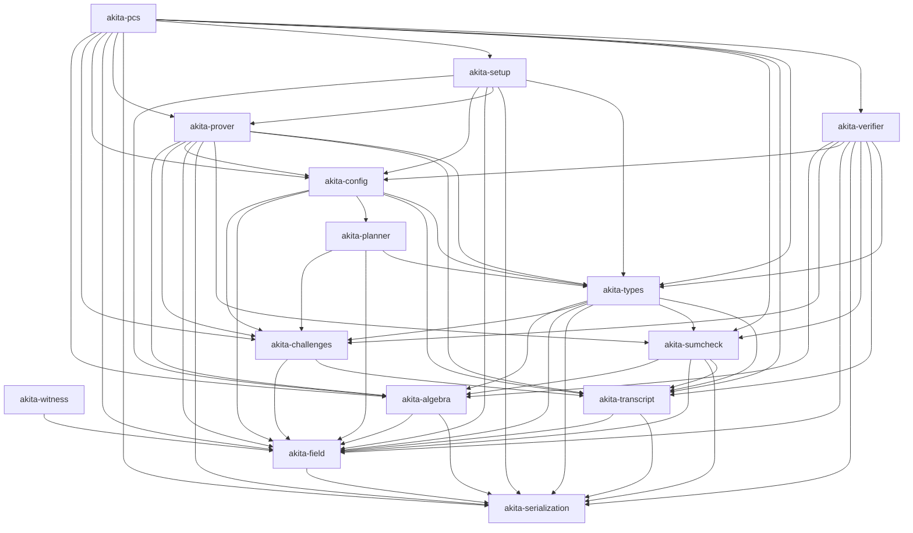

# Akita Crate Graph

Akita is split into small workspace crates so verifier-oriented consumers can
depend on public proof replay without pulling prover-only polynomial backends,
setup expansion, examples, or benchmark harnesses. This graph is derived from the
`crates/*/Cargo.toml` path dependencies; keep it in sync when edges change.
Narrative crate index: [`book/src/how/architecture.md`](../book/src/how/architecture.md).

There is **no** `akita-scheme` crate: the end-to-end `AkitaCommitmentScheme`
orchestration lives in `akita-pcs`.

## Crate index

| Crate | Role |
|-------|------|
| `akita-field` | Field traits, prime/extension fields, FFT, parallel macros |
| `akita-witness` | Shared `PolynomialView` / `WitnessProvider` vocabulary |
| `akita-serialization` | Serialization, validation, compression traits |
| `akita-algebra` | Modules, NTTs, cyclotomic rings, polynomials |
| `akita-transcript` | Fiat-Shamir transcript and descriptor preamble |
| `akita-challenges` | Challenge sampling helpers |
| `akita-sumcheck` | Sumcheck proofs, drivers, folding, batching |
| `akita-types` | Proof/setup/schedule/layout shapes, SIS floors, proof-size helpers |
| `akita-planner` | `Cfg`-free schedule engine and offline DP |
| `akita-schedules` | Shipped schedule table data |
| `akita-config` | Presets, `CommitmentConfig`, schedule catalog wiring |
| `akita-setup` | Setup construction and optional cache |
| `akita-verifier` | Verifier replay (no prover polynomial backends) |
| `akita-prover` | Commitment, proving, witnesses, polynomial backends |
| `akita-pcs` | Umbrella orchestration, examples, integration tests |

## Dependency Layers

## Ownership Rules

- `akita-witness` owns the shared borrowed witness/polynomial view vocabulary
  (`PolynomialView`, `WitnessProvider`) consumed by sumcheck and polyops paths.
  It depends only on `akita-field`. At the time of this graph, it is a workspace
  member without downstream `Cargo.toml` edges; cite it from the architecture
  chapter and polyops/sumcheck specs until prover/sumcheck depend on it explicitly.
- `akita-planner` is the `Cfg`-free schedule engine: generated table types,
  on-demand compact→`LevelParams` expansion, catalog identity validation, and
  the schedule-search DP. It sits **below** `akita-config` and names no
  `CommitmentConfig` type. It depends only on `akita-types`, `akita-challenges`,
  and `akita-field`.
- `akita-schedules` owns feature-gated shipped schedule table data. It depends
  on `akita-planner` for generated table types only.
- `akita-config` owns concrete runtime presets and the single `CommitmentConfig`
  policy trait. It **depends on `akita-planner`**: `CommitmentConfig::runtime_schedule`
  is a one-line delegation to `akita_planner::resolve_schedule`, which validates
  an opted-in catalog, expands a table hit, and runs the DP on a miss. There is no opt-in
  `test-utils` wrapper; runtime DP fallback is the default for every preset.
- `akita-verifier` stays prover-free (no polynomial backends, no setup
  expansion) and is directly `<Cfg>`-generic: it depends on `akita-config` and
  therefore reaches `akita-planner` **transitively**. The schedule-search DP is
  consequently verifier-reachable and must reject malformed input with
  `AkitaError`, never panic (see [`docs/verifier-contract.md`](verifier-contract.md)).
- `akita-prover` owns polynomial backends, prover setup artifacts, NTT/matrix
  kernels, the explicit compute-backend operation traits, recursive and
  ring-switch witness construction, proving orchestration, and the
  Akita-specific sumcheck stage provers.
- `akita-types` owns inert shared protocol data: proof/setup/claim shapes,
  opening-point and layout math, schedule contracts, SIS sizing (`akita_types::sis`),
  and transcript append traits. It should not grow planner search or prover
  algorithms (the generated table *representation* and search live in
  `akita-planner`).
- `akita-pcs` is the broad umbrella crate: it owns the end-to-end
  `AkitaCommitmentScheme` orchestration, re-exports the full public surface, and
  hosts examples and integration tests. Verifier-only integrations should not use
  it; prefer `akita-verifier` + `akita-types` + `akita-config`.

CI runs `scripts/check-crate-deps.sh` to guard the important one-way boundaries
(notably that `akita-prover`/`akita-verifier` source does not name
`akita_planner::` paths directly, even though they link it transitively through
`akita-config`). Add new forbidden edges there whenever a crate gets split
further.
