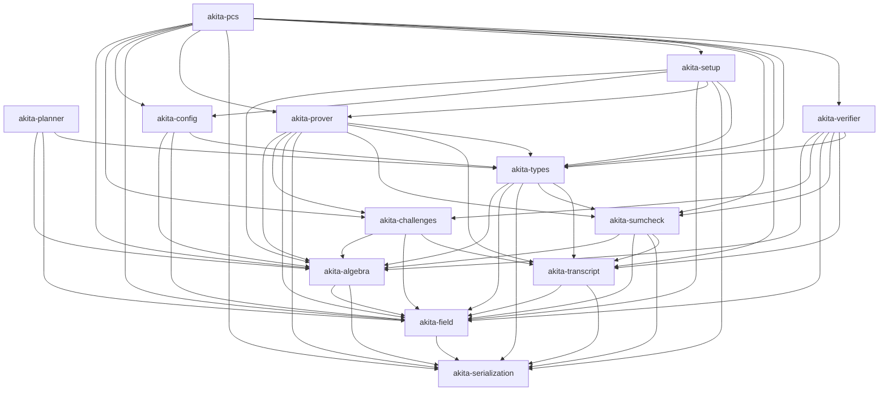

# Akita Crate Graph

Akita is split into small workspace crates so verifier-oriented consumers can
depend on public proof replay without pulling prover-only polynomial backends,
setup expansion, offline planner search, examples, or benchmark harnesses.

## Dependency Layers

## Ownership Rules

- `akita-verifier` must stay planner-free and prover-free. It may use
  `akita-types`, `akita-sumcheck`, `akita-challenges`, `akita-transcript`,
  `akita-algebra`, and `akita-field`. Its internals are grouped into public
  proof-shape preparation, protocol replay, and stage verifier modules.
- `akita-config` owns concrete runtime presets and generated-schedule lookup.
  It does not depend on `akita-planner`; runtime DP fallback is opt-in
  for tests via `akita_planner::test_utils::PlannerCfg<Cfg>` (the
  `test-utils` feature is enabled in `[dev-dependencies]` of the runtime
  crates that exercise it).
- `akita-planner` owns DP search, proof-size exploration, SIS planning, and
  planner inspection binaries. Runtime verifier/prover crates must not
  depend on it; `scripts/check-crate-deps.sh` enforces this on both the
  default and `--all-features` `cargo tree` graphs.
- `akita-prover` owns polynomial backends, prover setup artifacts, NTT/matrix
  kernels, explicit compute-backend operation traits, recursive witness
  construction, ring-switch witness construction, proving orchestration, and
  its Akita-specific sumcheck stage provers.
- `akita-types` owns inert shared protocol data: proof/setup/claim shapes,
  opening-point and layout math, schedule contracts, generated table shapes,
  and transcript append traits. It should not grow planner search or prover
  algorithms.
- `akita-pcs` is the broad umbrella crate for examples and applications that
  want the full public surface. It also owns the end-to-end
  `AkitaCommitmentScheme` orchestration. Verifier-only integrations should not
  use it.

CI runs `scripts/check-crate-deps.sh` to guard the important one-way
boundaries. Add new forbidden edges there whenever a crate gets split further.
