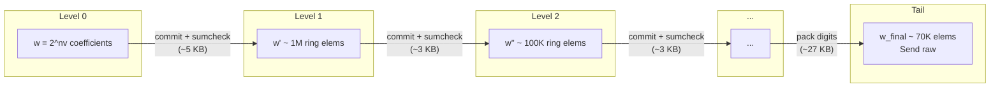
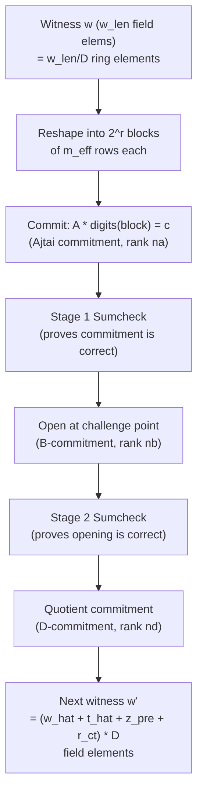
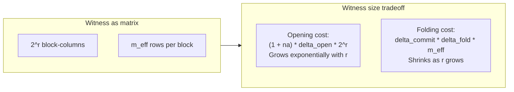
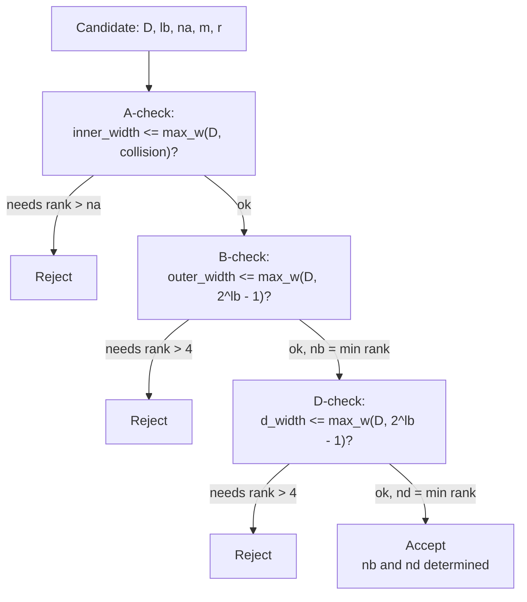
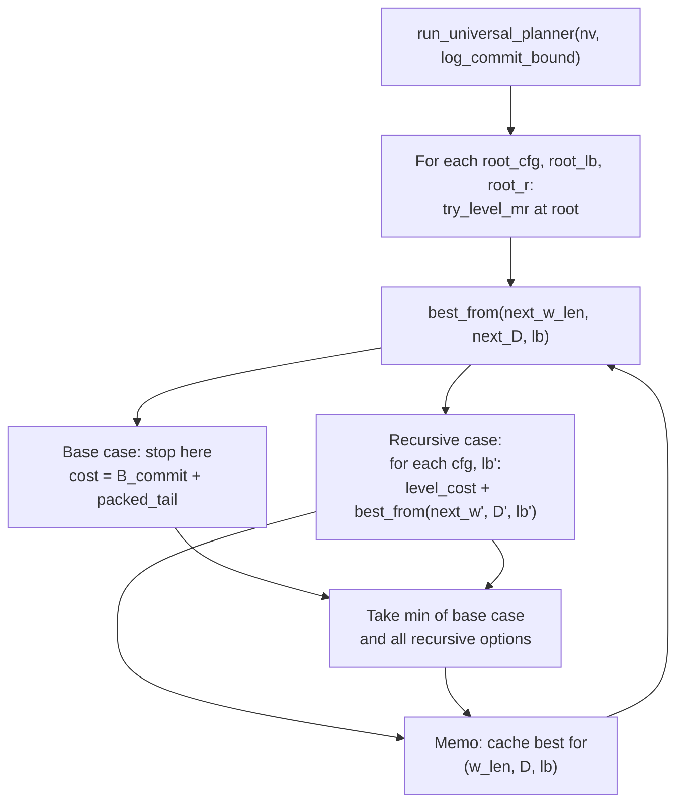

# Hachi Proof-Size Planner

The planner solves one problem: given a multilinear polynomial with `nv`
variables, find the sequence of recursion parameters that minimizes total
proof size, subject to 128-bit Module-SIS security.

The output is a **schedule**, a list of levels, each specifying
`(D, lb, m, r, na, nb, nd)`, plus a terminal tail. The implementation
lives in `src/planner/search.rs`.

---

## 1. Recursive proof structure

Hachi proves an evaluation claim `f(u) = v` on a multilinear polynomial
with `2^nv` coefficients. It does this recursively: each level reduces a
large witness to a smaller one, until the witness is small enough to send
directly.



The total proof is the concatenation of all per-level proofs plus the
packed tail. The planner chooses the parameters at each arrow to minimize
this sum.

---

## 2. Anatomy of one level

At each level the prover holds a witness vector `w` of length `w_len`
field elements. It interprets these as ring elements in
`Z_q[X]/(X^D + 1)`, then:



The "next witness" `w'` is made of digit decompositions of the
intermediate values. Its size depends on the level's parameters,
and determining it is the core of the planner's cost model.

---

## 3. The (m, r) split

After removing the ring dimension (`alpha = log2(D)` variables), the
remaining `reduced_vars = nv - alpha` variables are partitioned as
`m + r = reduced_vars`. This determines how the witness matrix is shaped:



- **Increasing r**: more block-columns, so the opening parts (`w_hat`,
  `t_hat`) grow exponentially, but fewer rows so the folded witness
  (`z_pre`) shrinks.
- **Increasing m**: the opposite.

The function `optimal_m_r_split` brute-forces all valid splits and picks
the `r` minimizing total witness size for given parameters. The planner
paper's formula (Section 4.5) sets `m = r` for asymptotic analysis; the
planner finds the true optimum, which is generally asymmetric (especially
for onehot where `delta_commit = 1`).

### Tight z_pre mode

When `tight_zpre = true` (the default), `m_eff = ceil(num_ring / 2^r)` —
the actual occupied row count, which can be smaller than `2^m` when the
ring-element count is not a power of two. This is the "column-major block
layout" optimization.

---

## 4. The five knobs per level

Each level is characterized by a **choice tuple** `(D, lb, na, m, r)`.
From these, `nb` and `nd` are *derived* as the minimum secure SIS ranks.

### D (ring dimension): 16, 32, or 64

Each ring element lives in `Z_q[X]/(X^D + 1)` and occupies `D * 16`
bytes. Larger D means each ring vector entry is bigger, but the SIS
commitment can accommodate more columns per row, so you need fewer rows
(lower `na`).

| D | Bytes per ring element | Typical na needed |
|---|------------------------|-------------------|
| 64 | 1024 | 1 |
| 32 | 512 | 1-2 |
| 16 | 256 | 2-4 |

### lb (log basis): 2 through 7

The digit decomposition base is `b = 2^lb`. Larger `lb` means fewer
digits per value (smaller `delta`), but each digit has a larger range,
meaning SIS requires higher rank or the commitment becomes less secure.

| lb | Base | delta_open (128-bit) | Collision bound |
|----|------|---------------------|-----------------|
| 2 | 4 | 65 | 3 |
| 3 | 8 | 43 | 7 |
| 4 | 16 | 33 | 15 |
| 5 | 32 | 26 | 31 |
| 6 | 64 | 22 | 63 |
| 7 | 128 | 19 | 127 |

### na (A-commitment rank): 1 through 4

More rows in the A-matrix commitment means more secure (can have wider
matrices), but costs `na * D * 16` bytes per commitment vector.

### (m, r) split

Controls the witness matrix shape. See Section 3 above.

### nb, nd (B and D commitment ranks): derived

The minimum Module-SIS rank needed for the opening (B) and quotient (D)
commitments to achieve 128-bit security, given the matrix widths and
collision bound `2^lb - 1`. Looked up from precomputed tables in
`sis_security.rs`.

### Bundled configurations

The planner predefines 9 `RingConfig` entries that bundle `(D, na,
challenge_l1_mass)`:

```
D=64: na=1 (l1=54),  na=2 (l1=54)
D=32: na=1 (l1=256), na=2 (l1=256), na=3 (l1=256)
D=16: na=1 (l1=2048), na=2 (l1=2048), na=3 (l1=2048), na=4 (l1=2048)
```

---

## 5. Cost model

### Per-level proof bytes

Each level contributes these serialized components to the proof:

```
level_bytes = entry_B_commit
            + D_commit
            + stage1_sumcheck
            + claim1
            + stage2_sumcheck
            + claim2
```

Where:

| Component | Size | Notes |
|-----------|------|-------|
| entry_B_commit | `nb * D * 16` bytes | B-commitment the next level verifies |
| D_commit | `nd * D * 16` bytes | Quotient commitment |
| stage1_sumcheck | `f(rounds, lb)` | Eq-compressed, fully 4-ary GKR tree |
| claim1 | 16 bytes | Evaluation claim from stage 1 |
| stage2_sumcheck | `rounds * 3 * 16` bytes | Degree-2 sumcheck |
| claim2 | 16 bytes | Opening claim |

Stage 1 cost depends on `lb`:
- `lb <= 3`: `rounds * (2^lb / 2) * 16` bytes
- `lb >= 4`: multiple GKR stages with inter-stage claims (see
  `stage1_bytes_optimized` in `proof_size.rs`)

### Tail bytes

After all levels, the terminal witness is sent directly:

```
tail_bytes = tail_B_commit + packed_digits

where:
  tail_B_commit = tail_nb * D * 16 bytes
  packed_digits = ceil(w_len * lb / 8) bytes
```

### Witness size computation

The next-level witness consists of four parts, all measured in ring
elements:

```
w_hat  = 2^r * delta_open           (opening proof digits)
t_hat  = 2^r * na * delta_open      (redundancy check digits)
z_pre  = m_eff * delta_commit * delta_fold  (folded witness digits)
r_ct   = (nd + nb + 2 + na) * delta_128     (quotient row digits)

next_w_len = (w_hat + t_hat + z_pre + r_ct) * D   (in field elements)
```

Where:
- `delta_open = compute_num_digits(max(log_commit_bound, 128), lb)` — digits
  to represent opening entries (at least 128-bit values)
- `delta_commit = compute_num_digits(log_commit_bound, lb)` — digits to
  represent commitment entries
- `delta_fold = compute_num_digits_fold(r, challenge_l1_mass, lb)` — digits
  to represent folded entries (bound `beta = 2^r * l1_mass * 2^(lb-1)`)
- `delta_128 = compute_num_digits(128, lb)` — digits to represent 128-bit
  field elements (used for quotient rows)

The `r_ct` term is particularly important: it does not depend on the
polynomial-specific witness size. It forms a "floor" that prevents the
recursion from shrinking the witness below ~50K elements.

### Root batching semantics

At the root, batching changes only the outer binding roles and the public
output rows.

- `A` stays the weak-opening role for the inner witness, so its width is the
  inner matrix width and is not multiplied by the batch size.
- `B` binds the digitized inner commitments, so its width scales with the
  total number of root claims.
- `D` binds the flattened digitized opening witness, so its width also scales
  with the total claim count.
- `num_claims` multiplies the concatenated witness pieces `w_hat` and `t_hat`,
  and it is the count used when deriving batch-effective `B` and `D` SIS
  ranks.
- `num_points` does not widen `B` or `D`. It only changes the public `y`
  rows, the root `z_pre` term, and the number of serialized `y_ring` objects
  in the root proof.

---

## 6. SIS security filter

Before a level can be accepted, three Module-SIS security checks must
pass. The planner consults a precomputed table
`sis_max_widths(D, collision_inf)` that maps `(D, collision_bound)` to
the maximum SIS width (in ring elements) for each rank 1 through 4:



The collision bound depends on the digit range:
- **B / D roles**: `collision_inf = 2^lb - 1`
- **A role**: `collision_inf` is the raw digit collision multiplied by the
  maximum absolute coefficient in the active challenge family, then rounded up
  to the next supported SIS table bucket
- **Root level, onehot raw collision**: `2` (coefficients are 0 or 1)
- **All other raw digit collisions**: `2^lb - 1` (balanced digits in
  range `[-(2^lb/2), 2^lb/2 - 1]`)

Higher `lb` means a higher collision bound, which means SIS can support
fewer columns per rank, which forces higher `nb`/`nd`, which makes the
proof bigger. This is the fundamental `lb` tradeoff.

---

## 7. The DP search algorithm

The planner uses memoized dynamic programming with state
`(w_len, D, lb)`:



### Properties

- **Memoization on `(w_len, D, lb)`**: Different paths that arrive at
  the same witness length, ring dimension, and log-basis share the same
  optimal suffix. This is what makes the DP efficient.

- **Natural termination**: `try_level_mr` requires `next_w_len < w_len`,
  so witness length strictly decreases. The DP has no depth limit — it
  terminates when recursion can no longer shrink the witness.

- **Root is special**: Enumerates `(m, r)` splits within +/-4 of the
  heuristic optimum (`optimal_m_r_split`). Recursive levels use only the
  single locally-optimal `(m, r)`. This captures most of the benefit of
  full enumeration while keeping the search fast.

- **D monotonicity**: `monotone_d = true` (the default) means D can only
  decrease across levels (64 -> 32 -> 16, never back up). This is a
  sound pruning because once you transition to a smaller D, the smaller
  ring vectors are always cheaper.

- **Base case competes with recursion**: At every state, the DP considers
  stopping immediately (sending the witness as a packed tail). This
  naturally finds the optimal number of levels without a depth limit.

### Search space at each level

At each recursive state, the DP tries:
- 9 ring configs (filtered by current D)
- 6 log-basis values (lb = 2..7)
- 3 next-D options (64, 32, 16, filtered by monotonicity)

That is up to `~9 * 6 * 3 = 162` options per state. Each option either
produces a new unique `(next_w_len, D, lb)` state or hits the memo cache.

---

## 8. Worked example: onehot nv=32

Under the corrected `A`-role filter, the planner finds this 7-level
schedule (75,632 bytes, 22.3% reduction from the 97,277-byte baseline):

```
L0: D=32 lb=2 m=16 r=11 na=3 nb=2 nd=2  →  4,672 B
L1: D=32 lb=2 m=13 r=8  na=2 nb=2 nd=2  →  4,352 B
L2: D=32 lb=3 m=11 r=6  na=2 nb=2 nd=2  →  4,832 B
L3: D=32 lb=4 m=10 r=5  na=2 nb=2 nd=2  →  5,216 B
L4: D=32 lb=4 m=9  r=4  na=2 nb=2 nd=2  →  5,072 B
L5: D=32 lb=4 m=9  r=3  na=2 nb=2 nd=2  →  5,072 B
L6: D=32 lb=4 m=9  r=3  na=2 nb=2 nd=2  →  5,072 B
Tail: lb=4, 81,152 elems                →  40,576 B
```

### Why these choices

- **L0 uses D=32, not D=64**: D=64 would make the root commitment
  (1 ring vector = 1024 bytes) cheap, but D=32 with na=3 has a smaller
  next-level witness because the SIS width limits are more favorable
  at D=32 for lb=2.

- **The corrected planner stays at D=32**: once the `A` role is charged for
  challenge-aware collisions, the older `D=16` schedules are no longer cheap
  enough to win.

- **lb is monotonically non-decreasing (2→2→2→3→4→4→4)**: The
  balanced digit range is asymmetric — digits in base `2^lb` lie in
  `[-2^(lb-1), 2^(lb-1)-1]`. When lb decreases between levels, the
  previous level's digits (bounded by `2^(prev_lb-1)`) must be
  re-decomposed into the smaller base, multiplying `delta_commit`.
  For example, an lb=6→lb=3 transition requires
  `compute_num_digits(6, 3) = 3` digits per entry instead of 1. This
  makes lb-decreasing transitions expensive, so the planner avoids them.

- **The tail still dominates**: 40,576 bytes out of 75,632 (54%). The tail's
  share is inherent — it is the packed digit decomposition of the
  terminal witness plus the entry commitment ring vector.

---

## 9. Experimental Follow-Ups

The unified Python planner now supports two experimental families that are not
yet modeled by the Rust `planner/` crate:

- mixed boolean steps via `--include-exp-bool`
- threshold-prime profiles via `--profile k5`, `--profile k6`, and
  `--profile k7`
- packed threshold-prime profiles via `--profile k5pack`, `--profile k6pack`,
  and `--profile k7pack`

### Mixed boolean steps

The boolean gadget replaces the balanced stage-1 range proof with a fused
booleanity term inside stage 2. In the planner model this means:

- stage 1 disappears on boolean levels
- `s_claim` disappears on boolean levels
- `B` and `D` use `collision_inf = 1`
- `A` uses raw collision `1`, scaled only by the challenge coefficient proxy

The planner does **not** force boolean at every level. The best schedules
usually use boolean only near the top, then switch back to balanced `lb = 2`.

### Threshold-prime profiles

The threshold-prime sweep inserts three extra fields between the 16-bit and
32-bit studies:

- `k5`: `p = 50,859,013`, degree-5 extension
- `k6`: `p = 2,642,333`, degree-6 extension
- `k7`: `p = 319,589`, degree-7 extension

These profiles expose a hidden cost in the neat `16/32/64/128` ladder. Because
the extension degree is odd, the sumcheck field no longer lands on `16` bytes:

- `k5`: `20` bytes
- `k6`: `18` bytes
- `k7`: `21` bytes

That extra sumcheck overhead is one reason the threshold-prime sweep still does
not beat the `32b-bool` floor.

The packed follow-up keeps the same `k = 5, 6, 7` idea but instead chooses the
largest primes below `2^(128/k)`, so a tightly packed `F_{p^k}` element still
fits in `16` bytes:

- `k5pack`: `p = 50,858,909`, degree-5 extension
- `k6pack`: `p = 2,642,173`, degree-6 extension
- `k7pack`: `p = 319,541`, degree-7 extension

These packed profiles are much more competitive:

- `k7-pack-bool` becomes the overall minimum at the smallest shared point
  `nv = 20`
- `32b-bool` still remains the best regime once `nv >= 25`
- packed threshold-prime fields mostly overtake the exploratory `16b-bool`
  regime, so serialization really is a first-order effect here

---

## 10. Limits of the planner

### The tail floor

The `r_ct` term in the witness size computation —
`(nd + nb + 2 + na) * delta_128` ring elements for quotient row
decomposition — does not depend on the polynomial-specific witness. It
is a fixed overhead at every level. This prevents the recursion from
shrinking the witness below ~50K elements: eventually the quotient rows
dominate and adding another level barely helps.

### Convergence

We verified experimentally that recursive (m, r) enumeration (±1
neighborhood at every level) yields at most 10 bytes improvement over
the heuristic, at 6x the runtime. The planner is effectively converged.

### What could push proof size lower

These would require structural changes outside the planner's cost model:

- **Batched/amortized opening** across multiple polynomials (reduces
  per-polynomial overhead)
- **Better tail encoding** — e.g., committing to the tail instead of
  sending it raw, if a sufficiently cheap commitment scheme exists
- **Univariate sumcheck tail** — replacing the last ~12 sumcheck rounds
  with a single univariate instance (not cost-effective in the lattice
  setting due to commitment overhead)
- **Reducing the quotient-row floor** — changing the protocol to need
  fewer quotient decomposition terms per level
