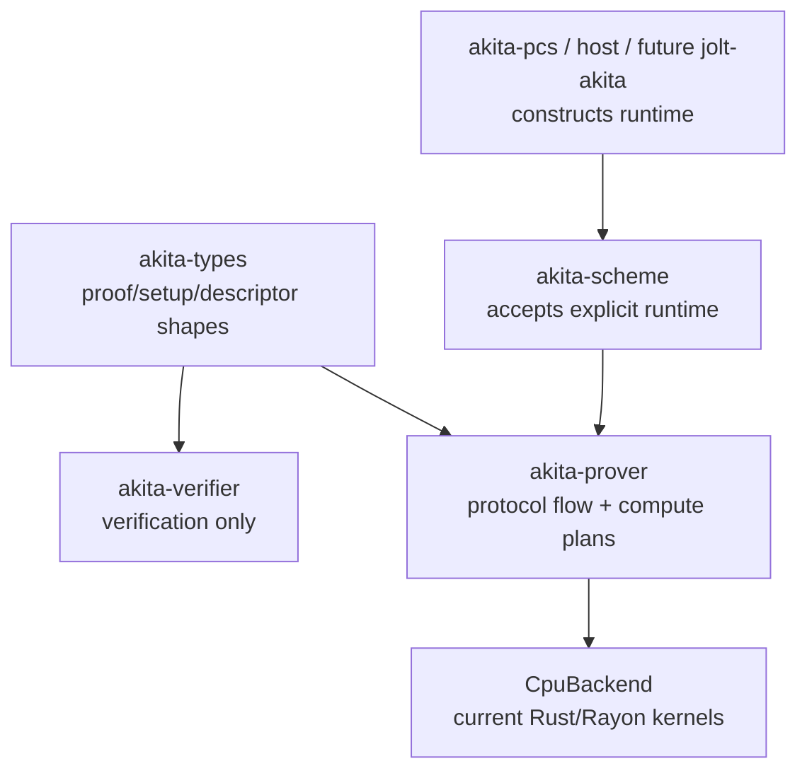

# Spec: Akita Compute Backend Cutover

| Field       | Value                 |
|-------------|-----------------------|
| Author(s)   | @quangvdao, Codex     |
| Created     | 2026-05-24            |
| Status      | proposed              |
| PR          |                       |

## Summary

Akita's prover currently has CPU-specific compute state wired through public
prover APIs, polynomial backends, setup construction, and protocol flow. The
most visible symptom is `NttSlotCache<D>`: it lives inside
`AkitaProverSetup`, appears as the default `AkitaPolyOps::CommitCache`, is
threaded through `akita-scheme`, and is lazily rebuilt by dynamic-D dispatch
macros. Adding Metal beside this shape would create a second execution layer
without replacing the CPU-shaped one.

This spec defines the first clean rearchitecture slice: make prover compute an
explicit runtime-owned boundary, move the existing ring/commit CPU path behind
that boundary, remove CPU NTT cache ownership from protocol-facing setup and
polynomial APIs, and record the inventory/baselines needed to review the
cutover honestly. Metal skeleton work, field kernels, MLE kernels, sumcheck
kernels, true hybrid scheduling, and Jolt adapter work are captured as one
remaining-work bucket that should be expanded into its own detailed spec when
that work becomes current.

## Intent

### Goal

Cut over Akita's prover setup and root ring/commit compute path to a
runtime-owned compute backend boundary, with `CpuBackend` preserving current
behavior exactly.

The key surfaces modified by this spec are:

- `akita-prover::compute`: new plan/result types, `ProverRuntime`,
  `CpuBackend`, prepared setup caches, capability/fallback policy, and the
  migrated ring/commit compute interface.
- `AkitaProverSetup`: becomes protocol/setup data only; it must not own
  `NttSlotCache`, `MultiDNttCaches`, Metal buffers, command queues, or any
  backend-prepared cache.
- `CommitmentProver`: public prover methods are changed in one pass to require
  an explicit runtime/backend context. There is no permanent old API plus
  optional runtime API.
- `AkitaPolyOps`: root polynomial representation logic is cut through rather
  than bypassed. Migrated commit methods must not expose
  `CommitCache = NttSlotCache<D>` or call `mat_vec_mul_ntt_*` directly.
- `akita-prover::protocol` and `akita-scheme`: migrated paths obtain prepared
  setup through `ProverRuntime`; they do not thread `&setup.ntt_shared`.
- `akita-verifier` and `akita-types`: unchanged in role. They must remain free
  of prover runtime, Metal, and backend cache dependencies.

### Invariants

1. Verifier-visible commitments, proofs, setup descriptors, opening claims,
   transcript labels, and challenge order are unchanged by the CPU runtime
   cutover.
2. Backends must not append to or squeeze from the Fiat-Shamir transcript.
   Transcript binding remains in `akita-prover` and `akita-scheme` protocol
   flow.
3. Backends must not choose sumcheck order, batching order, opening points,
   opening IDs, recursive schedule steps, or proof object structure.
4. Backend results are keyed by protocol plan slots, never by backend-invented
   semantic IDs.
5. `akita-verifier` must not depend on `akita-prover`, future accelerator
   crates such as `akita-metal`, runtime crates, device buffers, prover
   polynomial backends, or backend caches.
6. CPU remains the exact reference implementation. The first cutover must keep
   deterministic CPU proof behavior byte-identical where randomness is absent
   and transcript-event-identical everywhere else.
7. `AkitaProverSetup` and `AkitaInstanceDescriptor` must not include device
   placement, command queue state, buffer addresses, runtime timing, or
   backend cache identity.
8. Runtime-prepared caches are derived from the same `AkitaExpandedSetup`,
   schedule parameters, field family, ring dimension, and CRT/NTT parameter
   family as the current CPU path.
9. Future accelerator availability is a runtime capability, not a protocol
   assumption. The current CPU runtime must compile and run without accelerator
   crates.
10. There is exactly one migrated compute path. After a path moves to
    `akita-prover::compute`, neither protocol code nor `AkitaPolyOps`
    implementations may call `NttSlotCache`, `MultiDNttCaches`,
    `dispatch_with_ntt!`, or `mat_vec_mul_ntt_*` directly for that path.
11. Existing optimized representations must remain visible to compute
    planning: dense, one-hot, compact digit, sparse ring, and recursive witness
    paths must not be forced through dense `Vec<F>` materialization just to use
    a backend.
12. No compatibility shims, deprecated aliases, or long-lived parallel APIs are
    introduced. This repo makes no backward-compatibility guarantee; update all
    call sites in one pass.

### Non-Goals

1. Changing the Akita PCS protocol, proof layout, schedule policy, SIS
   parameters, Fiat-Shamir labels, verifier equations, or serialized proof
   structures.
2. Adding `crates/akita-metal`, Metal skeleton code, or production Metal field,
   MLE, sumcheck, or ring kernels in this current PR.
3. Implementing true CPU/GPU hybrid split execution. Accelerator fallback and
   deterministic CPU/GPU partitioning are follow-up work.
4. Completing the Jolt adapter in this branch.
5. Implementing a Dory-style homomorphic RLC interface for Akita.
6. Replacing Rayon as the CPU backend. Existing Rust/Rayon kernels become the
   CPU backend implementation.
7. Making Metal mandatory for `cargo test`, default features, verifier builds,
   or non-Apple builds.
8. Hiding Jolt field-boundary issues inside the PCS adapter. A future adapter
   must reject incompatible fields unless a separate transcript-bound
   conversion spec exists.

## Evaluation

### Acceptance Criteria

- [ ] `AkitaProverSetup<F, D>` no longer stores `ntt_shared:
      NttSlotCache<D>` or any other backend-prepared cache.
- [ ] `AkitaProverSetup::generate_with_capacity` and
      `AkitaProverSetup::from_expanded` do not build CPU NTT caches. CPU caches
      are prepared lazily by `CpuBackend` from `AkitaExpandedSetup`.
- [ ] `CommitmentProver::commit`, `CommitmentProver::batched_commit`, and
      `CommitmentProver::batched_prove` require an explicit
      `ProverRuntime`/backend context after the cutover, and all in-repo
      callers are updated. No old peer API remains.
- [ ] `AkitaPolyOps` no longer exposes `CommitCache = NttSlotCache<D>` for
      migrated commit paths. Dense, one-hot, sparse-ring, root-projection, and
      recursive witness implementations route migrated ring mat-vec work
      through compute plans.
- [ ] `akita-scheme` has no import or direct use of `NttSlotCache`,
      `MultiDNttCaches`, `dispatch_with_ntt!`, or `mat_vec_mul_ntt_*` after the
      migrated runtime cutover.
- [ ] Migrated protocol functions in `flow.rs`, `ring_switch.rs`, and
      `quadratic_equation.rs` obtain CPU prepared setup through
      `ProverRuntime`; they do not accept `&NttSlotCache<D>` for migrated
      paths.
- [ ] Dynamic-D setup lookup returns `AkitaError` through the runtime instead
      of panicking through CPU-cache-specific dispatch for migrated paths.
- [ ] `CpuBackend` implements the migrated ring/commit plan family and
      delegates to the existing CPU kernels internally.
- [ ] CPU runtime proofs for `commit`, `batched_commit`, and `batched_prove`
      pass the existing dense, one-hot, multipoint, recursive, and transcript
      hardening tests.
- [ ] Deterministic CPU proof bytes remain unchanged where current tests can
      assert bytes; otherwise `LoggingTranscript` prover/verifier event streams
      remain unchanged.
- [ ] The migrated ring/commit plan explicitly covers the current root commit
      and ring-switch NTT work used by `compute_v_rows`, `compute_r_split_eq`,
      `commit_w`, `commit_next_w_with_policy`, dense digit mat-vec, dense
      coefficient mat-vec, single-row cyclic/negacyclic variants, and strided
      recursive variants.
- [ ] Ring/CRT parity tests enumerate concrete `(field family, D)` tuples that
      exercise the actual Q32, Q64, and Q128 dispatch branches, including both
      negacyclic and cyclic cache paths.
- [ ] `akita-verifier` still has no normal dependency path to `akita-prover`,
      `akita-metal`, Metal runtime crates, examples, benches, or prover
      polynomial backends.
- [ ] Documentation explains the new CPU runtime selection, prepared setup
      ownership, and which accelerator/kernel families are intentionally
      deferred.

### Testing Strategy

Required baseline checks:

- `cargo fmt -q`
- `cargo clippy --all --message-format=short -q -- -D warnings`
- `cargo test`
- `cargo test -p akita-verifier --no-default-features`
- `scripts/check-crate-deps.sh akita-verifier`
- `scripts/check-crate-deps.sh akita-prover`

CPU cutover tests:

- Update `crates/akita-pcs/tests/commitment_contract.rs` for the new
  `CommitmentProver` shape; this is the public API compile test.
- Existing integration tests under `crates/akita-pcs/tests/`, especially
  `single_poly_e2e.rs`, `multipoint_batched_e2e.rs`,
  `batched_aggregated_e2e.rs`, `ring_switch.rs`, `stage1_roundtrip.rs`,
  `sumcheck_core.rs`, and transcript hardening tests.
- Existing scheme tests under `crates/akita-scheme/src/tests.rs`.
- `cargo test -p akita-sumcheck --test drivers`
- `cargo test -p akita-prover --lib`
- `cargo test -p akita-scheme --lib`

New focused tests:

- `AkitaProverSetup::from_expanded` does not build CPU NTT state.
- `CpuBackend::prepare_setup` builds the same NTT data that
  `AkitaProverSetup` used to build.
- No `NttSlotCache` import in `akita-scheme`.
- No `dispatch_with_ntt!` use in migrated paths.
- CPU runtime parity for `compute_v_rows`, `compute_r_split_eq`, `commit_w`,
  `commit_next_w_with_policy`, dense digit mat-vec, dense coefficient mat-vec,
  single-row variants, and strided recursive variants.
- Transcript-event equality around prover `v` absorption and the stage
  challenge squeezes that follow it.
- Concrete CRT/NTT branch tests:
  - Q32: small field with `D <= RING_DEGREE`;
  - Q64: small field with larger supported `D`, and native <=64-bit field;
  - Q128: one representative whitelisted 128-bit modulus family that exercises
    the Q128 dispatch branch, plus additional named families only when they
    protect a known regression or parameter-selection bug.

### Performance

The current cutover is judged by CPU non-regression and by making future
accelerator timings possible through explicit runtime/prepared-setup ownership.

Required benchmark coverage:

- `cargo bench --bench root_kernels`
- `cargo bench --bench ring_ntt`
- `cargo bench --bench onehot_batched_commit`
- `cargo bench --bench onehot_batched_opening`
- `AKITA_MODE=onehot AKITA_NUM_VARS=32 cargo run --release --example profile`

Expected outcomes:

- CPU runtime through the new backend boundary is within 2% of the previous CPU
  direct-kernel median on unchanged hardware, or the regression is explained by
  benchmark variance and fixed before the cutover is considered complete.
- CPU prepared-setup time is measured separately from repeated commit/prove
  execution time.

## Design

### Architecture

The first cutover replaces CPU-shaped protocol plumbing with runtime-owned
prepared setup and compute plans.



Host layers, examples, tests, or a future adapter construct a CPU runtime and
pass it into the prover API. Future accelerator crates must follow the same
shape without making `akita-scheme` or verifier crates depend on device code.
The verifier crate remains outside this graph.

### Public API Cutover

The public prover API changes in one pass. The existing method names may remain
if their signatures gain a runtime argument, but the old setup-only methods are
removed.

Representative shape:

```rust
pub trait CommitmentProver<F, const D: usize>
where
    F: FieldCore + CanonicalField,
{
    type ProverSetup: Clone + Send + Sync;
    type VerifierSetup: Clone + Send + Sync;
    type Commitment: Clone + Send + Sync;
    type ClaimField: ExtField<F>;
    type CommitHint: Clone + Send + Sync;
    type BatchedProof: Clone + Send + Sync;

    fn commit<P, B>(
        runtime: &mut ProverRuntime<B>,
        polys: &[P],
        setup: &Self::ProverSetup,
    ) -> Result<(Self::Commitment, Self::CommitHint), AkitaError>
    where
        P: AkitaPolyOps<F, D>,
        B: AkitaCommitBackend<F, D>;

    fn batched_commit<P, B>(
        runtime: &mut ProverRuntime<B>,
        polys_per_point: &[&[P]],
        setup: &Self::ProverSetup,
    ) -> Result<Vec<(Self::Commitment, Self::CommitHint)>, AkitaError>
    where
        P: AkitaPolyOps<F, D>,
        B: AkitaCommitBackend<F, D>;

    fn batched_prove<'a, T, P, B>(
        runtime: &mut ProverRuntime<B>,
        setup: &Self::ProverSetup,
        claims: ProverClaims<'a, Self::ClaimField, P, Self::Commitment, Self::CommitHint>,
        transcript: &mut T,
        basis: BasisMode,
    ) -> Result<Self::BatchedProof, AkitaError>
    where
        T: Transcript<F>,
        P: AkitaPolyOps<F, D>,
        B: AkitaCommitBackend<F, D>;
}
```

The exact generic spelling may change, but the design requirements are fixed:

- runtime selection is explicit at every prover entrypoint;
- the old `Cache = NttSlotCache<D>` generic disappears from
  `CommitmentProver`;
- tests and benches call the new API directly;
- no compatibility method silently constructs a CPU runtime behind the old API.

### `AkitaPolyOps` Cutover

`AkitaPolyOps` currently owns representation-specific work and exposes
CPU-shaped commit cache plumbing. The cutover must preserve representation
knowledge while removing CPU cache ownership from the trait.

Target rules:

- remove or replace `type CommitCache = NttSlotCache<D>` for migrated paths;
- migrated methods that need backend work receive a plan builder or runtime
  context rather than a CPU cache;
- dense, one-hot, sparse-ring, root-projection, and recursive witness
  implementations build representation-aware compute plans;
- representation-specific operations that are not migrated yet may remain CPU
  local, but they must not participate in the migrated ring/commit path through
  hidden `NttSlotCache` calls;
- the implementation must update `commit_inner`, `commit_inner_witness`,
  `decompose_fold`, `evaluate_and_fold`, and recursive witness call sites
  enough that the migrated commit/prove path has one compute boundary.

This is the main guard against adding a backend layer beside the existing
polynomial abstraction.

### Setup And Cache Ownership

Target ownership:

```text
AkitaExpandedSetup<F>
  shared matrix, seed, descriptor digest, verifier-reachable setup data

AkitaProverSetup<F, D>
  prover setup wrapper around AkitaExpandedSetup, no backend-prepared cache

CpuPreparedSetup<F, D>
  NttSlotCache<D>, MultiDNttCaches, CPU scratch/cached matrices

FutureAcceleratorPreparedSetup<F, D>
  device buffers/pipelines for supported matrix slices and CRT parameter family
```

Prepared setup is runtime-owned and keyed by:

- expanded setup descriptor digest;
- ring dimension `D`;
- field modulus family;
- CRT/NTT parameter family;
- backend name and backend cache version.

`AkitaProverSetup::generate_with_capacity` and `from_expanded` construct or
wrap expanded setup only. Disk-persistence or setup-cache paths must not
eagerly rebuild CPU NTT state outside the explicit runtime-preparation path.

### Compute Plans

Phase-1 compute plans cover the current ring/commit work that is already tied
to `NttSlotCache`:

- shared NTT setup preparation from `AkitaExpandedSetup`;
- dense pre-decomposed digit mat-vec equivalent to
  `mat_vec_mul_ntt_dense_digits_i8`;
- dense ring-coefficient mat-vec equivalent to `mat_vec_mul_ntt_i8_dense`;
- single-row cyclic and negacyclic variants;
- strided recursive witness variants;
- `compute_v_rows` and the transcript-adjacent `v` computation before
  absorption;
- `compute_r_split_eq` and quotient/cyclic rows used by ring switch;
- `commit_w` and `commit_next_w_with_policy`.

Plans contain dimensions, shape slots, representation handles, and prepared
setup handles. They do not contain transcript objects. Protocol code performs
transcript absorption after backend output is returned.

### Runtime Selection

```rust
pub struct ProverRuntime<B> {
    backend: B,
    prepared: PreparedSetupCache,
}

pub struct CpuBackend;
```

Rules:

- the current PR implements only `CpuBackend`;
- runtime selection is still explicit so future accelerators do not require a
  second prover API;
- no runtime path may construct hidden CPU caches outside prepared setup;
- dynamic ring-dimension dispatch for migrated paths returns `AkitaError`
  rather than panicking.

Accelerator fallback policies such as `PreferAccelerator` and
`RequireAccelerator` are remaining work, not part of the current PR.

### Remaining Accelerator Shape

The next accelerator PR is expected to introduce `crates/akita-metal` with
Apple-specific runtime code shaped roughly as follows:

```text
crates/akita-metal/
  src/lib.rs
  src/device.rs
  src/buffer.rs
  src/pipeline.rs
  src/runtime.rs
  src/kernels/
    smoke.metal
```

Implementation rules:

- use safe Rust wrappers around device, queue, pipeline, buffer, and command
  submission objects;
- keep Objective-C/Metal FFI isolated to `device`, `buffer`, and `pipeline`
  modules;
- compile kernels at build time or load embedded source deterministically;
- start with shared-memory buffers for correctness and simpler debugging;
- expose deterministic `is_available()` and `capabilities()`;
- implement one tiny vector/integer dispatch with CPU-checked output;
- do not claim production field, MLE, sumcheck, or ring acceleration in the
  skeleton PR.

### Deferred Kernel Roadmap

These areas are intentionally deferred to follow-up specs after the CPU runtime
cutover is complete.

#### Field And MLE Kernels

Follow-up scope:

- elementwise add/sub/mul, FMA, scaling, affine combine;
- dot products and batched reductions;
- signed/unreduced accumulation matching `HasUnreducedOps`;
- `fold_evals_in_place` equivalents;
- `EqPolynomial` table generation;
- `GruenSplitEq` binding and remaining-table state transitions.

The follow-up spec must name the concrete migrated call paths before adding
acceptance criteria. Generic field kernels without a prover consumer are not
enough.

#### Sumcheck Kernels

Stage-1 and stage-2 are state machines, not stateless round-poly callbacks. A
future sumcheck backend spec must either keep the state machine on CPU and
define exact backend hooks, or move backend-owned round state behind a precise
contract.

Required future coverage:

- current-round scan;
- challenge ingestion/fold;
- optional fused next-round scan;
- cached round polynomial behavior;
- two-round-prefix materialization;
- stage-1 tree wrapper;
- stage-2 `live_x_cols`, `m_compact`, `alpha_compact`,
  `prev_norm_claim`, and `prev_norm_poly` transitions.

#### Ring/NTT Metal Kernels

Production Metal ring kernels are a follow-up after the CPU plan boundary and
Metal skeleton exist. The first production target should be dense
pre-decomposed digit mat-vec because it avoids mixing digit extraction, NTT,
and sparse zero-scan policy in the first kernel.

#### True Hybrid Scheduling

True hybrid means deterministic simultaneous CPU/GPU partitioning of one plan.
That is not CPU fallback and not simple asynchronous Metal dispatch. A
follow-up spec must define canonical split reductions and tests before enabling
it.

#### Jolt Adapter Readiness

This spec keeps only the Akita constraints needed for Jolt:

- verifier-only Jolt code must be able to depend on `akita-verifier` and
  `akita-types` without `akita-prover` or `akita-metal`;
- future Jolt host/prover code passes an Akita runtime into an adapter;
- Jolt protocol order remains in `jolt-prover`;
- Akita protocol order remains in `akita-prover`;
- Akita should not implement fake Dory-style homomorphic RLC.

The actual opening-obligation API and adapter smoke tests belong in a separate
Jolt/Akita adapter spec.

### Alternatives Considered

1. Metal-only kernel crate without a compute cutover.
   Rejected because it would accelerate a few functions while leaving protocol
   flow coupled to CPU-only caches.

2. Add `*_with_runtime` APIs while preserving old setup-only APIs.
   Rejected because it creates two prover surfaces and lets call sites avoid
   the cutover.

3. Move CPU caches under `AkitaProverSetup::cpu_cache`.
   Rejected because setup would still own backend-prepared state and Metal
   would be bolted on beside it.

4. Include field, MLE, sumcheck, ring, hybrid, and Jolt adapter work in one
   acceptance surface.
   Rejected because that would be a roadmap, not a reviewable implementation
   milestone.

5. Wrap current stage-1/stage-2 provers with stateless backend callbacks.
   Rejected for this spec because the current provers fuse scan/fold work and
   maintain cached state across challenge ingestion.

## Documentation

Required documentation updates:

- Add `docs/compute-backends.md` describing the CPU runtime boundary, prepared
  setup ownership, and deferred accelerator roadmap.
- Update `docs/crate-graph.md` for the compute module.
- Update profiling documentation to show how to construct/select the explicit
  CPU runtime once exposed.
- Add a short note that field/MLE/sumcheck/hybrid/Jolt adapter work is
  intentionally deferred from this cutover.

## Execution

### Rolling Spec Split

At each stage of this project, keep the specs in three buckets:

1. Past PR specs: frozen after merge except for explicit errata.
2. Current PR spec: detailed enough to implement and review now.
3. Remaining work spec: a single coarse placeholder. Expand and split it only
   when that work becomes current.

This prevents the current PR from carrying a long speculative roadmap, while
still preserving the direction of travel.

### Past PR Specs

None yet. This is the first detailed spec in the stack.

After this PR merges, this document should move to the past-PR bucket and stay
unchanged except for errata. The next PR should get a new current spec derived
from the remaining-work placeholder below.

### Current PR: CPU Compute Backend Cutover

This PR combines the earlier PR 0/1/2 ideas because they are not independently
valuable code-review units. The spec/review record, inventory/baselines, and
CPU runtime/API/setup/`AkitaPolyOps` cutover should land together as one real
code PR.

Scope:

- add this spec and preserve the design-review conclusions that narrowed the
  first milestone;
- capture CPU benchmark baselines for `root_kernels`, `ring_ntt`, one-hot
  commit/opening, and the release profile example;
- add a checked-in inventory of direct `NttSlotCache`, `MultiDNttCaches`,
  `dispatch_with_ntt!`, `mat_vec_mul_ntt_*`, `commit_w`,
  `commit_next_w_with_policy`, `compute_v_rows`, and `compute_r_split_eq`
  call sites;
- classify each old direct-cache call as in the current cutover, later
  follow-up, or provably outside the migrated root commit/ring-switch/prove
  path;
- inventory `AkitaPolyOps` methods and impls that participate in root commit,
  recursive witness commit, and ring-switch commit paths;
- add `akita-prover::compute` with `ProverRuntime`, `PreparedSetupCache`,
  plan/result types, and `CpuBackend`;
- move NTT cache construction from `AkitaProverSetup` into
  `CpuBackend::prepare_setup`;
- make `AkitaProverSetup::generate_with_capacity` and `from_expanded`
  expanded-setup-only with respect to CPU NTT state;
- change `CommitmentProver` entrypoints to require an explicit runtime;
- update all in-repo tests, benches, examples, `akita-scheme`, and aggregate
  crate call sites;
- remove `CommitCache = NttSlotCache<D>` from migrated `AkitaPolyOps` paths;
- route dense, one-hot, sparse-ring, root-projection, and recursive witness
  migrated commit work through representation-aware compute plans;
- replace migrated `dispatch_with_ntt!` and direct `NttSlotCache` protocol
  plumbing with runtime prepared-setup lookup returning `AkitaError`;
- add focused CPU parity tests and import/dependency guards needed to keep the
  new boundary honest;
- add descriptor/transcript equality tests around prover `v` absorption and
  stage challenge squeezes;
- update documentation for the CPU runtime boundary and deferred accelerator
  roadmap.

Done when:

- the workspace compiles and tests through explicit `CpuBackend`;
- no old setup-only prover API remains;
- `AkitaProverSetup` does not own backend-prepared caches;
- `akita-scheme` no longer imports `NttSlotCache`, `MultiDNttCaches`,
  `dispatch_with_ntt!`, or `mat_vec_mul_ntt_*`;
- migrated paths have exactly one compute boundary;
- CPU proof behavior and transcript event streams are unchanged;
- CPU performance regression is within the accepted threshold or explained and
  fixed.

This PR is intentionally larger than an inventory PR and intentionally smaller
than a Metal PR. Splitting setup, public API, and `AkitaPolyOps` into separate
mergeable PRs would create the half-cutover state this spec is designed to
avoid.

### Remaining Work: Accelerator And Integration Stack

This is intentionally a single placeholder. Do not expand it into many detailed
subsections until the current CPU compute cutover is merged and this work
becomes current.

Likely contents when expanded:

- Metal skeleton: `crates/akita-metal`, target-specific dependencies, device
  discovery, capability reporting, safe buffer wrappers, pipeline loading, one
  tiny deterministic dispatch, Apple-only smoke tests, and non-Apple compile
  tests;
- production Metal ring/NTT kernels, starting with dense pre-decomposed digit
  mat-vec;
- field and MLE backend kernels tied to concrete prover call paths;
- stage-1/stage-2 sumcheck backend state-machine hooks;
- deterministic true hybrid CPU/GPU scheduling;
- Jolt opening adapter and Akita grouped batched-opening interface.

The next PR should take only the first coherent code slice from this bucket and
turn it into a new detailed current spec. The rest stays coarse.

## References

- `specs/akita-pcs-crate-decomposition.md`
- `specs/akita-crate-followup-jolt-integration.md`
- `/Users/quang.dao/Documents/Notes/jolt-prover-model-crate.md`
- `/Users/quang.dao/Documents/Notes/jolt-prover-cpu-backend-port.md`
- `/Users/quang.dao/Documents/Notes/jolt-core-prover-optimization-inventory.md`
- `/Users/quang.dao/Documents/SNARKs/jolt-refactor-crates/crates/jolt-prover/src/stages/stage8.rs`
- `/Users/quang.dao/Documents/SNARKs/jolt-refactor-crates/crates/jolt-openings/src/schemes.rs`
- `crates/akita-prover/src/api/setup.rs`
- `crates/akita-prover/src/api/scheme.rs`
- `crates/akita-prover/src/lib.rs`
- `crates/akita-prover/src/protocol/dispatch.rs`
- `crates/akita-prover/src/protocol/flow.rs`
- `crates/akita-prover/src/protocol/ring_switch.rs`
- `crates/akita-prover/src/protocol/quadratic_equation.rs`
- `crates/akita-prover/src/protocol/sumcheck/akita_stage1.rs`
- `crates/akita-prover/src/protocol/sumcheck/akita_stage1_tree.rs`
- `crates/akita-prover/src/protocol/sumcheck/akita_stage2.rs`
- `crates/akita-prover/src/kernels/crt_ntt.rs`
- `crates/akita-prover/src/kernels/linear.rs`
- `crates/akita-field/src/fields/wide.rs`
- `crates/akita-algebra/src/eq_poly.rs`
- `crates/akita-algebra/src/split_eq.rs`
