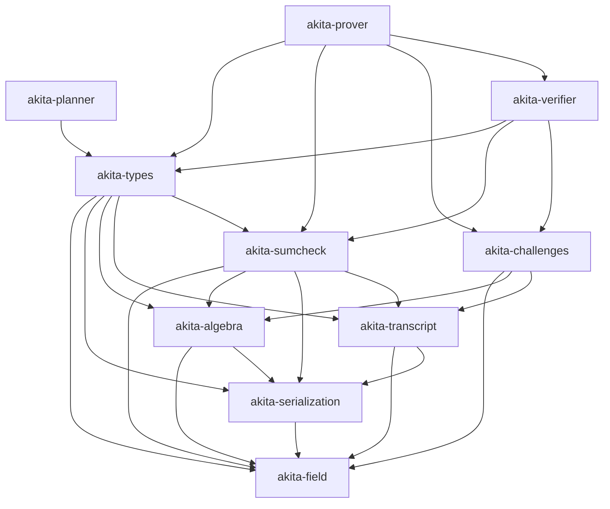

# Spec: Akita PCS Crate Decomposition and Naming Cutover

| Field       | Value        |
|-------------|--------------|
| Author(s)   | @quangvdao   |
| Created     | 2026-05-02   |
| Status      | proposed     |
| PR          | #64          |

## Summary

Hachi started as a single public library package, `hachi-pcs`, plus an older proc-macro package.
The monolith mixes algebra, serialization, transcripts, sumcheck machinery, schedule/config planning, prover kernels, verifier logic, examples, benches, and binary planner tools behind one dependency boundary.
This makes integration with Jolt harder than necessary: Jolt should be able to depend on a small verifier-oriented Akita surface without also pulling prover-only polynomial backends, recursive witness construction, offline planner search, and benchmark/profile scaffolding.
Decompose the codebase into focused Rust workspace crates with explicit dependency direction, a lightweight verifier crate, and a heavier prover crate, while preserving current protocol behavior, proof bytes, transcript streams, and all current end-to-end tests.
At the same architectural boundary, cut over the public package family from `hachi-*` to `akita-*`, with `akita-pcs` as the scheme/repository name after crate decomposition.

## Intent

### Goal

Refactor the current Hachi implementation into an Akita workspace of focused crates whose dependency graph separates foundational algebra, serialization, transcripts/challenge sampling, generic sumcheck, protocol data types, verifier logic, prover logic, and offline planning, so downstream projects such as Jolt can depend on the verifier surface without depending on prover-only code.

### Naming Cutover

The refactor should also rename the public crate family to Akita:

- Scheme and eventual repository name: `akita-pcs`.
- Crates: `akita-field`, `akita-serialization`, `akita-algebra`, `akita-transcript`, `akita-challenges`, `akita-sumcheck`, `akita-types`, `akita-planner`, `akita-verifier`, and `akita-prover`.

The name Akita is deliberately close to Hachi without being a patch-release name.
It keeps the Japanese Hachi/Hachiko association through the Akita breed, while giving the improved scheme its own identity.
It also sits naturally beside the Greyhound/LaBRADOR lineage: a concrete, memorable name for a lattice PCS descendant rather than a generic successor label.

The rename is justified because the implementation target is no longer only a packaging refactor of the original Hachi paper.
The Akita line includes, or is being designed to include, material protocol improvements over the original Hachi design:

- faster verifier-oriented reductions through matrix-claim delegation and tensor-structured challenges;
- smaller proof sizes for large-field deployments, including 128-bit-field settings, through modulus switching and field-size lowering;
- an efficient zero-knowledge layer, tentatively named Whiteout, based on fully blinding the proof with committed sumcheck masks and Gaussian masking noise.

The crate decomposition should keep these protocol improvements cleanly separable from foundational crates.
For example, tensor challenge sampling belongs in `akita-challenges` or role crates as appropriate, shared public proof/config shapes belong in `akita-types`, and Whiteout prover-only machinery must not leak into `akita-verifier`.

The target workspace layout uses a central top-level `crates/` directory.
Each extracted package lives under `crates/<package-name>/`.
The legacy proc-macro package does not remain in the target graph unless real derive macros are reintroduced.
The temporary placeholder `akita-derive` crate was removed rather than kept as a no-op API.
The implementation should migrate crates gradually, one package at a time, keeping the workspace compiling and tests passing after each extraction whenever practical.

The target workspace crates are:

- `akita-field`: `AkitaError`, arithmetic/module traits, and conditional parallelism macros.
- `akita-serialization`: `AkitaSerialize`, `AkitaDeserialize`, and validation/compression traits.
- `akita-algebra`: field implementations, wide/packed field helpers, NTT, cyclotomic rings, sparse challenges, polynomial helpers, and algebra backends.
- `akita-transcript`: transcript trait, hash transcript implementations, and domain labels only.
- `akita-challenges`: Fiat-Shamir challenge sampling helpers, including rejection-sampled dense and sparse ring challenges.
- `akita-sumcheck`: generic sumcheck traits, proof types, drivers, compact folding, batched sumcheck, and generic accumulation helpers. The current `two_round_prefix.rs` module remains Akita-stage-owned because it is a prover-internal optimization for constructing ordinary stage-1/stage-2 sumcheck round messages.
- `akita-types`: public protocol data shapes: commitments, opening claims, proof objects, setup structs needed by verifier APIs, params, config traits/envelopes, opening-point reduction types, schedule/layout shapes, generated schedule tables, transcript-append traits, and PRG utilities that are not prover-only.
- `akita-config`: concrete runtime config presets, the `CommitmentConfig` trait, config-backed schedule policy, recursive `w` config policy, and config adapters for SIS derivation over shared `akita-types` helpers.
- `akita-setup`: config-backed prover setup construction and optional disk persistence. It combines `akita-config` sizing policy with `akita-prover` setup artifacts without making verifier/prover role crates depend on the aggregate package.
- `akita-planner`: offline schedule search, proof-size estimation, SIS-security planning, and the `akita-planner` inspection binary. The concrete `gen_schedule_tables` binary lives with `akita-config`, because it instantiates concrete runtime config presets while calling planner search.
- `akita-verifier`: batched verification, root and recursive level verification, ring-switch verification, quadratic-equation verification helpers, and Akita-specific stage verifier instances.
- `akita-prover`: commitment, batched proving, prover setup/expansion, polynomial backends, recursive witness construction, ring-switch witness construction/finalization, and Akita-specific stage prover instances.
- `akita-pcs`: the aggregate end-to-end package under `crates/akita-pcs`, exposing `AkitaCommitmentScheme` and wiring `akita-config`, `akita-prover`, and `akita-verifier` together. The repository root is workspace-only and owns no Rust package.

The final cutover must update all in-repo imports, examples, benches, tests, docs, and package metadata to the new crate graph in one pass for each extracted crate.
Do not add temporary compatibility wrappers, deprecated aliases, or migration shims.
If a public aggregate package named `akita-pcs` is kept, it must be a deliberate final crate with a stable role, not a transition layer.

### Invariants

This is an architectural refactor.
The implementation must preserve:

1. Protocol behavior: every currently valid proof verifies after the refactor, and every invalid proof rejected by current `main` remains rejected.
2. Transcript determinism: Fiat-Shamir byte absorption order, labels, challenge derivation, rejection sampling, and sparse challenge sampling are unchanged for equivalent prover/verifier flows.
3. Serialization compatibility: existing `AkitaSerialize` / `AkitaDeserialize` encodings for commitments, proof objects, setup data, field elements, ring elements, flat vectors, and digit blocks remain byte-identical unless an acceptance criterion explicitly changes them.
4. Prover/verifier consistency: `akita-prover` and `akita-verifier` must consume the same `akita-types` proof/setup/config definitions; there must not be parallel copies of protocol shapes.
5. Dependency direction: shared foundational crates must not depend on prover or verifier crates; `akita-verifier` must not depend on `akita-prover`; `akita-prover` may depend on `akita-verifier` only if recursive proving needs verifier-side public types or helpers, and any such dependency must be justified in code comments or module docs.
6. Verifier slimness: `akita-verifier` must not expose or require `AkitaPolyOps`, `DensePoly`, `OneHotPoly`, `RecursiveWitnessFlat`, commit hints as prover witnesses, planner search APIs, examples, benches, profile code, or prover setup expansion APIs.
7. Planner isolation: offline search code in `src/planner/` must not be required by the verifier crate. Verifier layout validation may use generated schedule tables and schedule shape types, but not search loops.
8. Feature behavior: the existing default `parallel` feature remains enabled for crates that need it; all crates that can compile without Rayon must do so with `--no-default-features`.
9. No ownership churn: files or modules made obsolete by this refactor may be deleted, but only when they are replaced by the new crate layout in the same branch. Do not delete unrelated local analysis files or user-owned work.

Jolt's `jolt-eval` framework is separate from the spec-review workflow.
It is a dedicated evaluation crate that packages mechanically checkable invariants, fuzz/red-team targets, static-analysis objectives, Criterion performance objectives, and AI optimization loops.
Akita does not have an equivalent evaluation crate today.
Do not port the full `jolt-eval` framework as part of this crate-decomposition spec PR.
Instead, capture the above invariants with standard Rust unit/integration tests, compile-fail dependency checks where practical, deterministic transcript/serialization regression tests, and a small follow-up plan for an Akita-native evaluation crate once the crate graph is stable.

### Non-Goals

1. Changing current protocol behavior, security assumptions, schedule choices, proof layout semantics, Fiat-Shamir domain labels, or field/ring arithmetic as part of the crate split. Akita protocol improvements such as matrix-claim delegation, tensor challenges, modulus switching, and Whiteout should land as explicit protocol changes, not accidental side effects of moving files.
2. Migrating Jolt to consume the new Akita crates in this PR. The output should make that integration straightforward, but the Jolt-side dependency change is separate.
3. Importing Jolt's code, eval framework, or crate names into Akita.
4. Keeping temporary compatibility shims for old module paths such as `akita_pcs::protocol::...`, or preserving the old monolithic protocol tree under a new `akita_pcs::protocol::...` facade.
5. Rewriting algorithms for performance. Performance regressions should be avoided, but optimization beyond preserving current behavior is out of scope.
6. Publishing crates to crates.io.
7. Reorganizing local research notes, generated analysis markdowns, or untracked scripts unrelated to the crate decomposition.
8. Porting Jolt's full `jolt-eval` crate, Claude/agent optimization loop, guest sandbox, or Jolt-specific objective catalog into Akita. A lightweight Akita evaluation crate can be specified separately after the crate split gives it stable package boundaries to depend on.

## Evaluation

### Acceptance Criteria

- [x] Workspace `Cargo.toml` lists the new package members under `crates/*` and no package has a circular dependency for extracted leaf crates.
- [x] Each extracted leaf package is introduced as `crates/<package-name>/` and migrated with old in-tree owners removed.
- [x] `akita-field` contains the former `src/error.rs`, `src/primitives/arithmetic.rs`, and `src/parallel.rs` functionality under crate-local modules and re-exports the current public arithmetic trait surface.
- [x] `akita-serialization` contains the former `src/primitives/serialization.rs` functionality without a placeholder derive-macro dependency.
- [x] `akita-algebra` contains the live algebra tree and depends only on `akita-field` and `akita-serialization` plus its external dependencies.
- [x] `akita-transcript` contains the former `src/protocol/transcript/{mod.rs,hash.rs,labels.rs}` functionality but does not depend on protocol prover/verifier modules; challenge sampling helpers currently reached through `protocol::challenges::rejection` move out of transcript into `akita-challenges`.
- [x] `akita-challenges` contains the former `src/protocol/challenges/` functionality and all transcript helper functions that sample dense/sparse ring challenges from Fiat-Shamir output.
- [x] `akita-sumcheck` contains only generic sumcheck modules: `accum.rs`, `batched_sumcheck.rs`, `compact_fold.rs`, `drivers.rs`, `traits.rs`, and `types.rs`, plus any algebra polynomial re-exports needed by existing callers. The current `two_round_prefix.rs` module stays with the Akita-specific stage modules because its live API is a prover-side shortcut for constructing ordinary stage-1/stage-2 round messages from compact witness tables.
- [x] Akita-specific stage modules `akita_stage1.rs`, `akita_stage1_tree.rs`, and `akita_stage2.rs` are split so prover-specific structs live in `akita-prover` and verifier-specific structs live in `akita-verifier`; shared stage proof shapes live in `akita-types`.
- [x] `akita-types` uses current `main` file names and does not reference removed files such as `src/protocol/commitment/config.rs`, `presets.rs`, `profile.rs`, `schedule_planner.rs`, or `src/test_utils.rs`.
- [x] `akita-config` contains the former `src/protocol/config/{mod.rs,proof_optimized.rs,schedule_policy.rs,sis_policy.rs}` functionality. Root imports config policy from `akita-config` instead of owning a `protocol::config` module.
- [x] `akita-setup` owns config-backed setup construction and optional disk persistence, so `akita-pcs` no longer carries a setup module.
- [x] `akita-planner` owns the former `src/planner/{baseline.rs,proof_size.rs,schedule_params.rs,search.rs,sis_security.rs}` modules and the renamed `akita-planner` inspection binary. Runtime verifier/prover crates do not depend on planner search APIs. `akita-config` owns `gen_schedule_tables` because it owns the concrete fp128 config presets.
- [x] The unified commitment trait is split into role-specific trait surfaces, for example `CommitmentProver` and `CommitmentVerifier`, so verifier crates do not need a trait bound on `AkitaPolyOps`.
- [x] `akita-verifier` exposes batched verification APIs equivalent to the current `AkitaCommitmentScheme::batched_verify` and does not depend on `akita-prover`. The `akita-pcs` aggregate crate now calls `akita_verifier::verify_batched_with_policy`, injecting only config schedule/layout policy and the root-direct commitment recomputation callback.
- [x] `akita-prover` exposes commitment and proving APIs equivalent to current `commit`, `batched_commit`, and `batched_prove`, and owns `AkitaPolyOps`, `DensePoly`, `OneHotPoly`, `MultilinearPolynomial`, and recursive witness implementations.
- [x] Existing examples, benches, and integration tests import from the new crates and compile without old-path aliases.
- [x] The repository root is workspace-only; the aggregate package has moved to `crates/akita-pcs` and exposes `AkitaCommitmentScheme` directly rather than through an old `protocol::commitment_scheme` public path.
- [x] `README.md` and repository metadata describe the scheme as Akita / `akita-pcs`, and explain that Akita is the successor in the Hachi lineage rather than an unrelated project.
- [ ] Deterministic transcript regression tests assert that representative `Blake2bTranscript` and `KeccakTranscript` flows over Akita field/ring challenges produce the same challenges before and after the refactor.
- [ ] Serialization roundtrip and byte-stability tests cover `AkitaBatchedProof`, `AkitaBatchedRootProof`, `AkitaLevelProof`, `RingCommitment`, `FlatRingVec`, `FlatDigitBlocks`, and representative field/ring elements.
- [x] Dependency-graph checks assert that `akita-verifier` has no dependency edge to `akita-prover`, `akita-planner`, examples, benches, or prover polynomial backends.
- [x] `cargo fmt -q` passes at the workspace root.
- [x] `cargo clippy --all --all-targets --all-features --message-format=short -q -- -D warnings` passes at the workspace root.
- [x] `cargo test` passes at the workspace root.
- [x] `cargo test --no-default-features` passes for crates expected to support sequential/no-Rayon mode.

### Testing Strategy

Existing tests that must continue passing:

- All integration tests under `crates/akita-pcs/tests/`, especially `akita_e2e.rs`, `single_poly_e2e.rs`, `multipoint_batched_e2e.rs`, `batched_aggregated_e2e.rs`, `commitment_contract.rs`, and `setup.rs`.
- All protocol tests embedded in `crates/akita-pcs/src/commitment_scheme.rs`, integration tests under `crates/akita-pcs/tests/`, and tests in the owning extracted crates.
- All algebra and NTT tests after extraction to `akita-algebra`.
- All examples and benches that are listed in workspace manifests.

New tests to add:

- `akita-verifier` compile and runtime tests using only verifier setup, commitments, claimed openings, proof objects, transcripts, and public config/types.
- A dependency hygiene test or CI script that runs `cargo tree -p akita-verifier`
  and `cargo tree -p akita-prover`, failing if either crate grows a normal
  dependency on the root crate, the planner, or the opposite prover/verifier
  crate.
- Transcript regression tests for dense scalar challenges, extension challenges, rejection-sampled ring challenges, and sparse ring challenges.
- Serialization byte-stability fixtures generated on current `main` before the crate split, committed as compact deterministic test vectors.
- Trait-surface compile tests proving that verifier APIs accept claims/proofs without requiring `P: AkitaPolyOps`.
- Feature matrix checks: default features, `--no-default-features`, and `--all-features` for the workspace or the crates where those modes are meaningful.

### Evaluation Framework Follow-Up

Do not block this spec PR or the crate split on a full `jolt-eval` port.
The useful idea to carry over is the split between invariants and objectives, not the Jolt-specific implementation.

After `akita-field`, `akita-algebra`, `akita-transcript`, `akita-types`, `akita-verifier`, and `akita-prover` exist, open a separate spec for an `akita-eval` crate or `crates/akita-eval/` workspace member.
That follow-up should start small:

- invariants: transcript determinism, serialization byte stability, proof accept/reject behavior, verifier/prover agreement, dependency-graph hygiene, and Whiteout zero-knowledge simulation checks once Whiteout lands;
- fuzz targets: sparse challenge sampling, deserialization validation, ring-switch verifier inputs, and proof-object validation;
- objectives: verifier dependency size, verifier compile time, proof verification time, proof size, prover commit/open throughput, and memory use for representative profiles;
- tooling: simple `measure-objectives` and invariant/fuzz entrypoints first; agent red-teaming and optimization loops only if they prove useful for Akita-specific invariants.

This keeps the spec-review workflow lightweight while leaving room for an Akita-native evaluation harness with protocol-specific invariants.

### Performance

Expected performance is no regression beyond measurement noise.
The refactor changes package boundaries and module paths, not algorithms.

Concrete performance checks:

- `cargo bench --bench akita_e2e`
- `cargo bench --bench onehot_batched_commit`
- `cargo bench --bench onehot_batched_opening`
- `cargo bench --bench root_kernels`
- `cargo run --release --example profile` with representative `AKITA_MODE=onehot` and `AKITA_NUM_VARS=25`

Acceptable regression threshold: within 2% for wall-clock benchmark medians on unchanged hardware, unless the benchmark noise is higher and the implementer documents the run variance.
Binary size and dependency size should improve for verifier-only consumers: `cargo tree -p akita-verifier` must be materially smaller than the prover dependency graph and must not include prover-only polynomial backend modules.

No Jolt-style objective registry is required for this PR; the `akita-eval` follow-up should own any future objective catalog.

## Design

### Architecture

All new library crates should live below the top-level `crates/` directory:

```text
crates/
  akita-field/
  akita-serialization/
  akita-algebra/
  akita-transcript/
  akita-challenges/
  akita-sumcheck/
  akita-types/
  akita-planner/
  akita-verifier/
  akita-prover/
```

The root workspace manifest owns package membership and shared workspace dependency versions.
Package-local manifests own only the dependencies needed by that crate.
Avoid keeping duplicate source ownership between the old monolithic module tree and the extracted crate: once a crate owns a module, update all call sites to import the crate directly and delete or privatize the old module path in the same step.

The crate graph should be acyclic and roughly layered as follows:



The `Prover --> Verifier` edge is optional.
Prefer avoiding it unless recursive proving materially benefits from reusing verifier-only checks.
The required edge is one-way: `Verifier` must never depend on `Prover`.

#### Current Source Mapping

Use current `main` paths, not the stale older plan.

`akita-field`:

- `crates/akita-field/src/error.rs` (moved from `src/error.rs`)
- `crates/akita-field/src/arithmetic.rs` (moved from `src/primitives/arithmetic.rs`)
- `crates/akita-field/src/parallel.rs` (moved from `src/parallel.rs`)

`akita-serialization`:

- `crates/akita-serialization/src/lib.rs` (moved from `src/primitives/serialization.rs`)

`akita-algebra`:

- `crates/akita-algebra/src/backend/` (moved from `src/algebra/backend/`)
- `crates/akita-algebra/src/fields/` (moved from `src/algebra/fields/`)
- `crates/akita-algebra/src/ntt/` (moved from `src/algebra/ntt/`)
- `crates/akita-algebra/src/ring/` (moved from `src/algebra/ring/`)
- `crates/akita-algebra/src/{eq_poly.rs,module.rs,offset_eq.rs,poly.rs,split_eq.rs,uni_poly.rs}` (moved from `src/algebra/`)

`akita-transcript`:

- `crates/akita-transcript/src/hash.rs` (moved from `src/protocol/transcript/hash.rs`)
- `crates/akita-transcript/src/labels.rs` (moved from `src/protocol/transcript/labels.rs`)
- `Transcript` trait in `crates/akita-transcript/src/lib.rs` (moved from `src/protocol/transcript/mod.rs`)

`akita-challenges`:

- `crates/akita-challenges/src/{lib.rs,rejection.rs,sparse.rs}` (moved from `src/protocol/challenges/`)
- `sample_ext_challenge`, `challenge_ring_element`, `challenge_ring_element_rejection_sampled`, `challenge_ring_elements_rejection_sampled`, and `challenge_sparse_ring_elements_rejection_sampled`.

`akita-sumcheck`:

- `src/protocol/sumcheck/{accum.rs,batched_sumcheck.rs,compact_fold.rs,drivers.rs,traits.rs,types.rs}`
- Do not move Akita-specific stage prover/verifier structs here.
- Keep the current `src/protocol/sumcheck/two_round_prefix.rs` beside the Akita stage modules for this cutover. When the role crates split, move it with `akita-prover`; it does not define verifier proof data or a public wire format.

`akita-types`:

- `src/protocol/proof.rs`, after ensuring it contains proof/data shapes rather than prover algorithms. Extracted in the first `akita-types` cut.
- `src/protocol/params.rs`. Extracted in the first `akita-types` cut.
- `src/protocol/opening_point.rs`. Extracted in the first `akita-types` cut.
- `src/protocol/commitment/types.rs`. Extracted in the first `akita-types` cut.
- `src/protocol/commitment/transcript_append.rs`. Extracted in the first `akita-types` cut.
- `src/protocol/commitment/generated/`. Extracted in the first `akita-types` cut.
- `src/protocol/commitment/utils/flat_matrix.rs`, because `FlatMatrix` and `RingMatrixView` are shared setup/view data used by both verifier replay and prover matrix operations. Extracted before setup-shape ownership moves.
- Schedule/layout contract portions of `src/protocol/commitment/schedule.rs`: `HachiScheduleInputs`, `HachiRootBatchSummary`, `HachiScheduleLookupKey`, `HachiSchedulePlan`, planned-step data shapes, and the `ScheduleProvider` trait. These are extracted into `akita-types` as shared contracts only; schedule search, table generation, and runtime materialization remain outside `akita-types`.
- `src/protocol/commitment/schedule_types.rs`, which owned the shared runtime `Schedule`, `Step`, and `WitnessShape` data shapes used by configs, prover/verifier wiring, examples, tests, and planner output translation. The shared data shapes and `HachiSchedulePlan` to `Schedule` conversion are now extracted into `akita-types`; the obsolete root file has been deleted.
- `src/protocol/commitment/digit_math.rs`, because digit decomposition math is part of runtime layout/proof sizing as well as offline planner search. Extracted in the schedule-boundary cut.
- Shared recursive witness-size formulas (`w_ring_element_count*` and `r_decomp_levels`) used by schedule/config/verifier layout validation. These are layout math, not prover witness construction, so they live with schedule contracts rather than in `ring_switch`.
- Shared decomposition/layout derivation helpers (`recursive_level_decomposition_from_root`, `level_layout_from_params`, and SIS rank derivation math) now live in `akita-types`; root keeps only config adapters that need concrete `CommitmentConfig` policy.
- Recursive witness layout derivation now lives in `akita-types` with the root decomposition passed explicitly; root keeps only the `CommitmentConfig` adapter.
- The root `hachi_recursive_level_layout_from_params` adapter has been retired; prover, config, and tests call `akita_types::recursive_level_layout_from_params` directly with the active config decomposition.
- Header-stripped proof-size and planned-witness sizing formulas now live in `akita-types`, so runtime generated-schedule validation and `akita-planner` search share one implementation.
- Batched-root layout scaling and per-polynomial split helpers now live in `akita-types`; root and planner only supply the config-specific stage-1 challenge mass.
- The root `scale_batched_root_layout` adapter has been retired; config/prover tests call `akita_types::scale_batched_root_layout` directly with the active stage-1 L1 mass.
- Per-polynomial batched-root split extraction from a planned schedule now lives in `akita-types`, keeping root's batched-layout fallback focused on config lookup and planner miss handling.
- Planned-schedule state lookup, planned log-basis resolution, and stable planned schedule keys now live in `akita-types`; `akita-config` presets use these as shared schedule metadata helpers instead of owning duplicate schedule-inspection code.
- Exact planned fold execution recovery now lives in `akita-types`; `akita-config` presets supply only the stage-1 challenge callback needed to synthesize terminal direct-step params.
- Generated schedule direct-witness shape conversion and generated-step witness-length accessors now live beside generated schedule data in `akita-types`; root only supplies the config-specific fallback log-basis for field-element direct witnesses.
- Generated schedule table-entry materialization and validation now live in `akita-types`; `akita-config` keeps only a `CommitmentConfig` adapter that supplies decomposition, stage-1 challenge config, and batched-root scaling policy.
- Config-backed generated-schedule materialization, current/root layout selection, batched-root fallback, and batched-root layout selection now live under `akita-config`.
- The former `src/protocol/commitment/schedule.rs` owner has been deleted. Examples, benches, integration tests, and `gen_schedule_tables` no longer import schedule policy through `protocol::commitment`.
- Pure schedule/layout tests for proof byte accounting and root-batch aggregate semantics now live in `akita-types`. `akita-config` keeps only concrete fp128, generated-table, planner-fallback, and preset-policy tests.
- Config adapters for SIS derivation now live under `akita-config`, because they are preset policy over `akita-types` SIS derivation helpers rather than commitment machinery.
- The obsolete root `protocol::commitment` module has been deleted. Prover trait/data imports now come from `akita-prover` or direct aggregate crate re-exports instead of a compatibility wrapper.
- Shared config data shapes (`DecompositionParams`, `CommitmentEnvelope`, and `AjtaiRole`) are now in `akita-types`; concrete config policy now lives in `akita-config`.
- Shared setup contracts from the former root setup module: `HachiSetupSeed`, `HachiExpandedSetup`, and `HachiVerifierSetup`, plus the public matrix seed type. These are public verifier/prover API shapes and now live in `akita-types`; `HachiProverSetup` and config-free setup expansion now live in `akita-prover`, while `akita-config` owns setup sizing and `akita-setup` owns optional disk persistence.
- `src/protocol/prg.rs` only if both prover and verifier need it. If it is setup/prover-only, place it in `akita-prover`.
- Runtime-to-const dispatch helpers now live in `akita-prover`, beside the
  multi-D NTT cache and prover kernels that consume them.

`akita-planner`:

- `crates/akita-planner/src/{baseline.rs,proof_size.rs,schedule_params.rs,search.rs,sis_security.rs}` (moved from `src/planner/`).
- `crates/akita-planner/src/bin/akita-planner.rs` (moved from the root manifest binary and renamed from `hachi-planner` to `akita-planner`).
- `crates/akita-config/src/bin/gen_schedule_tables.rs` owns generated schedule table emission for the concrete fp128 presets, using `akita-planner` for search and `akita-types` for emitted table shapes.
- Search-specific logic is no longer embedded in verifier/prover runtime policy. `akita-config` calls `akita-planner` across an explicit `PlannerConfig` trait for table misses; verifier/prover role crates remain planner-free.

`akita-verifier`:

- Verification path from the aggregate commitment scheme, including current functions around `batched_verify`, `verify_batched_recursive_suffix`, `verify_root_level`, `verify_one_level`, and root-direct verification helpers.
- Verifier path from the former root ring-switch module, including `ring_switch_verifier`. The ring-switch verifier replay engine (`ring_switch_verifier`, `PreparedMEval`, and the direct M-eval helpers) has moved into `crates/akita-verifier`; prover-side witness construction/finalization remains prover-owned.
- Verifier challenge derivation and stage helpers that used to sit beside the
  quadratic equation builder now live in `akita-verifier`; the remaining
  quadratic equation builder is prover-owned.
- Verifier structs and impls currently in `akita_stage1.rs`, `akita_stage1_tree.rs`, and `akita_stage2.rs`.

`akita-prover`:

- Prover path from the aggregate commitment scheme, including the
  config-free `commit_with_params` kernel (now moved), followed by `commit`,
  `batched_commit`, `batched_prove`, `prove_root_level`, and recursive proving
  helpers once config/schedule policy is separated.
- Prover path from the former root ring-switch module, including
  `ring_switch_build_w`, `ring_switch_finalize`, and the `commit_w` kernel
  (now moved). `WCommitmentConfig` and schedule-derived layout selection now
  live in `akita-config`.
- Prover helpers from `src/protocol/quadratic_equation.rs`; the quadratic
  equation builder has moved into `akita-prover` and no longer carries a
  config phantom parameter.
- the former recursive runtime helpers
- the former root polynomial backend helpers
- Prover structs and impls currently in `akita_stage1.rs`, `akita_stage1_tree.rs`, and `akita_stage2.rs`.
- Setup expansion code from the former root setup module if it builds prover matrices or NTT caches unnecessary for verifier-only consumers. The config-free `HachiProverSetup` artifact and matrix/NTT expansion are now in `akita-prover`; `akita-setup` keeps config-backed construction and disk-cache policy.

#### Trait Split

The current `CommitmentScheme` trait combines setup, commit, prove, and verify and imports `AkitaPolyOps`.
Split it into role-specific traits in `akita-types` or the relevant role crates:

```rust
pub trait CommitmentVerifier<F, const D: usize>
where
    F: FieldCore + CanonicalField,
{
    type VerifierSetup: Clone + Send + Sync;
    type Commitment: Clone + PartialEq + Send + Sync + AppendToTranscript<F>;
    type BatchedProof: Clone + Send + Sync;

    fn batched_verify<'a, T: Transcript<F>>(
        proof: &Self::BatchedProof,
        setup: &Self::VerifierSetup,
        transcript: &mut T,
        claims: VerifierClaims<'a, F, Self::Commitment>,
        basis: BasisMode,
    ) -> Result<(), AkitaError>;

    fn protocol_name() -> &'static [u8];
}

pub trait CommitmentProver<F, const D: usize>
where
    F: FieldCore + CanonicalField,
{
    type ProverSetup: Clone + Send + Sync;
    type VerifierSetup: Clone + Send + Sync;
    type Commitment: Clone + Send + Sync;
    type CommitHint: Clone + Send + Sync;
    type BatchedProof: Clone + Send + Sync;

    fn setup_prover(
        max_num_vars: usize,
        max_num_batched_polys: usize,
        max_num_points: usize,
    ) -> Self::ProverSetup;

    fn setup_verifier(setup: &Self::ProverSetup) -> Self::VerifierSetup;

    fn commit<P: AkitaPolyOps<F, D>>(
        polys: &[P],
        setup: &Self::ProverSetup,
    ) -> Result<(Self::Commitment, Self::CommitHint), AkitaError>;

    fn batched_prove<'a, T: Transcript<F>, P: AkitaPolyOps<F, D>>(
        setup: &Self::ProverSetup,
        claims: ProverClaims<'a, F, P, Self::Commitment, Self::CommitHint>,
        transcript: &mut T,
        basis: BasisMode,
    ) -> Result<Self::BatchedProof, AkitaError>;
}
```

The exact trait placement may differ, but the verifier trait must not name `AkitaPolyOps`, and the prover trait must not inherit from the verifier trait merely to reuse associated setup/proof/commitment types.
The first verifier-crate cut moves `CommitmentVerifier`, `CommittedOpenings`,
`OpeningPoints`, and `VerifierClaims` into `crates/akita-verifier` with no root
crate dependency. The remaining verifier extraction work is to move the actual
batched/root/recursive verifier engine and verifier-specific stage modules into
that crate.
The next verifier cut moves the ring-switch verifier replay engine into
`crates/akita-verifier`; the remaining verifier extraction work is now the
stage-1/stage-2 verifier structs and the batched/root/recursive verifier
orchestration in the aggregate commitment scheme.
The following verifier cut moves the stage-2 verifier (`HachiStage2Verifier`,
`Stage2MEvalSource`, direct-witness evaluation, and `relation_claim_from_rows`)
into `crates/akita-verifier`; stage-2 proving and two-round-prefix prover
optimizations remain root/prover-owned.
Before moving the stage-1 verifier, shared stage-1 tree choreography helpers
(`stage1_tree_stage_shapes`, leaf coefficients, interstage batching, and claim
absorption) move into `akita-types` so the prover path and verifier crate use
one source of truth.
The next verifier cut moves the stage-1 verifier (`HachiStage1Verifier`, the
single-stage range-check verifier, and the staged product/leaf verifier
instances) into `crates/akita-verifier`; stage-1 proving and the compact
two-round-prefix kernels remain root/prover-owned.
The follow-up verifier-helper cut moves stage-coordinate reordering into
`akita-types`, cyclotomic trace evaluation into `akita-algebra`, and verifier
stage-1 challenge derivation into `akita-verifier`, leaving only prover
challenge sampling in the quadratic-equation builder.
The shared batch/opening helper cut moves multipoint batch shapes, prepared
root opening points, batch transcript absorption, claim-count validation, and
root schedule shape predicates into `akita-types`, so the eventual verifier
orchestration move can depend on shared contracts rather than root-local
helpers.
The level-replay verifier cut moves root-level and recursive fold-level
transcript/algebra checks into `akita-verifier`, leaving only schedule/config
selection and ring-dimension dispatch in the root crate until the
verifier-facing config boundary is extracted.
The recursive-suffix verifier cut then moves the post-root fold loop and
runtime ring-dimension dispatch into `akita-verifier`; the root crate now only
selects the schedule, handles the root-direct fallback, prepares the root
state, and calls the verifier crate for root/fold replay.
The fold-root orchestration cut moves the folded-root proof-shape checks,
root-opening preparation, root replay call, and recursive suffix handoff into
`akita-verifier`; the root crate keeps only config-derived layout selection
and the root-direct fallback while the schedule/config boundary is still
monolithic.
The root-direct opening cut moves direct witness/opening validation into
`akita-verifier`; root-direct commitment recomputation stays in the root crate
temporarily because it still depends on commitment-generation utilities that
have not yet been split from prover setup.
This recomputation callback is intentionally a preservation mechanism, not the
desired long-term verifier interface: root-direct verification should become a
lighter verifier-side check, and future verifier preprocessing may also need to
commit to setup-matrix data without importing prover-oriented polynomial
machinery.
The verifier-claim preparation cut moves validation and flattening of
`VerifierClaims` into `akita-verifier`, so root no longer rebuilds batch
shapes, flattened openings, or aggregate schedule summaries by hand.
The batched verifier orchestration cut moves root-proof variant dispatch into
`akita-verifier`; root now selects the schedule context and provides only a
temporary direct-commitment recomputation callback.
The verifier-schedule-context cut moves direct-vs-folded schedule-context
construction into `akita-verifier`. Root still supplies config-derived layout
callbacks, but `akita-verifier` owns the public schedule shape interpretation
used by top-level verifier replay.
The first prover extraction cut introduces `crates/akita-prover` and moves the
operation-centric root polynomial trait (the current `HachiPolyOps`, occupying
the future `AkitaPolyOps` role) plus `DecomposeFoldWitness` and
`CommitInnerWitness` into that crate. The trait now abstracts over the
per-polynomial commitment cache type, so `akita-prover` does not depend on the
root crate's NTT cache utilities. Concrete backends (`DensePoly`, `OneHotPoly`,
`MultilinearPolynomial`) and recursive witness storage remain root-owned until
the NTT/commitment utilities and prover setup expansion move with them.
The second prover extraction cut moves prover input grouping shapes
(`CommittedPolynomials` and `ProverClaims`) into `akita-prover`. The root
`CommitmentProver` trait remains in the root crate for now because its default
cache parameter still names the root-local `NttSlotCache`.
The next prover utility cut moves the CRT/NTT cache type and cache builder
(`NttSlotCache`, `ProtocolCrtNttParams`, `select_crt_ntt_params`, and
`build_ntt_slot`) into `akita-prover`. The large root linear kernels still
live in the root crate for this cut, but they now consume the cache from
`akita-prover`, which unblocks moving the prover trait and later NTT-backed
recursive witness operations.
With the cache default available from `akita-prover`, the following cut moves
the `CommitmentProver` trait itself into `akita-prover`. The root crate now
implements the prover trait from the prover crate rather than owning the
trait definition.
The next prover utility cut moves the NTT-backed linear kernels
(`decompose_rows_i8*`, cached mat-vec dispatch, cyclic single-row dispatch,
and split-eq quotient helpers) into `akita-prover`. Root setup, prover
orchestration, polynomial backends, and benches now import those kernels from
the prover crate.
The follow-up helper cut moves shared decompose-fold helper kernels and the
conditional AArch64 NEON sparse accumulation kernel into `akita-prover` as
internal prover plumbing. Root polynomial backends still call those helpers
during the transition, but the helper ownership is now prover-side.
The recursive witness cut then moves `RecursiveWitnessFlat` and
`RecursiveWitnessView` into `akita-prover`, because those types model
prover-only ring-switch witness state and are consumed only by prover
orchestration, quadratic-equation construction, and ring-switch handoff paths.
Root code imports them directly from the prover crate during the cutover.
The cache-management cut moves `MultiDNttCaches` into `akita-prover`; the root
NTT dispatch macro still calls its dimension-specific accessors, but the cache
owner now sits with the prover-owned NTT slot and linear kernels.
The matrix/PRG cut moves deterministic public-matrix derivation and matrix PRG
backends into `akita-prover`, leaving root setup to call prover-owned setup
material while `CommitmentConfig` remains root-owned for this stage.
The prover-setup artifact cut moves `HachiProverSetup` and config-free setup
expansion into `akita-prover`. Root setup now owns only config capacity
selection and optional disk-cache policy, then asks `akita-prover` to build or
wrap the concrete expanded setup and NTT cache.
The commitment-kernel cut moves config-free grouped polynomial commitment into
`akita-prover`. Root commit APIs now select `LevelParams` from config/schedule
policy, then call the prover-owned kernel to produce the commitment and hint.
The root-direct recommit cut moves config-free direct-witness-to-commitment
checking into `akita-prover`. Root verification still chooses the direct layout
from config/schedule policy, then passes concrete params into the prover-owned
checker used by the verifier callback.
This removes root's direct dependency on dense witness reconstruction and
temporary prover setup creation for root-direct verification; the remaining
root callback is now only a bridge from verifier schedule policy into the
prover-owned preservation check.
The relation-claim cut moves shared stage-2 public-row relation math into
`akita-types`, because both prover and verifier replay the same algebra and it
should not make root/prover code import verifier internals.
The API-contract cut moves verifier claim shapes and the `CommitmentVerifier`
trait into `akita-types`. `akita-verifier` now owns verifier replay, while
`akita-prover` no longer depends on verifier internals for its normal build.
The prover-flow-state cut moves recursive prover carry state, root raw-output
state, suffix output state, and terminal direct-proof packaging into
`akita-prover`, preparing the remaining root prover orchestration for a later
lift behind config-selected layouts.
The recursive-fold-finisher cut moves the config-free part of one recursive
fold proof into `akita-prover`: build `w`, finish ring switching, run both
sumchecks, and produce the next recursive state. Root still supplies the
config-selected closure that commits the next `w`.
The root-fold-finisher cut applies the same boundary to the folded root level:
root still owns transcript setup, batch shape, and schedule-selected next
commitment params, while `akita-prover` owns root `w` construction, ring-switch
finalization, sumchecks, and root raw output assembly.
The root-fold-orchestration cut moves the remaining config-free root fold
preparation into `akita-prover`: root polynomial folding, public root transcript
absorbs, gamma batching, root quadratic-equation construction, and root
commitment-row selection. Root now passes only prepared opening points, root
params, expected next `w` length, next log-basis, and the next-commitment
closure selected from config/schedule policy.
The batched-prove-driver cut moves top-level batched prover claim
normalization, schedule-key derivation, schedule selection callback wiring, and
the root-direct shortcut into `akita-prover::prove_batched_with_policy`. It
also derives the folded-root first-recursive schedule inputs before calling
back into root for config-selected next params. Root still supplies the
folded-root closure while recursive `w` commitment layout selection remains
config-owned.
The recursive-fold-orchestration cut mirrors that boundary for suffix levels:
`akita-prover::prove_recursive_level_with_policy` now owns recursive state
unpacking, recursive opening-point reduction, typed witness/hint conversion,
recursive witness folding, public recursive transcript absorbs, recursive
quadratic-equation construction, and the folded-level prover mechanics. Root
still owns dynamic ring-dimension dispatch, scheduled current/next layout
selection, and the next-commitment closure.
The recursive-commitment-policy cleanup factors root's duplicated next-`w`
commitment logic into `commit_next_w_with_policy`. Root keeps this helper
because the same-D layout policy intentionally differs between the root fold
(`Cfg`) and recursive folds (`WCommitmentConfig<D, Cfg>`), while
`akita-prover` continues to receive the selected commitment closure.
The recursive-`w` commitment-driver cut moves that helper into
`akita-prover`: the prover crate now owns same-D reuse, cross-D NTT dispatch,
`commit_w`, and D-erased hint conversion. Root supplies only the same-D layout
callback and the runtime-D recursive layout callback so config policy remains
root-owned.
The folded-batched-prover cut moves folded-root preparation and suffix assembly
into `akita-prover::prove_folded_batched_with_policy`: root opening reduction,
commitment row checks, root fold proving, recursive suffix handoff, and final
proof assembly are now prover-owned. Root supplies the first recursive params
and the config-selected callbacks for root-next commitment and suffix proving.
The recursive-commitment-config cleanup moves `WCommitmentConfig` into
`akita-config` and makes the old root `protocol::ring_switch` file
test-only. Production ring-switch proving and verification now live only in
`akita-prover` and `akita-verifier`, while `akita-config` keeps the derived
recursive-commitment policy beside `CommitmentConfig`.
The proof-assembly cleanup moves config-free root-direct proof construction and
folded root-plus-suffix proof assembly into `akita-prover`. Root still selects
schedule/config policy and recursive suffix callbacks, but it no longer
manually shapes `HachiBatchedProof` payloads.
The recursive-suffix-driver cut moves the suffix fold loop into `akita-prover`
behind two callbacks: scheduled current/next layout selection and dynamic
ring-dimension proving. Root still owns dispatch/orchestration policy, but
`akita-prover` now owns suffix state threading and terminal direct-basis
resolution.
The schedule-execution helper cut moves fold/direct schedule replay helpers
into `akita-types`. Root still provides the config callback for direct terminal
params, but successor-step interpretation and runtime schedule consistency
checks now live beside the shared schedule data model.
The batched-commit-kernel cut moves the repeated grouped commitment loop into
`akita-prover`. Root still validates grouped batch shape and chooses the root
layout from config/schedule policy, while `akita-prover` owns the actual
per-group commitment execution for that layout.
The commit-policy cut moves singleton and grouped batched commit validation
plus root commit schedule interpretation into
`akita-prover::{commit_with_policy, batched_commit_with_policy}`. Root now
passes only config callbacks (`get_params_for_commitment` and
`get_params_for_prove`) for normal commit entrypoints, while root-direct
verifier recomputation intentionally remains on the lower-level
`commit_with_params` preservation callback until that verifier path is
redesigned.
The batched-prove-input cut moves config-free prover-claim validation and
flattening into `akita-prover`: opening points, commitments, multipoint batch
shape, flattened polynomial refs, and flattened hints are prepared there. Root
uses the prepared shape only for schedule/layout policy and root opening-point
preparation.
The commit-input cut moves config-free singleton and grouped batched commit
validation into `akita-prover`: root now receives the validated polynomial
dimension, group sizes, and total claim count, then uses only those summaries
to choose the config-backed commitment layout.
The dense-backend cut moves `DensePoly` into `akita-prover`. Root direct
witness reconstruction and mixed-batch wrappers now import the dense backend
from the prover crate, while root one-hot and representation-erasing wrappers
continue to move independently.
The one-hot/backend-wrapper cut moves `OneHotPoly`, `OneHotIndex`, and
`MultilinearPolynomial` into `akita-prover` and deletes the root
`hachi_poly_ops` module instead of leaving it as a forwarding layer.
The recursive hint-cache cut moves `RecursiveCommitmentHintCache` into
`akita-prover`, keeping D-erased prover hint state beside the recursive witness
and prover backends that consume it.
The sumcheck-prover cut moves Akita's stage-1/stage-2 prover implementations
and their two-round-prefix optimization into `akita-prover`. The verifier
counterparts already live in `akita-verifier`, so this keeps stage ownership
role-specific.
The dispatch-helper cut moves runtime-to-const ring-dimension dispatch macros
into `akita-prover`. The macros are used by root prover orchestration to select
dimension-specific NTT caches, so they belong beside the multi-D NTT cache and
prover kernels until the remaining root orchestration is extracted.
The quadratic-equation cut moves the stage-1 quadratic equation builder into
`akita-prover` and removes its unused config phantom parameter. This keeps
root orchestration calling prover-owned construction logic without forcing
`akita-prover` to depend on config policy.
The ring-switch prover cuts start the remaining ring-switch split by moving
D-agnostic output state, witness-shaping helpers, prover M-table evaluation,
ring-switch build/finalize orchestration, and the recursive `w` commitment
kernel into `akita-prover`. `WCommitmentConfig` and schedule-derived layout
selection now live in `akita-config`.

#### Schedule and Config Boundary

Current `main` has a scheduler refactor:

- `crates/akita-config/src/lib.rs`
- `crates/akita-config/src/proof_optimized.rs`
- `crates/akita-config/src/schedule_policy.rs`
- `crates/akita-config/src/sis_policy.rs`
- `crates/akita-planner/src/schedule_params.rs` (moved from `src/planner/schedule_params.rs`)

The older plan's `commitment/config.rs`, `presets.rs`, `profile.rs`, and `schedule_planner.rs` no longer exist.
Before moving crates, split current schedule/config code by role:

- Shared layout/config types and generated tables: `akita-types`.
- Offline search and proof-size/SIS exploration: `akita-planner`.
- Prover-only setup expansion or witness sizing helpers: `akita-prover`.
- Verifier-needed layout validation: `akita-types` or `akita-verifier`, with no dependency on planner search.

#### Transcript and Challenge Boundary

Before the in-place boundary split, transcript code imported `protocol::challenges::rejection`.
That made `akita-transcript` not truly foundational.
Move challenge sampling out of transcript so:

- `akita-transcript` owns byte absorption, labels, hash transcript state, and scalar challenge extraction.
- `akita-challenges` owns "interpret transcript output as Akita/Akita-specific ring/sparse challenges" functions.

This keeps Jolt integration cleaner: Jolt can consume the transcript layer without importing Akita ring challenge sampling, while Akita prover/verifier crates can depend on both.

### Alternatives Considered

1. Keep a single `akita-pcs` crate and use Cargo features to hide prover code.
   This avoids file moves but leaves dependency boundaries unenforced and makes verifier slimness easy to regress.
   It also keeps Jolt integration tied to a monolithic package.

2. Extract only `akita-verifier` and leave all shared code in `akita-pcs`.
   This gives a superficial verifier package but still forces verifier consumers through a broad transitive dependency graph.

3. Put planner, config, schedule, setup, and commitment utilities into one `akita-types` crate.
   This was the older plan.
   It is too broad after the scheduler refactor because planner search and setup expansion are heavier than proof/config shape definitions and risk entering the verifier path.

4. Keep the unified `CommitmentScheme` trait.
   This keeps API continuity but forces verifier-oriented crates to name prover-only `AkitaPolyOps`.
   The role-specific split is cleaner and aligns with the no-backward-compatibility policy.

5. Add a temporary `akita-pcs` facade with old `akita_pcs::...`-style module paths.
   This conflicts with the full-cutover rule.
   Any aggregate crate must be a final public product decision, not a temporary migration layer.

## Documentation

Add or update Akita documentation:

- `AGENTS.md`: update crate structure, essential commands if package-specific commands become preferable, and key abstractions.
- `README.md`: rename the public scheme/package description to Akita / `akita-pcs`, state that Akita descends from and improves on Hachi, and describe the new package layout plus which crate downstream users should depend on for prover, verifier, algebra, and transcript use cases.
- Repository description: update GitHub/repo metadata from the old Hachi wording to Akita wording, while preserving the explicit Hachi lineage.
- `docs/`: add a short crate graph document, preferably `docs/crate-graph.md`, with the dependency diagram and intended ownership boundaries.
- Examples: update import paths and comments so users learn the new public crate names.

No Jolt book changes are required in this Akita crate-decomposition PR.
A later Jolt integration PR can update Jolt docs once Jolt consumes `akita-verifier`.

## Future Planner Improvement

The current runtime/profile surface still has a type-level config split:
callers choose a concrete preset such as `D32Full`, `D128Full`, `D32OneHot`,
or `D64OneHot`, and each preset then plans the best schedule inside that fixed
ring family. As a result, `profile.rs` implements a wrapper-level comparison
between generated plans, for example comparing `D32Full` against `D128Full`
before running the dense profile.

This is good enough for the crate-decomposition cutover, but it is not the
ideal Akita planner API. After the crate graph is stable, add an explicit
planner-facing selector for "best full" and "best onehot" modes that returns
the chosen concrete config/ring family plus its schedule, rather than making
callers manually compare typed presets. The selector should support singleton
and batched shapes, use the same schedule-provider boundary as the typed
configs, and avoid leaking offline search APIs into `akita-verifier`.

## Schedule Provider Boundary and Planner Follow-Up

The planner-extraction cut removes the old in-tree `src/planner` fallback
imports from `protocol::{config,commitment}`. Runtime config code still treats
generated schedules as the shipped schedule cache, but table misses preserve
current behavior by calling the extracted `akita-planner` search engine through
the explicit `PlannerConfig` boundary while the root aggregate crate still owns
concrete configs and orchestration. The crate-decomposition goal is not to make
generated tables enumerate every possible grouped or multipoint batch shape. A
finite generated table should be treated as a cache for shipped presets, not as
the general scheduling abstraction.

The in-place schedule split introduces an explicit schedule-provider boundary:
runtime prover/verifier code asks a provider for a `HachiSchedulePlan` by
`HachiScheduleLookupKey`. `akita-types` owns the inert public contracts for
that boundary: schedule keys, batch summaries, planned schedule data shapes,
runtime `Schedule`/`Step`/`WitnessShape` data shapes, generated table
representation, and the `ScheduleProvider` trait. It must not own DP search,
proof-size estimation, SIS-security search, table generation binaries, profile
selection wrappers, or other planner algorithms.

`akita-planner` owns the search-backed implementation. Concrete table
generation stays in the root crate until config preset ownership moves, but it
must call the extracted planner crate rather than carrying a second search
implementation.
Generated tables, offline planner search, tests, profile tooling, and future
external caches can then be separate provider implementations. `akita-verifier`,
and `akita-prover` must not depend on the search-backed provider. The root
aggregate crate may temporarily depend on it while it still owns both concrete
configs and runtime orchestration.

## Execution

Implement in dependency order through a repeated crate-extraction loop.
Each extraction creates one `crates/<package-name>/` package, moves the owning source into that package, updates all direct users to import the package by crate name, removes or privatizes the old module path, and runs the relevant verification before moving to the next package.
Because this is a full cutover, individual extraction steps may be large, but each step should leave a clear owner for every moved module and should avoid old-path aliases.

The intended sequence is:

1. Prepare the migration:
   update the root workspace manifest strategy, document that all new packages go under `crates/`, and remove the unused placeholder derive crate unless real derive macros are restored.
2. Create deterministic regression fixtures on current `main` before moving code:
   transcript challenge vectors, proof serialization vectors, and representative e2e proof/verify fixtures.
3. Split role-neutral traits before crate moves:
   introduce `CommitmentVerifier` / `CommitmentProver` boundaries and update monolithic call sites.
4. Split transcript/challenge boundaries in-place:
   remove `protocol::transcript` dependency on `protocol::challenges`.
5. Split Akita-specific stage sumcheck modules in-place:
   isolate shared proof shapes, prover structs, and verifier structs.
6. Split schedule/config/planner boundaries in-place:
   separate generated layout/config from offline search and prover setup sizing.
7. Extract `crates/akita-field`:
   move error/arithmetic/parallel foundations, update all imports, remove the old public module ownership, then run focused tests and formatting.
8. Extract `crates/akita-serialization`:
   move serialization traits, remove placeholder derive re-exports, then verify serialization roundtrips and compile checks.
9. Extract `crates/akita-algebra`:
   move algebra backends and polynomial helpers, update dependents, then run algebra/NTT tests.
10. Extract `crates/akita-transcript`:
    move transcript traits, hash implementations, and labels only, then verify transcript regression vectors.
11. Extract `crates/akita-challenges`:
    move Akita challenge sampling helpers, update prover/verifier/sumcheck users, then verify challenge regression vectors.
12. Extract `crates/akita-sumcheck`:
    move only generic sumcheck code, leaving Akita-specific stage prover/verifier logic for later role crates.
13. Extract `crates/akita-types`:
    move proof, commitment, config, schedule shape, opening, setup, and shared protocol data types that both prover and verifier need.
    The first cut moves proof objects, commitment wrappers/claims, opening-point
    reduction types, per-level params, transcript-append helpers, and generated
    schedule/SIS tables. Follow-up cuts should move schedule/config/setup shared
    shapes once the schedule-provider boundary is explicit enough to keep
    planner search out of runtime verifier/prover crates.
    The current setup-contract cut moves `HachiSetupSeed`, `HachiExpandedSetup`,
    `HachiVerifierSetup`, and the public matrix seed type into `akita-types`,
    while later cuts move `HachiProverSetup` and config-free setup expansion
    into `akita-prover`.
14. Extract `crates/akita-planner`:
    move offline planner/search/proof-size/SIS code and the planner inspection binary, and confirm verifier/prover runtime crates do not depend on planner search APIs.
    First cut: move the planner modules into `crates/akita-planner`,
    rename the inspection binary to `akita-planner`, remove the root
    `planner` module, introduce an explicit `PlannerConfig` trait, and keep
    runtime batch behavior by having the root aggregate crate call the
    extracted planner for generated-table misses. The concrete table generator
    now lives under `crates/akita-config/src/bin/gen_schedule_tables.rs`.
15. Extract `crates/akita-verifier`:
    move the batched/root/recursive verification paths and verifier-specific stage implementations, and check its dependency graph is slim.
    First cut: create the crate and move the verifier trait/claim API there so
    in-repo call sites import `akita_verifier` directly rather than relying on
    root protocol re-exports.
    Second cut: move ring-switch verifier replay (`ring_switch_verifier`,
    `PreparedMEval`, and M-eval helpers) into `akita-verifier`, after moving
    shared scalar-power, sparse-challenge-eval, gadget-scalar, and
    claim-routing validation helpers into foundational crates.
    Third cut: move stage-2 verifier construction and expected-output logic
    into `akita-verifier`, while leaving `HachiStage2Prover` and prover-only
    prefix acceleration in the root/prover path.
    Fourth cut: move shared stage-1 tree helper math into `akita-types` before
    moving the stage-1 verifier itself.
    Fifth cut: move the stage-1 verifier into `akita-verifier`, including the
    compact single-stage verifier and larger-basis product/leaf verifier
    instances; keep stage-1 prover kernels in the root/prover path.
    Sixth cut: move remaining verifier helper functions out of root/prover
    files: stage-coordinate reordering to `akita-types`, cyclotomic trace to
    `akita-algebra`, and verifier stage-1 challenge derivation to
    `akita-verifier`.
    Seventh cut: move shared multipoint batch shapes, prepared root-opening
    helpers, transcript batch absorption, count validators, and root schedule
    predicates into `akita-types`.
    Eighth cut: move root-level and recursive fold-level verifier replay into
    `akita-verifier`; keep schedule/config dispatch in the root crate for now
    because it still depends on `CommitmentConfig` and planner-selected
    `Schedule` steps.
    Ninth cut: move recursive suffix verification and runtime ring-dimension
    dispatch into `akita-verifier`, using the selected `Schedule` as the
    verifier contract rather than depending on `CommitmentConfig`.
    Tenth cut: move folded-root verification orchestration into
    `akita-verifier`; root remains responsible for deriving `root_lp` and the
    first recursive params from `CommitmentConfig`.
    Eleventh cut: move root-direct direct-witness opening validation into
    `akita-verifier`, leaving direct-commitment recomputation in the root
    crate until commitment generation is split out of prover-only machinery.
    Twelfth cut: move verifier-claim validation and flattening into
    `akita-verifier`, producing the canonical batch shape and schedule summary
    consumed by config selection.
    Thirteenth cut: move top-level batched proof dispatch into
    `akita-verifier`, with a temporary callback for root-direct commitment
    recomputation until commitment code is split.
    Thirteenth-B cut: move verifier schedule-context construction into
    `akita-verifier`, while root supplies only config-derived layout callbacks.
16. Extract `crates/akita-prover`:
    move commitment, proving, polynomial backends, recursive witnesses, setup expansion, and prover-specific stage implementations.
    First cut: introduce `akita-prover` and move the operation-centric
    polynomial trait plus shared prover witness structs there, while leaving
    concrete backends in the root crate until their NTT cache and commitment
    utility dependencies are disentangled.
    Second cut: move public prover input grouping shapes into `akita-prover`;
    leave the root `CommitmentProver` trait in place until the NTT cache type
    moves out of the root crate.
    Third cut: move the CRT/NTT cache type and builder into `akita-prover`,
    then update root linear kernels and setup/prover code to import the cache
    from the new crate.
    Fourth cut: move the `CommitmentProver` trait into `akita-prover` now that
    its default cache parameter is no longer root-local.
    Fifth cut: move the NTT-backed linear kernels into `akita-prover`, keeping
    only root setup matrix sampling and cache orchestration in the root crate
    until those can move with prover setup.
    Sixth cut: move shared decompose-fold helper kernels and the conditional
    NEON sparse accumulation kernel into `akita-prover`.
    Seventh cut: move recursive `w` owner/view types and digit-native witness
    operations into `akita-prover`.
    Eighth cut: move multi-D NTT cache management into `akita-prover`.
    Ninth cut: move deterministic public-matrix derivation and matrix PRG
    backends into `akita-prover`.
    Ninth-B cut: move the `HachiProverSetup` artifact and config-free setup
    expansion into `akita-prover`; keep disk-cache policy in root and move
    config sizing with config extraction.
    Ninth-C cut: move the config-free grouped commitment kernel
    (`commit_with_params`) into `akita-prover`; keep root commit APIs as
    config/layout selectors.
    Ninth-D cut: move root-direct recomputation from direct field-element
    witnesses into `akita-prover`; keep root verifier as the config/layout
    selector for the verifier callback.
    Ninth-E cut: move shared stage-2 relation-claim computation into
    `akita-types` so prover/root code no longer imports it from
    `akita-verifier`.
    Ninth-F cut: move verifier claim shapes and the `CommitmentVerifier` trait
    into `akita-types`; demote `akita-prover`'s `akita-verifier` edge to a
    test-only dependency.
    Ninth-G cut: move recursive prover flow state and terminal direct-proof
    packaging into `akita-prover`; keep root orchestration as the schedule
    driver until config extraction.
    Ninth-H cut: move config-free recursive fold-level finishing into
    `akita-prover`; keep root responsible only for selecting how the next
    recursive `w` commitment is parameterized.
    Ninth-I cut: move config-free folded-root finishing into `akita-prover`;
    keep root responsible for public root transcript setup and schedule policy.
    Ninth-J cut: move config-free folded-root preparation/orchestration into
    `akita-prover`; keep root responsible for selecting root/next layouts and
    building prepared opening points from caller basis.
    Ninth-K cut: move config-free recursive-fold preparation/orchestration into
    `akita-prover`; keep root responsible for dynamic D dispatch and
    schedule-selected current/next layout policy.
    Ninth-L cut: move the recursive `w` commitment config adapter beside
    `CommitmentConfig` and leave root `protocol::ring_switch` as a test-only
    compatibility check, since production ring-switch logic has moved out.
    Ninth-M cut: move config-free root-direct proof construction and folded
    proof assembly into `akita-prover`; keep root responsible for the schedule
    branch and recursive suffix policy closure.
    Ninth-N cut: move the recursive suffix fold loop into `akita-prover`;
    keep root responsible for schedule selection callbacks and dynamic
    ring-dimension dispatch callbacks.
    Ninth-O cut: move the grouped batched-commit execution loop into
    `akita-prover`; keep root responsible for shape validation and
    schedule-selected root layout policy.
    Ninth-P cut: move config-free batched prover-claim validation and
    flattening into `akita-prover`; keep root responsible for using the
    prepared shape in schedule/layout policy.
    Ninth-Q cut: move config-free singleton and grouped batched commit
    validation into `akita-prover`; keep root responsible for config-backed
    layout selection.
    Tenth cut: move `DensePoly` into `akita-prover`, then update root
    orchestration, tests, examples, and benches to import it from the prover
    crate.
    Eleventh cut: move `OneHotPoly`, `OneHotIndex`, and
    `MultilinearPolynomial` into `akita-prover`, then remove the obsolete root
    `hachi_poly_ops` module.
    Twelfth cut: move recursive commitment hint caches into `akita-prover`.
    Thirteenth cut: move Akita-specific sumcheck stage prover modules and the
    two-round-prefix prover optimization into `akita-prover`.
    Fourteenth cut: move runtime-to-const ring-dimension dispatch helpers into
    `akita-prover`, beside the multi-D NTT cache they operate on.
    Fifteenth cut: move the stage-1 quadratic equation builder into
    `akita-prover` and remove its unused config phantom.
    Sixteenth cut: move ring-switch output state and D-agnostic witness-shaping
    helpers into `akita-prover`; keep config-backed recursive commitment in
    root for now.
    Seventeenth cut: move prover M-table evaluation into `akita-prover`, beside
    the ring-switch witness-shaping helpers it feeds.
    Eighteenth cut: move ring-switch build/finalize orchestration into
    `akita-prover`; keep config-backed recursive commitment in root until the
    config/schedule split.
    Nineteenth cut: move the recursive `w` commitment kernel into
    `akita-prover`; keep only root layout derivation and `WCommitmentConfig`
    until the config/schedule split.
20. Update examples, benches, integration tests, docs, package metadata, and any deliberate final root re-exports.
21. Remove obsolete modules and old paths in the same branch.
22. Run the full verification matrix and compare deterministic fixtures/benchmark baselines.

The implementation should prefer mechanical file moves with minimal internal edits first.
After each extraction, update `use` paths to external crate names rather than preserving old module aliases, and run the smallest useful check before proceeding.

### Lowest-Risk Implementation Timeline

Start with changes that either add tests/fixtures or split interfaces in-place before any package moves.
The first implementation PRs should avoid protocol changes, algorithm rewrites, and public crate renaming beyond what is needed for the current extraction step.

Phase 0: baseline and fixtures.

- Generate deterministic transcript, serialization, and representative proof fixtures on current `main`.
- Add fixture tests while the code is still monolithic, so later crate moves are checked against known bytes.
- Add the dependency-hygiene script skeleton for the future verifier crate, even if it is initially a no-op until `akita-verifier` exists.
- Gate: `cargo fmt -q`, `cargo test`, and targeted fixture tests pass.

Phase 1: role-neutral in-place splits.

- Split `CommitmentScheme` into verifier/prover role traits in the existing crate.
- Keep current concrete APIs compiling through the new traits, but do not add old-path compatibility shims.
- Update all in-repo callsites to use the role-appropriate trait bounds.
- Gate: existing integration tests pass; verifier-facing trait signatures do not mention `AkitaPolyOps`, `DensePoly`, `OneHotPoly`, commit hints, or recursive witness types.

Phase 2: dependency-breaking in-place splits.

- Move challenge sampling out of transcript ownership while still inside the monolithic crate.
- Split Akita-specific sumcheck stage code into shared proof shapes, prover structs, and verifier structs.
- Split schedule/config/planner responsibilities in place: shared shapes, planner search, prover sizing, and verifier validation.
- First schedule split: move shared runtime schedule shapes (`Schedule`, `Step`, `WitnessShape`) and digit decomposition math into `akita-types`, and make generated SIS floor data available as the runtime-facing audit source.
- Second schedule split: move planned-schedule data shapes (`HachiScheduleInputs`, `HachiRootBatchSummary`, `HachiScheduleLookupKey`, `HachiSchedulePlan`, and planned-step structs) into `akita-types`, and introduce an explicit `ScheduleProvider` boundary so runtime crates consume generated or externally supplied schedules without making `akita-types` own planner search.
- Planner extraction cut: remove the remaining in-tree planner module imports from runtime config/commitment code by moving the search-backed implementation behind `akita-planner` and an explicit `PlannerConfig` trait. Preserve current batching by keeping the root aggregate crate's generated-table miss fallback search-backed for now; do not solve this by growing generated tables around ad hoc production batch shapes.
- Gate: transcript regression fixtures stay byte-identical; `rg` checks confirm transcript modules do not import challenge modules and verifier-oriented modules do not import planner search.

Phase 3: leaf crate extraction.

- Extract one foundational crate at a time: `akita-field`, then `akita-serialization`, then `akita-algebra`.
- For each crate, move files mechanically, update imports to the crate name, remove or privatize the old module owner, and run the smallest relevant test subset before proceeding.
- Gate after each crate: package-specific tests pass, workspace `cargo check` passes, and no old public module alias remains for the moved owner.

Phase 4: protocol infrastructure extraction.

- Extract `akita-transcript`, `akita-challenges`, and `akita-sumcheck` in that order.
- Keep Akita-specific stage prover/verifier logic out of `akita-sumcheck`; only generic sumcheck machinery belongs there.
- Gate after each crate: transcript/challenge fixtures pass, sumcheck tests pass, and crate dependency edges match the architecture diagram.

Phase 5: shared protocol data and planner extraction.

- Extract `akita-types` only after proof/config/setup ownership is clear.
- Extract `akita-planner` immediately after `akita-types`, so offline search stops being visible to runtime verifier/prover crates. The root aggregate crate may keep a temporary direct edge while it owns concrete configs and orchestration.
- Gate: the `akita-planner` inspection binary compiles under `akita-planner`; verifier/prover runtime crates do not depend on planner search APIs; generated schedule tables remain available to verifier/prover code through shared types or generated data.

Phase 6: verifier then prover role crates.

- Extract `akita-verifier` before `akita-prover`.
- Keep verifier APIs proof/claim/setup/transcript oriented and free of polynomial backend or witness types.
- Extract `akita-prover` last because it owns the heaviest dependency surface: commitment, polynomial backends, recursive witness construction, setup expansion, and proving kernels.
- Gate: `cargo tree -p akita-verifier` contains no `akita-prover`, `akita-planner`, polynomial backend, example, bench, profile, or recursive witness dependency.

Phase 7: public naming and docs cutover.

- Update package metadata, README, repository description, examples, benches, integration tests, and docs to present Akita / `akita-pcs` as the public scheme name with explicit Hachi lineage.
- Rename benchmarks, environment variables, examples, and user-facing docs from Hachi names to Akita names when they are part of the public surface.
- Gate: old public `hachi-*` package names and `hachi_pcs::...` import paths are absent from examples, benches, tests, and docs except where describing historical lineage or current-source references.

Phase 8: full verification and cleanup.

- Run the full verification matrix from the acceptance criteria.
- Compare deterministic fixtures and benchmark baselines.
- Delete files made obsolete by the refactor only when their replacement owner is live and verified.
- Gate: workspace checks pass, fixture bytes match, dependency hygiene passes, and any benchmark variance beyond the threshold is documented.

If any phase reveals that a supposed shared type is actually prover-only or verifier-only, stop and update the ownership map before extracting the next crate.
Do not proceed by adding a temporary facade or alias to keep momentum.

## References

- Jolt spec template: [`specs/TEMPLATE.md`](https://github.com/a16z/jolt/blob/main/specs/TEMPLATE.md)
- Jolt example spec style: [`specs/unify-field-hierarchy.md`](https://github.com/a16z/jolt/blob/main/specs/unify-field-hierarchy.md)
- Akita aggregate crate root: [`crates/akita-pcs/src/lib.rs`](../crates/akita-pcs/src/lib.rs)
- Akita current commitment implementation: [`crates/akita-pcs/src/commitment_scheme.rs`](../crates/akita-pcs/src/commitment_scheme.rs)
- Akita current scheduler/config files: [`crates/akita-config/src/lib.rs`](../crates/akita-config/src/lib.rs), [`crates/akita-config/src/proof_optimized.rs`](../crates/akita-config/src/proof_optimized.rs), [`crates/akita-config/src/schedule_policy.rs`](../crates/akita-config/src/schedule_policy.rs)
