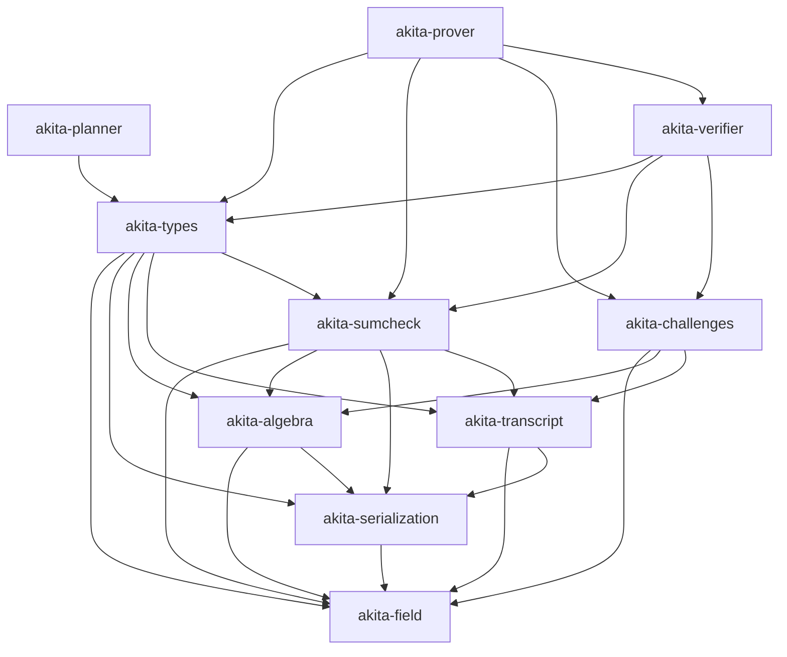

# Spec: Akita PCS Crate Decomposition and Naming Cutover

| Field       | Value        |
|-------------|--------------|
| Author(s)   | @quangvdao   |
| Created     | 2026-05-02   |
| Status      | proposed     |
| PR          | #64          |

## Summary

Hachi started as a single public library package, `hachi-pcs`, plus the proc-macro package `hachi-derive`.
The monolith mixes algebra, serialization, transcripts, sumcheck machinery, schedule/config planning, prover kernels, verifier logic, examples, benches, and binary planner tools behind one dependency boundary.
This makes integration with Jolt harder than necessary: Jolt should be able to depend on a small verifier-oriented Akita surface without also pulling prover-only polynomial backends, recursive witness construction, offline planner search, and benchmark/profile scaffolding.
Decompose the codebase into focused Rust workspace crates with explicit dependency direction, a lightweight verifier crate, and a heavier prover crate, while preserving current protocol behavior, proof bytes, transcript streams, and all current end-to-end tests.
At the same architectural boundary, cut over the public package family from `hachi-*` to `akita-*`, with `akita-pcs` as the scheme/repository name after crate decomposition.

## Intent

### Goal

Refactor the current Hachi implementation into an Akita workspace of focused crates whose dependency graph separates foundational algebra, serialization, transcripts/challenge sampling, generic sumcheck, protocol data types, verifier logic, prover logic, and offline planning, so downstream projects such as Jolt can depend on the verifier surface without depending on prover-only code.

### Naming Cutover

The refactor should also rename the public crate family to Akita:

- Scheme and eventual repository name: `akita-pcs`.
- Crates: `akita-field`, `akita-serialization`, `akita-algebra`, `akita-transcript`, `akita-challenges`, `akita-sumcheck`, `akita-types`, `akita-planner`, `akita-verifier`, and `akita-prover`.
- Proc macro package: `akita-derive`, whether it remains at `derive/` or moves to `crates/akita-derive/`.

The name Akita is deliberately close to Hachi without being a patch-release name.
It keeps the Japanese Hachi/Hachiko association through the Akita breed, while giving the improved scheme its own identity.
It also sits naturally beside the Greyhound/LaBRADOR lineage: a concrete, memorable name for a lattice PCS descendant rather than a generic successor label.

The rename is justified because the implementation target is no longer only a packaging refactor of the original Hachi paper.
The Akita line includes, or is being designed to include, material protocol improvements over the original Hachi design:

- faster verifier-oriented reductions through matrix-claim delegation and tensor-structured challenges;
- smaller proof sizes for large-field deployments, including 128-bit-field settings, through modulus switching and field-size lowering;
- an efficient zero-knowledge layer, tentatively named Whiteout, based on fully blinding the proof with committed sumcheck masks and Gaussian masking noise.

The crate decomposition should keep these protocol improvements cleanly separable from foundational crates.
For example, tensor challenge sampling belongs in `akita-challenges` or role crates as appropriate, shared public proof/config shapes belong in `akita-types`, and Whiteout prover-only machinery must not leak into `akita-verifier`.

The target workspace layout uses a central top-level `crates/` directory.
Each extracted package lives under `crates/<package-name>/`.
The proc-macro package has moved from `derive/` to `crates/akita-derive/` as the first low-risk crate-layout cutover, so subsequent crate extractions should follow the same top-level `crates/` convention.
The implementation should migrate crates gradually, one package at a time, keeping the workspace compiling and tests passing after each extraction whenever practical.

The target workspace crates are:

- `akita-field`: `AkitaError`, arithmetic/module traits, and conditional parallelism macros.
- `akita-serialization`: `AkitaSerialize`, `AkitaDeserialize`, validation/compression traits, and the `akita-derive` proc-macro re-export.
- `akita-algebra`: field implementations, wide/packed field helpers, NTT, cyclotomic rings, sparse challenges, polynomial helpers, and algebra backends.
- `akita-transcript`: transcript trait, hash transcript implementations, and domain labels only.
- `akita-challenges`: Fiat-Shamir challenge sampling helpers, including rejection-sampled dense and sparse ring challenges.
- `akita-sumcheck`: generic sumcheck traits, proof types, drivers, compact folding, batched sumcheck, and generic accumulation helpers. The current `two_round_prefix.rs` module remains Akita-stage-owned because it is a prover-internal optimization for constructing ordinary stage-1/stage-2 sumcheck round messages.
- `akita-types`: public protocol data shapes: commitments, opening claims, proof objects, setup structs needed by verifier APIs, params, config traits/envelopes, opening-point reduction types, schedule/layout shapes, generated schedule tables, transcript-append traits, and PRG utilities that are not prover-only.
- `akita-planner`: offline schedule search, proof-size estimation, SIS-security planning, and the `akita-planner` / `gen_schedule_tables` binaries.
- `akita-verifier`: batched verification, root and recursive level verification, ring-switch verification, quadratic-equation verification helpers, and Akita-specific stage verifier instances.
- `akita-prover`: commitment, batched proving, prover setup/expansion, polynomial backends, recursive witness construction, ring-switch witness construction/finalization, and Akita-specific stage prover instances.

The final cutover must update all in-repo imports, examples, benches, tests, docs, and package metadata to the new crate graph in one pass for each extracted crate.
Do not add temporary compatibility wrappers, deprecated aliases, or migration shims.
If a public aggregate package named `akita-pcs` is kept, it must be a deliberate final crate with a stable role, not a transition layer.

### Invariants

This is an architectural refactor.
The implementation must preserve:

1. Protocol behavior: every currently valid proof verifies after the refactor, and every invalid proof rejected by current `main` remains rejected.
2. Transcript determinism: Fiat-Shamir byte absorption order, labels, challenge derivation, rejection sampling, and sparse challenge sampling are unchanged for equivalent prover/verifier flows.
3. Serialization compatibility: existing `AkitaSerialize` / `AkitaDeserialize` encodings for commitments, proof objects, setup data, field elements, ring elements, flat vectors, and digit blocks remain byte-identical unless an acceptance criterion explicitly changes them.
4. Prover/verifier consistency: `akita-prover` and `akita-verifier` must consume the same `akita-types` proof/setup/config definitions; there must not be parallel copies of protocol shapes.
5. Dependency direction: shared foundational crates must not depend on prover or verifier crates; `akita-verifier` must not depend on `akita-prover`; `akita-prover` may depend on `akita-verifier` only if recursive proving needs verifier-side public types or helpers, and any such dependency must be justified in code comments or module docs.
6. Verifier slimness: `akita-verifier` must not expose or require `AkitaPolyOps`, `DensePoly`, `OneHotPoly`, `RecursiveWitnessFlat`, commit hints as prover witnesses, planner search APIs, examples, benches, profile code, or prover setup expansion APIs.
7. Planner isolation: offline search code in `src/planner/` must not be required by the verifier crate. Verifier layout validation may use generated schedule tables and schedule shape types, but not search loops.
8. Feature behavior: the existing default `parallel` feature remains enabled for crates that need it; all crates that can compile without Rayon must do so with `--no-default-features`.
9. No ownership churn: files or modules made obsolete by this refactor may be deleted, but only when they are replaced by the new crate layout in the same branch. Do not delete unrelated local analysis files or user-owned work.

Jolt's `jolt-eval` framework is separate from the spec-review workflow.
It is a dedicated evaluation crate that packages mechanically checkable invariants, fuzz/red-team targets, static-analysis objectives, Criterion performance objectives, and AI optimization loops.
Akita does not have an equivalent evaluation crate today.
Do not port the full `jolt-eval` framework as part of this crate-decomposition spec PR.
Instead, capture the above invariants with standard Rust unit/integration tests, compile-fail dependency checks where practical, deterministic transcript/serialization regression tests, and a small follow-up plan for an Akita-native evaluation crate once the crate graph is stable.

### Non-Goals

1. Changing current protocol behavior, security assumptions, schedule choices, proof layout semantics, Fiat-Shamir domain labels, or field/ring arithmetic as part of the crate split. Akita protocol improvements such as matrix-claim delegation, tensor challenges, modulus switching, and Whiteout should land as explicit protocol changes, not accidental side effects of moving files.
2. Migrating Jolt to consume the new Akita crates in this PR. The output should make that integration straightforward, but the Jolt-side dependency change is separate.
3. Importing Jolt's code, eval framework, or crate names into Akita.
4. Keeping temporary compatibility shims for old module paths such as `hachi_pcs::protocol::...`, or preserving the old monolithic protocol tree under a new `akita_pcs::protocol::...` facade.
5. Rewriting algorithms for performance. Performance regressions should be avoided, but optimization beyond preserving current behavior is out of scope.
6. Publishing crates to crates.io.
7. Reorganizing local research notes, generated analysis markdowns, or untracked scripts unrelated to the crate decomposition.
8. Porting Jolt's full `jolt-eval` crate, Claude/agent optimization loop, guest sandbox, or Jolt-specific objective catalog into Akita. A lightweight Akita evaluation crate can be specified separately after the crate split gives it stable package boundaries to depend on.

## Evaluation

### Acceptance Criteria

- [x] Workspace `Cargo.toml` lists the new package members under `crates/*` and no package has a circular dependency for extracted leaf crates.
- [x] Each extracted leaf package is introduced as `crates/<package-name>/` and migrated with old in-tree owners removed.
- [x] `akita-field` contains the former `src/error.rs`, `src/primitives/arithmetic.rs`, and `src/parallel.rs` functionality under crate-local modules and re-exports the current public arithmetic trait surface.
- [x] `akita-serialization` contains the former `src/primitives/serialization.rs` functionality and re-exports derive macros from `akita-derive`; `akita-derive` no longer depends on the old monolithic package path.
- [x] `akita-algebra` contains the live algebra tree and depends only on `akita-field` and `akita-serialization` plus its external dependencies.
- [x] `akita-transcript` contains the former `src/protocol/transcript/{mod.rs,hash.rs,labels.rs}` functionality but does not depend on protocol prover/verifier modules; challenge sampling helpers currently reached through `protocol::challenges::rejection` move out of transcript into `akita-challenges`.
- [x] `akita-challenges` contains the former `src/protocol/challenges/` functionality and all transcript helper functions that sample dense/sparse ring challenges from Fiat-Shamir output.
- [x] `akita-sumcheck` contains only generic sumcheck modules: `accum.rs`, `batched_sumcheck.rs`, `compact_fold.rs`, `drivers.rs`, `traits.rs`, and `types.rs`, plus any algebra polynomial re-exports needed by existing callers. The current `two_round_prefix.rs` module stays with the Akita-specific stage modules because its live API is a prover-side shortcut for constructing ordinary stage-1/stage-2 round messages from compact witness tables.
- [ ] Akita-specific stage modules `akita_stage1.rs`, `akita_stage1_tree.rs`, and `akita_stage2.rs` are split so prover-specific structs live in `akita-prover` and verifier-specific structs live in `akita-verifier`; shared stage proof shapes live in `akita-types`.
- [x] `akita-types` uses current `main` file names and does not reference removed files such as `src/protocol/commitment/config.rs`, `presets.rs`, `profile.rs`, `schedule_planner.rs`, or `src/test_utils.rs`.
- [ ] `akita-types` includes the current config path `src/protocol/config/{mod.rs,proof_optimized.rs}` and the current commitment schedule path `src/protocol/commitment/{digit_math.rs,schedule.rs,schedule_types.rs,types.rs,transcript_append.rs,sis_derivation.rs,generated/}` after any necessary dependency-breaking splits.
- [ ] `akita-planner` owns `src/planner/{baseline.rs,proof_size.rs,schedule_params.rs,search.rs,sis_security.rs}` and both planner binaries. Runtime verifier/prover crates must not depend on planner search APIs.
- [ ] The unified `CommitmentScheme` trait in `src/protocol/commitment/scheme.rs` is split into role-specific trait surfaces, for example `CommitmentProver` and `CommitmentVerifier`, so verifier crates do not need a trait bound on `AkitaPolyOps`.
- [ ] `akita-verifier` exposes batched verification APIs equivalent to the current `AkitaCommitmentScheme::batched_verify` and does not depend on `akita-prover`.
- [ ] `akita-prover` exposes commitment and proving APIs equivalent to current `commit`, `batched_commit`, and `batched_prove`, and owns `AkitaPolyOps`, `DensePoly`, `OneHotPoly`, `MultilinearPolynomail`, and recursive witness implementations.
- [ ] Existing examples, benches, and integration tests import from the new crates and compile without old-path aliases.
- [ ] `README.md` and repository metadata describe the scheme as Akita / `akita-pcs`, and explain that Akita is the successor in the Hachi lineage rather than an unrelated project.
- [ ] Deterministic transcript regression tests assert that representative `Blake2bTranscript` and `KeccakTranscript` flows over Akita field/ring challenges produce the same challenges before and after the refactor.
- [ ] Serialization roundtrip and byte-stability tests cover `AkitaBatchedProof`, `AkitaBatchedRootProof`, `AkitaLevelProof`, `RingCommitment`, `FlatRingVec`, `FlatDigitBlocks`, and representative field/ring elements.
- [ ] Dependency-graph checks assert that `akita-verifier` has no dependency edge to `akita-prover`, `akita-planner`, examples, benches, or prover polynomial backends.
- [ ] `cargo fmt -q` passes at the workspace root.
- [ ] `cargo clippy --all --all-targets --all-features --message-format=short -q -- -D warnings` passes at the workspace root.
- [ ] `cargo test` passes at the workspace root.
- [ ] `cargo test --no-default-features` passes for crates expected to support sequential/no-Rayon mode.

### Testing Strategy

Existing tests that must continue passing:

- All integration tests under `tests/`, especially `akita_e2e.rs`, `single_poly_e2e.rs`, `multipoint_batched_e2e.rs`, `batched_aggregated_e2e.rs`, `commitment_contract.rs`, and `setup.rs`.
- All protocol tests embedded in `src/protocol/commitment_scheme.rs`, `ring_switch.rs`, `quadratic_equation.rs`, `proof.rs`, `setup.rs`, and sumcheck modules after they move to their owning crates.
- All algebra and NTT tests after extraction to `akita-algebra`.
- All examples and benches that are listed in workspace manifests.

New tests to add:

- `akita-verifier` compile and runtime tests using only verifier setup, commitments, claimed openings, proof objects, transcripts, and public config/types.
- A dependency hygiene test or CI script that runs `cargo tree -p akita-verifier` and fails if `akita-prover` or `akita-planner` appears.
- Transcript regression tests for dense scalar challenges, extension challenges, rejection-sampled ring challenges, and sparse ring challenges.
- Serialization byte-stability fixtures generated on current `main` before the crate split, committed as compact deterministic test vectors.
- Trait-surface compile tests proving that verifier APIs accept claims/proofs without requiring `P: AkitaPolyOps`.
- Feature matrix checks: default features, `--no-default-features`, and `--all-features` for the workspace or the crates where those modes are meaningful.

### Evaluation Framework Follow-Up

Do not block this spec PR or the crate split on a full `jolt-eval` port.
The useful idea to carry over is the split between invariants and objectives, not the Jolt-specific implementation.

After `akita-field`, `akita-algebra`, `akita-transcript`, `akita-types`, `akita-verifier`, and `akita-prover` exist, open a separate spec for an `akita-eval` crate or `crates/akita-eval/` workspace member.
That follow-up should start small:

- invariants: transcript determinism, serialization byte stability, proof accept/reject behavior, verifier/prover agreement, dependency-graph hygiene, and Whiteout zero-knowledge simulation checks once Whiteout lands;
- fuzz targets: sparse challenge sampling, deserialization validation, ring-switch verifier inputs, and proof-object validation;
- objectives: verifier dependency size, verifier compile time, proof verification time, proof size, prover commit/open throughput, and memory use for representative profiles;
- tooling: simple `measure-objectives` and invariant/fuzz entrypoints first; agent red-teaming and optimization loops only if they prove useful for Akita-specific invariants.

This keeps the spec-review workflow lightweight while leaving room for an Akita-native evaluation harness with protocol-specific invariants.

### Performance

Expected performance is no regression beyond measurement noise.
The refactor changes package boundaries and module paths, not algorithms.

Concrete performance checks:

- `cargo bench --bench akita_e2e`
- `cargo bench --bench onehot_batched_commit`
- `cargo bench --bench onehot_batched_opening`
- `cargo bench --bench root_kernels`
- `cargo run --release --example profile` with representative `AKITA_MODE=onehot` and `AKITA_NUM_VARS=25`

Acceptable regression threshold: within 2% for wall-clock benchmark medians on unchanged hardware, unless the benchmark noise is higher and the implementer documents the run variance.
Binary size and dependency size should improve for verifier-only consumers: `cargo tree -p akita-verifier` must be materially smaller than the prover dependency graph and must not include prover-only polynomial backend modules.

No Jolt-style objective registry is required for this PR; the `akita-eval` follow-up should own any future objective catalog.

## Design

### Architecture

All new library crates should live below the top-level `crates/` directory:

```text
crates/
  akita-field/
  akita-serialization/
  akita-algebra/
  akita-transcript/
  akita-challenges/
  akita-sumcheck/
  akita-types/
  akita-planner/
  akita-verifier/
  akita-prover/
```

The root workspace manifest owns package membership and shared workspace dependency versions.
Package-local manifests own only the dependencies needed by that crate.
Avoid keeping duplicate source ownership between the old monolithic module tree and the extracted crate: once a crate owns a module, update all call sites to import the crate directly and delete or privatize the old module path in the same step.

The crate graph should be acyclic and roughly layered as follows:



The `Prover --> Verifier` edge is optional.
Prefer avoiding it unless recursive proving materially benefits from reusing verifier-only checks.
The required edge is one-way: `Verifier` must never depend on `Prover`.

#### Current Source Mapping

Use current `main` paths, not the stale older plan.

`akita-field`:

- `crates/akita-field/src/error.rs` (moved from `src/error.rs`)
- `crates/akita-field/src/arithmetic.rs` (moved from `src/primitives/arithmetic.rs`)
- `crates/akita-field/src/parallel.rs` (moved from `src/parallel.rs`)

`akita-serialization`:

- `crates/akita-serialization/src/lib.rs` (moved from `src/primitives/serialization.rs`)
- `crates/akita-derive/`

`akita-algebra`:

- `crates/akita-algebra/src/backend/` (moved from `src/algebra/backend/`)
- `crates/akita-algebra/src/fields/` (moved from `src/algebra/fields/`)
- `crates/akita-algebra/src/ntt/` (moved from `src/algebra/ntt/`)
- `crates/akita-algebra/src/ring/` (moved from `src/algebra/ring/`)
- `crates/akita-algebra/src/{eq_poly.rs,module.rs,offset_eq.rs,poly.rs,split_eq.rs,uni_poly.rs}` (moved from `src/algebra/`)

`akita-transcript`:

- `crates/akita-transcript/src/hash.rs` (moved from `src/protocol/transcript/hash.rs`)
- `crates/akita-transcript/src/labels.rs` (moved from `src/protocol/transcript/labels.rs`)
- `Transcript` trait in `crates/akita-transcript/src/lib.rs` (moved from `src/protocol/transcript/mod.rs`)

`akita-challenges`:

- `crates/akita-challenges/src/{lib.rs,rejection.rs,sparse.rs}` (moved from `src/protocol/challenges/`)
- `sample_ext_challenge`, `challenge_ring_element`, `challenge_ring_element_rejection_sampled`, `challenge_ring_elements_rejection_sampled`, and `challenge_sparse_ring_elements_rejection_sampled`.

`akita-sumcheck`:

- `src/protocol/sumcheck/{accum.rs,batched_sumcheck.rs,compact_fold.rs,drivers.rs,traits.rs,types.rs}`
- Do not move Akita-specific stage prover/verifier structs here.
- Keep the current `src/protocol/sumcheck/two_round_prefix.rs` beside the Akita stage modules for this cutover. When the role crates split, move it with `akita-prover`; it does not define verifier proof data or a public wire format.

`akita-types`:

- `src/protocol/proof.rs`, after ensuring it contains proof/data shapes rather than prover algorithms. Extracted in the first `akita-types` cut.
- `src/protocol/params.rs`. Extracted in the first `akita-types` cut.
- `src/protocol/opening_point.rs`. Extracted in the first `akita-types` cut.
- `src/protocol/commitment/types.rs`. Extracted in the first `akita-types` cut.
- `src/protocol/commitment/transcript_append.rs`. Extracted in the first `akita-types` cut.
- `src/protocol/commitment/generated/`. Extracted in the first `akita-types` cut.
- Schedule/layout contract portions of `src/protocol/commitment/schedule.rs`: `HachiScheduleInputs`, `HachiRootBatchSummary`, `HachiScheduleLookupKey`, `HachiSchedulePlan`, planned-step data shapes, and the `ScheduleProvider` trait. These are extracted into `akita-types` as shared contracts only; schedule search, table generation, and runtime materialization remain outside `akita-types`.
- `src/protocol/commitment/schedule_types.rs`, which owns the shared runtime `Schedule`, `Step`, and `WitnessShape` data shapes used by configs, prover/verifier wiring, examples, tests, and planner output translation. The shared data shapes are extracted; the root crate keeps only the local `HachiSchedulePlan` to `Schedule` conversion until planner/runtime ownership is split further.
- `src/protocol/commitment/digit_math.rs`, because digit decomposition math is part of runtime layout/proof sizing as well as offline planner search. Extracted in the schedule-boundary cut.
- Current config files `src/protocol/config/mod.rs` and `src/protocol/config/proof_optimized.rs`, after planner-search dependencies are split out or gated.
- Public verifier setup shape from `src/protocol/setup.rs`; prover setup expansion can remain prover-owned if that keeps verifier slim.
- `src/protocol/prg.rs` only if both prover and verifier need it. If it is setup/prover-only, place it in `akita-prover`.
- `src/protocol/dispatch.rs` only if macro dispatch is genuinely shared. Otherwise put dispatch beside the code that uses it.

`akita-planner`:

- `src/planner/`
- Planner binaries currently declared in the root manifest.
- Search-specific logic currently imported by `src/protocol/config/mod.rs` or `src/protocol/commitment/schedule.rs` should move here or behind explicit non-verifier features.

`akita-verifier`:

- Verification path from `src/protocol/commitment_scheme.rs`, including current functions around `batched_verify`, `verify_batched_recursive_suffix`, `verify_root_level`, `verify_one_level`, and root-direct verification helpers.
- Verifier path from `src/protocol/ring_switch.rs`, including `ring_switch_verifier`.
- Verifier helpers from `src/protocol/quadratic_equation.rs`, including `derive_stage1_challenges` if verifier-owned.
- Verifier structs and impls currently in `akita_stage1.rs`, `akita_stage1_tree.rs`, and `akita_stage2.rs`.

`akita-prover`:

- Prover path from `src/protocol/commitment_scheme.rs`, including `commit_with_params`, `commit`, `batched_commit`, `batched_prove`, `prove_root_level`, and recursive proving helpers.
- Prover path from `src/protocol/ring_switch.rs`, including `ring_switch_build_w`, `ring_switch_finalize`, and `commit_w`.
- Prover helpers from `src/protocol/quadratic_equation.rs`.
- `src/protocol/recursive_runtime.rs`
- `src/protocol/akita_poly_ops/`
- Prover structs and impls currently in `akita_stage1.rs`, `akita_stage1_tree.rs`, and `akita_stage2.rs`.
- Setup expansion code from `src/protocol/setup.rs` if it builds prover matrices or NTT caches unnecessary for verifier-only consumers.

#### Trait Split

The current `CommitmentScheme` trait combines setup, commit, prove, and verify and imports `AkitaPolyOps`.
Split it into role-specific traits in `akita-types` or the relevant role crates:

```rust
pub trait CommitmentVerifier<F, const D: usize>
where
    F: FieldCore + CanonicalField,
{
    type VerifierSetup: Clone + Send + Sync;
    type Commitment: Clone + PartialEq + Send + Sync + AppendToTranscript<F>;
    type BatchedProof: Clone + Send + Sync;

    fn batched_verify<'a, T: Transcript<F>>(
        proof: &Self::BatchedProof,
        setup: &Self::VerifierSetup,
        transcript: &mut T,
        claims: VerifierClaims<'a, F, Self::Commitment>,
        basis: BasisMode,
    ) -> Result<(), AkitaError>;

    fn protocol_name() -> &'static [u8];
}

pub trait CommitmentProver<F, const D: usize>: CommitmentVerifier<F, D>
where
    F: FieldCore + CanonicalField,
{
    type ProverSetup: Clone + Send + Sync;
    type CommitHint: Clone + Send + Sync;

    fn setup_prover(
        max_num_vars: usize,
        max_num_batched_polys: usize,
        max_num_points: usize,
    ) -> Self::ProverSetup;

    fn setup_verifier(setup: &Self::ProverSetup) -> Self::VerifierSetup;

    fn commit<P: AkitaPolyOps<F, D>>(
        polys: &[P],
        setup: &Self::ProverSetup,
    ) -> Result<(Self::Commitment, Self::CommitHint), AkitaError>;

    fn batched_prove<'a, T: Transcript<F>, P: AkitaPolyOps<F, D>>(
        setup: &Self::ProverSetup,
        claims: ProverClaims<'a, F, P, Self::Commitment, Self::CommitHint>,
        transcript: &mut T,
        basis: BasisMode,
    ) -> Result<Self::BatchedProof, AkitaError>;
}
```

The exact trait placement may differ, but the verifier trait must not name `AkitaPolyOps`.

#### Schedule and Config Boundary

Current `main` has a scheduler refactor:

- `src/protocol/config/mod.rs`
- `src/protocol/config/proof_optimized.rs`
- `src/protocol/commitment/schedule.rs`
- `src/protocol/commitment/sis_derivation.rs`
- `src/planner/schedule_params.rs`

The older plan's `commitment/config.rs`, `presets.rs`, `profile.rs`, and `schedule_planner.rs` no longer exist.
Before moving crates, split current schedule/config code by role:

- Shared layout/config types and generated tables: `akita-types`.
- Offline search and proof-size/SIS exploration: `akita-planner`.
- Prover-only setup expansion or witness sizing helpers: `akita-prover`.
- Verifier-needed layout validation: `akita-types` or `akita-verifier`, with no dependency on planner search.

#### Transcript and Challenge Boundary

Before the in-place boundary split, transcript code imported `protocol::challenges::rejection`.
That made `akita-transcript` not truly foundational.
Move challenge sampling out of transcript so:

- `akita-transcript` owns byte absorption, labels, hash transcript state, and scalar challenge extraction.
- `akita-challenges` owns "interpret transcript output as Akita/Akita-specific ring/sparse challenges" functions.

This keeps Jolt integration cleaner: Jolt can consume the transcript layer without importing Akita ring challenge sampling, while Akita prover/verifier crates can depend on both.

### Alternatives Considered

1. Keep a single `akita-pcs` crate and use Cargo features to hide prover code.
   This avoids file moves but leaves dependency boundaries unenforced and makes verifier slimness easy to regress.
   It also keeps Jolt integration tied to a monolithic package.

2. Extract only `akita-verifier` and leave all shared code in `akita-pcs`.
   This gives a superficial verifier package but still forces verifier consumers through a broad transitive dependency graph.

3. Put planner, config, schedule, setup, and commitment utilities into one `akita-types` crate.
   This was the older plan.
   It is too broad after the scheduler refactor because planner search and setup expansion are heavier than proof/config shape definitions and risk entering the verifier path.

4. Keep the unified `CommitmentScheme` trait.
   This keeps API continuity but forces verifier-oriented crates to name prover-only `AkitaPolyOps`.
   The role-specific split is cleaner and aligns with the no-backward-compatibility policy.

5. Add a temporary `akita-pcs` facade with old `hachi_pcs::...`-style module paths.
   This conflicts with the full-cutover rule.
   Any aggregate crate must be a final public product decision, not a temporary migration layer.

## Documentation

Add or update Akita documentation:

- `AGENTS.md`: update crate structure, essential commands if package-specific commands become preferable, and key abstractions.
- `README.md`: rename the public scheme/package description to Akita / `akita-pcs`, state that Akita descends from and improves on Hachi, and describe the new package layout plus which crate downstream users should depend on for prover, verifier, algebra, and transcript use cases.
- Repository description: update GitHub/repo metadata from the old Hachi wording to Akita wording, while preserving the explicit Hachi lineage.
- `docs/`: add a short crate graph document, preferably `docs/crate-graph.md`, with the dependency diagram and intended ownership boundaries.
- Examples: update import paths and comments so users learn the new public crate names.

No Jolt book changes are required in this Akita crate-decomposition PR.
A later Jolt integration PR can update Jolt docs once Jolt consumes `akita-verifier`.

## Future Planner Improvement

The current runtime/profile surface still has a type-level config split:
callers choose a concrete preset such as `D32Full`, `D128Full`, `D32OneHot`,
or `D64OneHot`, and each preset then plans the best schedule inside that fixed
ring family. As a result, `profile.rs` implements a wrapper-level comparison
between generated plans, for example comparing `D32Full` against `D128Full`
before running the dense profile.

This is good enough for the crate-decomposition cutover, but it is not the
ideal Akita planner API. After the crate graph is stable, add an explicit
planner-facing selector for "best full" and "best onehot" modes that returns
the chosen concrete config/ring family plus its schedule, rather than making
callers manually compare typed presets. The selector should support singleton
and batched shapes, use the same schedule-provider boundary as the typed
configs, and avoid leaking offline search APIs into `akita-verifier`.

## Schedule Provider Boundary and Planner Follow-Up

The current monolithic crate still lets runtime config code fall back from
generated schedule tables into planner search. That is acceptable only as a
temporary bridge while the code is still monolithic. The crate-decomposition
goal is not to make generated tables enumerate every possible grouped or
multipoint batch shape. A finite generated table should be treated as a cache
for shipped presets, not as the general scheduling abstraction.

The in-place schedule split introduces an explicit schedule-provider boundary:
runtime prover/verifier code asks a provider for a `HachiSchedulePlan` by
`HachiScheduleLookupKey`. `akita-types` owns the inert public contracts for
that boundary: schedule keys, batch summaries, planned schedule data shapes,
runtime `Schedule`/`Step`/`WitnessShape` data shapes, generated table
representation, and the `ScheduleProvider` trait. It must not own DP search,
proof-size estimation, SIS-security search, table generation binaries, profile
selection wrappers, or other planner algorithms.

`akita-planner` should own the search-backed provider and table generation.
Generated tables, offline planner search, tests, profile tooling, and future
external caches can then be separate provider implementations. `akita-verifier`
must not depend on the search-backed provider.

This follow-up should remove the remaining direct imports from
`protocol::{config,commitment}` into planner search by changing the dependency
direction, not by bloating generated tables around whichever batch shapes happen
to be covered by today's tests.

## Execution

Implement in dependency order through a repeated crate-extraction loop.
Each extraction creates one `crates/<package-name>/` package, moves the owning source into that package, updates all direct users to import the package by crate name, removes or privatizes the old module path, and runs the relevant verification before moving to the next package.
Because this is a full cutover, individual extraction steps may be large, but each step should leave a clear owner for every moved module and should avoid old-path aliases.

The intended sequence is:

1. Prepare the migration:
   update the root workspace manifest strategy, move `derive/` to `crates/akita-derive/`, and document that all new packages go under `crates/`.
2. Create deterministic regression fixtures on current `main` before moving code:
   transcript challenge vectors, proof serialization vectors, and representative e2e proof/verify fixtures.
3. Split role-neutral traits before crate moves:
   introduce `CommitmentVerifier` / `CommitmentProver` boundaries and update monolithic call sites.
4. Split transcript/challenge boundaries in-place:
   remove `protocol::transcript` dependency on `protocol::challenges`.
5. Split Akita-specific stage sumcheck modules in-place:
   isolate shared proof shapes, prover structs, and verifier structs.
6. Split schedule/config/planner boundaries in-place:
   separate generated layout/config from offline search and prover setup sizing.
7. Extract `crates/akita-field`:
   move error/arithmetic/parallel foundations, update all imports, remove the old public module ownership, then run focused tests and formatting.
8. Extract `crates/akita-serialization`:
   move serialization traits and derive re-exports, update `akita-derive` package paths, then verify serialization roundtrips and compile checks.
9. Extract `crates/akita-algebra`:
   move algebra backends and polynomial helpers, update dependents, then run algebra/NTT tests.
10. Extract `crates/akita-transcript`:
    move transcript traits, hash implementations, and labels only, then verify transcript regression vectors.
11. Extract `crates/akita-challenges`:
    move Akita challenge sampling helpers, update prover/verifier/sumcheck users, then verify challenge regression vectors.
12. Extract `crates/akita-sumcheck`:
    move only generic sumcheck code, leaving Akita-specific stage prover/verifier logic for later role crates.
13. Extract `crates/akita-types`:
    move proof, commitment, config, schedule shape, opening, setup, and shared protocol data types that both prover and verifier need.
    The first cut moves proof objects, commitment wrappers/claims, opening-point
    reduction types, per-level params, transcript-append helpers, and generated
    schedule/SIS tables. Follow-up cuts should move schedule/config/setup shared
    shapes once the schedule-provider boundary is explicit enough to keep
    planner search out of runtime verifier/prover crates.
14. Extract `crates/akita-planner`:
    move offline planner/search/proof-size/SIS code and the planner binaries, and confirm verifier/prover runtime crates do not depend on planner search APIs.
15. Extract `crates/akita-verifier`:
    move the batched/root/recursive verification paths and verifier-specific stage implementations, and check its dependency graph is slim.
16. Extract `crates/akita-prover`:
    move commitment, proving, polynomial backends, recursive witnesses, setup expansion, and prover-specific stage implementations.
17. Update examples, benches, integration tests, docs, package metadata, and any deliberate final root re-exports.
18. Remove obsolete modules and old paths in the same branch.
19. Run the full verification matrix and compare deterministic fixtures/benchmark baselines.

The implementation should prefer mechanical file moves with minimal internal edits first.
After each extraction, update `use` paths to external crate names rather than preserving old module aliases, and run the smallest useful check before proceeding.

### Lowest-Risk Implementation Timeline

Start with changes that either add tests/fixtures or split interfaces in-place before any package moves.
The first implementation PRs should avoid protocol changes, algorithm rewrites, and public crate renaming beyond what is needed for the current extraction step.

Phase 0: baseline and fixtures.

- Generate deterministic transcript, serialization, and representative proof fixtures on current `main`.
- Add fixture tests while the code is still monolithic, so later crate moves are checked against known bytes.
- Add the dependency-hygiene script skeleton for the future verifier crate, even if it is initially a no-op until `akita-verifier` exists.
- Gate: `cargo fmt -q`, `cargo test`, and targeted fixture tests pass.

Phase 1: role-neutral in-place splits.

- Split `CommitmentScheme` into verifier/prover role traits in the existing crate.
- Keep current concrete APIs compiling through the new traits, but do not add old-path compatibility shims.
- Update all in-repo callsites to use the role-appropriate trait bounds.
- Gate: existing integration tests pass; verifier-facing trait signatures do not mention `AkitaPolyOps`, `DensePoly`, `OneHotPoly`, commit hints, or recursive witness types.

Phase 2: dependency-breaking in-place splits.

- Move challenge sampling out of transcript ownership while still inside the monolithic crate.
- Split Akita-specific sumcheck stage code into shared proof shapes, prover structs, and verifier structs.
- Split schedule/config/planner responsibilities in place: shared shapes, planner search, prover sizing, and verifier validation.
- First schedule split: move shared runtime schedule shapes (`Schedule`, `Step`, `WitnessShape`) and digit decomposition math into `akita-types`, and make generated SIS floor data available as the runtime-facing audit source.
- Second schedule split: move planned-schedule data shapes (`HachiScheduleInputs`, `HachiRootBatchSummary`, `HachiScheduleLookupKey`, `HachiSchedulePlan`, and planned-step structs) into `akita-types`, and introduce an explicit `ScheduleProvider` boundary so runtime crates consume generated or externally supplied schedules without making `akita-types` own planner search.
- Follow-up before extracting `akita-planner`: remove the remaining planner-search fallback imports from runtime config/commitment code by moving search-backed provider implementation and table generation behind the planner crate. Do not solve this by growing generated tables around ad hoc production batch shapes.
- Gate: transcript regression fixtures stay byte-identical; `rg` checks confirm transcript modules do not import challenge modules and verifier-oriented modules do not import planner search.

Phase 3: leaf crate extraction.

- Extract one foundational crate at a time: `akita-field`, then `akita-serialization`, then `akita-algebra`.
- For each crate, move files mechanically, update imports to the crate name, remove or privatize the old module owner, and run the smallest relevant test subset before proceeding.
- Gate after each crate: package-specific tests pass, workspace `cargo check` passes, and no old public module alias remains for the moved owner.

Phase 4: protocol infrastructure extraction.

- Extract `akita-transcript`, `akita-challenges`, and `akita-sumcheck` in that order.
- Keep Akita-specific stage prover/verifier logic out of `akita-sumcheck`; only generic sumcheck machinery belongs there.
- Gate after each crate: transcript/challenge fixtures pass, sumcheck tests pass, and crate dependency edges match the architecture diagram.

Phase 5: shared protocol data and planner extraction.

- Extract `akita-types` only after proof/config/setup ownership is clear.
- Extract `akita-planner` immediately after `akita-types`, so offline search stops being visible to runtime verifier/prover crates.
- Gate: planner binaries compile under `akita-planner`; runtime crates do not depend on planner search APIs; generated schedule tables remain available to verifier/prover code through shared types or generated data.

Phase 6: verifier then prover role crates.

- Extract `akita-verifier` before `akita-prover`.
- Keep verifier APIs proof/claim/setup/transcript oriented and free of polynomial backend or witness types.
- Extract `akita-prover` last because it owns the heaviest dependency surface: commitment, polynomial backends, recursive witness construction, setup expansion, and proving kernels.
- Gate: `cargo tree -p akita-verifier` contains no `akita-prover`, `akita-planner`, polynomial backend, example, bench, profile, or recursive witness dependency.

Phase 7: public naming and docs cutover.

- Update package metadata, README, repository description, examples, benches, integration tests, and docs to present Akita / `akita-pcs` as the public scheme name with explicit Hachi lineage.
- Rename benchmarks, environment variables, examples, and user-facing docs from Hachi names to Akita names when they are part of the public surface.
- Gate: old public `hachi-*` package names and `hachi_pcs::...` import paths are absent from examples, benches, tests, and docs except where describing historical lineage or current-source references.

Phase 8: full verification and cleanup.

- Run the full verification matrix from the acceptance criteria.
- Compare deterministic fixtures and benchmark baselines.
- Delete files made obsolete by the refactor only when their replacement owner is live and verified.
- Gate: workspace checks pass, fixture bytes match, dependency hygiene passes, and any benchmark variance beyond the threshold is documented.

If any phase reveals that a supposed shared type is actually prover-only or verifier-only, stop and update the ownership map before extracting the next crate.
Do not proceed by adding a temporary facade or alias to keep momentum.

## References

- Jolt spec template: [`specs/TEMPLATE.md`](https://github.com/a16z/jolt/blob/main/specs/TEMPLATE.md)
- Jolt example spec style: [`specs/unify-field-hierarchy.md`](https://github.com/a16z/jolt/blob/main/specs/unify-field-hierarchy.md)
- Hachi current crate root: [`src/lib.rs`](../src/lib.rs)
- Hachi current commitment trait: [`src/protocol/commitment/scheme.rs`](../src/protocol/commitment/scheme.rs)
- Hachi current commitment implementation: [`src/protocol/commitment_scheme.rs`](../src/protocol/commitment_scheme.rs)
- Hachi current scheduler/config files: [`src/protocol/config/mod.rs`](../src/protocol/config/mod.rs), [`src/protocol/commitment/schedule.rs`](../src/protocol/commitment/schedule.rs)
