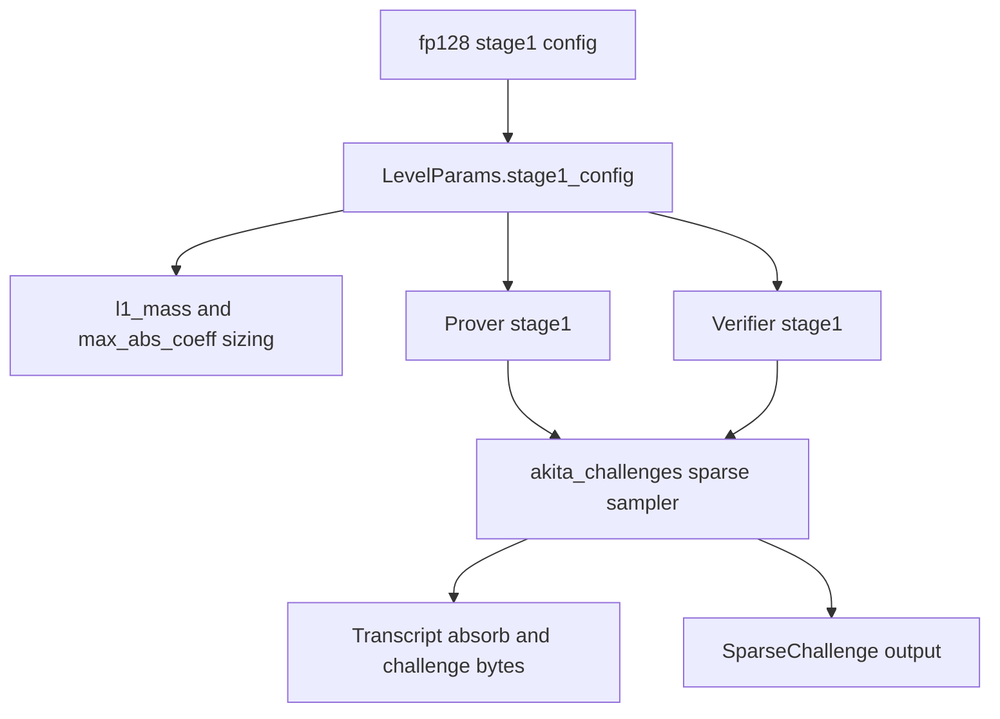

# Spec: Bounded-L1 Sparse Challenge

| Field     | Value                                      |
|-----------|--------------------------------------------|
| Author(s) | Omid Bodaghi, Cursor agent draft           |
| Created   | 2026-05-04                                 |
| Status    | proposed                                   |
| PR        |                                            |

## Summary

This spec introduces a new `SparseChallengeConfig` family, `BoundedL1Ball`, for the stage-1 sparse fold challenge. The first rollout applies it only to the fp128 `D=32` preset, replacing the current full-weight uniform family with an exactly uniform sampler over coefficient vectors satisfying `||c||_inf <= 8` and `||c||_1 <= 121`. This keeps at least 128 bits of Fiat-Shamir challenge support, keeps the existing `L_inf` bound used by SIS sizing, and reduces the worst-case `L1` mass used by folded-witness digit sizing from `256` to `121`.

There is no code symbol named `ChallengeCfg` in the current crate layout. The challenge configuration surface discussed here is `SparseChallengeConfig` in `akita-algebra`, carried through `LevelParams.stage1_config`, and consumed by `akita-challenges` for transcript-bound sampling.

## Intent

### Goal

Add a deterministic, transcript-bound, exactly uniform bounded-`L1` sparse challenge family for fp128 `D=32` stage-1 folding, while preserving the existing prover/verifier replay model and all sizing hooks derived from `SparseChallengeConfig`.

The concrete fp128 policy change is:

```text
current D=32:
  SparseChallengeConfig::Uniform {
      weight: 32,
      nonzero_coeffs: [-8, ..., -1, 1, ..., 8],
  }

new D=32:
  SparseChallengeConfig::BoundedL1Ball {
      max_abs_coeff: 8,
      l1_bound: 121,
  }
```

The fp128 `D=64` and `D=128` presets stay unchanged:

```text
D=64:
  SparseChallengeConfig::SplitRing {
      half_weight: 21,
      max_mag2_per_half: 6,
  }

D=128:
  SparseChallengeConfig::Uniform {
      weight: 31,
      nonzero_coeffs: [-1, 1],
  }
```

### Invariants

- `BoundedL1Ball { max_abs_coeff: M, l1_bound: B }` samples uniformly from a fixed `2^128`-element subset of `{ c in Z^D : ||c||_inf <= M and ||c||_1 <= B }`. Concretely, the canonical streaming sampler draws a 128-bit index `r in [0, 2^128)` and descends the DP recurrence; the subset is exactly the `2^128` lexicographically-first valid descent paths under that recurrence. Whenever the full ball has at least `2^128` elements (which is required by the support-size invariant below), this subset is well-defined and non-empty.
- Every sampled challenge satisfies `||c||_inf <= M` and `||c||_1 <= B`, because the truncated subset is a subset of the ball.
- The sampler delivers exactly `128` bits of Fiat-Shamir min-entropy: each of the `2^128` outcomes is produced with probability exactly `1 / 2^128`, and outcomes outside the chosen subset are produced with probability `0`.
- Every sampled challenge is stored as the existing `SparseChallenge { positions, coeffs }` representation, containing only nonzero coefficients.
- For the fp128 `D=32` preset, `M = 8`, `B = 121`, and the full ball size is approximately `2^128.133`; the `2^128` truncation drops about `12.7%` of ball elements (zero probability under the sampler) while keeping each retained outcome at exactly `1 / 2^128`. `B = 120` would push the full ball below the 128-bit target and is therefore rejected.
- `l1_mass()` for `BoundedL1Ball` returns the true worst-case coefficient `L1` bound `B`. The `2^128` truncation cannot increase realized `||c||_1` past `B` because every retained outcome already satisfied `||c||_1 <= B` in the full ball.
- `max_abs_coeff()` for `BoundedL1Ball` returns the true coefficient `L_inf` bound `M`. The truncation cannot increase realized `||c||_inf` past `M` for the same reason.
- `BoundedL1Ball` has variable realized Hamming weight. Any config-level Hamming-weight accessor used for this family must be degree-aware and return the tight worst-case nonzero-count bound `min(D, B)`, or callers must assert that bound locally.
- Prover and verifier derive identical challenges from the same transcript prefix, label, batch count or instance index, ring degree, and config-domain bytes.
- The sampler reads exactly `16` little-endian bytes from the transcript-derived XOF per challenge for the top-level index `r`, with no rejection at the top level. Per-coefficient bucket selection is then a finite descent over the DP recurrence with no further bounded-integer draws. Earlier drafts of this spec required rejection-sampling the top-level index over `[0, WAYS[D][B])`; this requirement is intentionally relaxed to "uniform draw of one 128-bit index" in exchange for the stricter `128`-bit min-entropy guarantee above and the `u128`-only inner-loop arithmetic. The same relaxation drops the previous "must not draw 128 bits and reduce modulo `T`" rule, which was justified only against the stronger "exactly uniform over the full ball" goal.
- The DP table and sampling descent must be pure functions of `(D, M, B)` and deterministic across platforms. No floating point, platform bignum, randomized initialization, or thread-racy lazy setup is part of the canonical distribution.
- The new challenge family has a distinct transcript/domain encoding and cannot collide with existing `Uniform`, `SplitRing`, or `ExactShell` encodings.

### Non-Goals

- Do not adopt bounded-`L1` sampling for fp128 `D=64` in this change. The proposed `D=64` ball reduces `l1_mass` only from `54` to `47`, while increasing worst-case Hamming weight from `42` to `47`.
- Do not adopt bounded-`L1` sampling for fp128 `D=128` in this change. The proposed `D=128` ball keeps the same `l1_mass = 31` and only adds sampler cost.
- Do not change global transcript labels or rename existing `hachi/...` transcript domains.
- Do not replace the independent operator-norm rejection sampler in `crates/akita-challenges/src/rejection.rs`.
- Do not serialize `SparseChallengeConfig` into proof objects. As today, challenges are re-derived from `LevelParams.stage1_config` and transcript state.

## Evaluation

### Acceptance Criteria

- [ ] `SparseChallengeConfig` has a `BoundedL1Ball { max_abs_coeff, l1_bound }` variant with documented semantics.
- [ ] `BoundedL1Ball { 8, 121 }` validates for `D=32` and has `l1_mass() == 121`, `max_abs_coeff() == 8`, and a degree-aware worst-case Hamming weight of `32`.
- [ ] The fp128 `D=32` preset uses `BoundedL1Ball { max_abs_coeff: 8, l1_bound: 121 }`; fp128 `D=64` and `D=128` remain unchanged.
- [ ] The bounded-`L1` sampler is exactly uniform over the configured ball by construction, using DP suffix counts and bias-free XOF draws.
- [ ] The transcript-domain bytes for `BoundedL1Ball` are canonical and distinct from existing variants.
- [ ] Prover and verifier replay use the same `sample_sparse_challenges` path and produce identical `SparseChallenge` values for a fixed transcript fixture.
- [ ] Generated fp128 `D=32` schedule entries are regenerated or otherwise updated so their pinned `challenge_l1_mass` matches `121`.
- [ ] Regenerated fp128 `D=32` schedules produce a strictly smaller proof-size estimate for at least one targeted production profile, and no targeted `D=32` profile regresses in proof size. If this is not true, the preset switch should not ship.
- [ ] End-to-end fp128 `D=32` profiling records proof bytes, prover time, and verifier time before and after the preset switch. Prover and verifier time should improve or remain within an agreed noise threshold; any regression must be explained by a larger proof-size reduction.
- [ ] Existing sparse challenge tests continue to pass, with exact-weight assumptions kept only for fixed-shape families.

### Testing Strategy

The implementation should keep the existing test coverage in `crates/akita-pcs/tests/sparse_challenge.rs` and add bounded-`L1` tests there or in the most local crate that can exercise the transcript path.

Required tests:

- Config semantics: validate `BoundedL1Ball { max_abs_coeff: 8, l1_bound: 121 }` for `D=32`, reject zero `max_abs_coeff`, zero `l1_bound`, and bounds exceeding `D * M`.
- Domain encoding: assert the byte encoding is exactly `tag=3`, followed by `M` and `B` as `u64` little-endian values.
- Determinism: with a fixed `Blake2bTranscript`, fixed label, fixed `instance_idx` or batch count, and the `D=32` config, sampling twice yields byte-for-byte identical `SparseChallenge` values.
- Domain separation: changing `instance_idx`, batch count, label, `D`, or config bytes changes the sample with overwhelming probability; tests should at least cover `instance_idx` or count as current tests do.
- Shape invariants: every sampled challenge validates, has unique positions `< D`, has nonzero stored coefficients, satisfies `max(|coeff|) <= 8`, `l1_norm() <= 121`, and `hamming_weight() <= 32`.
- Reference vector: check in one fixed transcript fixture with expected `positions` and `coeffs` after implementation. This locks the canonical byte order, coefficient order, and rejection loop behavior.
- Small exhaustive sampler: for a toy parameter set such as `(D=3, M=2, B=3)`, enumerate the ball, run the same decoder against each possible rank or bounded draw path where practical, and assert the output count per vector matches exact uniformity.
- Schedule consistency: generated schedule validation must fail before regeneration if pinned `challenge_l1_mass` is stale, and pass after the fp128 `D=32` tables are refreshed.

### Performance

The bounded-`L1` sampler is expected to be slower than the current `D=32` fixed-weight sampler in isolation, because it performs DP-table lookups and bounded integer draws instead of only a small shuffle and coefficient draws. The protocol-level goal is not sampler microbenchmark speed; it is reducing the worst-case fold bound:

```text
beta = challenge_l1_mass * num_claims * 2^(r_vars + log_basis - 1)
```

For fp128 `D=32`, `challenge_l1_mass` drops from `256` to `121`, reducing `log2(beta)` by about `log2(256 / 121) ~= 1.08`. This can reduce `num_digits_fold` at schedule points near a digit boundary and shrink recursive witness or proof-size components.

Performance review should include:

- A sparse-challenge microbenchmark for `D=32` and realistic batch counts, to confirm the sampler overhead is small compared to the full prover.
- Regenerated fp128 `D=32` schedule diffs, especially `num_digits_fold`, `w_ring`, `next_w_len`, and `level_bytes`.
- End-to-end profile runs for affected `D=32` modes, comparing proof size and prover time before and after the generated table refresh.

The implementation must include an explicit proof-size gate before the fp128 `D=32` preset switch is accepted:

```text
For each targeted D=32 profile:
  old_proof_bytes = proof-size estimate or measured proof size before the switch
  new_proof_bytes = proof-size estimate or measured proof size after the switch

Required:
  new_proof_bytes <= old_proof_bytes for every targeted profile
  new_proof_bytes < old_proof_bytes for at least one targeted production profile
```

The preferred check is to diff regenerated schedule output first, because schedule entries expose the mechanism of the improvement. The implementation should then confirm the result with an end-to-end profile run using the repository profiling harness, for example `HACHI_MODE=full_d32` and `HACHI_MODE=onehot_d32` with a fixed `HACHI_NUM_VARS`.

Timing is a secondary but required measurement:

```text
Record:
  proof_bytes
  prove_time
  verify_time
  schedule key / num_vars / mode
  machine and build settings
```

The expected result is smaller proof size and neutral-or-better prover and verifier time. A small timing regression may be acceptable only if it is attributable to the new sampler and the proof-size reduction is material; the benchmark data should make that tradeoff reviewable.

## Design

### Architecture

The new family extends the existing config-driven sparse challenge path:



Affected modules:

- `crates/akita-algebra/src/ring/sparse_challenge.rs`: define `BoundedL1Ball` and its derived quantities, validation, and domain bytes.
- `crates/akita-challenges/src/sparse.rs`: add the bounded-`L1` DP table, wide integer helpers, XOF bounded draw, and `parse_challenge` dispatch arm.
- `crates/akita-config/src/proof_optimized.rs`: change only the fp128 `D=32` preset.
- `crates/akita-types/src/schedule.rs` and generated tables: no API redesign, but generated fp128 `D=32` entries must be refreshed because they pin `challenge_l1_mass`.
- `crates/akita-prover/src/quadratic_equation.rs` and `crates/akita-verifier/src/stage1.rs`: no direct API changes expected; both already consume `lp.stage1_config` through `sample_sparse_challenges`.
- `crates/akita-pcs/tests/sparse_challenge.rs`: add deterministic fixtures and bounded-`L1` shape tests.

### Public Config Semantics

Add a fourth enum variant:

```rust
BoundedL1Ball {
    /// Coefficient L_inf bound M. Each conceptual dense coefficient is in [-M, M].
    max_abs_coeff: u8,
    /// Coefficient L1 bound B. The sampled dense vector satisfies sum |c_i| <= B.
    l1_bound: u16,
}
```

Derived methods:

```text
l1_mass():
  B

max_abs_coeff():
  M

hamming_weight():
  min(D, B) when a degree-aware helper is available.
```

The existing `hamming_weight()` method currently has no `D` parameter. The implementation should avoid returning `B` for `BoundedL1Ball { 8, 121 }`, because that would report `121` for a degree-32 family and is not a meaningful sparse-lane upper bound. There are two acceptable implementation options:

- Add a degree-aware method such as `max_hamming_weight::<D>()` and use it in bounded-`L1` tests and any lane-allocation sites that need tightness.
- If the existing `hamming_weight()` must remain degree-free, document it as unavailable or conservative for variable-weight families and avoid using it for bounded-`L1` assertions. For the fp128 `D=32` rollout, local validation and tests should assert the tight bound `min(32, 121) = 32`.

Validation for `BoundedL1Ball`:

```text
M >= 1
B >= 1
B <= D * M
support_size(D, M, B) >= 2^128 for production presets
```

The first implementation may intentionally support only `(D=32, M=8, B=121)` in the sampler, returning `AkitaError::InvalidInput` for other bounded-`L1` triples until additional tables and test vectors are added.

### Domain Separation

`SparseChallengeConfig::domain_separator_bytes()` must assign a fresh variant tag:

```text
BoundedL1Ball:
  tag: 3u8
  max_abs_coeff: u64 little-endian
  l1_bound: u64 little-endian
```

For `BoundedL1Ball { max_abs_coeff: 8, l1_bound: 121 }`, the config-domain suffix is:

```text
03
08 00 00 00 00 00 00 00
79 00 00 00 00 00 00 00
```

The existing sparse sampler absorb buffer remains:

```text
label
instance_tag_or_count as u64 little-endian
D as u64 little-endian
cfg.domain_separator_bytes()
```

The transcript flow remains:

```text
transcript.append_bytes(ABSORB_SPARSE_CHALLENGE, absorb_buf)
seed = transcript.challenge_bytes(CHALLENGE_SPARSE_CHALLENGE, 32)
cursor = SHAKE256("hachi/sparse-challenge-prg" || seed)
```

This spec does not rename the current transcript labels or PRG domain.

### Counting Table

For fixed `(D, M, B)`, define:

```text
WAYS[n][b] =
  # { v in [-M, M]^n : ||v||_1 <= b }
```

Base case:

```text
WAYS[0][b] = 1 for all b >= 0
```

Recurrence:

```text
WAYS[n][b] =
    WAYS[n-1][b]
  + sum_{a=1..min(M,b)} 2 * WAYS[n-1][b-a]
```

For the first production table:

```text
D = 32
M = 8
B = 121
rows = 33
cols = 122
total cells = 4026
```

The total challenge support is:

```text
T = WAYS[32][121] ~= 2^128.133
```

The table representation must use exact fixed-width unsigned arithmetic. A simple implementation is `Wide = [u128; 2]`, interpreted as a little-endian 256-bit integer. All additions during table construction must either prove no overflow beyond 256 bits for supported presets or explicitly reject unsupported triples before constructing a table.

The `D=32` table should be a compile-time constant or generated checked-in Rust data, not a runtime `OnceLock`. The table has no floating-point dependency and is small enough for `.rodata`.

### Canonical Rank-Unranking Sampler

The canonical sampler is global rank-unranking under the standard DP recurrence: draw one 128-bit index `r in [0, 2^128)` at the top, then walk down the DP, subtracting the cumulative bucket offset at each chosen step so `r` remains a valid offset inside the selected sub-bucket. The realized distribution is uniform over the lexicographically-first `2^128` valid descent paths through the DP, which is a `2^128`-element subset of `{ c in Z^D : ||c||_inf <= M and ||c||_1 <= B }`. Earlier drafts of this spec described the per-position streaming form (a fresh `r_i` per position drawn from `[0, WAYS[rem_after + 1][budget])`); that form is mathematically equivalent for the *full* ball but does not extend cleanly to a `2^128`-truncated sampler, so we standardize on the rank-unranking form here.

```text
budget = B
positions = []
coeffs = []

# One 128-bit, no-rejection top-level draw, taken once per challenge.
# The little-endian byte order matches `read_u128_le` below.
r = read_u128_le(XOF)

for i in 0..D:
    if budget == 0:
        break

    rem_after = D - i - 1

    acc = 0
    for a in [-M, ..., -1, 0, 1, ..., M]:
        if |a| > budget:
            continue

        bucket = WAYS[rem_after][budget - |a|]
        next = acc + bucket          # may exceed u128 only when r < next is already trivially true
        if r < next:                 # treat acc-overflow above u128 as r < next
            c_i = a
            r = r - acc              # descend into the chosen bucket: r becomes the local offset
            break
        acc = next

    if c_i != 0:
        positions.push(i)
        coeffs.push(c_i)
        budget -= |c_i|

return SparseChallenge { positions, coeffs }
```

Canonical order requirements:

- Coefficient positions are visited in increasing order: `i = 0, 1, ..., D - 1`.
- Candidate coefficients are visited in increasing signed order: `-M, -(M-1), ..., -1, 0, 1, ..., M`.
- Negative and positive values of the same magnitude are distinct buckets.
- Once `budget == 0`, all remaining coefficients are forced to zero and are omitted from sparse storage.
- The top-level index `r` is a single 128-bit little-endian read from the XOF; no descent step, including the very first, performs any further bounded-integer draws or rejection loops.

Arithmetic invariant (used by the implementation to stay in `u128`): once a bucket is selected at position `i`, the new `r' = r - acc < bucket = WAYS[rem_after][budget - |c_i|]`. For `(D=32, M=8, B=121)` every cell of `WAYS[<=31][<=121]` fits in `u128`, so all subsequent descent positions can perform `acc + bucket` safely in `u128`. Only the very first descent step (where `WAYS[D][B] > 2^128`) can have an `acc + bucket` that overflows `u128`; the implementation handles that by treating a `u128` overflow on the cumulative sum as "the comparison `r < next` is automatically true" and selecting the current coefficient immediately. This is sound because `r < 2^128` always holds, so any overflow above `2^128` strictly exceeds `r`.

### Bias-Free Top-Level Draw

`read_u128_le(XOF)` must read exactly 16 little-endian bytes from the XOF and interpret them as an unsigned 128-bit integer:

```text
loop_free:
    read 16 bytes from XOF
    interpret bytes as a little-endian unsigned integer in [0, 2^128)
    return value
```

Requirements:

- The first byte read is the least-significant byte.
- No top-byte masking, no rejection loop, and no modulo reduction.
- The implementation must not reduce this draw modulo `WAYS[D][B]`, because the canonical distribution is uniform over a `2^128`-element subset of the ball, not over the full ball.

For non-production `(D, M, B)` triples whose canonical distribution chooses to use the prior "exactly uniform over the full ball" formulation, a separate bitmask-rejection wide draw is the correct primitive. The current production preset does not exercise that path.

### Security and Sizing Effects

Current fp128 challenge families:

```text
D=32:  Uniform, weight=32, coeffs in {-8,...,-1,1,...,8}
       l1_mass = 256
       max_abs_coeff = 8
       support = 16^32 = 2^128

D=64:  SplitRing, half_weight=21, max_mag2_per_half=6
       l1_mass = 54
       max_abs_coeff = 2

D=128: Uniform, weight=31, coeffs in {-1,1}
       l1_mass = 31
       max_abs_coeff = 1
```

New fp128 `D=32` family:

```text
D=32:  BoundedL1Ball { max_abs_coeff=8, l1_bound=121 }
       l1_mass = 121
       max_abs_coeff = 8
       full ball size ~= 2^128.133
       sampled subset size = 2^128 (lex-first 2^128 descent paths)
```

The protocol uses `l1_mass` as a worst-case bound because multiplication by a sparse challenge satisfies:

```text
||c * s||_inf <= ||c||_1 * ||s||_inf
```

The protocol uses `max_abs_coeff` separately for SIS collision sizing. Since `M = 8` remains unchanged for `D=32`, the A-role collision bucket scaling through `stage1_config.max_abs_coeff()` does not worsen.

### Generated Schedule Impact

Generated schedule entries pin `challenge_l1_mass` and cross-check it against `stage1_challenge_config(d).l1_mass()`. Changing fp128 `D=32` from `256` to `121` requires regenerating or updating affected generated schedule tables before runtime schedule validation can pass.

The regenerated tables must be reviewed as an optimization artifact, not just as mechanical churn. The PR should include a compact before/after report for targeted `D=32` modes showing proof bytes and the schedule fields that explain the delta, especially `num_digits_fold`, `w_ring`, `next_w_len`, and `level_bytes`.

If regeneration does not make proof size smaller for any targeted production profile, this spec requires stopping before the active preset switch. In that case, keep `BoundedL1Ball` available only as an inactive sampler/config option until the parameter choice or schedule search demonstrates a concrete proof-size win.

The spec expects the implementation PR to include the regenerated fp128 `D=32` generated artifacts unless the implementation is explicitly split into two PRs:

```text
PR 1: add config variant and sampler behind no preset change
PR 2: switch fp128 D=32 preset and regenerate schedules
```

If split, PR 1 must not change the active fp128 `D=32` preset.

### Alternatives Considered

Apply bounded-`L1` to all fp128 dimensions:

This was rejected for the first rollout. `D=64` offers only a small `l1_mass` reduction and increases worst-case Hamming weight. `D=128` offers no `l1_mass` reduction.

Use one global rank and unrank the vector:

This is exact, but the chosen canonical implementation is streaming decoding because it avoids carrying one global rank through all coefficient positions and lets the modulus shrink as the prefix is fixed. The byte stream and output are canonical only for the streaming method described in this spec.

Use rejection over dense vectors in `[-M, M]^D`:

This is simple but inefficient, especially for `D=32, M=8`, and it complicates exact performance expectations.

Use modulo reduction for bounded draws:

Rejected because it biases the Fiat-Shamir challenge distribution and invalidates the min-entropy argument.

Introduce a joint `(M, B, W)` family:

This may be useful for a future `D=64` design that constrains both `L1` mass and Hamming weight. It is out of scope for this change.

## Documentation

Documentation updates required with implementation:

- Update `crates/akita-algebra/src/ring/sparse_challenge.rs` docs to describe `BoundedL1Ball`, including variable realized Hamming weight.
- Update `crates/akita-challenges/src/sparse.rs` module docs to mention bounded-`L1` DP decoding and the exact uniformity requirement.
- Either replace or supplement `docs/sparse-challenge-l1.md` with the final accepted design, especially the `D=32`-only rollout decision and canonical sampler details.
- Add a note to generated schedule documentation or PR description explaining why fp128 `D=32` table entries changed.

## Execution

Suggested implementation order:

1. Extend `SparseChallengeConfig` with `BoundedL1Ball` and implement derived quantities, validation, and domain bytes.
2. Add exact `Wide` arithmetic helpers and the const `D=32, M=8, B=121` `WAYS` table in `akita-challenges/src/sparse.rs` or a local submodule.
3. Add `XofCursor::next_wide_mod` or equivalent, following the little-endian bitmask rejection rules above.
4. Add `sample_bounded_l1_sparse` and wire it through `parse_challenge`.
5. Add deterministic and shape tests for the new sampler, including a reference vector.
6. Regenerate affected fp128 `D=32` schedule tables in a comparison branch or local checkpoint and verify the proof-size gate.
7. Switch only the fp128 `D=32` preset in `proof_optimized.rs` if the regenerated schedules reduce proof size as required.
8. Run the end-to-end D=32 profile comparison and record proof bytes, prover time, and verifier time.
9. Run:

```bash
cargo fmt -q
cargo clippy --all --message-format=short -q -- -D warnings
cargo test
```

Implementation risks:

- Off-by-one errors in `ceil_log2`, top-byte masking, or coefficient bucket ranges can silently change the distribution.
- Returning a degree-free `hamming_weight()` value of `B` for `D=32, B=121` can overstate sparse weight and obscure whether any production caller needs tight lane bounds.
- Stale generated schedule tables will fail validation because `challenge_l1_mass` changes.
- Any change to transcript labels, absorb layout, byte order, or XOF domain must be treated as a protocol transcript change and covered by fixtures.

## References

- `docs/sparse-challenge-l1.md`
- Local review note: `SPARSE-CHALLENGE-L1-REVIEW-NEVER-COMMIT.md`
- `crates/akita-algebra/src/ring/sparse_challenge.rs`
- `crates/akita-challenges/src/sparse.rs`
- `crates/akita-config/src/proof_optimized.rs`
- `crates/akita-types/src/params.rs`
- `crates/akita-types/src/sis_derivation.rs`
- `crates/akita-prover/src/quadratic_equation.rs`
- `crates/akita-verifier/src/stage1.rs`
- `crates/akita-pcs/tests/sparse_challenge.rs`
