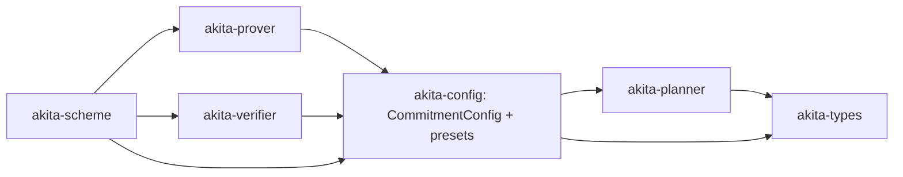

# Spec: Make commit / prove / verify generic over `Cfg` (delete the `_with_policy` closure layer)

| Field       | Value                          |
|-------------|--------------------------------|
| Author(s)   |                                |
| Created     | 2026-06-04                     |
| Status      | implemented                    |
| PR          |                                |

## Summary

The top-level commit, prove, and verify APIs in `akita-prover` / `akita-verifier` are written in a deliberately `Cfg`-free style: every entry point is a `*_with_policy` function that takes the parameter-selection policy as one or more `FnOnce` / `Fn` / `FnMut` closures, and `akita-scheme` is the layer that knows the concrete `Cfg` and threads `Cfg::…` associated functions into those closures. The result is that `AkitaCommitmentScheme::batched_prove` and `AkitaCommitmentScheme::batched_verify` are dominated by deeply nested closure "soup" (a single `prove_batched_with_policy` call passes five closures, two of which nest further closures that themselves capture `Cfg::decomposition()` / `Cfg::ring_subfield_embedding_norm_bound()`), and the prover/verifier signatures carry up to eleven generic parameters where five of them only exist to name closure types (`<F, Cfg::ClaimField, Cfg::ChallengeField, T, P, D, _, _, _, _, _>`).

This spec proposes a focused, mechanical-but-substantial refactor: make the commit/prove/verify entry points **generic over `Cfg: CommitmentConfig`** and call `Cfg::…` directly inside the prover/verifier, deleting the `_with_policy` closure-threading entirely. `commit_with_policy` becomes `commit::<Cfg, …>`, `prove_batched_with_policy` becomes `prove_batched::<Cfg, …>`, `verify_batched_with_policy` becomes `verify_batched::<Cfg, …>`, and so on for the eight `_with_policy` siblings and their nested layout/commit closures. The scheme's per-API bodies collapse to (near) one-liners. This is purely an API-shape and code-organization change: schedules, proof bytes, transcript streams, prover/verifier behavior, and the SIS-security model are unchanged.

The central tradeoff this spec accepts — and the reason it is worth a spec rather than a drive-by edit — is that `akita-prover` and `akita-verifier` must gain a dependency on `akita-config` (where `CommitmentConfig` lives) and name `Cfg` in their public surface. Today those crates know nothing about config; that decoupling is exactly what the closure layer buys. We argue the closure layer's cost (unreadable scheme glue, generic-parameter explosion, hard-to-extend policy surface) outweighs the benefit of the prover/verifier being config-agnostic, and that the `Cfg`-generic form is strictly more readable and equally monomorphized/inlined.

## Intent

### Goal

Replace the closure-based `_with_policy` commit/prove/verify entry points in `akita-prover` and `akita-verifier` with siblings that are generic over `Cfg: CommitmentConfig` and obtain every parameter by calling `Cfg::…` associated functions directly, so that `akita-scheme`'s `CommitmentProver` / `CommitmentVerifier` impls become thin one-line delegations with no closures.

Concretely, the following entry points are converted (full inventory and target signatures in the Design section):

- `commit_with_policy` → `commit::<Cfg, P, B, const D>`
- `batched_commit_with_policy` → `batched_commit::<Cfg, P, B, const D>`
- `prove_batched_with_policy` → `prove_batched::<Cfg, T, P, B, const D>`
- `prove_folded_batched_with_policy` → `prove_folded_batched::<Cfg, T, P, B, const D>`
- `commit_next_w_with_policy` → `commit_next_w::<Cfg, B, const D>`
- `prove_recursive_suffix_with_policy` → `prove_recursive_suffix::<Cfg, T, B, const D>`
- `prove_recursive_level_with_policy` → `prove_recursive_level::<Cfg, T, B, const D>`
- `prove_terminal_recursive_level_with_policy` → `prove_terminal_recursive_level::<Cfg, T, B, const D>`
- `verify_batched_with_policy` → `verify_batched::<Cfg, T, const D>`

The explicit-`LevelParams` helpers `commit_with_params`, `batched_commit_with_params`, `*_with_validated_params`, and the `*_from_ring_relation` / `*_with_params` internal primitives are **not** touched — they take concrete `LevelParams` / `Schedule` and have nothing to do with `Cfg`. They remain the "I already resolved my params, just run the protocol" layer that the new `<Cfg>` functions are built on top of.

Two code relocations are **mandatory** (not optional) because the acceptance criteria require the scheme methods to become near one-liners that pass **zero** closures to prover/verifier entry points:

1. The root tensor-projection transform (today `should_transform_root_commitment` + `tensor_packed_extension_root_poly::<Cfg::ChallengeField>()` in the scheme) moves **inside** `commit::<Cfg, …>` / `batched_commit::<Cfg, …>`.
2. The ring-dimension dispatch helpers (`dispatch_prove_level`, `dispatch_prove_terminal_level`) move **into** `akita-prover` so `prove_recursive_suffix::<Cfg, …>` is closure-free.

The Design section gives the concrete shapes; the "smaller-diff alternatives" that leave a closure or transform in the scheme are explicitly rejected because they violate the zero-closure acceptance criterion.

### Invariants

This is an organizational/API refactor. The implementation must preserve:

1. **Protocol behavior.** Every proof that verifies on current `main` verifies after the refactor; every proof rejected on `main` stays rejected. For **non-ZK** presets, proof bytes are identical for every preset and every `AkitaScheduleLookupKey`. For **ZK** presets, proof bytes are *not* byte-identical because blinding draws from a non-deterministic RNG (`OsRng`/`thread_rng`); the ZK invariant is "every produced proof verifies and every tampered proof is rejected", not byte equality. Protected by `crates/akita-pcs/tests/akita_e2e.rs`, `crates/akita-pcs/tests/multipoint_batched_e2e.rs`, `crates/akita-pcs/tests/zk.rs`, and `crates/akita-scheme/src/tests.rs`.
2. **Transcript determinism.** Fiat-Shamir absorption order, labels, sparse-challenge sampling, and `AkitaInstanceDescriptor` byte encoding are byte-identical. The closure that today calls `bind_transcript_instance_descriptor::<F, T, D, Cfg>` is replaced by a direct call to the same function with the same arguments in the same place (after any root-direct schedule rewrite, before any protocol bytes). Protected by the `logging-transcript` event-stream equality tests and `crates/akita-pcs/examples/transcript_schedule.rs`.
3. **Prover/verifier wire consistency.** Both sides keep consuming the same `Schedule` / `LevelParams` from `akita-types`. The order in which `Cfg::get_params_for_prove`, the root-direct fallback (`Cfg::get_params_for_batched_commitment` + `root_direct_schedule`), transcript binding, and `scheduled_next_level_params(&schedule, 1)` run on the prover side must remain bit-for-bit mirrored on the verifier side. This ordering is currently implemented inside `prove_batched_with_policy` / `verify_batched_with_policy`; it must move verbatim into the `<Cfg>` siblings.
4. **Verifier no-panic contract (AGENTS.md).** After the refactor, `akita-verifier` (and the verifier-reachable prove-time code it shares) names `Cfg` directly. Every `Cfg` method reachable from `verify_batched::<Cfg>` must already return `Result<_, AkitaError>` or be infallible-by-construction. The verifier-reachable hooks called **directly** on this path are `get_params_for_prove`, `get_params_for_batched_commitment`, `ring_challenge_config`, `decomposition`, `sis_modulus_family`, `ring_subfield_embedding_norm_bound`, and `fold_challenge_shape_at_level`. In addition, `get_params_for_prove → runtime_schedule → policy_of::<Cfg>()` (on a generated-table miss, which runs the DP and is verifier-reachable) **transitively** reaches `basis_range()`, `onehot_chunk_size()`, and the associated constants `D`, `CLAIM_EXT_DEGREE`, `CHAL_EXT_DEGREE`. All of these are infallible value accessors / consts today and so are fine, but they are listed here so that any custom `Cfg` impl is audited under the same no-panic boundary (a custom `basis_range`/`onehot_chunk_size` that can panic, overflow, or produce an unbounded search space would violate the contract). The coarse `.map_err(|_| AkitaError::InvalidProof)` mapping currently applied to schedule/layout policy errors at the verifier boundary must be preserved exactly (same error-masking semantics). No new `panic!`/`unwrap`/`expect`/unchecked indexing may be introduced on the verifier path.
5. **Monomorphization / inlining parity.** Today's closure form and tomorrow's `<Cfg>` form are both fully monomorphized per concrete `Cfg`. `Cfg::…` associated functions called directly are at least as inlinable as the same functions wrapped in a `FnOnce`. No `dyn` dispatch, no boxing, no runtime indirection may be introduced. The `#[inline(never)]` isolation on the ring-dim dispatch frames (`dispatch_prove_level`, `dispatch_prove_terminal_level`) is preserved (the functions keep that attribute in their new home).
6. **Multi-`D` ring-dimension dispatch is preserved.** The recursive fold levels can run at a ring dimension different from `Cfg::D` (the scheme's `dispatch_prove_level` instantiates `prove_recursive_level_with_policy::<…, { D_LEVEL }, …>` via `dispatch_ring_dim_result!`). The new functions therefore keep a **`const D: usize` function generic that is independent of `Cfg::D`**: `Cfg` supplies field types and policy facts (`decomposition()`, `ring_subfield_embedding_norm_bound()`, challenge-field algebra) that do not depend on the instantiated ring dimension, while `const D` is the actual ring dimension being computed at that level. This separation is load-bearing and must be stated explicitly so the implementer does not collapse `D` into `Cfg::D`.
7. **No churn beyond the API shape.** No protocol changes, no schedule-selection changes, no new presets, no field/ring changes, no `Cfg` trait method additions/removals, no crate renames, no planner-crate merges. Setup matrix sizing, ZK blinding, and root tensor projection behavior are unchanged.

### Non-Goals

1. **Renaming `akita-config` → `akita-cfg`, merging `akita-planner`/`akita-config`, deleting `ScheduleProvider`/`PlannerConfig`, or moving search/derivation out of `akita-types`.** Those belong to `specs/planner-config-consolidation.md`. This spec deliberately carves out *only* the `_with_policy` → `<Cfg>` API change so it can land (and be reviewed) independently of the much larger crate reorganization. If the consolidation spec lands first, this work is a subset of it; if this lands first, the consolidation spec's "Delete `_with_policy` entry points" step is already done.
2. **Adding new `Cfg` trait methods** (e.g. `level_params_with_log_basis`, `log_basis_at_level`, a separate singleton `get_params_for_commitment`). The current trait surface is sufficient; the new functions call exactly the methods the closures call today.
3. **Changing the explicit-params helpers** (`commit_with_params`, `batched_commit_with_params`, `*_with_validated_params`, `prove_*_with_params`, `*_from_ring_relation`). They stay.
4. **Splitting `Cfg` into subtraits**, or introducing a verifier-only config trait so the verifier can avoid depending on presets. The chosen design has the prover/verifier depend on the single `CommitmentConfig` trait crate (`akita-config`). A verifier-safe core-trait split is a possible future refactor and is explicitly out of scope here.
5. **Touching `profile/akita-recursion/`** (separate pinned-toolchain workspace). Any import-path follow-up there is a separate commit.
6. **Backward compatibility.** Per AGENTS.md there is none. The `_with_policy` functions are deleted in the same PR, not deprecated or aliased.

## Evaluation

### Acceptance Criteria

- [ ] All nine `_with_policy` entry points listed in Goal are deleted from `akita-prover` / `akita-verifier` public APIs and replaced by their `<Cfg>`-generic siblings. `rg '_with_policy' crates/akita-prover/src crates/akita-verifier/src crates/akita-scheme/src` returns empty (excluding `*_with_params`, which are intentionally kept and are a distinct name).
- [ ] `AkitaCommitmentScheme::commit`, `batched_commit`, `batched_prove`, and `batched_verify` in `crates/akita-scheme/src/lib.rs` contain **zero closures** passed to `akita-prover`/`akita-verifier` entry points. Each delegates in essentially one call.
- [ ] `akita-prover` and `akita-verifier` `Cargo.toml` declare a dependency on `akita-config`; their entry points name `Cfg: CommitmentConfig` in their signatures.
- [ ] The generic-parameter count on the public entry points drops: `prove_batched::<Cfg, T, P, B, const D>` (4 type generics + 1 const + lifetime) replaces `prove_batched_with_policy::<'a, F, E, L, T, P, const D, +5 closure params>` (8 type/const generics + lifetime + 5 closure params). `verify_batched::<Cfg, T, const D>` replaces the eleven-slot `verify_batched_with_policy::<…, _, _, _, _, _>`. The net win is the elimination of the five closure-typed generics and the three field-role generics (folded into `Cfg`), not a reduction below the irreducible `Cfg`/`T`/`P`/`B`/`const D` set; `prove_batched` keeps `B` because it now takes `backend`/`prepared` directly (see Design).
- [ ] The root tensor-projection transform is moved inside `commit`/`batched_commit` (the scheme no longer calls `tensor_packed_extension_root_poly` or hosts `should_transform_root_commitment`), and the ring-dimension dispatch helpers are moved into `akita-prover` so that **no** closure is passed to any prover/verifier entry point. (These moves are mandatory, not optional — see Design.)
- [ ] `cargo test --workspace` passes. `cargo test -p akita-pcs --features zk` passes. `cargo test -p akita-pcs --no-default-features` passes. `cargo test -p akita-prover --features zk` and `cargo test -p akita-verifier --features zk` pass standalone (verifies the `akita-config/zk` feature forwarding in the Design).
- [ ] `cargo clippy --all --message-format=short -q -- -D warnings` passes.
- [ ] `cargo fmt -q --check` passes.
- [ ] **Non-ZK proof-byte identity:** for the non-ZK presets, `AKITA_MODE=onehot_fp128_d128 AKITA_NUM_VARS=32 cargo run --release --example profile` reports identical proof bytes and level counts pre/post refactor. ZK proofs are excluded from byte identity because ZK blinding draws from a non-deterministic RNG (`OsRng`/`thread_rng` in the prover); for ZK the invariant is verify-acceptance, not byte equality (see Performance).
- [ ] **Transcript determinism check:** a `LoggingTranscript` event-stream golden comparison (under `logging-transcript`) shows zero diff pre/post refactor for at least one prove+verify fixture per field family. This is the canonical transcript-determinism check; the profile example is not relied on for transcript digests (it reports proof-size/schedule summaries, not bound-descriptor digests). If a digest-level check is wanted, it must be added as new instrumentation (e.g. assert equality of `PlanSection::from_schedule` / `digest_level_params` outputs in a fixture test) rather than read from the profile example.
- [ ] The verifier no-panic regression (`crates/akita-scheme/src/tests.rs` adversarial cases, or a dedicated test) still rejects malformed schedule/incidence/setup inputs with `AkitaError`, not panic, under both `--release` and debug.

### Testing Strategy

Existing suites that must continue passing with at most import-path updates:

- `crates/akita-pcs/tests/akita_e2e.rs`, `multipoint_batched_e2e.rs`, `zk.rs`, `setup.rs`, `ring_switch.rs`.
- `crates/akita-scheme/src/tests.rs`, including the custom-config fixtures (`Fp32RingSubfieldRootFoldCfg`, `Fp32RingSubfieldOuterFallbackCfg`, `UncommittableRootDirectCfg`) — these are `CommitmentConfig` impls already, so they slot directly into the new `<Cfg>` calls. The `UncommittableRootDirectCfg` test (root-direct schedule missing commit params → `InvalidSetup`) specifically exercises the `Cfg::get_params_for_batched_commitment` error path that the prover now invokes directly instead of through a closure.
- Any prover/verifier unit tests that call `*_with_policy` directly are rewritten to call the `<Cfg>` form with a concrete (possibly test-only) `Cfg`, or to call the retained `*_with_params` form when they already hand-build `LevelParams`.

New/changed tests:

- A `LoggingTranscript` golden event-stream test asserting byte-identical event order for prove and verify on a small fixture, run before and after to catch any reordering introduced when collapsing the closure layer (the binding-vs-schedule-rewrite ordering in Invariant 3 is the main risk).
- If any current direct caller of `*_with_policy` in tests/benches is removed, ensure the behavior it covered is still covered by a `<Cfg>` or `*_with_params` caller.

Required CI matrix: default features; `--no-default-features`; `--features zk` on `akita-pcs`; `--features logging-transcript` on the consuming tests; `--release` for the profile example.

### Performance

No measurable change expected.

- **Proof bytes:** identical for **non-ZK** presets (Invariant 1). Verified by the profile example and `schedule.total_bytes` on the fixture set. ZK proofs are excluded — their blinding draws from `OsRng`/`thread_rng`, so byte identity is not a valid invariant; the ZK check is that produced proofs verify and tampered proofs are rejected (`crates/akita-pcs/tests/zk.rs`).
- **Prover wallclock:** within the ±5% project noise band on `AKITA_MODE=onehot_fp128_d128 AKITA_NUM_VARS=32 cargo run --release --example profile`. Calling `Cfg::…` directly removes one indirection layer relative to `FnOnce` shims; if anything this is neutral-to-favorable.
- **Verifier wallclock:** within ±5% on the same profile. Both forms are monomorphized per `Cfg`.
- **Compile time / binary size:** expected neutral. The generic-parameter count drops, but the same set of concrete `Cfg` × `D` instantiations is produced. The `#[inline(never)]` dispatch frames keep codegen bloat isolated.

Any non-ZK proof-byte diff, any `LoggingTranscript` event-stream diff, or >5% wallclock regression on the standard profile means the refactor is incorrect and must be fixed before merge.

## Design

### Architecture

#### The dependency-direction decision (the crux)

Today `akita-prover` and `akita-verifier` do not depend on `akita-config` and never name `Cfg`. The closure layer exists precisely to keep that decoupling: the scheme captures `Cfg::…` into closures and passes plain `FnOnce`/`FnMut` values down, so the prover/verifier only ever see `Schedule`, `LevelParams`, `ClaimIncidenceSummary`, and field/transcript generics.

This refactor inverts that: `akita-prover` and `akita-verifier` gain a dependency on `akita-config` and take `Cfg: CommitmentConfig` as a generic. This is the same tradeoff `specs/planner-config-consolidation.md` accepts (see its "Consumption rule" and dependency diagram); we restate it here because it is the load-bearing decision for *this* spec:

- **Benefit:** the scheme's `batched_prove`/`batched_verify` collapse from ~120 lines of nested closures to a handful of lines; the prover/verifier signatures shed five-plus closure-typed generics; new policy needs are met by adding a `Cfg` method and a call site, not by adding another generic parameter and another closure to thread through every layer.
- **Cost:** `akita-prover`/`akita-verifier` are no longer config-agnostic; their build graph now includes `akita-config` (and, transitively, `akita-planner`). Under Cargo feature unification this is already what every production binary links.
- **Why accepted:** the config-agnostic property is not consumed by anything except the scheme's closure plumbing. No alternative backend or alternative config system exists that benefits from the decoupling. The readability and extensibility win is concrete and immediate.

A note on the `CommitmentConfig` trait crate: `akita-config` currently *depends on* `akita-prover`-adjacent crates only through `akita-planner`; making `akita-prover`/`akita-verifier` depend on `akita-config` must not create a cycle. `akita-config` depends on `akita-planner`, `akita-types`, `akita-transcript`, `akita-challenges`, `akita-field` — none of which is `akita-prover`/`akita-verifier`. So `akita-prover → akita-config → akita-planner → akita-types` is acyclic. `akita-scheme` keeps depending on all of them. This must be confirmed at implementation step 0 (a `cargo tree` / build check) before any signatures change.



#### Feature propagation for the new `akita-config` dependency

`akita-config` carries `parallel` and `zk` features that gate planner-backed and ZK schedule surfaces. When `akita-prover`/`akita-verifier` add the `akita-config` dependency they must wire features so standalone builds (`cargo test -p akita-prover --features zk`, verifier-only builds) compile the matching config/planner surface:

```toml
# crates/akita-prover/Cargo.toml (and analogously akita-verifier)
[dependencies]
akita-config = { path = "../akita-config", default-features = false }

[features]
default = ["parallel"]
parallel = ["akita-config/parallel", /* existing */]
zk       = ["akita-config/zk",       /* existing */]
```

Rationale: depending with `default-features = false` avoids silently re-enabling `akita-config`'s defaults (which today include the planner-backed path) for a `--no-default-features` prover/verifier build, and the explicit `prover/zk → akita-config/zk` (and `parallel`) forwarding ensures that building the prover or verifier alone with `--features zk` brings in the ZK schedule surface rather than compiling `akita-config`/`akita-planner` without it. The exact default-feature set on `akita-config` should be confirmed at step 0; the invariant is that every feature the prover/verifier expose which has an `akita-config` analogue forwards to it.

#### `const D` vs `Cfg::D` (must not be collapsed)

`Cfg::D` is the configured root ring dimension. The recursive fold levels may commit at a *different* ring dimension, chosen per level by the schedule; `crates/akita-scheme/src/lib.rs::dispatch_prove_level` switches on `level_params.ring_dimension` and re-instantiates the per-level prove function at `{ D_LEVEL }` via `dispatch_ring_dim_result!`. The policy facts the per-level function needs from `Cfg` — `decomposition()`, `ring_subfield_embedding_norm_bound()`, and the challenge-field algebra (`Cfg::ChallengeField`) — are all independent of the instantiated ring dimension.

Therefore the new functions keep `const D: usize` as a function generic that is **distinct from `Cfg::D`**. For example `prove_recursive_level::<Cfg, T, B, const D>` is instantiated with `D = D_LEVEL` at each level, while `Cfg` is fixed. The top-level `prove_batched::<Cfg, T, P, B, const D>` is normally called with `D = Cfg::D`, but the const generic stays separate so the recursive dispatch keeps working. Collapsing `D` into `Cfg::D` would break multi-`D` recursion (Invariant 6).

#### Per-function before/after

The shared shape of the change: drop the closure parameters; add `Cfg: CommitmentConfig<Field = F>` (and the associated-type bounds the scheme already states); replace each closure body with the inlined `Cfg::…` call. Field generics `F`/`E`/`L` become `Cfg::Field`/`Cfg::ClaimField`/`Cfg::ChallengeField`.

**Commit** (`crates/akita-prover/src/api/commitment.rs`):

```rust
// before
pub fn commit_with_policy<F, const D: usize, P, B, SelectParams>(
    polys: &[P],
    expanded: &AkitaExpandedSetup<F>,
    backend: &B,
    prepared: &B::PreparedSetup<D>,
    select_params: SelectParams,
) -> Result<(RingCommitment<F, D>, AkitaCommitmentHint<F, D>), AkitaError>
where
    F: FieldCore + CanonicalField + RandomSampling,
    P: AkitaPolyOps<F, D>,
    B: CommitmentComputeBackend<F>,
    SelectParams: FnOnce(&ClaimIncidenceSummary) -> Result<LevelParams, AkitaError>;

// after
pub fn commit<Cfg, const D: usize, P, B>(
    polys: &[P],
    expanded: &AkitaExpandedSetup<Cfg::Field>,
    backend: &B,
    prepared: &B::PreparedSetup<D>,
) -> Result<(RingCommitment<Cfg::Field, D>, AkitaCommitmentHint<Cfg::Field, D>), AkitaError>
where
    Cfg: CommitmentConfig,
    // RandomSampling is the base commit bound; FromPrimitiveInt + HasWide (and the
    // associated Wide conversions) and the RingSubfieldEncoding challenge bound are
    // required because `commit` now performs the root tensor-projection transform
    // internally (see below). These mirror the bounds the scheme impl supplies today.
    Cfg::Field: FieldCore + CanonicalField + RandomSampling + FromPrimitiveInt + HasWide,
    <Cfg::Field as HasWide>::Wide: From<Cfg::Field> + ReduceTo<Cfg::Field>,
    Cfg::ClaimField: RingSubfieldEncoding<Cfg::Field>,
    Cfg::ChallengeField: RingSubfieldEncoding<Cfg::Field>,
    P: AkitaPolyOps<Cfg::Field, D>,
    B: CommitmentComputeBackend<Cfg::Field>,
{
    backend.validate_prepared_setup::<D>(prepared, expanded)?;
    let incidence = prepare_commit_inputs::<Cfg::Field, D, P>(polys, expanded)?;
    // Root tensor-projection transform, formerly in the scheme:
    if should_transform_root_commitment::<Cfg, D>(&incidence)? {
        let transformed = polys
            .iter()
            .map(|p| p.tensor_packed_extension_root_poly::<Cfg::ChallengeField>())
            .collect::<Result<Vec<RootTensorProjectionPoly<Cfg::Field, D>>, _>>()?;
        let params = Cfg::get_params_for_batched_commitment(&incidence)?;
        validate_commit_level_params::<Cfg::Field, D>(&params, expanded)?;
        return commit_with_validated_params::<Cfg::Field, D, RootTensorProjectionPoly<Cfg::Field, D>, B>(
            &transformed, backend, prepared, &params,
        );
    }
    let params = Cfg::get_params_for_batched_commitment(&incidence)?;
    validate_commit_level_params::<Cfg::Field, D>(&params, expanded)?;
    commit_with_validated_params::<Cfg::Field, D, P, B>(polys, backend, prepared, &params)
}
```

`batched_commit` is the identical shape over `prepare_batched_commit_inputs` and `batched_commit_with_validated_params`, transforming each per-point bundle.

**Root tensor projection (commit path) — mandatory consolidation.** Today the scheme decides whether to transform polys into `RootTensorProjectionPoly` (`should_transform_root_commitment` + `tensor_packed_extension_root_poly::<Cfg::ChallengeField>()`) *before* calling `commit_with_policy`, which forces the transform logic and the `Cfg::ChallengeField` knowledge into the scheme. Because `commit::<Cfg, …>` now knows `Cfg`, the transform decision and execution move **inside** `commit`/`batched_commit` (the returned commitment type `RingCommitment<Cfg::Field, D>` is unchanged regardless of the internal poly type). This removes `should_transform_root_commitment` and both transform blocks from the scheme and is **required** to meet the zero-closure / near-one-liner acceptance criteria.

**Bounds the transform path requires.** `tensor_packed_extension_root_poly::<E>` is defined on `AkitaPolyOps` with `where F: CanonicalField + FromPrimitiveInt, E: RingSubfieldEncoding<F>` (`crates/akita-prover/src/lib.rs:440`), and the underlying packing uses the field's wide representation. The scheme's `CommitmentProver` impl supplies these indirectly through its blanket bounds (`F: … + HasWide + FromPrimitiveInt`, `Cfg::ChallengeField: RingSubfieldEncoding<F>`); because the transform now lives behind a *public* prover API, `commit`/`batched_commit` must state them explicitly: at minimum `Cfg::Field: FromPrimitiveInt + HasWide` with `<Cfg::Field as HasWide>::Wide: From<Cfg::Field> + ReduceTo<Cfg::Field>`, and `Cfg::ChallengeField: RingSubfieldEncoding<Cfg::Field>` (plus `Cfg::ClaimField: RingSubfieldEncoding<Cfg::Field>` for the incidence/role checks). The implementer should copy the exact bound set the current `impl CommitmentProver for AkitaCommitmentScheme` block carries (`crates/akita-scheme/src/lib.rs:381-399`) and prune anything genuinely unused by the commit path; the sketch above lists the load-bearing ones, not necessarily the complete closure.

`should_transform_root_commitment` becomes a `<Cfg, const D>`-generic helper inside `akita-prover` (it calls `root_tensor_projection_enabled::<Cfg::Field, Cfg::ClaimField, Cfg::ChallengeField, D>` and `Cfg::get_params_for_prove`, then `schedule_root_fold_step`), replacing the scheme-local version verbatim.

**Top-level prove** (`crates/akita-prover/src/protocol/flow/inputs.rs`):

```rust
// after (sketch; body is today's prove_batched_with_policy body with closures inlined)
pub fn prove_batched<'a, Cfg, T, P, B, const D: usize>(
    expanded: &AkitaExpandedSetup<Cfg::Field>,
    backend: &B,
    prepared: &B::PreparedSetup<D>,
    claims: ProverClaims<'a, Cfg::ClaimField, RingCommitment<Cfg::Field, D>, AkitaCommitmentHint<Cfg::Field, D>>,
    transcript: &mut T,
    basis: BasisMode,
) -> Result<AkitaBatchedProof<Cfg::Field, Cfg::ChallengeField>, AkitaError>
where
    Cfg: CommitmentConfig,
    Cfg::Field: FieldCore + CanonicalField + RandomSampling + HasWide + HalvingField
        + PseudoMersenneField + Valid,
    Cfg::ClaimField: RingSubfieldEncoding<Cfg::Field> + MulBaseUnreduced<Cfg::Field>,
    Cfg::ChallengeField: RingSubfieldEncoding<Cfg::Field> + ExtField<Cfg::ClaimField>
        + FrobeniusExtField<Cfg::Field> + HasUnreducedOps + HasOptimizedFold
        + FromPrimitiveInt + AkitaSerialize,
    T: Transcript<Cfg::Field>,
    P: AkitaPolyOps<Cfg::Field, D>,
    B: ProverComputeBackend<Cfg::Field>,
{
    let prepared_claims = prepare_batched_prove_inputs::<Cfg::Field, Cfg::ClaimField, P, D>(expanded, claims)?;
    let num_vars = prepared_claims.incidence_summary.num_vars();
    let mut schedule = Cfg::get_params_for_prove(&prepared_claims.incidence_summary)?;

    if let Some(root_step) = schedule_root_fold_step(&schedule) {
        if !folded_root_supports_opening_shape::<Cfg::Field, Cfg::ClaimField, Cfg::ChallengeField, D>(/* … */)
            && !root_tensor_projection_enabled::<Cfg::Field, Cfg::ClaimField, Cfg::ChallengeField, D>(num_vars)
        {
            let commit_params = Cfg::get_params_for_batched_commitment(&prepared_claims.incidence_summary)?;
            schedule = root_direct_schedule(num_vars, commit_params)?;
        }
    }

    bind_transcript_instance_descriptor::<Cfg::Field, T, D, Cfg>(
        expanded, &prepared_claims.incidence_summary, &schedule, basis, transcript,
    )?;

    if schedule_is_root_direct(&schedule) {
        return prove_root_direct::<Cfg::Field, Cfg::ChallengeField, D, P>(/* … */);
    }

    let root_step = schedule_root_fold_step(&schedule).ok_or(/* … */)?;
    let next_inputs = AkitaScheduleInputs { num_vars, level: 1, current_w_len: root_step.next_w_len };
    let root_next_params = scheduled_next_level_params(&schedule, 1)?; // next_inputs unused today, as before

    prove_folded_batched::<Cfg, T, P, B, D>(
        expanded, backend, prepared, transcript, prepared_claims, &schedule, basis, &root_next_params,
    )
    .map(|(proof, _total_levels)| proof)
}
```

Two structural points:

- The `prove_folded` closure (the largest one in the scheme today) disappears entirely; `prove_batched` calls `prove_folded_batched::<Cfg, …>` directly. This requires `prove_batched` to also take the `backend` and `prepared` arguments that today were captured by the scheme closure. That is a signature addition to the top-level prove function (it gains `backend: &B, prepared: &B::PreparedSetup<D>` and a `B: ProverComputeBackend<Cfg::Field>` bound). This is the one place the new signature is *wider* than the old `prove_batched_with_policy`, and it is the correct trade: the backend was always needed; it was being smuggled through a closure.
- `select_root_next_params` (today `|schedule, _| scheduled_next_level_params(schedule, 1)`) becomes the direct `scheduled_next_level_params(&schedule, 1)?` call. `scheduled_next_level_params` stays an `akita-types` free function; it is not a `Cfg` method.

**`prove_folded_batched`** drops `commit_root_next` and `build_suffix` closures and calls `commit_next_w::<Cfg, B, D>` and `prove_recursive_suffix::<Cfg, T, B, D>` directly.

**`commit_next_w`** (`crates/akita-prover/src/protocol/ring_switch/commit.rs`) drops its `same_d_layout` and `dispatch_layout` closures. Both were `recursive_level_layout_from_params(params, w_len, Cfg::decomposition(), Cfg::ring_subfield_embedding_norm_bound())` (the dispatch variant wrapped in `dispatch_ring_dim_result!`). With `Cfg` in scope, the function calls `akita_types::recursive_level_layout_from_params` with `Cfg::decomposition()` / `Cfg::ring_subfield_embedding_norm_bound()` inline, and performs the cross-`D` dispatch itself. The scheme-local helper `recursive_w_commit_layout_for_d::<Cfg>` is deleted (its body moves inline into `commit_next_w`).

**Ring-dimension dispatch ownership.** Today `dispatch_prove_level` / `dispatch_prove_terminal_level` live in `akita-scheme` and are passed into `prove_recursive_suffix_with_policy` as the `prove_level` closure. To make `prove_recursive_suffix::<Cfg>` self-contained (no closure), the per-level ring-dim dispatch must be callable from inside `akita-prover`. The `dispatch_ring_dim_result!` macro is already defined in `akita-prover` (`crates/akita-prover/src/protocol/dispatch.rs`), so:

**Mandatory:** move `dispatch_prove_level` / `dispatch_prove_terminal_level` into `akita-prover` as `<Cfg>`-generic functions (keeping `#[inline(never)]`). `prove_recursive_suffix::<Cfg>` then calls them directly, and the `SuffixLevelRequest`/`SuffixLevelOutput` indirection collapses into a straight-line loop. This removes the last closure on the prove path, satisfying the zero-closure acceptance criterion. The previously-considered "keep dispatch in the scheme behind one `prove_level` closure" alternative is **rejected** because it leaves a closure at a prover entry point and keeps codegen-heavy helpers in the scheme; if a circular-dependency or codegen surprise surfaces during implementation it must be resolved within `akita-prover` (the `dispatch_ring_dim_result!` macro already lives there), not by reintroducing the scheme closure.

**Top-level verify** (`crates/akita-verifier/src/protocol/batched.rs`):

```rust
// after (body is today's verify_batched_with_policy body, closures inlined)
pub fn verify_batched<'a, Cfg, T, const D: usize>(
    proof: &AkitaBatchedProof<Cfg::Field, Cfg::ChallengeField>,
    setup: &AkitaVerifierSetup<Cfg::Field>,
    transcript: &mut T,
    claims: VerifierClaims<'a, Cfg::ClaimField, RingCommitment<Cfg::Field, D>>,
    basis: BasisMode,
) -> Result<(), AkitaError>
where
    Cfg: CommitmentConfig,
    Cfg::Field: FieldCore + CanonicalField + RandomSampling + PseudoMersenneField,
    Cfg::ClaimField: RingSubfieldEncoding<Cfg::Field>,
    Cfg::ChallengeField: RingSubfieldEncoding<Cfg::Field> + ExtField<Cfg::ClaimField>
        + FrobeniusExtField<Cfg::Field> + FromPrimitiveInt + AkitaSerialize,
    T: Transcript<Cfg::Field>,
{
    check_batched_proof_step_shape(proof)?;
    let prepared = prepare_verifier_claims(&setup.expanded, &claims)?;
    let num_vars = prepared.incidence_summary.num_vars();

    let mut schedule = Cfg::get_params_for_prove(&prepared.incidence_summary)
        .map_err(|_| AkitaError::InvalidProof)?;

    let mut root_direct_params = None;
    if let Some(root_step) = schedule_root_fold_step(&schedule) {
        if !folded_root_supports_opening_shape::<Cfg::Field, Cfg::ClaimField, Cfg::ChallengeField, D>(/* … */)
            && !root_tensor_projection_enabled::<Cfg::Field, Cfg::ClaimField, Cfg::ChallengeField, D>(num_vars)
        {
            let params = Cfg::get_params_for_batched_commitment(&prepared.incidence_summary)
                .map_err(|_| AkitaError::InvalidProof)?;
            schedule = root_direct_schedule(num_vars, params.clone()).map_err(|_| AkitaError::InvalidProof)?;
            root_direct_params = Some(params);
        }
    }

    bind_transcript_instance_descriptor::<Cfg::Field, T, D, Cfg>(
        &setup.expanded, &prepared.incidence_summary, &schedule, basis, transcript,
    )?;

    let schedule_context = prepare_batched_verifier_schedule_context(num_vars, &schedule, |next_inputs| {
        // unchanged: scheme today ignores next_inputs and uses step index 1
        scheduled_next_level_params(&schedule, 1)
    })
    .map_err(|_| AkitaError::InvalidProof)?;

    verify_batched_proof_with_schedule::<Cfg::Field, Cfg::ClaimField, Cfg::ChallengeField, T, D, _>(
        proof, setup, transcript, prepared, basis, &schedule, schedule_context,
        |witnesses, commitments, incidence_summary, payload| {
            let params = match &root_direct_params {
                Some(p) => p.clone(),
                None => Cfg::get_params_for_batched_commitment(incidence_summary)
                    .map_err(|_| AkitaError::InvalidProof)?,
            };
            verify_root_direct_commitments_with_params::<Cfg::Field, D>(
                witnesses, setup, commitments, incidence_summary, &params, payload,
            )
        },
    )
}
```

The internal `verify_batched_proof_with_schedule` keeps its small `DirectCommitmentCheck` closure (it closes over `setup` + the resolved `LevelParams`); this is an internal helper, not a public policy hook, and is fine to keep. The crucial Invariant-3 ordering — schedule selection → root-direct rewrite → descriptor bind → schedule-context prep — is preserved verbatim, including all `.map_err(|_| AkitaError::InvalidProof)` masks.

#### Scheme after the refactor

`AkitaCommitmentScheme::commit`:

```rust
fn commit<P, B>(setup, backend, prepared, polys) -> Result<(Self::Commitment, Self::CommitHint), AkitaError>
where P: AkitaPolyOps<F, D>, B: CommitmentComputeBackend<F>
{
    akita_prover::commit::<Cfg, D, P, B>(polys, setup.expanded.as_ref(), backend, prepared)
}
```

`batched_commit`, `batched_prove`, `batched_verify` reduce similarly. `validate_field_roles_for_ring::<F, D, Cfg>()` stays at the top of `batched_prove`/`batched_verify` (it is a scheme-level precondition, not a prover concern). The scheme-local helpers `should_transform_root_commitment`, `recursive_w_commit_layout_for_d`, `dispatch_prove_level`, `dispatch_prove_terminal_level`, and `prove_recursive_suffix` are removed from the scheme (moved into the prover under the recommended dispatch-ownership option, or trimmed under the alternative).

#### Inventory and target table

| Today (crate · file) | Becomes | Closures removed |
|---|---|---|
| `commit_with_policy` · prover `api/commitment.rs` | `commit::<Cfg, D, P, B>` | `select_params` |
| `batched_commit_with_policy` · prover `api/commitment.rs` | `batched_commit::<Cfg, D, P, B>` | `select_params` |
| `prove_batched_with_policy` · prover `protocol/flow/inputs.rs` | `prove_batched::<Cfg, T, P, D>` | `select_schedule`, `select_root_direct_params`, `select_root_next_params`, `bind_transcript`, `prove_folded` (5) |
| `prove_folded_batched_with_policy` · prover `protocol/flow/inputs.rs` | `prove_folded_batched::<Cfg, T, P, B, D>` | `commit_root_next`, `build_suffix` (2) |
| `commit_next_w_with_policy` · prover `protocol/ring_switch/commit.rs` | `commit_next_w::<Cfg, B, D>` | `same_d_layout`, `dispatch_layout` (2) |
| `prove_recursive_suffix_with_policy` · prover `protocol/flow/recursive.rs` | `prove_recursive_suffix::<Cfg, T, B, D>` | `select_fold_execution`, `prove_level` (2) |
| `prove_recursive_level_with_policy` · prover `protocol/flow/recursive.rs` | `prove_recursive_level::<Cfg, T, B, D>` | `current_layout`, `commit_w` (2) |
| `prove_terminal_recursive_level_with_policy` · prover `protocol/flow/recursive.rs` | `prove_terminal_recursive_level::<Cfg, T, B, D>` | `current_layout` (1) |
| `verify_batched_with_policy` · verifier `protocol/batched.rs` | `verify_batched::<Cfg, T, D>` | `select_schedule`, `next_params`, `direct_params`, `bind_transcript`, (outer) `verify_direct_commitments` (5) |

Scheme-local helpers removed/relocated: `should_transform_root_commitment`, `recursive_w_commit_layout_for_d`, `dispatch_prove_level`, `dispatch_prove_terminal_level`, `prove_recursive_suffix`.

#### `bind_transcript_instance_descriptor` reachability

This free function lives in `akita-config` and is already `<F, T, D, Cfg>`-generic. Since `akita-prover`/`akita-verifier` now depend on `akita-config`, they can call it directly (`akita_config::bind_transcript_instance_descriptor`). No move is required for this spec (the consolidation spec proposes moving it to `akita-prover`; that is out of scope here). The scheme stops re-exporting/wrapping it.

### Alternatives Considered

1. **Keep `_with_policy`, only flatten the scheme closures with helper functions.** Pulls each closure into a named `fn` in the scheme but keeps the prover/verifier config-agnostic. Rejected: it does not reduce the generic-parameter explosion on the prover/verifier signatures, and the scheme still threads N functions through M layers. The readability win is marginal.
2. **Pass a single `&dyn` policy object instead of `Cfg` generic.** One trait-object parameter replaces five closures without making the prover generic over `Cfg`. Rejected: introduces `dyn` dispatch on hot prove/verify paths (violates Invariant 5) and still needs a config-shaped trait in a verifier-reachable crate, i.e. the same dependency it tries to avoid.
3. **Introduce a verifier-safe `Cfg` core trait so the verifier depends only on a thin trait crate, not on presets/planner.** Cleaner dependency story. Rejected for *this* spec as scope creep — it is a separate, larger refactor (and is the subtrait option the consolidation spec also defers). This spec keeps the single `CommitmentConfig` trait and accepts the transitive planner dependency.
4. **Do the full `specs/planner-config-consolidation.md` reorg in one PR.** Rejected: that PR renames a crate, merges planner code, changes trait method signatures to `Result`-returning, and moves search/derivation between crates — a much larger, riskier review. This spec is the minimal, independently reviewable slice that delivers the readability win the user asked for. It is forward-compatible with the consolidation spec (it implements that spec's "Delete `_with_policy` entry points" step early).
5. **Collapse `const D` into `Cfg::D`.** Tempting for signature minimalism. Rejected: breaks multi-`D` recursive dispatch (Invariant 6).

## Documentation

- `AGENTS.md` — update the `akita-prover` / `akita-verifier` / `akita-scheme` bullets in "Crate Structure": the prover/verifier public surface becomes `<Cfg>`-generic (`prove_batched::<Cfg, …>`, `verify_batched::<Cfg, …>`, `commit::<Cfg, …>`), and they now depend on `akita-config`. Remove the description of the scheme as "one-line call into the prover/verifier `<Cfg>`-generic API … with closure adapters" wording if present; note the prover/verifier are now directly `<Cfg>`-generic.
- Crate-level `//!` docs on `akita-prover/src/protocol/flow.rs`, `akita-prover/src/api/commitment.rs`, and `akita-verifier/src/protocol/batched.rs` — replace `_with_policy` references with the `<Cfg>` names.
- `specs/planner-config-consolidation.md` — add a note that the `_with_policy` deletion is being landed separately via this spec (so the two specs do not double-count the work).
- No README or paper-note changes; protocol and security are unchanged.

## Execution

No backward-compat requirement, so the order optimizes for review legibility; CI need only be green at PR head.

0. **Confirm acyclic deps + wire features.** Add `akita-config` as a dependency of `akita-prover` and `akita-verifier` with `default-features = false`, and forward their `parallel`/`zk` features to `akita-config/parallel` / `akita-config/zk` (see "Feature propagation" in Design). Build the workspace and the standalone `cargo test -p akita-prover --features zk` / `cargo test -p akita-verifier --features zk` to confirm no dependency cycle and that the ZK schedule surface is present. Resolve before touching signatures.
1. **Commit APIs.** Convert `commit_with_policy` / `batched_commit_with_policy` to `commit::<Cfg, …>` / `batched_commit::<Cfg, …>`. Move the root tensor-projection transform inside them (mandatory): port `should_transform_root_commitment` into `akita-prover` as `<Cfg, const D>`-generic and add the tensor-path bounds from Design. Reduce the scheme `commit`/`batched_commit` to one-liners; delete `should_transform_root_commitment` from the scheme.
2. **Recursive layout/commit primitives.** Convert `commit_next_w_with_policy` → `commit_next_w::<Cfg, …>` (inline the two layout closures; delete `recursive_w_commit_layout_for_d`). Convert `prove_recursive_level_with_policy`, `prove_terminal_recursive_level_with_policy` → `<Cfg>` forms.
3. **Dispatch ownership.** Move `dispatch_prove_level` / `dispatch_prove_terminal_level` into `akita-prover` as `<Cfg>`-generic, `#[inline(never)]` functions (mandatory — the scheme-closure alternative is rejected). Convert `prove_recursive_suffix_with_policy` → `prove_recursive_suffix::<Cfg, …>` with the dispatch called directly (no `prove_level` closure).
4. **Folded + top-level prove.** Convert `prove_folded_batched_with_policy` → `prove_folded_batched::<Cfg, …>` and `prove_batched_with_policy` → `prove_batched::<Cfg, …>` (the latter gains `backend`/`prepared` parameters). Collapse `AkitaCommitmentScheme::batched_prove` to a single delegating call; delete the now-relocated scheme suffix/dispatch helpers (`prove_recursive_suffix`, `dispatch_prove_level`, `dispatch_prove_terminal_level`, `recursive_w_commit_layout_for_d`).
5. **Verify.** Convert `verify_batched_with_policy` → `verify_batched::<Cfg, …>`, preserving the schedule→rewrite→bind→context ordering and every `.map_err(|_| AkitaError::InvalidProof)` mask. Collapse `AkitaCommitmentScheme::batched_verify`.
6. **Call `bind_transcript_instance_descriptor` directly** from prover/verifier; stop wrapping/re-exporting it in the scheme.
7. **Tests + lints.** Update any test/bench that called `*_with_policy` directly to the `<Cfg>` or `*_with_params` form. Add the `LoggingTranscript` golden comparison (the canonical transcript-determinism check). Run the full CI matrix and the profile example; confirm **non-ZK** proof-byte identity (ZK proofs are excluded — verify acceptance only) and `LoggingTranscript` event-stream identity.

Risks to resolve early:

- **Dependency cycle (step 0).** If `akita-config` turns out to (transitively) need a prover/verifier symbol, the single-trait approach must be reconsidered (likely a small verifier-safe trait extraction). Confirm before signature churn.
- **`prove_batched` signature widening.** It must take `backend`/`prepared`; ensure all call sites (scheme, tests) supply them. This is the only non-shrinking signature change.
- **Transcript ordering regression.** Collapsing the closure layer must not move the descriptor bind relative to the root-direct schedule rewrite. Gate on the `logging-transcript` golden test (step 7) before merge.
- **Multi-`D` dispatch.** Verify recursive levels at `D_LEVEL != Cfg::D` still compile and run (the `dispatch_ring_dim_result!` instantiations) after the dispatch move.

## References

- `specs/planner-config-consolidation.md` — the broader crate/trait consolidation; this spec is its "Delete `_with_policy` entry points" slice, landed independently. Shares the prover/verifier-depends-on-config tradeoff and the `verify_batched::<Cfg>` / `prove_batched::<Cfg>` target shapes.
- `specs/transcript-hardening.md` — the `AkitaInstanceDescriptor` binding contract preserved across the refactor (Invariant 2).
- AGENTS.md — "Crate Structure", "Key Abstractions", "Verifier No-Panic Contract".
- Current call sites: `crates/akita-scheme/src/lib.rs` (`commit` 425–459, `batched_commit` 463–504, `batched_prove` 507–623, `batched_verify` 648–699; scheme-local helpers `dispatch_prove_level` 111–220, `dispatch_prove_terminal_level` 306–379, `prove_recursive_suffix` 229–301, `recursive_w_commit_layout_for_d` 66–86, `should_transform_root_commitment` 88–102).
- Profiling: `AKITA_MODE=onehot_fp128_d128 AKITA_NUM_VARS=32 cargo run --release --example profile`.
