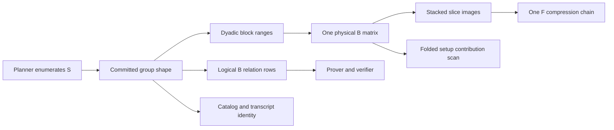

# Spec: B Commitment Slicing

| Field | Value |
|---|---|
| Author(s) | Quang Dao |
| Created | 2026-08-10 |
| Status | implemented |
| PR | [#383](https://github.com/LayerZero-Labs/akita/pull/383) |
| Supersedes | The inactive commitment matrix slice fields in generated schedules |
| Superseded-by | |
| Book-chapter | book/src/how/commitment.md |

## Summary

Akita reuses one smaller physical B matrix across several consecutive parts
of a commitment input. Each use produces its own B image. Akita stacks those
images in slice order and compresses the complete stack with one F compression
chain.

This change reduces the B setup width at the first two commitment levels, where
setup cost has the largest effect. It does not slice D. It admits only one,
two, four, or eight B slices. B slicing and witness multi chunking both use the
canonical dyadic block partition, so one partition always refines the other.

The existing 8 KiB compression input limit remains unchanged. A planner
candidate is valid only when the complete stacked B image fits that limit.

The implementation started from PR #377 commit
`16c09f9c684e6ab3e4158c0a3c76fa22534f7e0a` and is completed by PR #383.

## Intent

### Goal

Add planner selected B commitment slicing at absolute commitment levels zero
and one while keeping one physical B matrix, one complete B compression source
per group, and one canonical block partition rule.

### Terminology

This specification uses the following names.

- `B` is the exact number of live blocks in one committed group.
- `S` is that group's B slice count.
- `W` is the level's witness chunk count.
- `I_s` is the live block range owned by B slice `s`.
- `n_B` is the output rank of the one physical B matrix.
- `m_B` is the input width of that physical B matrix.
- `D_A` and `D_B` are the native A and B ring dimensions.
- `P` is the number of polynomials in the committed group.
- `delta_B` is the B gadget digit depth.

The absolute commitment level uses the same numbering as
`CommitmentPayloadPhase::candidate_modes`. The root is level zero. The first
recursive commitment is level one.

### Invariants

#### Scope

- Only B may be sliced. D always has one unsliced image.
- The only valid B slice counts are `1`, `2`, `4`, and `8`.
- A slice count above one is valid only at absolute commitment levels zero and
  one.
- A slice count above one requires compressed payload mode.
- A slice count above one must not exceed the group's live block count.
- `S = 1` preserves the current B input order, physical B matrix shape,
  relation geometry, and commitment arithmetic. The complete proof bytes may
  change because the schedule descriptor now binds the slice count.
- Standalone precommitments use root eligibility. Their selected slice count is
  frozen in `CommittedGroupProfile`.
- A setup prefix uses the eligibility of the absolute schedule level whose
  commitment geometry forms that prefix. The producer freezes the selected
  count. A later consumer cannot reslice the commitment.

#### Canonical partition

Every B slice range comes from `akita_types::dyadic_block_ranges(B, S)`:

```text
I_s = [floor(s * B / S), floor((s + 1) * B / S))
```

The implementation must call that function. It must not copy the formula into
a second helper.

B slicing rejects `S > B`, even though witness multi chunking permits empty
machine chunks. Empty B slices spend relation rows and compression capacity
without reducing the physical matrix width.

#### Physical B input

Let

```text
rho = D_A / D_B
g = n_A * rho * delta_B
L = max_s |I_s| = ceil(B / S)
```

One live block contributes `g` B input ring elements per polynomial. The one
physical B matrix has width

```text
m_B = P * L * g
```

Within each slice, the physical input keeps the existing polynomial major
order. For each polynomial, it keeps block order, then A row order, B
subcolumn order, and digit order. A shorter slice pads its missing block slots
with zero inside each polynomial segment. This rule makes `S = 1` identical to
the current input order and gives every slice the same physical width.

For each slice `s`, the prover computes

```text
u_s = B_matrix * x_s
```

using the same physical B matrix. The matrix has `n_B` rows and `m_B` columns.
The prover must not derive a new matrix seed or a new matrix identity for a
slice.

#### Logical B image and compression

The complete logical B image for one committed group is

```text
u = u_0 || u_1 || ... || u_(S - 1)
```

It contains `S * n_B` B ring elements and
`S * n_B * D_B` field coefficients. Its canonical coefficient order is slice,
then physical B row, then ring coefficient.

Each committed group has one F compression chain over this complete stack.
Akita must not compress each slice separately. The chain still has exactly two
maps and still emits one 128 byte terminal payload.

For a compressed candidate, the following inclusive bound must hold:

```text
canonical_bytes(u) <= MAX_COMPRESSION_INPUT_BYTES = 8192
```

The planner, schedule validator, prover, and verifier must derive this size
from the same complete source geometry. They must not increase the constant or
treat raw mode as a fallback for an oversized sliced source.

The shared D image has its own independent compression plan and its own 8 KiB
check. B slicing does not change D width, D rows, its H compression chain, or
its payload.

#### Physical setup and logical relation

The setup stores one physical B matrix with `n_B * m_B` B ring elements. It
does not store `S` copies.

The relation contains `S * n_B` logical B rows. A B row identity includes the
group index, slice index, and physical row index. The canonical order is group,
then slice, then physical row.

The B equations are

```text
for s in 0..S:
    u_s = B_matrix * x_s
```

The underlying `t_hat` witness does not grow. Slicing changes how its B input
columns are grouped into equations. It increases the number of B relation rows
and may increase the compression witness and quotient geometry.

The setup contribution evaluator must combine all logical slice weights before
scanning a physical B entry. For logical row weights `beta_(s,r)`, the B term is

```text
sum_(r,c) B_matrix[r,c] * sum_s beta_(s,r) * x_s[c]
```

The direct setup scan and recursive setup contribution path must use this same
identity. Neither path may scan or price `S` physical B matrices.

#### Binding security

All slices reuse one audited B matrix. If two stacked B images agree, then each
slice image agrees. Any changed commitment input differs in at least one slice,
which gives a nonzero kernel vector for that same physical B matrix. The secure
rank lookup therefore uses the physical width `m_B` and the existing B norm
bound.

The implementation must not use the logical stacked width as the SIS column
count for the physical B matrix. It must use the logical stacked image size for
relation and compression accounting.

#### Multi chunk refinement

B slicing and witness multi chunking remain independent choices. For each
group, both partition the same exact live block prefix with
`dyadic_block_ranges`.

Since `S` and `W` are powers of two, one partition refines the other:

- If `S = W`, all boundaries match.
- If `S < W`, witness chunks refine B slices.
- If `S > W`, B slices refine witness chunks.

Every nonempty intersection is one range from the finer partition. The
combined geometry does not create `S * W` crossing fragments. When `W > B`,
witness chunks may be empty, but every B slice remains nonempty.

At a multi group root, `W` is level wide and each group keeps its own frozen
`S`. The refinement property is checked against each group's own live block
count.

#### Planner selection

At eligible levels, the planner constructs every valid count from
`{1, 2, 4, 8}`. It rejects each candidate independently when `S > B`, when its
complete compressed B source exceeds 8 KiB, or when its physical B matrix has
no secure rank.

The planner must not assume that source size is monotone across slice counts.
Secure rank can change when physical width changes. It must evaluate each of
the four bounded candidates directly.

The 8 KiB limit is an admission rule. It does not select the largest feasible
slice count.

The planner applies one local profitability rule before it computes the next
witness or searches the suffix:

- `MinEstimatedProofPayload` keeps every admitted count for normal proof size
  selection.
- `MinSetupMatrixFieldElementsThenProofPayload` computes the exact local setup
  envelope for every admitted count. It keeps the smallest `S` that reaches
  the minimum.
- `MinFirstDirectSetupThenPayload` computes the exact padded active setup
  capacity for every admitted count. It keeps the smallest `S` that reaches
  the minimum.

The first rule preserves proof focused search. The other two rules stop adding
logical B rows once further slicing does not improve their local setup goal.
They evaluate all four bounded values before choosing. They do not stop at the
first worse value.

This is a normative local slicing policy. It does not claim that every removed
count is dominated under the old whole schedule objective. Slice count changes
the successor witness, so that stronger global claim would require carrying
the counts through suffix search. The local rule deliberately avoids that
search multiplication at the two eligible levels.

The normal complete schedule objective selects among the retained candidates:

- `MinEstimatedProofPayload` compares proof bytes before setup size.
- `MinSetupMatrixFieldElementsThenProofPayload` compares setup size before
  proof bytes.
- `MinFirstDirectSetupThenPayload` compares the first direct setup capacity,
  then proof bytes and total setup size.

Candidate pricing must distinguish these quantities:

- The physical B setup requirement is `n_B * m_B * D_B` field elements before
  the existing shared setup packing rule.
- The logical B relation has `S * n_B` rows.
- The complete B compression source has `S * n_B * D_B` field coefficients.
- Compression digit and quotient sizes come from one chain over that complete
  source.
- D pricing is unchanged and independent.

The exact level setup envelope includes A, the one physical B matrix, D,
precommitted groups, setup prefixes, and all compression maps. The 8 KiB source
cap bounds a compression map to at most 65,536 field elements. This is at most
1 MiB for the 128 bit field. The planner still computes this term exactly.

The canonical candidate descriptor remains the final tie breaker. It includes
the selected B slice count.

#### Frozen groups and setup prefixes

The standalone planner selects a slice count as part of each
`CommittedGroupProfile`. Root schedule selection receives that exact profile.
It must not reconstruct or change its B matrix, basis, rank, width, or slice
count.

At a grouped root, the final group may select its own eligible slice count.
Every earlier group uses its frozen count. Each group has one complete stacked
B source and one F compression chain. The level still has one shared unsliced D
image and one H compression chain.

A generated setup prefix input carries the commitment shape that produced it,
including the B slice count. A consuming fold checks that frozen shape before
using the prefix. It does not derive a count from the consumer's current level.

#### Identity and version policy

The selected B slice count is protocol data. It must be included in:

- `CommittedGroupParams` canonical descriptor bytes;
- `CommittedGroupProfile` canonical bytes and serialization;
- generated schedule rows and standalone profile records;
- generated catalog identity;
- effective schedule and instance descriptor binding;
- setup prefix commitment parameter digests.

Only the count is stored. Slice boundaries are derived from the count and exact
live block geometry.

`AKITA_INSTANCE_DESCRIPTOR_VERSION` remains `1`. Akita is in development and
does not promise compatibility. `CommittedGroupProfile::VERSION` also remains
at its current development value. Old serialized profiles and generated
catalogs are not supported after this cutover.

Malformed counts, inconsistent logical row counts, oversized compression
sources, and impossible physical widths must return `AkitaError` or
`SerializationError`. Verifier reachable code must not panic or allocate from
an unchecked count.

### Non Goals

- This change does not slice D.
- This change does not support arbitrary slice counts.
- This change does not support more than eight B slices.
- This change does not slice commitments formed after absolute level one.
- This change does not add empty B slices.
- This change does not change witness chunk selection policy.
- This change does not couple the selected B slice count to the selected
  witness chunk count.
- This change does not increase the 8 KiB compression input limit.
- This change does not add a raw payload fallback for sliced commitments.
- This change does not preserve old schedule, profile, transcript, or catalog
  encodings.

## Evaluation

### Acceptance Criteria

- [x] One checked B slice count type accepts exactly `1`, `2`, `4`, and `8`.
- [x] Every B slice range comes from `dyadic_block_ranges`.
- [x] `S > B` rejects before allocation.
- [x] `S > 1` rejects after absolute commitment level one.
- [x] `S > 1` rejects for raw payload mode.
- [x] D has no runtime or generated slice count.
- [x] For `S = 1`, the B input planes, B image, relation values, compression
      witness, and terminal commitment match the unsliced reference before
      transcript binding.
- [x] One physical B matrix is reused for every slice.
- [x] Short slices use the specified zero padding and physical column order.
- [x] The complete stacked B image uses one F compression chain.
- [x] A source of exactly 8192 bytes is accepted and a larger source rejects.
- [x] The D cap remains independent from each group's B cap.
- [x] Relation rows identify group, slice, and physical B row without aliases.
- [x] Direct and recursive setup contribution evaluation match a naive
      materialized reference with repeated logical B blocks.
- [x] Multi chunk and B slice intersections always equal the finer dyadic
      partition for supported counts.
- [x] Grouped roots preserve each precommitted group's frozen slice count.
- [x] Setup prefix producers and consumers agree on the frozen count.
- [x] Planner metrics price physical setup and logical proof geometry
      separately.
- [x] Proof focused selection keeps all admitted slice counts until complete
      schedule scoring.
- [x] Setup focused selection keeps the smallest slice count that reaches its
      exact local setup minimum before witness sizing and suffix search.
- [x] Schedule descriptors and generated catalog identities change when `S`
      changes.
- [x] Malformed slice counts, physical widths, logical row coordinates,
      compression lengths, group profiles, and setup prefix descriptors reject
      at checked boundaries without panic.
- [x] Real compressed commitment execution covers every exact
      `S = 1, 2, 4, 8`; the shipped proof round trip pins exact `S = W = 8`,
      and the ordinary unsliced proof suite covers `S = W = 1`.
- [x] Generated catalog tests pin the admitted `S/W` interactions for
      `W = 1, 2, 4, 8`, including `S = 2, 4, 8` where shipped rows select them.
- [x] The protocol epoch remains `1`.
- [x] Generated tables, profile reports, proof size reports, and documentation
      guardrails pass.

### Testing Strategy

#### Partition tests

For live block counts from 1 through at least 512, test every valid pair
`S, W` from `1, 2, 4, 8`. For B slicing, skip `S > B`. Assert exact coverage,
nonempty slices, and nesting. Include fixed irregular cases with 5, 13, and 61
blocks. Include `W > B` to preserve empty witness chunk coverage.

#### Commitment tests

Build a naive block diagonal B reference that materializes one logical copy of
the physical matrix per slice. Compare its complete stacked image against the
production reused matrix executor for every valid `S`. Include uneven last
slices and more than one polynomial.

Check that `S = 1` produces the same B input planes, B image, compression
witness, terminal commitment, and hint as the unsliced reference. Do not
require complete proof byte equality across the descriptor cutover.

#### Relation and setup tests

Materialize the complete sliced relation for small deterministic geometry.
Compare its row values and relation MLE against the structured prover and
verifier evaluators.

Compare the folded physical B setup scan against a naive scan over `S` logical
matrix copies. Cover direct setup, recursive setup contribution, multiple
groups, mixed role dimensions, and irregular block counts.

#### Planner tests

For each selection policy, construct candidates where different slice counts
win. Assert that proof first policy may keep `S = 1`. Assert that setup first
policy keeps the smallest count at the exact setup floor. Include a case where
the physical B matrix shrinks again after the selected count to prove that the
planner checks every admitted value rather than stopping at the first worse
value. Check the exact 8 KiB boundary, missing secure rank, `S > B`, level
gating, and raw mode rejection.

Regenerate every schedule family. Run catalog drift tests and the compression
schedule census. Check that every emitted count is valid and every complete B
source fits the cap.

#### Integrated tests

The committed test matrix separates affordable full proof round trips from
exact component coverage. The dense multi chunk proof round trip pins
`S = W = 8` at the root and recursive level one. Existing scalar, grouped,
standalone precommitment, setup prefix, cached and streamed backend, and raw
suffix proof suites cover the surrounding integration paths. The ordinary
unsliced proof suite covers `S = W = 1`.

A deterministic real commitment test runs every exact `S = 1, 2, 4, 8` through
B input construction, B multiplication, the two-map compression chain,
terminal payload construction, and hint validation. The `S = 1` case is also
compared with an independent pre-slicing reference. Relation and setup tests
cover every count on both prover and verifier shared algebra. Catalog tests pin
the shipped dyadic interactions for `W = 1, 2, 4, 8`, including the `S = 2`
and `S = 4` rows whose full `nv = 32` proof runs belong to profiling rather
than the ordinary unit test pass.

Negative tests mutate the count, logical row coordinate, physical width,
group profile and order, compression source length, and setup prefix
descriptor. Each checked boundary rejects without panic. This spec does not
claim a Cartesian sixteen-case full proof suite; exact component tests and
catalog audits cover combinations that would require the large profiling rows.

### Performance

The current generated schedules on the PR #377 base use unsliced B and D
compression sources between 512 bytes and 2 KiB. The fixed 8 KiB cap therefore
leaves room for useful slice candidates.

Slicing should reduce the selected physical B width at eligible setup focused
profiles. The exact setup change depends on secure rank and shared setup
packing. The planner and profile report must show both the B requirement and
the complete packed setup requirement.

The total B matvec input work is approximately unchanged because `S` inputs
each have about `1 / S` of the original active width. Output work grows with
`S * n_B`. Compression work and relation rows grow with the complete stacked B
image.

All slice matvec calls use the same exact physical width. The CPU backend may
therefore reuse one prepared B matrix prefix and one exact NTT cache entry. A
new backend trait is not required unless measurement shows that a batched
primitive removes material overhead.

The direct setup evaluator must scan each physical B entry once after combining
slice weights. Scanning the physical B matrix once per slice is not acceptable.

Profile reports must include selected B slice counts, physical B width, logical
B rows, complete B compression bytes, proof bytes, setup field elements, and
peak prover memory. Benchmark at least one irregular multi chunk profile.

## Design

### Architecture



`akita-types` owns the checked slice count, canonical range derivation,
physical and logical geometry, descriptor bytes, relation row identity, and
validation rules.

`akita-planner` enumerates slice counts with matrix basis and rank candidates.
It prices exact physical setup and logical proof geometry. It uses the existing
complete schedule objective to select a winner.

`akita-schedules` stores the count on the generated committed group. Expansion
derives the physical B width and validates the complete source. Runtime lookup
does not run the planner.

`akita-prover` partitions prepared B digit blocks by canonical block ranges,
pads each physical input, reuses the B matrix, stacks the images, and runs one
compression chain. The same executor serves concrete level params, frozen
profiles, recursive commitment construction, and setup prefix commitments.

`akita-types::setup_contribution` and relation layout code distinguish physical
B rows from logical sliced B rows. The verifier reconstructs all geometry from
the bound schedule and frozen profiles.

### Canonical types and ownership

Add a checked `CommitmentSliceCount` type in `akita-types`. It owns:

- the accepted set `1, 2, 4, 8`;
- the maximum count of eight;
- level and live block admission;
- conversion to canonical block ranges through `dyadic_block_ranges`;
- canonical descriptor encoding.

Store the B slice count on `CommittedGroupParams` and
`CommittedGroupProfile`. Do not store it on `OuterCommitMatrixParams`. That
matrix type describes one physical matrix and is also used by setup and SIS
admission. Slice count describes repeated logical use of that matrix.

The generated schema stores the count on `GeneratedCommittedGroup`. Remove
`GeneratedOuterCommitMatrix::slice_count`,
`GeneratedOpenCommitMatrix::slice_count`, and
`MAX_COMMIT_MATRIX_SLICES`. D has no slice field. The canonical maximum of
eight belongs to `akita-types`.

Provide one canonical checked geometry path for:

- maximum blocks per slice;
- physical B input width;
- logical B row count;
- complete B source coefficient and byte count;
- slice and physical row conversion.

Planner sizing, generated expansion, proof sizing, relation layout, setup
contribution, prover execution, and verifier validation call these primitives
directly. They must not introduce role specific copies of the formulas.

### Prover execution

The current commitment code has separate flows for `CommittedGroupParams` and
`CommittedGroupProfile`. The cutover should extract one real sliced B execution
boundary rather than duplicate slicing logic in both flows.

The executor receives prepared per polynomial `DigitBlocks`, physical B
matrix params, the checked slice count, and the canonical block ranges. For
each slice it constructs a full `m_B` input with zero padding, then calls the
existing exact prefix `digit_rows` operation with the same row count and input
width. It appends returned rows in slice order.

The executor validates every returned slice length before concatenation. It
uses checked arithmetic for allocations. After concatenation it derives one
`CompressionChainPlan::for_complete_source` and runs one chain.

If later profiling justifies a backend batch operation, that operation must own
real reuse of one prepared matrix prefix. It must not be a forwarding wrapper
around repeated `digit_rows` calls.

### Relation and witness layout

Change `RelationRowFamily::Outer` so its semantic identity includes
`slice_index` and `physical_row`. A flattened row index may be derived only
through the canonical geometry owner.

`RelationGroupRows` stores `physical_b_rows = n_B` together with the checked
slice count and derives the logical count `S * n_B`. Physical setup code reads
the stored physical count. The logical count is never stored independently.

The relation compression layout keeps one F plan per group. Its source size is
the complete logical B image. It does not create one plan per slice. The number
of F relation rows remains two per compressed group because the chain still has
two maps.

The original A rows and `t_hat` witness remain unchanged. Compression digit
segments and quotient segments use the larger complete source geometry.

### Setup contribution

The setup contribution plan currently takes one B row weight vector of length
`n_B`. After slicing it receives logical weights in slice major order with
length `S * n_B`.

For each physical B row, planning and scan preparation combine the weights for
all slices with the slice specific B input column weights. The resulting packed
setup index weight still addresses one physical `n_B * m_B` matrix.

Both structured tensor evaluation and direct materialized scan must implement
the same contraction. Tests compare each path to a naive logical block
diagonal oracle. No verifier path may allocate the logical block diagonal
matrix.

### Planner and generated catalogs

Slice count joins the adaptive commitment candidate tuple selected on the PR
#377 stack. Candidate enumeration order does not define policy. The local
profitability rule first removes setup neutral counts for setup focused
policies. The complete objective and canonical descriptor order then define
the winner.

Standalone profile generation searches the same eligible counts under its
existing exact profile objective. The emitted `CommittedGroupProfile` freezes
the winner.

Generated compact rows store the count once on each committed group. Expansion
derives matrix width and logical geometry, checks rank and cap admission, and
constructs runtime params. Catalog identity hashes the count. Generated open
matrix records do not contain a count.

### Serialization and compatibility

This is an intentional protocol, profile, generated catalog, and persistence
cutover. No compatibility wrapper or dual representation is provided.

The profile serializer includes the checked count. Deserialization validates
the count before using it in multiplication or allocation. Schedule and
instance descriptor bytes bind it through canonical group descriptors.

The protocol epoch remains one under the development policy in
`akita-types::instance_descriptor`. Generated identities change because their
semantic inputs change, not because the epoch changes.

### Alternatives Considered

#### Arbitrary slice counts

Arbitrary counts can cross witness chunk boundaries and create extra relation
fragments. The bounded dyadic set gives deterministic refinement and a small
planner domain.

#### Slice both B and D

D slicing adds another independent partition and complicates the shared D
matrix at grouped roots. The setup benefit is strongest for B at the first
commitment levels. D remains unsliced.

#### Compress each B slice independently

This would multiply terminal payloads, compression chains, relation rows, and
proof metadata. The paper construction compresses the complete stacked image
once. Akita follows that construction.

#### Force the largest feasible slice count

Larger counts can reduce physical setup while increasing logical rows and
compression work. No one count is best for every selection policy. Setup
focused policies stop at the smallest count that reaches their exact local
setup minimum. Proof focused policy leaves the choice to the complete
objective.

#### Couple `S` to `W`

Requiring equal counts would discard useful planner choices. Dyadic nesting
already prevents crossing fragmentation, so the counts can remain independent.

#### Put slice count on the matrix type

One physical B matrix does not contain slices. Storing the count on the matrix
would mix physical SIS identity with logical commitment shape and would leave a
misleading D slice field. The committed group owns the count.

#### Store every boundary

The exact live block count and dyadic slice count determine every boundary.
Serializing boundaries would create a second source of truth.

## Documentation

The durable B slicing construction, complete compression source rule, and
physical versus logical setup geometry now live in
`book/src/how/commitment.md`. The refinement rule for B slices and witness
chunks now lives in `book/src/how/proving/opening-points-layout.md`.

Update the commitment API and profiling documentation if public reports expose
the selected slice count. Do not change the descriptor development version
policy.

This spec is implemented by PR #383. Archive it during the next normal pruning
pass after the pull request merges.

## Execution

1. Add the checked slice count and canonical physical and logical geometry to
   `akita-types`.
2. Move generated slice ownership from matrix records to committed groups and
   remove the D slice field.
3. Add slice enumeration and exact pricing to adaptive and standalone planner
   paths.
4. Regenerate schedules and verify all complete sources against the 8 KiB cap.
5. Add the canonical prover B slice executor and use it for level params,
   frozen profiles, recursive commitments, and setup prefixes.
6. Extend commitment hints, relation rows, compression geometry, and quotient
   layout for the complete stacked B image.
7. Fold logical slice weights onto one physical B matrix in direct and
   recursive setup contribution paths.
8. Extend verifier validation and structured relation evaluation without panic
   paths or unchecked allocations.
9. Add partition, oracle, planner, multi group, setup prefix, backend parity,
   and end to end tests.
10. Update profile reports and book pages, run repository preflight, and perform
    a protocol focused pull request review.

## References

- Akita paper, `sections/akita/6_commitment_and_fold.tex`
- Akita paper, `sections/akita/13_parameter_selection.tex`
- [`commitment-compression-cutover.md`](commitment-compression-cutover.md)
- [`dyadic-chunk-partition.md`](dyadic-chunk-partition.md)
- [`multi-group-batching.md`](multi-group-batching.md)
- [`modular-planner-and-precommit-roles.md`](modular-planner-and-precommit-roles.md)
- [`setup-prefix-ladder.md`](setup-prefix-ladder.md)
- [`runtime-schedule-boundary.md`](runtime-schedule-boundary.md)
- [`book/src/how/commitment.md`](../book/src/how/commitment.md)
- [`book/src/how/proving/opening-points-layout.md`](../book/src/how/proving/opening-points-layout.md)
