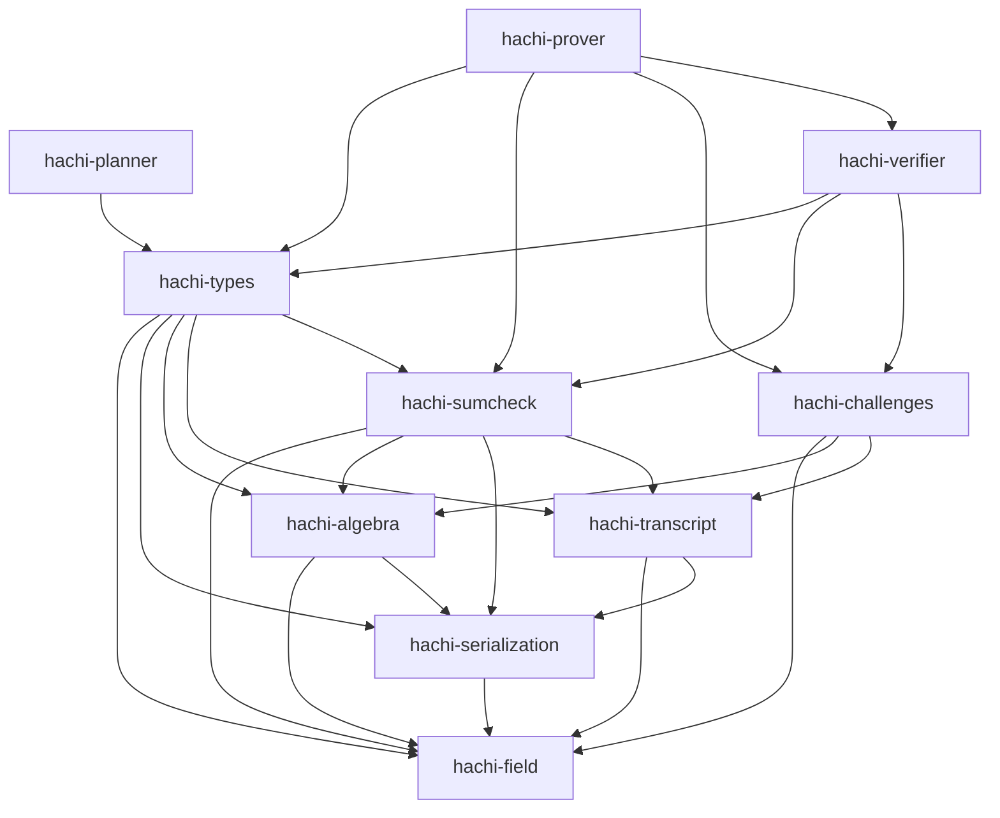

# Spec: Crate Decomposition

| Field       | Value        |
|-------------|--------------|
| Author(s)   | @quangvdao   |
| Created     | 2026-05-02   |
| Status      | proposed     |
| PR          | #64          |

## Summary

Hachi is currently a single public library package, `hachi-pcs`, plus the proc-macro package `hachi-derive`.
The monolith mixes algebra, serialization, transcripts, sumcheck machinery, schedule/config planning, prover kernels, verifier logic, examples, benches, and binary planner tools behind one dependency boundary.
This makes integration with Jolt harder than necessary: Jolt should be able to depend on a small verifier-oriented Hachi surface without also pulling prover-only polynomial backends, recursive witness construction, offline planner search, and benchmark/profile scaffolding.
Decompose Hachi into focused Rust workspace crates with explicit dependency direction, a lightweight verifier crate, and a heavier prover crate, while preserving protocol behavior, proof bytes, transcript streams, and all current end-to-end tests.

## Intent

### Goal

Refactor Hachi into a workspace of focused crates whose dependency graph separates foundational algebra, serialization, transcripts/challenge sampling, generic sumcheck, protocol data types, verifier logic, prover logic, and offline planning, so downstream projects such as Jolt can depend on the verifier surface without depending on prover-only code.

The target workspace crates are:

- `hachi-field`: `HachiError`, arithmetic/module traits, and conditional parallelism macros.
- `hachi-serialization`: `HachiSerialize`, `HachiDeserialize`, validation/compression traits, and the `hachi-derive` proc-macro re-export.
- `hachi-algebra`: field implementations, wide/packed field helpers, NTT, cyclotomic rings, sparse challenges, polynomial helpers, and algebra backends.
- `hachi-transcript`: transcript trait, hash transcript implementations, and domain labels only.
- `hachi-challenges`: Fiat-Shamir challenge sampling helpers, including rejection-sampled dense and sparse ring challenges.
- `hachi-sumcheck`: generic sumcheck traits, proof types, drivers, compact folding, batched sumcheck, and generic two-round-prefix helpers.
- `hachi-types`: public protocol data shapes: commitments, opening claims, proof objects, setup structs needed by verifier APIs, params, config traits/envelopes, opening-point reduction types, schedule/layout shapes, generated schedule tables, transcript-append traits, and PRG utilities that are not prover-only.
- `hachi-planner`: offline schedule search, proof-size estimation, SIS-security planning, and the `hachi-planner` / `gen_schedule_tables` binaries.
- `hachi-verifier`: batched verification, root and recursive level verification, ring-switch verification, quadratic-equation verification helpers, and Hachi-specific stage verifier instances.
- `hachi-prover`: commitment, batched proving, prover setup/expansion, polynomial backends, recursive witness construction, ring-switch witness construction/finalization, and Hachi-specific stage prover instances.

The final cutover must update all in-repo imports, examples, benches, tests, docs, and package metadata to the new crate graph in one pass.
Do not add temporary compatibility wrappers, deprecated aliases, or migration shims.
If a public aggregate package named `hachi-pcs` is kept, it must be a deliberate final crate with a stable role, not a transition layer.

### Invariants

This is an architectural refactor.
The implementation must preserve:

1. Protocol behavior: every currently valid proof verifies after the refactor, and every invalid proof rejected by current `main` remains rejected.
2. Transcript determinism: Fiat-Shamir byte absorption order, labels, challenge derivation, rejection sampling, and sparse challenge sampling are unchanged for equivalent prover/verifier flows.
3. Serialization compatibility: existing `HachiSerialize` / `HachiDeserialize` encodings for commitments, proof objects, setup data, field elements, ring elements, flat vectors, and digit blocks remain byte-identical unless an acceptance criterion explicitly changes them.
4. Prover/verifier consistency: `hachi-prover` and `hachi-verifier` must consume the same `hachi-types` proof/setup/config definitions; there must not be parallel copies of protocol shapes.
5. Dependency direction: shared foundational crates must not depend on prover or verifier crates; `hachi-verifier` must not depend on `hachi-prover`; `hachi-prover` may depend on `hachi-verifier` only if recursive proving needs verifier-side public types or helpers, and any such dependency must be justified in code comments or module docs.
6. Verifier slimness: `hachi-verifier` must not expose or require `HachiPolyOps`, `DensePoly`, `OneHotPoly`, `RecursiveWitnessFlat`, commit hints as prover witnesses, planner search APIs, examples, benches, profile code, or prover setup expansion APIs.
7. Planner isolation: offline search code in `src/planner/` must not be required by the verifier crate. Verifier layout validation may use generated schedule tables and schedule shape types, but not search loops.
8. Feature behavior: the existing default `parallel` feature remains enabled for crates that need it; all crates that can compile without Rayon must do so with `--no-default-features`.
9. No ownership churn: files or modules made obsolete by this refactor may be deleted, but only when they are replaced by the new crate layout in the same branch. Do not delete unrelated local analysis files or user-owned work.

No Hachi equivalent of Jolt's `jolt-eval` framework exists today.
Do not add a full eval framework as part of this spec.
Instead, capture the above invariants with standard Rust unit/integration tests, compile-fail dependency checks where practical, and deterministic transcript/serialization regression tests.

### Non-Goals

1. Changing the Hachi protocol, security assumptions, schedule choices, proof layout semantics, Fiat-Shamir domain labels, or field/ring arithmetic.
2. Migrating Jolt to consume the new Hachi crates in this PR. The output should make that integration straightforward, but the Jolt-side dependency change is separate.
3. Importing Jolt's code, eval framework, or crate names into Hachi.
4. Keeping temporary compatibility shims for old module paths such as `hachi_pcs::protocol::...`.
5. Rewriting algorithms for performance. Performance regressions should be avoided, but optimization beyond preserving current behavior is out of scope.
6. Publishing crates to crates.io.
7. Reorganizing local research notes, generated analysis markdowns, or untracked scripts unrelated to the crate decomposition.

## Evaluation

### Acceptance Criteria

- [ ] Workspace `Cargo.toml` lists the new package members and no package has a circular dependency.
- [ ] `hachi-field` contains `src/error.rs`, `src/primitives/arithmetic.rs`, and `src/parallel.rs` functionality under crate-local modules and re-exports the current public arithmetic trait surface.
- [ ] `hachi-serialization` contains `src/primitives/serialization.rs` functionality and re-exports derive macros from `hachi-derive`; `hachi-derive` no longer depends on the old monolithic package path.
- [ ] `hachi-algebra` contains the live `src/algebra/` tree and depends only on `hachi-field` and `hachi-serialization` plus its external dependencies.
- [ ] `hachi-transcript` contains `src/protocol/transcript/{mod.rs,hash.rs,labels.rs}` functionality but does not depend on protocol prover/verifier modules; challenge sampling helpers currently reached through `protocol::challenges::rejection` move out of transcript into `hachi-challenges`.
- [ ] `hachi-challenges` contains `src/protocol/challenges/` functionality and all transcript helper functions that sample dense/sparse ring challenges from Fiat-Shamir output.
- [ ] `hachi-sumcheck` contains only generic sumcheck modules: `accum.rs`, `batched_sumcheck.rs`, `compact_fold.rs`, `drivers.rs`, `traits.rs`, `two_round_prefix.rs`, and `types.rs`, plus any algebra polynomial re-exports needed by existing callers.
- [ ] Hachi-specific stage modules `hachi_stage1.rs`, `hachi_stage1_tree.rs`, and `hachi_stage2.rs` are split so prover-specific structs live in `hachi-prover` and verifier-specific structs live in `hachi-verifier`; shared stage proof shapes live in `hachi-types`.
- [ ] `hachi-types` uses current `main` file names and does not reference removed files such as `src/protocol/commitment/config.rs`, `presets.rs`, `profile.rs`, `schedule_planner.rs`, or `src/test_utils.rs`.
- [ ] `hachi-types` includes the current config path `src/protocol/config/{mod.rs,proof_optimized.rs}` and the current commitment schedule path `src/protocol/commitment/{schedule.rs,types.rs,transcript_append.rs,sis_derivation.rs,generated/}` after any necessary dependency-breaking splits.
- [ ] `hachi-planner` owns `src/planner/{baseline.rs,digit_math.rs,proof_size.rs,schedule_params.rs,search.rs,sis_security.rs}` and both planner binaries. Runtime verifier/prover crates must not depend on planner search APIs.
- [ ] The unified `CommitmentScheme` trait in `src/protocol/commitment/scheme.rs` is split into role-specific trait surfaces, for example `CommitmentProver` and `CommitmentVerifier`, so verifier crates do not need a trait bound on `HachiPolyOps`.
- [ ] `hachi-verifier` exposes batched verification APIs equivalent to the current `HachiCommitmentScheme::batched_verify` and does not depend on `hachi-prover`.
- [ ] `hachi-prover` exposes commitment and proving APIs equivalent to current `commit`, `batched_commit`, and `batched_prove`, and owns `HachiPolyOps`, `DensePoly`, `OneHotPoly`, `MultilinearPolynomail`, and recursive witness implementations.
- [ ] Existing examples, benches, and integration tests import from the new crates and compile without old-path aliases.
- [ ] Deterministic transcript regression tests assert that representative `Blake2bTranscript` and `KeccakTranscript` flows over Hachi field/ring challenges produce the same challenges before and after the refactor.
- [ ] Serialization roundtrip and byte-stability tests cover `HachiBatchedProof`, `HachiBatchedRootProof`, `HachiLevelProof`, `RingCommitment`, `FlatRingVec`, `FlatDigitBlocks`, and representative field/ring elements.
- [ ] Dependency-graph checks assert that `hachi-verifier` has no dependency edge to `hachi-prover`, `hachi-planner`, examples, benches, or prover polynomial backends.
- [ ] `cargo fmt -q` passes at the workspace root.
- [ ] `cargo clippy --all --all-targets --all-features --message-format=short -q -- -D warnings` passes at the workspace root.
- [ ] `cargo test` passes at the workspace root.
- [ ] `cargo test --no-default-features` passes for crates expected to support sequential/no-Rayon mode.

### Testing Strategy

Existing tests that must continue passing:

- All integration tests under `tests/`, especially `hachi_e2e.rs`, `single_poly_e2e.rs`, `multipoint_batched_e2e.rs`, `batched_aggregated_e2e.rs`, `commitment_contract.rs`, and `setup.rs`.
- All protocol tests embedded in `src/protocol/commitment_scheme.rs`, `ring_switch.rs`, `quadratic_equation.rs`, `proof.rs`, `setup.rs`, and sumcheck modules after they move to their owning crates.
- All algebra and NTT tests after extraction to `hachi-algebra`.
- All examples and benches that are listed in workspace manifests.

New tests to add:

- `hachi-verifier` compile and runtime tests using only verifier setup, commitments, claimed openings, proof objects, transcripts, and public config/types.
- A dependency hygiene test or CI script that runs `cargo tree -p hachi-verifier` and fails if `hachi-prover` or `hachi-planner` appears.
- Transcript regression tests for dense scalar challenges, extension challenges, rejection-sampled ring challenges, and sparse ring challenges.
- Serialization byte-stability fixtures generated on current `main` before the crate split, committed as compact deterministic test vectors.
- Trait-surface compile tests proving that verifier APIs accept claims/proofs without requiring `P: HachiPolyOps`.
- Feature matrix checks: default features, `--no-default-features`, and `--all-features` for the workspace or the crates where those modes are meaningful.

### Performance

Expected performance is no regression beyond measurement noise.
The refactor changes package boundaries and module paths, not algorithms.

Concrete performance checks:

- `cargo bench --bench hachi_e2e`
- `cargo bench --bench onehot_batched_commit`
- `cargo bench --bench onehot_batched_opening`
- `cargo bench --bench root_kernels`
- `cargo run --release --example profile` with representative `HACHI_MODE=onehot` and `HACHI_NUM_VARS=25`

Acceptable regression threshold: within 2% for wall-clock benchmark medians on unchanged hardware, unless the benchmark noise is higher and the implementer documents the run variance.
Binary size and dependency size should improve for verifier-only consumers: `cargo tree -p hachi-verifier` must be materially smaller than the prover dependency graph and must not include prover-only polynomial backend modules.

No new Jolt-style objective is required for this PR because Hachi does not currently have `jolt-eval`.
If a Hachi eval framework is later introduced, natural objectives are verifier dependency size, verifier compile time, proof verification time, and prover commit/prove throughput.

## Design

### Architecture

The crate graph should be acyclic and roughly layered as follows:



The `Prover --> Verifier` edge is optional.
Prefer avoiding it unless recursive proving materially benefits from reusing verifier-only checks.
The required edge is one-way: `Verifier` must never depend on `Prover`.

#### Current Source Mapping

Use current `main` paths, not the stale older plan.

`hachi-field`:

- `src/error.rs`
- `src/primitives/arithmetic.rs`
- `src/parallel.rs`

`hachi-serialization`:

- `src/primitives/serialization.rs`
- `derive/`

`hachi-algebra`:

- `src/algebra/backend/`
- `src/algebra/fields/`
- `src/algebra/ntt/`
- `src/algebra/ring/`
- `src/algebra/{eq_poly.rs,module.rs,offset_eq.rs,poly.rs,split_eq.rs,uni_poly.rs}`
- `src/primitives/poly.rs` if it remains algebraic and protocol-independent

`hachi-transcript`:

- `src/protocol/transcript/hash.rs`
- `src/protocol/transcript/labels.rs`
- `Transcript` trait from `src/protocol/transcript/mod.rs`

`hachi-challenges`:

- `src/protocol/challenges/`
- `sample_ext_challenge`, `challenge_ring_element`, `challenge_ring_element_rejection_sampled`, `challenge_ring_elements_rejection_sampled`, and `challenge_sparse_ring_elements_rejection_sampled` if keeping them in transcript would require transcript to depend on challenge modules.

`hachi-sumcheck`:

- `src/protocol/sumcheck/{accum.rs,batched_sumcheck.rs,compact_fold.rs,drivers.rs,traits.rs,two_round_prefix.rs,types.rs}`
- Do not move Hachi-specific stage prover/verifier structs here.

`hachi-types`:

- `src/protocol/proof.rs`, after ensuring it contains proof/data shapes rather than prover algorithms.
- `src/protocol/params.rs`
- `src/protocol/opening_point.rs`
- `src/protocol/commitment/types.rs`
- `src/protocol/commitment/transcript_append.rs`
- `src/protocol/commitment/generated/`
- Schedule/layout shape portions of `src/protocol/commitment/schedule.rs`
- Current config files `src/protocol/config/mod.rs` and `src/protocol/config/proof_optimized.rs`, after planner-search dependencies are split out or gated.
- Public verifier setup shape from `src/protocol/setup.rs`; prover setup expansion can remain prover-owned if that keeps verifier slim.
- `src/protocol/prg.rs` only if both prover and verifier need it. If it is setup/prover-only, place it in `hachi-prover`.
- `src/protocol/dispatch.rs` only if macro dispatch is genuinely shared. Otherwise put dispatch beside the code that uses it.

`hachi-planner`:

- `src/planner/`
- Planner binaries currently declared in the root manifest.
- Search-specific logic currently imported by `src/protocol/config/mod.rs` or `src/protocol/commitment/schedule.rs` should move here or behind explicit non-verifier features.

`hachi-verifier`:

- Verification path from `src/protocol/commitment_scheme.rs`, including current functions around `batched_verify`, `verify_batched_recursive_suffix`, `verify_root_level`, `verify_one_level`, and root-direct verification helpers.
- Verifier path from `src/protocol/ring_switch.rs`, including `ring_switch_verifier`.
- Verifier helpers from `src/protocol/quadratic_equation.rs`, including `derive_stage1_challenges` if verifier-owned.
- Verifier structs and impls currently in `hachi_stage1.rs`, `hachi_stage1_tree.rs`, and `hachi_stage2.rs`.

`hachi-prover`:

- Prover path from `src/protocol/commitment_scheme.rs`, including `commit_with_params`, `commit`, `batched_commit`, `batched_prove`, `prove_root_level`, and recursive proving helpers.
- Prover path from `src/protocol/ring_switch.rs`, including `ring_switch_build_w`, `ring_switch_finalize`, and `commit_w`.
- Prover helpers from `src/protocol/quadratic_equation.rs`.
- `src/protocol/recursive_runtime.rs`
- `src/protocol/hachi_poly_ops/`
- Prover structs and impls currently in `hachi_stage1.rs`, `hachi_stage1_tree.rs`, and `hachi_stage2.rs`.
- Setup expansion code from `src/protocol/setup.rs` if it builds prover matrices or NTT caches unnecessary for verifier-only consumers.

#### Trait Split

The current `CommitmentScheme` trait combines setup, commit, prove, and verify and imports `HachiPolyOps`.
Split it into role-specific traits in `hachi-types` or the relevant role crates:

```rust
pub trait CommitmentVerifier<F, const D: usize>
where
    F: FieldCore + CanonicalField,
{
    type VerifierSetup: Clone + Send + Sync;
    type Commitment: Clone + PartialEq + Send + Sync + AppendToTranscript<F>;
    type BatchedProof: Clone + Send + Sync;

    fn batched_verify<'a, T: Transcript<F>>(
        proof: &Self::BatchedProof,
        setup: &Self::VerifierSetup,
        transcript: &mut T,
        claims: VerifierClaims<'a, F, Self::Commitment>,
        basis: BasisMode,
    ) -> Result<(), HachiError>;

    fn protocol_name() -> &'static [u8];
}

pub trait CommitmentProver<F, const D: usize>: CommitmentVerifier<F, D>
where
    F: FieldCore + CanonicalField,
{
    type ProverSetup: Clone + Send + Sync;
    type CommitHint: Clone + Send + Sync;

    fn setup_prover(
        max_num_vars: usize,
        max_num_batched_polys: usize,
        max_num_points: usize,
    ) -> Self::ProverSetup;

    fn setup_verifier(setup: &Self::ProverSetup) -> Self::VerifierSetup;

    fn commit<P: HachiPolyOps<F, D>>(
        polys: &[P],
        setup: &Self::ProverSetup,
    ) -> Result<(Self::Commitment, Self::CommitHint), HachiError>;

    fn batched_prove<'a, T: Transcript<F>, P: HachiPolyOps<F, D>>(
        setup: &Self::ProverSetup,
        claims: ProverClaims<'a, F, P, Self::Commitment, Self::CommitHint>,
        transcript: &mut T,
        basis: BasisMode,
    ) -> Result<Self::BatchedProof, HachiError>;
}
```

The exact trait placement may differ, but the verifier trait must not name `HachiPolyOps`.

#### Schedule and Config Boundary

Current `main` has a scheduler refactor:

- `src/protocol/config/mod.rs`
- `src/protocol/config/proof_optimized.rs`
- `src/protocol/commitment/schedule.rs`
- `src/protocol/commitment/sis_derivation.rs`
- `src/planner/schedule_params.rs`

The older plan's `commitment/config.rs`, `presets.rs`, `profile.rs`, and `schedule_planner.rs` no longer exist.
Before moving crates, split current schedule/config code by role:

- Shared layout/config types and generated tables: `hachi-types`.
- Offline search and proof-size/SIS exploration: `hachi-planner`.
- Prover-only setup expansion or witness sizing helpers: `hachi-prover`.
- Verifier-needed layout validation: `hachi-types` or `hachi-verifier`, with no dependency on planner search.

#### Transcript and Challenge Boundary

Current transcript code imports `protocol::challenges::rejection`.
That makes `hachi-transcript` not truly foundational.
Move challenge sampling out of transcript so:

- `hachi-transcript` owns byte absorption, labels, hash transcript state, and scalar challenge extraction.
- `hachi-challenges` owns "interpret transcript output as Hachi-specific ring/sparse challenges" functions.

This keeps Jolt integration cleaner: Jolt can consume the transcript layer without importing Hachi ring challenge sampling, while Hachi prover/verifier can depend on both.

### Alternatives Considered

1. Keep a single `hachi-pcs` crate and use Cargo features to hide prover code.
   This avoids file moves but leaves dependency boundaries unenforced and makes verifier slimness easy to regress.
   It also keeps Jolt integration tied to a monolithic package.

2. Extract only `hachi-verifier` and leave all shared code in `hachi-pcs`.
   This gives a superficial verifier package but still forces verifier consumers through a broad transitive dependency graph.

3. Put planner, config, schedule, setup, and commitment utilities into one `hachi-types` crate.
   This was the older plan.
   It is too broad after the scheduler refactor because planner search and setup expansion are heavier than proof/config shape definitions and risk entering the verifier path.

4. Keep the unified `CommitmentScheme` trait.
   This keeps API continuity but forces verifier-oriented crates to name prover-only `HachiPolyOps`.
   The role-specific split is cleaner and aligns with the no-backward-compatibility policy.

5. Add a temporary `hachi-pcs` facade with old module paths.
   This conflicts with the full-cutover rule.
   Any aggregate crate must be a final public product decision, not a temporary migration layer.

## Documentation

Add or update Hachi documentation:

- `AGENTS.md`: update crate structure, essential commands if package-specific commands become preferable, and key abstractions.
- `README.md`: describe the new package layout and which crate downstream users should depend on for prover, verifier, algebra, and transcript use cases.
- `docs/`: add a short crate graph document, preferably `docs/crate-graph.md`, with the dependency diagram and intended ownership boundaries.
- Examples: update import paths and comments so users learn the new public crate names.

No Jolt book changes are required in this Hachi PR.
A later Jolt integration PR can update Jolt docs once Jolt consumes `hachi-verifier`.

## Execution

Implement in dependency order, keeping the workspace compiling after each meaningful phase when practical.
Because this is a full cutover, intermediate commits may temporarily be large, but avoid leaving old-path aliases.

1. Create deterministic regression fixtures on current `main` before moving code:
   transcript challenge vectors, proof serialization vectors, and representative e2e proof/verify fixtures.
2. Split role-neutral traits before crate moves:
   introduce `CommitmentVerifier` / `CommitmentProver` boundaries and update monolithic call sites.
3. Split transcript/challenge boundaries in-place:
   remove `protocol::transcript` dependency on `protocol::challenges`.
4. Split Hachi-specific stage sumcheck modules in-place:
   isolate shared proof shapes, prover structs, and verifier structs.
5. Split schedule/config/planner boundaries in-place:
   separate generated layout/config from offline search and prover setup sizing.
6. Extract leaf crates:
   `hachi-field`, `hachi-serialization`, `hachi-algebra`.
7. Extract transcript/challenge/sumcheck crates:
   `hachi-transcript`, `hachi-challenges`, `hachi-sumcheck`.
8. Extract protocol data and planner crates:
   `hachi-types`, `hachi-planner`.
9. Extract role crates:
   `hachi-verifier`, then `hachi-prover`.
10. Update examples, benches, tests, docs, and root re-exports.
11. Remove obsolete modules and old paths in the same branch.
12. Run the full verification matrix and compare deterministic fixtures/benchmark baselines.

The implementation should prefer mechanical file moves with minimal internal edits first.
After each extraction, update `use` paths to external crate names rather than preserving old module aliases.

## References

- Jolt spec template: [`specs/TEMPLATE.md`](https://github.com/a16z/jolt/blob/main/specs/TEMPLATE.md)
- Jolt example spec style: [`specs/unify-field-hierarchy.md`](https://github.com/a16z/jolt/blob/main/specs/unify-field-hierarchy.md)
- Hachi current crate root: [`src/lib.rs`](../src/lib.rs)
- Hachi current commitment trait: [`src/protocol/commitment/scheme.rs`](../src/protocol/commitment/scheme.rs)
- Hachi current commitment implementation: [`src/protocol/commitment_scheme.rs`](../src/protocol/commitment_scheme.rs)
- Hachi current scheduler/config files: [`src/protocol/config/mod.rs`](../src/protocol/config/mod.rs), [`src/protocol/commitment/schedule.rs`](../src/protocol/commitment/schedule.rs)
