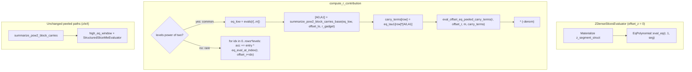

# Spec: Simplify `eval_offset_eq_tensor` → `EqPolynomial::eval_eq`

| Field         | Value                                      |
|---------------|--------------------------------------------|
| Author(s)     | Omid Bodaghi (draft)                       |
| Created       | 2026-07-03                                 |
| Status        | proposed                                   |
| PR            |                                            |
| Supersedes    |                                            |
| Superseded-by |                                            |
| Book-chapter  | how/verifying/matrix_evaluation.md         |

## Summary

`eval_offset_eq_tensor` in `akita-algebra/src/offset_eq.rs` is a general
carry-DP for \(\sum_z \mathrm{eq}(r,\,\text{offset}+z)\cdot\text{scale}\cdot\prod_j
\text{factors}[j][\text{idx}_j(z)]\). In the live verifier it is reached from
**three call sites**, all in `structured_slice.rs`. Profiling shows this path is
**not verifier-hot** (≈0.4–2% of batched verify). This spec replaces the tensor
helper with a small, offset-free `EqPolynomial::eval_eq` for the `z` dense
segment (where `offset_z = 0` today) and, for the `r` tail, a two-branch
`compute_r_contribution`: the common **pow2** case is rerouted through the
retained 2-adic peel primitives (preserving today's fast path), and the rare
**non-pow2** case uses a fused on-the-fly `eq_eval_at_index` loop.
The carry/tensor machinery and `eval_offset_eq_tensor` itself are deleted;
peeled-block primitives (`summarize_pow2_block_carries[_base]`,
`eval_offset_eq_peeled_carry_terms`, `eq_eval_at_index`) remain — and the
**pow2 `r` optimization is preserved by rerouting it through those peel
primitives** (see `compute_r_contribution` below), so the fast path survives
without any carry-DP code.

## Intent

### Goal

Collapse the only production uses of `eval_offset_eq_tensor` into:

1. **`EqPolynomial::eval_eq`** — offset-zero inner product of one factor table
   against `eq(r, ·)`, implemented via `mle_small` + tail \((1-r_t)\) factors.
   Used by dense `z` (`offset_z = 0`).
2. **`compute_r_contribution`** — two branches, both free of `eval_offset_eq_tensor`:
   - **pow2 `levels`** (common): peel the low `m = log2(levels)` bits with
     `summarize_pow2_block_carries_base` + `eval_offset_eq_peeled_carry_terms`
     (keeps today's `O(levels + rows)` fast path).
   - **non-pow2 `levels`** (rare, e.g. log_basis 3/5): fused on-the-fly loop
     over `eq_eval_at_index(r, offset_r + idx)`, no `r_tail` allocation.

### Non-goals

- Removing `eq_eval_at_index`, `summarize_pow2_block_carries`, or the peeled
  e/t/z fast paths (`ZStructuredPow2SlicesEvaluator`, setup contribution peel).
- Changing distributed chunking layout or witness segment geometry.
- Optimizing `setup_contribution` (still ≈50–90% of ring-switch row eval).

### Constraints

- **Verifier no-panic contract** unchanged: dimension errors return
  `AkitaError`, no unchecked indexing.
- **No measurable regression** on `examples/profile` for `onehot_fp128_d64`
  at `nv ∈ {32, 36}` (r span within noise of current tracing).
- **Single-chunk `offset_z = 0`** for `ZDenseSlicesEvaluator` is an explicit
  assumption (documented below); multi-chunk dense `z` with nonzero
  `chunk.offset_z` is out of scope unless we add offset back.

---

## Evidence (why this is safe)

Measurements: release build, Apple Silicon, `cargo run --release --example profile`,
`AKITA_PROFILE_TRACE=0`, `np=1`.

### `compute_r_contribution` share of batched verify

| Config | Verify | Total `r` | % verify | `r_dense` calls | `r_structured` calls |
|--------|--------|-----------|----------|-----------------|----------------------|
| nv=32, D=64 onehot | 23.7 ms | ≈506 µs | **2.1%** | 2 (≈303 µs, ≈183 µs) | 6 (≈2–8 µs each) |
| nv=36, D=64 onehot | 68.0 ms | ≈279 µs | **0.4%** | 1 (≈255 µs) | 7 (≈2–8 µs each) |

Dominant row-eval cost remains **`setup_contribution`** (≈43–52 ms cumulative
across levels at nv=36; ≈47–90% of per-level `stage2_ring_switch_row_eval`).

### Microbench (`r_contribution_cost_profile`, fixture: `rows=7`, `levels=26`,
`r_tail=182`, dense path)

| Method | µs/iter | vs current |
|--------|---------|------------|
| Current (materialize `r_tail` + `eval_offset_eq_tensor`) | ≈8.6 | 1.00× |
| On-the-fly `eq_eval_at_index` loop | ≈12.8 | 1.49× |
| Materialized full eq table + loop | ≈17.1 | 1.99× |

At **production scale** (nv=36 dense fold: **`r_tail = 9 × 43 = 387`** entries),
tracing gives **`r_dense ≈ 255 µs`** — same order as the fused loop would be;
eliminating the `Vec<E>` allocation is a mild win, not a loss.

### Decision log

| Question | Decision | Rationale |
|----------|----------|-----------|
| Keep the pow2 `r` optimization? | **Yes** | It is the common case (6 of 7 folds at nv=36) and ~30–100× cheaper than dense. Preserve it. |
| Keep carry-DP (`eval_offset_eq_tensor`) to do it? | **No** | The pow2 tensor with `offset_r ≠ 0` is *exactly* a 2-adic peel; reuse `summarize_pow2_block_carries_base` + `eval_offset_eq_peeled_carry_terms` instead. No carry-DP needed. |
| Keep `eval_offset_eq_tensor` for `z`? | **No** | Single-chunk `offset_z = 0`; degenerates to `eval_eq`. |
| Pass `offset` into new `eval_eq`? | **No** | API is offset-zero only; offset cases use the peel or `eq_eval_at_index` at the call site. |
| Split pow2 / non-pow2 `r` paths? | **Yes** | pow2 → peel (fast); non-pow2 → on-the-fly. Same dispatch key as today (`levels.is_power_of_two()`), different implementations. |
| Delete entire `offset_eq.rs`? | **No** | Peeled primitives and `eq_eval_at_index` still used widely (now including pow2 `r`). |

---

## Current call sites

All `eval_offset_eq_tensor` production uses:

| Site | Segment | `offset` | Factors | Current path | After |
|------|---------|----------|---------|--------------|-------|
| `ZDenseSlicesEvaluator::evaluate` | `ẑ` dense | `offset_z` (=0) | 1 (`z_segment_struct`) | aligned if `offset=0`, else carry | `EqPolynomial::eval_eq` |
| `compute_r_contribution` (pow2) | `r̂` tail | `offset_r` | 2 (`r_gadget`, `eq_tau1`) | carry-DP | 2-adic peel (kept primitives) |
| `compute_r_contribution` (!pow2) | `r̂` tail | `offset_r` | 1 (`r_tail` materialized) | carry-DP | on-the-fly loop |

No other crate calls `eval_offset_eq_tensor`.

### `offset_z = 0` assumption (z dense)

For **single-chunk** layouts (`num_chunks = 1`), witness geometry places `z`
first: `chunk.offset_z = 0` ([`ring_relation.rs` tests](crates/akita-types/src/proof/ring_relation.rs), [`distributed-verifier-row-eval.md`](distributed-verifier-row-eval.md)).

`ZDenseSlicesEvaluator` today is only used when `block_len` is **not** a power
of two (recursive levels). Under **multi-chunk** plans, dense `z` may be
evaluated per chunk at **nonzero** `chunk.offset_z`. This spec **does not**
support that without either (a) keeping an offset-aware helper for dense `z`, or
(b) restricting dense `z` to single-chunk / `offset_z = 0` and using the peeled
path for chunked root `z`. **Implementation must assert or debug_assert
`offset_z == 0`** in `ZDenseSlicesEvaluator` until chunking lands.

### `offset_r` is never zero in production

`offset_r = z_len + e_len + t_len (+ u_len if tiered)` — see
[`WitnessChunkLayout::offset_r`](crates/akita-types/src/witness.rs). Example
fixture: `offset_r = 3408` with `rows × levels = 182`. The aligned tensor
formula (`mle_small` product **without** per-index `eq(r, offset_r + idx)`) does
**not** apply to `r`. The proposed `r` loop must keep `offset_r`.

---

## Proposed API (`akita-algebra/src/eq_poly.rs`)

### `EqPolynomial::eval_eq`

```rust
impl<E: FieldCore> EqPolynomial<E> {
    /// Evaluate `scale · Σ_i eq(r, i) · factor[i]` for `i ∈ [0, factor.len())`,
    /// with little-endian bit order matching [`Self::evals`].
    ///
    /// Indices `i ≥ factor.len()` are treated as zero (implicit padding to the
    /// next power of two inside the MLE fold). Challenge bits beyond the
    /// padded factor width are constrained to zero via multiplication by
    /// `(1 - r_t)`.
    ///
    /// # Errors
    ///
    /// Returns [`AkitaError::InvalidSize`] if the factor consumes more
    /// challenge bits than `r.len()`.
    pub fn eval_eq(r: &[E], scale: E, factor: &[E]) -> Result<E, AkitaError>;
}
```

### Implementation (moved from `eval_offset_eq_tensor_aligned`, single factor)

```text
result = scale
m = factor.len().next_power_of_two().log2()
result *= mle_small(factor, r[0..m])
for r_t in r[m..]:
    result *= (1 - r_t)
return result
```

**`mle_small`** moves from `offset_eq.rs` to `eq_poly.rs` as a private helper
(same implementation as today: pad with zeros, standard multilinear fold).

**Mathematical identity** (offset = 0):

\[
\sum_{z=0}^{2^m-1} \mathrm{eq}(r, z)\cdot f(z)
= \mathrm{MLE}(f, r_{0..m})\cdot \prod_{t\ge m}(1-r_t)
\]

where `f(z)=0` for `z ≥ len(factor)` via padding.

### Not adding (unless needed later)

- `eval_eq_tensor(r, scale, factors: &[&[E]])` — only needed for offset-zero
  multi-factor products. **Not required** after unifying `r` to one on-the-fly
  loop. If we ever need it, it is the multi-factor body of today's
  `eval_offset_eq_tensor_aligned` without offset.

---

## Verifier changes (`structured_slice.rs`)

### 1. `ZDenseSlicesEvaluator::evaluate` (line ≈289)

**Before:** materialize `z_segment_struct`, `eval_offset_eq_tensor(r, offset_z, 1, &[seg])`.

**After:**

```rust
debug_assert_eq!(self.offset_z, 0, "dense z eval_eq assumes offset_z = 0");
// Still materialize z_segment_struct (tensor product); only the eq pass changes.
EqPolynomial::eval_eq(self.full_vec_randomness, E::one(), &z_segment_struct)
```

Remove `offset_z` from the eq call (field may remain on the struct for layout
metadata until chunking). If `offset_z != 0` in debug builds, fail loud.

**Performance:** identical to today's `eval_offset_eq_tensor_aligned` single-factor
path (what already runs when `offset=0`).

### 2. `compute_r_contribution` (line ≈301)

**Before:** branch on `levels.is_power_of_two()` → structured two-factor carry-DP
(`eval_offset_eq_tensor`) or dense materialized `r_tail` + single-factor carry-DP.

**After:** same dispatch key (`levels.is_power_of_two()`), but neither branch
calls `eval_offset_eq_tensor`.

```rust
pub(crate) fn compute_r_contribution<F, E>(
    prepared: &RingSwitchDeferredRowEval<E>,
    full_vec_randomness: &[E],
    offset_r: usize,
    denom: E,
    r_gadget: &[F],
) -> Result<E, AkitaError>
where
    F: FieldCore + CanonicalField,
    E: ExtField<F>,
{
    let levels = r_gadget.len();
    let rows = prepared.rows;

    if levels.is_power_of_two() {
        // --- pow2: 2-adic peel of the low m = log2(levels) bits -------------
        let _span = tracing::info_span!("r_structured").entered();
        let m = levels.trailing_zeros() as usize;
        let eq_low = EqPolynomial::evals(&full_vec_randomness[..m])?;   // 2^m entries
        let offset_lo = offset_r & (levels - 1);
        // Low-factor summary shared across every row (r_gadget is row-independent):
        let [a0, a1] =
            summarize_pow2_block_carries_base::<F, E>(&eq_low, offset_lo, r_gadget)?;
        // Per-row outer weights fold eq_tau1 into the two carry buckets.
        let carry_terms: Vec<[E; 2]> = prepared.eq_tau1[..rows]
            .iter()
            .map(|&e| [e * a0, e * a1])
            .collect();
        let combined =
            eval_offset_eq_peeled_carry_terms(full_vec_randomness, offset_r, m, &carry_terms)?;
        Ok(-denom * combined)
    } else {
        // --- non-pow2: fused on-the-fly loop, no r_tail allocation ----------
        let _span = tracing::info_span!("r_dense").entered();
        let r_len = rows.checked_mul(levels).ok_or_else(|| {
            AkitaError::InvalidInput("r-tail length overflow".to_string())
        })?;
        let mut acc = E::zero();
        for idx in 0..r_len {
            let row_idx = idx / levels;
            let level_idx = idx % levels;
            let entry = -(prepared.eq_tau1[row_idx] * denom).mul_base(r_gadget[level_idx]);
            acc += entry * eq_eval_at_index(full_vec_randomness, offset_r + idx);
        }
        Ok(acc)
    }
}
```

Both branches keep their existing tracing spans (`r_structured` / `r_dense`)
so the profile comparison stays apples-to-apples.

#### Why the pow2 peel is exact (and equals today's tensor)

The r-tail is a rank-1 tensor: `tail[idx] = (-denom) · eq_tau1[row] · r_gadget[level]`
with `idx = row · levels + level`. When `levels = 2^m`, `level` occupies the low
`m` bits of `idx` and `row` the high bits. Split
`offset_r = offset_lo + levels · offset_hi` (`offset_lo = offset_r mod levels`).
Because `eq` is fully multiplicative across bits, and `s = offset_lo + level ∈
[0, 2·levels − 2]` carries at most one bit:

\[
\mathrm{eq}(r,\,\text{offset}_r + idx)
= \mathrm{eq}_{\text{low}}\big(s \bmod levels\big)\cdot
  \mathrm{eq}_{\text{high}}\big(\text{offset}_{hi} + row + \lfloor s/levels\rfloor\big).
\]

Summing over `level` (shared for all rows) gives the two carry buckets
`[A0, A1] = summarize_pow2_block_carries_base(eq_low, offset_lo, r_gadget)`; the
outer combine over rows with weight `eq_tau1[row]` is exactly
`eval_offset_eq_peeled_carry_terms`. This is the **same math** the pow2 tensor
carry-DP computed — the carry-DP was just a general way to reach it. Reusing the
peel makes pow2 `r` structurally identical to pow2 `z`/`e`/`t`.

**Cost (unchanged fast path):** `O(levels)` to build `eq_low` + summarize, plus
`O(rows · (n − m))` for the outer combine (`rows` ≤ ~10). No `rows × levels`
materialization, no 2×2 carry matrices.

**Why non-pow2 stays on-the-fly:** if `levels` is not a power of two, `level`
does not occupy a contiguous bit range of `idx`, so the two-bucket peel is
undefined. The fused loop is correct for any `offset_r` and matches today's
dense semantics.

**`r_tail` length (non-pow2 branch, now implicit — no allocation):**

```text
r_len = prepared.rows × r_gadget.len()
      = prepared.rows × r_decomp_levels(log_basis)
```

Production examples (fp128, `rows = 3 + n_a`, `np=1`):

| nv | Non-pow2 fold | rows | levels | `r_len` (loop iters) |
|----|---------------|------|--------|----------------------|
| 32 | log_basis=3 | 8 | 43 | 344 |
| 36 | log_basis=3 | 9 | 43 | **387** |

At nv=36 only **one** fold (log_basis=3) hits the on-the-fly branch; the other
six (log_basis 2→64, 4→32) take the peel.

---

## Code removal plan (`akita-algebra/src/offset_eq.rs`)

### Delete entirely

| Item | Lines (approx) | Reason |
|------|----------------|--------|
| `eval_offset_eq_tensor` (pub) | 188–219 | No callers after migration |
| `eval_offset_eq_tensor_aligned` | 338–377 | Logic → `EqPolynomial::eval_eq` |
| `eval_offset_eq_tensor_carry` | 380–409 | No callers |
| `factor_summary` | 122–178 | Carry-DP only |
| `carry_transition_pair` | 92–116 | Carry-DP only |
| `CarryTransition` | 24–28 | Carry-DP only |
| `CarryMatrix` + impl | 35–88 | Carry-DP only |
| `mle_small` | 415–441 | Moves to `eq_poly.rs` |
| Tests: offset nonzero tensor cases | ≈560–689 | Behavior removed |
| Module doc bullet (1) about tensor carry-DP | 5–6 | Stale |

**Estimated deletion:** ~350–400 LOC + tests.

### Keep (still used)

| Item | Used by |
|------|---------|
| `eq_eval_at_index` | `structured_slice`, `setup_contribution`, `ring_switch`, `trace_weight`, non-pow2 `r` loop, peel outer combine |
| `summarize_pow2_block_carries` | `structured_slice` tests, `tensor_challenges`, peeled z/e/t |
| `summarize_pow2_block_carries_base` | **Promote from `#[cfg(test)]` to `pub(crate)` / `pub`** — now the low-factor summary for **pow2 `r`** (base `r_gadget` × ext `eq_low`, no lift alloc). Currently `#[cfg(test)]` in `ring_switch.rs`; move to `offset_eq.rs` alongside `summarize_pow2_block_carries` as the canonical base×ext variant. |
| `eval_offset_eq_peeled_carry_terms` | **Now production**: outer combine for pow2 `r` (previously tests-only). |

> **Note:** promoting `summarize_pow2_block_carries_base` avoids lifting
> `r_gadget` into `E` (today's pow2 path allocates `r_gadget_ext`). If we prefer
> zero new API surface, the alternative is to lift `r_gadget → E` and call the
> generic `summarize_pow2_block_carries::<E>`; either is correct. Recommendation:
> promote the `_base` variant (fewer allocations, single source of truth for the
> base×ext peel already used by `z`).

### Module header after cutover

`offset_eq.rs` becomes **offset equality helpers**: single-index eval + peeled
block carry buckets. Tensor carry-DP removed.

### Other repo touch-ups

| Location | Change |
|----------|--------|
| `structured_slice.rs` | Import `EqPolynomial::eval_eq`, `summarize_pow2_block_carries_base`, `eval_offset_eq_peeled_carry_terms`; drop `eval_offset_eq_tensor`; rewrite `compute_r_contribution` (peel + on-the-fly); update tests |
| `ring_switch.rs` | Un-gate `summarize_pow2_block_carries_base` (remove `#[cfg(test)]`) or relocate it to `offset_eq.rs` |
| `offset_eq.rs` `lib.rs` re-export | Unchanged module; document shrunk surface |
| `book/src/how/verifying/matrix_evaluation.md` | Case 2 dense `z`: `EqPolynomial::eval_eq` instead of `eval_offset_eq_tensor` |
| `docs/doc-blast-radius.json` | Update if `offset_eq` blast radius listed |
| `specs/distributed-verifier-row-eval.md` | Note: dense `z` at nonzero `offset_z` needs follow-up if chunking ships before offset helper |
| `r_contribution_cost_profile` test | Retarget to on-the-fly loop vs `eval_eq` for `z`; remove tensor references |

---

## Data flow (after)



---

## Test plan

1. **Existing unit tests** — `r_tail_matches_materialized_range_inner_product`,
   `z_dense_matches_*` in `structured_slice.rs`: update expected path, keep
   numeric equality. Add a pow2-`levels` case to `r_tail_matches_*` so the peel
   branch is covered against the materialized reference (the current fixture uses
   `levels = 26`, non-pow2, exercising only the on-the-fly branch).
2. **New `eq_poly` tests** — `eval_eq` matches brute-force
   `Σ_i eq(r,i)*scale*factor[i]` for pow2 / non-pow2 factor lengths; tail
   `(1-r)` behavior when `r.len() > log2(next_pow2(len))`.
3. **`offset_eq` regression** — keep `summarize_pow2_block_carries` and
   `eq_eval_at_index` tests; delete tensor carry tests.
4. **Integration** — `crates/akita-pcs/tests/ring_switch.rs` chunked / single
   chunk `eval_at_point` unchanged.
5. **Profile guard** — manual or CI spot-check:
   `AKITA_NUM_VARS=36 AKITA_MODE=onehot_fp128_d64 cargo run --release --example profile`;
   verify OK; optional: `r_contribution` span ≤ prior + 10% noise.

---

## Performance expectation

| Component | Before | After | Δ |
|-----------|--------|-------|---|
| `z` dense eq pass | `eval_offset_eq_tensor` aligned | `eval_eq` (same math) | **0%** |
| `r` pow2 | ≈2–8 µs (`r_structured`, carry-DP) | peel: `summarize_..._base` + peeled combine | **~0%** (same `O(levels+rows)`, no 2×2 matrices; likely marginally faster) |
| `r` non-pow2 | ≈255–303 µs + alloc `r_tail` | on-the-fly loop, no alloc | **0–10% faster** (alloc removal) |
| Full verify nv=36 | 68 ms | — | **< 0.5%** (r is 0.4% of total) |

The pow2 fast path is **preserved**, not regressed: the peel is the same
computation the carry-DP performed, minus the 2×2 matrix overhead. No expected
regression on correctness or measurable wall time.

---

## Implementation checklist

- [ ] Add `EqPolynomial::eval_eq` + `mle_small` in `eq_poly.rs` with tests
- [ ] Switch `ZDenseSlicesEvaluator::evaluate` to `eval_eq`; `debug_assert!(offset_z == 0)`
- [ ] Promote `summarize_pow2_block_carries_base` (un-gate `#[cfg(test)]`; ideally relocate to `offset_eq.rs`)
- [ ] Rewrite `compute_r_contribution`: pow2 → peel, non-pow2 → on-the-fly loop
- [ ] Delete tensor/carry symbols from `offset_eq.rs` and trim tests
- [ ] Update book + blast-radius references
- [ ] Run `cargo test`, `cargo clippy -D warnings`, profile nv=32/36 spot-check (confirm `r_structured` span unchanged)
