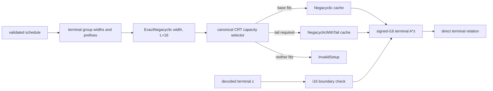

# Spec: Large-Digit NTT Infrastructure and Terminal Verification

| Field | Value |
| --- | --- |
| Author(s) | Quang Dao |
| Created | 2026-07-21 |
| Status | active |
| Branch | `quang/large-inner-basis-infra` |
| PR | pending |
| Supersedes | the 2026-07 large-basis extension notes in `crt-ntt-accumulation-safety.md` |
| Superseded-by | |
| Book-chapter | book/src/foundations/ntt-crt.md |
| Compatibility | internal API cutover and stricter terminal-proof validation; no proof or setup wire change |

## Summary

Akita's balanced inner commitment decomposition was artificially limited by an
`i8` implementation boundary. Mathematically, a balanced base `2^L` digit is in

```text
[-2^(L-1), 2^(L-1) - 1],
```

so `i8` is exact through `L = 8` and `i16` is exact through `L = 16`. This PR
provides the complete arithmetic and prepared-setup infrastructure needed for
large inner bases, with bases 10 and 11 as the immediate target. It does not
change planner policy or generated schedules yet.

The implementation also cuts the terminal verifier's `A * z` relation over to
one signed-`i16` NTT matvec. Decoded terminal coefficients outside `i16` are
rejected; there is no two-pass `i8` fallback. Exact CRT reconstruction is
selected from the actual field, ring degree, matrix width, and signed bound.
The existing homogeneous `i32` CRT profile is retained when sufficient;
otherwise exactly one 14-bit residue modulo 12289 is added. This tail is a
derived, lazy, non-serialized prepared representation.

The branch implements the arithmetic, terminal cutover, SIMD kernels,
exactness selection, lazy verifier warming, unified NTT cache, and removal of
obsolete partial-split/strided kernel families. The final cache API has one
preparation function and two request modes. It derives exactly three physical
layouts: base negacyclic plus cyclic transforms, exact base-only negacyclic
transforms, or exact negacyclic transforms with one i16 tail. CPU cache storage
remains outside protocol and compute-backend traits.

## Intent

### Goal

Provide a single exact, lazy, backend-portable NTT preparation and matvec
contract that supports balanced signed digits through `i16`, use that contract
for the verifier's terminal `A * z` relation, and delete obsolete commitment
kernel surfaces without changing proof bytes, transcript semantics, or setup
serialization.

### Supported digit classes

`L` denotes `log_basis` for balanced base `2^L` decomposition.

| `L` | Exact interval | Storage | Immediate use |
| ---: | --- | --- | --- |
| `1..=8` | `[-2^(L-1), 2^(L-1)-1]` | `i8` | existing prover commitment paths; newly includes L7/L8 |
| `9..=16` | `[-2^(L-1), 2^(L-1)-1]` | `i16` | large-basis infrastructure and terminal relation |
| `10` | `[-512, 511]` | `i16` | target inner basis |
| `11` | `[-1024, 1023]` | `i16` | target inner basis |
| `16` | `[-32768, 32767]` | `i16` | terminal decoded-witness acceptance class |

The first basis that requires `i16` is `L = 9`, not `L = 7`. Storage width is
derived from the mathematical interval. Whether a later decomposition is range
checked does not constrain the source `f -> s` decomposition basis.

The implementation supports `L <= 16`; this PR's performance and planner
motivation is specifically `L in {10, 11}`. Bases above 16 require a separate
storage and arithmetic design and are rejected at checked boundaries.

### Exact CRT reconstruction contract

Let:

- `q` be the protocol field modulus;
- `D` be the active negacyclic ring degree;
- `W` be the number of matrix columns accumulated before reconstruction;
- `A = floor(q / 2)` bound each centered matrix coefficient;
- `B` bound the absolute value of every signed RHS coefficient; and
- `P` be the product of the active pairwise-coprime NTT primes.

Each output coefficient of a negacyclic product is a signed sum of at most `D`
products per matrix column. Therefore

```text
|coefficient| <= W * D * floor(q / 2) * B.
```

Centered CRT reconstruction is unique exactly when that interval lies strictly
inside `(-P/2, P/2)`, which is the implemented condition

```text
2 * W * D * floor(q / 2) * B < P.
```

For balanced base `2^L`, the canonical conservative bound is
`B = 2^(L-1)`. For the terminal relation, all decoded coefficients are checked
to fit `i16`, so `B = 2^15 = 32768` (`L = 16`). Capacity arithmetic must be
overflow-safe and shared by preparation, warming, execution, tests, and any
future planner capability check. There must not be separate wrapper formulas or
weaker field/profile-specific approximations.

The canonical base profiles are:

| Field tier | Base residues | Maximum current NTT degree | Optional exactness residue |
| --- | --- | ---: | --- |
| Q32 | `2 x i32` | 2048 | `12289` as `i16` |
| Q64 | `3 x i32` | 1024 | `12289` as `i16` |
| Q128 | `5 x i32` | 512 | `12289` as `i16` |

`12289 - 1 = 3 * 2^12`, so the tail admits a primitive root for every
negacyclic ring degree through `D = 2048`. It is coprime to every base profile
prime and adds about 13.59 bits of reconstruction range. It is preferred over
another 30-bit prime because it adds exactly the range current L10/L11 and
terminal schedules need while adding only two bytes per cached coefficient.

At each field tier's maximum supported degree, the exact safe widths for the
two target bases are:

| Profile | `D` | L10 base | L10 with tail | L11 base | L11 with tail |
| --- | ---: | ---: | ---: | ---: | ---: |
| Q32/2xi32 | 2048 | 255 | 3,145,624 | 127 | 1,572,812 |
| Q64/3xi32 | 1024 | 127 | 1,572,760 | 63 | 786,380 |
| Q128/5xi32 | 512 | 15 | 196,592 | 7 | 98,296 |

The selector always chooses the minimum exact representation:

1. use the base profile if the strict inequality holds;
2. otherwise use the base profile plus 12289 if that inequality holds;
3. otherwise reject the schedule/setup rather than aliasing or guessing.

The tail is not attached merely because the input type is `i16`. A narrow Q32
`i16` matvec may be base-only, while a wide Q128 L10 matvec may require the
tail. Conversely, an `i8` schedule must not construct a tail merely because the
implementation is capable of doing so.

### Terminal verifier contract

The terminal relation accepts one coefficient class and one arithmetic path:

```text
decoded z coefficient -> checked i16 -> exact negacyclic NTT matvec -> A * z
```

For every terminal group, the verifier:

1. validates the schedule and proof shapes;
2. decodes the folded witness;
3. rejects any coefficient outside `[-32768, 32767]` with `InvalidProof`;
4. derives the terminal `A` matrix prefix and width from canonical group
   parameters;
5. selects the exact base-or-tail representation with `B = 32768`;
6. uses the prepared negacyclic matrix to compute `A * z`; and
7. compares it to the challenge-folded predecessor-bound `t` relation.

There is no retained `i8` fallback and no split-radix verifier path. The cache is
warmed after schedule resolution and before transcript replay, the earliest
point at which field, ring degree, group widths, and matrix prefixes are all
known. Arithmetic performs cache lookup only.

Verifier-reachable preparation and matvec code must return `AkitaError` for an
invalid ring degree, unsupported field profile, undersized setup prefix,
overflowed shape product, mismatched runtime type, poisoned cache, or
unsupported capacity. It must not panic, use unchecked caller-controlled
indexing, or allocate from an unvalidated descriptor.

### Unified NTT cache contract

The final caller-selected preparation API has two modes:

```rust
pub enum NttCacheMode {
    BothTransforms,
    ExactNegacyclic { width: usize, log_basis: u32 },
}

pub fn prepare_ntt_cache<F, const D: usize>(
    matrix: RingMatrixView<'_, F, D>,
    mode: NttCacheMode,
) -> Result<PreparedNttCache<D>, AkitaError>;
```

`BothTransforms` is the prover quotient/commitment representation: base-profile
negacyclic and cyclic transforms are both present. `ExactNegacyclic` is the
bounded signed-coefficient representation: it validates `width` and
`log_basis`, derives `B = 2^(log_basis-1)`, and selects base-only or base plus
tail from the canonical inequality.

The three supported prepared layouts are named:

| Layout | Negacyclic base | Cyclic base | i16 tail | Consumer |
| --- | --- | --- | --- | --- |
| `BothTransforms` | required | required | absent | prover quotient/commitment kernels |
| `Negacyclic` | required | absent | absent | exact base-only matvec |
| `NegacyclicWithTail` | required | absent | required | exact matvec needing 12289 |

There is deliberately no cyclic-only layout and no cyclic-plus-tail layout.
The protocol has no consumer for either. Constructors remain private, and a
cheap internal validation checks the option combination and vector lengths at
the preparation boundary.

Field-profile erasure uses one enum. Each variant owns the same logical fields;
the CRT limb count remains statically typed:

```rust
pub enum PreparedNttCache<const D: usize> {
    Q32 {
        neg: Vec<CyclotomicCrtNtt<i32, Q32_NUM_PRIMES, D>>,
        cyc: Option<Vec<CyclotomicCrtNtt<i32, Q32_NUM_PRIMES, D>>>,
        params: CrtNttParamSet<i32, Q32_NUM_PRIMES, D>,
        tail: Option<PreparedI16Tail<Q32_NUM_PRIMES, D>>,
        exact: bool,
    },
    // Q64 and Q128 have the same fields with their canonical limb counts.
}
```

`PreparedI16Tail` is public only because `PreparedNttCache` crosses crate
boundaries; it is hidden from documentation and its fields and construction
remain private. It keeps the 12289 parameters, negacyclic tail transforms, and
mixed reconstruction constants together. The base and tail remain physically
homogeneous arrays so scalar, AVX2, AVX-512, NEON, Metal, and CUDA
implementations can choose native kernels independently. There is no public
mixed-residue element type.

Runtime `D` erasure uses standard Rust type erasure:

```rust
Arc<dyn Any + Send + Sync>
```

with a stored runtime ring degree and checked
`downcast_ref::<PreparedNttCache<D>>()`. A mismatch returns `InvalidSetup`.
Duplicated const-generic `Any` enums, ring-degree macros, and pointer casts are
removed.

The derived cache stores one entry per matrix/ring-degree and strongest required
layout, with covering-prefix reuse. Schedule warming coalesces all terminal
groups before construction:

- if every group is base-only, build one `Negacyclic` prefix;
- if any group needs the tail, build one `NegacyclicWithTail` object whose base
  prefix covers every group but whose tail prefix covers only the largest
  tail-requiring group;
- never build separate base and tail copies of the same base transforms;
- repeated warm calls and smaller prefixes reuse the existing covering entry.

Accordingly, the private tail vector may be shorter than the mandatory base
vector. Validation requires it to be a prefix of the same coefficient matrix
and no longer than the base vector. This avoids materializing 12289 transforms
for a larger base-only group merely because another, smaller group needs the
tail.

The physical storage key is the derived layout, not the raw requested
`(width, log_basis)`. Requests with different bounds that select the same
layout share a cache. `NttCacheKey` continues to describe matrix geometry;
`NttCacheMode` describes requested work; layout is derived internally.

Prepared transforms, twiddles, and reconstruction constants are derived from
the canonical coefficient setup. They do not affect setup serialization,
equality, transcript bytes, proof bytes, or setup digests.

### Backend boundary

Protocol code requests named compute work and must not inspect CPU cache
variants. The prover's `ComputeBackendSetup::with_ntt_slot` hook and the
delegating CPU pass-through expose `PreparedNttSlotAny` as if the CPU cache were
a backend contract; both are removed.

The CPU prepared setup may store the erased `PreparedNttCache` internally.
Downstream Metal/CUDA/custom backends remain free to prepare an equivalent
layout without implementing Akita's CPU structs or reproducing its cache
registry. Correctness is the named operation output plus the exactness
contract, not a particular row-major/AoS/SoA buffer.

The final implementation uses separate homogeneous base and tail vectors. This
preserves the existing mixed-matvec arithmetic while allowing the tail prefix
to be shorter than the base prefix. Future private tiling or batching may
change that physical layout, but it must preserve the single public cache
contract and the exactness selector.

### Invariants

1. Balanced decomposition round-trips exactly for every supported field,
   `D`, and `L <= 16`; every digit lies in the stated asymmetric interval.
2. `L <= 8` uses `i8`; `9 <= L <= 16` uses `i16`. No caller-maintained cap may
   disagree with this mapping.
3. Every CRT reconstruction uses the same strict capacity inequality and the
   product of the residues actually materialized.
4. The optional 12289 tail is selected only when the base product is
   insufficient and is rejected if base plus tail is still insufficient.
5. Matrix and RHS ring degrees are never assumed equal across unrelated A/B/D
   roles. Every prepared entry is keyed and typed by its own `D`.
6. The terminal verifier always uses signed-`i16` arithmetic and rejects wider
   decoded coefficients. It never falls back to two `i8` matvecs.
7. Verifier schedule warming happens before transcript replay and performs no
   proof-dependent acceptance beyond validated schedule/setup capability.
8. A base-only schedule constructs no tail parameters, twiddles, transforms,
   or cache entries. A tail schedule constructs exactly one additional residue
   per coefficient in the largest tail-required matrix prefix, not the largest
   base-only prefix.
9. One prepared base prefix is shared when a schedule contains both base-only
   and tail-requiring terminal groups.
10. Cyclic transforms are present exactly for `BothTransforms`; exact
    negacyclic modes never allocate them.
11. Prepared caches are derived and non-serialized. Proof, transcript, setup,
    and descriptor bytes remain unchanged.
12. Scalar, AVX2, and NEON implementations are differential-equivalent.
    AVX-512-capable hosts may use the supported AVX2 i16 path unless a dedicated
    AVX-512 kernel is separately measured and added. Accelerated kernels are
    optional; scalar behavior is authoritative.
13. Verifier-reachable malformed inputs fail with `AkitaError` and do not
    panic.
14. The cache API has one canonical constructor and one canonical exactness
    selector. No thin builder aliases or parallel base/capability wrappers
    remain.
15. Protocol and backend traits do not expose CPU-specific prepared-cache
    types.
16. Existing valid i8 schedules preserve results and avoid the extra prime.
17. Removing partial-split, strided, and wrapper surfaces does not remove any
    production caller or supported protocol mode.

### Non-Goals

1. Enabling planner emission of L10/L11 schedules or regenerating schedule
   catalogs. That is a follow-up once the planner proves those schedules
   Pareto-optimal under the canonical capability and security contracts.
2. Supporting balanced bases above 16 or coefficients wider than `i16` in the
   terminal relation.
3. Adding the tail unconditionally to Q64/Q128 or to every `i16` operation.
4. Replacing a base 30-bit prime with multiple 14-bit primes. The production
   profile remains a homogeneous `i32` prefix plus an optional exactness tail.
5. Restoring partial-split NTT multiplication, strided digit kernels, or legacy
   verifier fallbacks.
6. Changing the proof format, transcript labels/order, Fiat-Shamir sampling,
   setup seed, serialized setup, generated descriptor shape, or public claims.
7. Requiring AVX-512, AVX2, NEON, Metal, or CUDA for correctness.
8. Standardizing a GPU buffer layout in this PR. The interface must permit one,
   but the CPU layout remains an implementation detail.
9. Reworking planner/security pricing beyond exposing the one canonical
   implementability contract needed by the follow-up planner PR.
10. Adding a protocol-level benchmark fixture. This PR measures the NTT matvec
    kernel directly so rank, ring degree, accumulation width, digit storage,
    and exactness-tail selection can be varied independently.

## Architecture and Change Surface

### Execution flow



### Implemented branch surface

This inventory describes the implementation through code head
`63138d816fd5fa8d1205705c3972296703cfe396`, based on
`e131faf48938b975ca63b12b59ac6d86894048e0`. At that checkpoint the complete
merge-base diff changed 72 files with 3,686 insertions and 3,498 deletions. A
subsequent documentation-only commit may change the final head and line count
without changing this implementation inventory.

| Area | Before | Current branch state | Consequence |
| --- | --- | --- | --- |
| Balanced decomposition | dedicated i8 params; `L <= 6` artificial cap | shared signed decomposition core; i8 through L8 and i16 through L16 | exact L10/L11 digit generation exists without duplicating the decomposition algorithm |
| Digit LUT | fixed behavior documented around L6 | 256-slot i8 table initializes only the active balanced range | L7/L8 stay on the faster/smaller existing i8 path |
| Tail prime | base i32 profiles only | canonical 12289 i16 NTT prime | exact capacity can grow by ~13.59 bits without another 30-bit limb |
| i16 NTT | scalar/partial backend support only | AVX2 forward/inverse and direct 16-lane Montgomery operations; optimized NEON pointwise operations; scalar fallback | tail work has accelerated CPU kernels and differential tests |
| Mixed CRT arithmetic | no base-plus-tail representation | i32 prefix plus i16 tail, affine final Garner digit, signed-i16 matvec | exact reconstruction supports boundary and negative i16 values |
| Capability selection | base profile and chunk-width helpers were separate from tail choice | overflow-safe selector evaluates the exact strict bound and chooses base/tail/error | cache allocation follows mathematical need |
| Verifier terminal A relation | split/legacy i8-oriented implementation | decoded z narrows to i16; one i16 NTT matvec for every terminal | wider folded witnesses are rejected and two-pass radix work is removed |
| Verifier cache timing | first-use preparation possible in arithmetic | schedule-level warm before transcript replay | terminal arithmetic performs lookup only |
| Verifier cache geometry | one prefix assumption across groups | canonical per-group A prefix; warm derives terminal groups from final fold params | multi-group schedules prepare the actual terminal layout |
| Partial-split NTT | 815-line alternative representation plus tests/benches/docs | completely deleted | one supported CRT+NTT arithmetic family remains |
| Strided digit paths | duplicate strided balanced/raw kernels and block-parallel variants | deleted; canonical block-major paths used | smaller kernel surface without removing production behavior |
| Linear wrappers | trusted/pass-through digit matvec wrappers and duplicate modules | removed or called directly through canonical `ntt_matvec` functions | less wrapper slop and fewer call graphs to optimize |
| Sparse-ring A rows | temporary vector of row slices | `RingMatrixView::rows()` used directly | removes an avoidable allocation while preserving sparse sweep behavior |
| Unified prepared cache | parallel base/capability enums, duplicate builders, custom runtime-D erasure | one `NttCacheMode`, one `prepare_ntt_cache`, one `PreparedNttCache`, checked `Any` erasure | callers request work while physical layout remains derived and validated |
| Verifier cache prefixes | base and tail entries could duplicate base transforms | one covering base prefix plus the independently largest tail-required prefix | mixed terminal groups neither duplicate the base nor overbuild the tail |
| Backend boundary | compute-backend traits exposed CPU prepared-slot types | CPU owns erased prepared caches internally; protocol/backend traits request named work | downstream Metal, CUDA, and custom backends do not implement CPU cache structs |
| Docs/profile artifacts | L6 and partial-split assumptions | L8 i8 range, i16 mapping, exact bound, tail behavior, cache layouts, and removed baselines documented | repository narrative matches the new arithmetic contract |

Primary implemented files:

- `crates/akita-algebra/src/ring/cyclotomic/decomposition.rs`: shared signed
  decomposition and i16 APIs.
- `crates/akita-algebra/src/ntt/`: 12289 table plus AVX2/NEON/scalar i16 work.
- `crates/akita-algebra/src/ring/crt_ntt_repr/`: homogeneous base operations,
  private base-plus-tail reconstruction, and signed matvecs.
- `crates/akita-types/src/ntt_cache.rs`: canonical exactness selector, unified
  preparation API, prepared layouts, checked type erasure, and verifier cache.
- `crates/akita-types/src/proof/setup.rs`: derived verifier-cache access.
- `crates/akita-verifier/src/protocol/core/terminal_{direct,ntt}.rs`: i16
  boundary and terminal relation kernel.
- `crates/akita-verifier/src/protocol/core/verify.rs`: schedule-level warming.
- `crates/akita-prover/src/kernels/linear/`: canonicalized i8 kernel surface.
- `crates/akita-pcs/benches/ring_ntt.rs`: residue, mixed matvec,
  reconstruction, LUT, terminal, and cache-construction comparisons.
- `crates/akita-pcs/benches/ntt_matvec.rs`: rank, width, ring-degree, common
  basis, and equal-I/O scaling grid.

### Final cache-refactor surface

| File/area | Final state |
| --- | --- |
| `akita-types/src/ntt_cache.rs` | `NttCacheMode`, `PreparedNttCache`, and `prepare_ntt_cache` own request validation, exact layout derivation, coalesced verifier prefixes, checked `Any` downcasts, and cache-byte accounting |
| `akita-types/src/lib.rs` | exports the unified cache surface and canonical base-profile selector; removed capability/profile/slot families have no aliases |
| `akita-types/src/proof/setup.rs` | requests an exact negacyclic prefix by `(base prefix, tail prefix, width, log_basis)` without exposing a physical profile enum |
| `akita-algebra/src/ring/crt_ntt_repr/mixed.rs` | keeps only `I16TailParams` and one shape-checked operation over separate base and tail slices; the public aggregate element type is gone |
| `akita-algebra/src/ring/crt_ntt_repr/ops.rs` | owns the homogeneous signed-i16 matvec and common SIMD pointwise dispatch |
| `akita-verifier/src/protocol/core/terminal_ntt.rs` | coalesces terminal group requirements during warm-up and invokes the unified signed-i16 cache operation |
| `akita-prover/src/compute/` | CPU caches use checked standard type erasure internally; compute-backend traits and delegating wrappers no longer expose prepared NTT slots |
| prover linear kernels | consume typed prepared caches inside CPU execution and call canonical algebra operations directly |
| tests/benches/docs | cover layout selection, prefix reuse, type mismatch rejection, scaling, cache construction, and final vocabulary |

The stable vocabulary is:

- request: `NttCacheMode`;
- modes: `BothTransforms`, `ExactNegacyclic`;
- prepared object: `PreparedNttCache`;
- derived layouts: `BothTransforms`, `Negacyclic`,
  `NegacyclicWithTail`;
- hidden tail payload: `PreparedI16Tail`;
- mixed reconstruction parameters: `I16TailParams`.

Neither tail type exposes a second caller-selectable cache family.

Do not preserve removed names as aliases. Akita makes no backward-compatibility
guarantee, and aliases would recreate the ambiguity this refactor removes.

## Evaluation

### Acceptance Criteria

Implementation criteria completed on the current branch:

- [x] Balanced i8 decomposition supports L7 and L8 with exact round-trip.
- [x] Balanced i16 decomposition supports L10 and L11 with exact intervals and
      round-trip.
- [x] The exact selector uses overflow-safe arithmetic and the strict
      `2 * W * D * floor(q/2) * B < P` bound.
- [x] A single 12289 i16 tail is available for Q32, Q64, and Q128 at every
      field-supported ring degree.
- [x] Mixed/base i16 matvecs match schoolbook ring arithmetic for Q32, Q64,
      Q128, D64/D128, negative values, zero, `i16::MIN`, and `i16::MAX`.
- [x] AVX2 i16 transform/pointwise operations have scalar differential tests;
      NEON uses direct i16 lanes where measured beneficial and scalar fallback
      remains available.
- [x] Terminal verification always uses the i16 NTT relation and rejects
      decoded values immediately outside i16.
- [x] Terminal cache capability is warmed from the validated schedule before
      transcript replay.
- [x] Tests show a narrow Q32 i16 terminal matvec remains base-only and a Q128
      terminal case materializes exactly one tail residue.
- [x] Generated q32 D128/D256 terminal schedules are checked to require the
      tail under their full-i16 widths.
- [x] Partial-split NTT implementation, baselines, tests, and callers are
      removed.
- [x] Strided balanced/raw digit kernels and unnecessary matvec wrappers are
      removed.
- [x] Sparse-ring row traversal avoids the temporary row-slice allocation.
- [x] Book foundations/verification prose and the generated CRT capacity
      artifact reflect i8-through-L8 and exact i16 capability.
- [x] Replace the transitional cache families with `NttCacheMode`, one
      `prepare_ntt_cache`, and `PreparedNttCache`.
- [x] Represent exactly the three supported layouts and reject every other
      option combination at the private construction boundary.
- [x] Replace runtime-D enum macros and pointer casts with checked `Any`
      downcasts; add mismatch/no-panic tests.
- [x] Coalesce multi-group terminal warm requirements into one cache object
      with the largest required base prefix and the independently largest
      tail-required prefix, without duplicating base transforms or overbuilding
      tail transforms.
- [x] Prove by instrumentation/tests that base-only/i8 schedules construct no
      tail and no unused cyclic transforms; tail schedules construct the tail
      only once.
- [x] Remove `CrtAccumulationProfile`, `ProtocolCrtNttCapability`, all
      `Prepared*Ntt*Any` transitional enums, public mixed aggregate types, and
      duplicate builder functions.
- [x] Remove `ComputeBackendSetup::with_ntt_slot` and its delegating wrapper so
      CPU prepared-cache types do not constrain downstream backends.
- [x] Preserve the measured separate-base/tail terminal arithmetic across the
      cache refactor and add benchmarks for all three final cache layouts.
- [x] Add a dedicated Q128 NTT-matvec benchmark that sweeps rank, ring degree,
      and accumulation width across the production i8/L8 path and unified i16
      L8/L10/L11 paths, without a protocol fixture.

Final merge evidence still required:

- [ ] Run complete generated-schedule drift checks and confirm this PR changes
      capability tests but not catalog policy/output.
- [x] Run every locally available cheap repository preflight check on the final
      documentation head; record unavailable tools explicitly.
- [ ] Complete feature-matrix Clippy, focused, broader, no-panic, and relevant
      portability checks on the final refactored head.
- [ ] Update the spec header to the PR number and `implemented` only when every
      required criterion is complete.

### Testing Strategy

Arithmetic differential coverage must use independent coefficient-form ring
arithmetic, not another CRT path, as the oracle.

| Property | Coverage |
| --- | --- |
| digit interval and recomposition | L7/L8 i8; L10/L11 i16; field boundary coefficients; every supported field width |
| NTT backend equivalence | scalar versus AVX2 for production 12289; NEON differential coverage for the same i16 arithmetic class at 13697; forward/inverse round-trip; pointwise accumulation; negative Montgomery representatives |
| CRT exactness | widths immediately below/at/above base capacity; base-plus-tail capacity; strict inequality boundary |
| signed matvec | Q32/Q64/Q128; multiple D values; zero columns; multiple rows; `i16::MIN`, `i16::MAX`, -1, 0, 1, L10/L11 extremes |
| malformed shapes | RHS length mismatch, matrix-prefix undersize, multiplication overflow, unsupported D/profile, runtime downcast mismatch |
| cache allocation | `BothTransforms` has cyclic/no tail; `Negacyclic` has neither optional payload; `NegacyclicWithTail` has tail/no cyclic |
| cache laziness | base-only schedule allocates no tail; repeated/smaller warms reuse; mixed-profile schedule owns one shared base prefix and one tail |
| verifier boundary | coefficients at i16 endpoints accepted; one beyond either endpoint rejected without panic |
| protocol | single- and multi-group commit/open/verify; terminal A relation matches direct ring arithmetic; tampered terminal witness rejected |
| catalog | every generated terminal has a supported exact capability; generator drift is clean; no new L10/L11 entries in this PR |
| portability | scalar-only build; x86 AVX2 on AVX2/AVX-512-capable hosts; aarch64 NEON; no backend trait dependency on CPU cache structs |

### NTT matvec benchmark

`crates/akita-pcs/benches/ntt_matvec.rs` is the canonical scaling benchmark for
this PR. It uses the production Q128 field and holds two axes fixed while
sweeping the third:

| Group | Ring degrees | Ranks | Accumulation widths |
| --- | --- | --- | --- |
| `rank_ring_dim` | 64, 128, 256, 512 | 1, 2, 4, 8 | 128 |
| `width` | 64 | 4 | 128, 256, 512, 1024 |
| `equal_output/output512` | 64, 128, 256, 512 | 8, 4, 2, 1 | 128, 256, 512, 1024 |
| `equal_io/input65536_output512` | 64, 128, 256, 512 | 8, 4, 2, 1 | 1024, 512, 256, 128 |

The rank and width grids measure the existing prover i8/L8 path and the unified
signed-i16 path at L8, L10, and L11. The equal-output and equal-I/O grids compare
i8 and i16 at every common L2..L8 basis, then measure the i16-only L10/L11
cases. Common-basis cases use identical digits and must produce identical
outputs before timing begins. The benchmark label records whether the exact
i16 selector chose the base residues alone or the optional 12289 tail. Matrix
generation and prepared-cache construction are outside the timed region. Digit
validation and transformation, pointwise matrix accumulation, inverse
transforms, CRT reconstruction, and output allocation are inside it.

The equal-output group compares D64/rank-8, D128/rank-4, D256/rank-2, and
D512/rank-1, which all return 512 field coefficients, at widths 128 through
1024. Its scalar input therefore grows with D. `input65536_output512` also
fixes the scalar input at 65,536 coefficients by using widths 1024, 512, 256,
and 128 as D grows. Both groups compare i8 and i16 at every common L2..L8
basis, then measure the i16-only L10/L11 cases. This separates raw digit
storage and conversion effects from CRT-tail selection and from changes in the
scalar problem size. Criterion uses 10 samples, a 200 ms warmup, and a 1 second
measurement window to keep the large matrix practical.

Criterion reports throughput in coefficient-products, `rank * width * D`, so
results across shapes can be normalized without hiding their absolute
latency. Run the complete groups or one representative shape with:

```bash
cargo bench -p akita-pcs --bench ntt_matvec -- rank_ring_dim
cargo bench -p akita-pcs --bench ntt_matvec -- width
cargo bench -p akita-pcs --bench ntt_matvec -- equal_output
cargo bench -p akita-pcs --bench ntt_matvec -- equal_io
cargo bench -p akita-pcs --bench ntt_matvec -- d64_r4_w128
```

This benchmark is kernel evidence, not a protocol performance claim. Protocol
profiling remains the responsibility of the existing `examples/profile`
harness after planner-emitted L10/L11 schedules exist.

Verifier fuzz/no-panic coverage must include malformed serialized terminal
witnesses and descriptors that maximize claimed lengths before boundary
validation. Allocation sizes are derived only after schedule/setup shape checks.

### Performance and memory

Measurements in this section are local Apple Silicon/NEON evidence, not
cross-machine release claims. The first table records the pre-unification
decision checkpoint that selected the mixed-width arithmetic:

| Operation | Base/reference | i16/mixed | Result |
| --- | ---: | ---: | ---: |
| one D64 forward+inverse residue | i32 196.1 ns | i16/12289 264.9 ns | 1.35x per residue |
| production Q128 D64 cached 8x128 matvec | 5xi32+i8 281-360 us | 5xi32+1xi16+i16 321-395 us | +9.8% to +14.0% |
| terminal Q128 D64 8x128 full kernel | two radix-64 i8 passes 281.4 us | one mixed i16 pass 191.0 us | 32.1% faster |

The first matvec comparison isolates the cost of the sixth residue. The
terminal comparison is decision-relevant: it includes digit handling, RHS
transforms, pointwise work, inverse transforms, reconstruction, and radix
scaling. Absolute D64 timings were bimodal; relative pairs are the useful local
signal.

The current affine tail-digit reconstruction improved a D32 diagnostic mixed
reconstruction by 10.5% and cached matvec by 5.5%. NEON eight-lane direct i16
pointwise multiplication is retained; applying the same approach throughout
dependency-heavy D64 butterflies regressed round-trip time by about 8%, so the
measured four-lane widening transform remains.

The final implementation head `63138d816fd5fa8d1205705c3972296703cfe396`
added D64/D128/D256/D512 equal-I/O coverage. A diagnostic run used the checked-in
Criterion settings: 10 samples, 200 ms warm-up, and a 1 second measurement
window. Comparing ordinary NEON dispatch with a separate process using
`AKITA_SCALAR_NTT=1` produced these medians for the Q128 L10 tail path:

| Equal-I/O shape | NEON dispatch | Forced scalar | Scalar / NEON |
| --- | ---: | ---: | ---: |
| D64/rank-8/width-1024 | 12.30 ms | 21.67 ms | 1.76x |
| D128/rank-4/width-512 | 10.01 ms | 14.99 ms | 1.50x |
| D256/rank-2/width-256 | 7.29 ms | 17.86 ms | 2.45x |
| D512/rank-1/width-128 | 7.92 ms | 15.96 ms | 2.01x |

This shows that the available NEON kernels materially accelerate the complete
matvec. It does not establish a stable ranking between ring degrees. The same
D512 NEON case measured 3.24 ms in an earlier invocation on the shared host,
and several intervals were broad. Optimization decisions require longer,
alternating paired runs on an otherwise idle machine.

The existing D64 single-residue microbench gave a different signal:

| Forward plus inverse | NEON dispatch | Forced scalar | NEON / scalar |
| --- | ---: | ---: | ---: |
| i32 base residue | 1.313 us | 1.180 us | 1.11x |
| i16 residue modulo 12289 | 0.954 us | 0.861 us | 1.11x |

At this checkpoint the complete matvec therefore benefits from SIMD even
though the isolated transform did not. The likely source is the mature NEON
pointwise path: i32 processes four lanes and i16 processes eight, whereas the
i16 transform uses four-lane widening and scalar `len = 2, 1` stages. This is a
profiling hypothesis, not a demonstrated attribution.

For 256 prepared D256 rings in a debug construction diagnostic:

| Profile | Base | Base plus tail | Exact byte delta |
| --- | ---: | ---: | ---: |
| Q64 | 31.38 ms / 786,432 B | 45.98 ms / 917,504 B | 131,072 B |
| Q128 | 50.72 ms / 1,310,720 B | 65.37 ms / 1,441,792 B | 131,072 B |

The byte delta is exactly `256 * 256 * 2`. Relative cache growth is 25% for
Q32, 16.7% for Q64, and 10% for Q128. Serialized setup growth is zero.

`ring_ntt` also benchmarks construction of the final `BothTransforms`, exact
base-only, and exact base-plus-tail layouts over 1,024 production D64 rings.
`PreparedNttCache::cache_bytes` and allocation tests establish structural
footprint: a tail adds exactly `tail_prefix_len * D * 2` bytes, and base-only
schedules allocate zero tail bytes. Cache construction may grow only in
proportion to transforms actually requested.

### Deferred kernel hypotheses and future work

These items are deliberately outside this PR. They are hypotheses to test with
component benchmarks before changing arithmetic or prepared layout.

| Direction | Hypothesis and required evidence |
| --- | --- |
| component benchmark grid | Add forward, inverse, pointwise, LUT conversion, reconstruction, and complete-matvec measurements for D64/D128/D256/D512, i32 base primes, and production 12289. Use longer alternating SIMD/scalar runs before drawing a ring-degree conclusion. |
| NEON i16 small stages | A fused vector forward tail for `len = 2, 1` can remove `D` scalar Montgomery products per RHS transform and the final full-array reduction. A vector inverse head should be evaluated separately because terminal widths make forward work dominant. |
| NEON lane scheduling | Unrolling independent four-lane widening operations may hide multiply latency without the D64 regression observed for blanket eight-lane butterflies. Test eight-lane direct arithmetic first on streaming twists and then only on selected wide stages. |
| batched RHS columns | Preparing and accumulating several columns together may reduce accumulator traffic and expose independent Montgomery chains, especially for rank-1 D512. Measure register pressure and temporary-cache footprint for each field tier. |
| validated LUT access | `CenteredMontLut` exactly covers the data-derived bound, so an internally unchecked lookup after boundary validation may remove redundant per-coefficient `Option` handling. Preserve verifier rejection at the outer boundary. |
| AVX2 i32 stages | The pointwise path already has an eight-lane Montgomery primitive. Evaluate eight lanes for transform stages `len >= 8`, four lanes at `len = 4`, and the existing fused tail. |
| AVX2/AVX-512 i16 | Replace AVX2 scalar stages below `len = 16` with width-aware or fused stages before considering a 32-lane AVX-512BW kernel. AVX-512 frequency effects require machine-specific measurement. |
| backend tests | Extend production-prime i16 differential tests through D512, add D512 AVX-512 transform coverage, and keep scalar arithmetic authoritative. |

No future optimization may bake one common ring degree into the abstraction,
make the tail unconditional, expose CPU storage through backend traits, or
weaken the verifier no-panic boundary.

### Validation status

- Formatting, focused algebra/prover/verifier/config tests, `single_poly_e2e`,
  documentation guardrails, and generated all-schedules drift completed during
  earlier implementation checkpoints.
- The documentation-completion commit passed `cargo fmt --all --check`, both
  Rust line-cap checks, all 28 script unit tests, dependency-hygiene checks for
  `akita-verifier`, `akita-prover`, `akita-config`, `akita-planner`, and
  `akita-setup`, `typos`, and the documentation guardrails. The guardrail script
  skipped its optional mdBook build because `mdbook` is not installed.
- `taplo fmt --check` and `cargo machete --with-metadata` were attempted but
  could not run because `taplo` and `cargo-machete` are not installed in the
  local environment.
- This documentation pass does not rerun the full test suite or Clippy matrix.
- Full generated-schedule drift, feature-matrix Clippy, broader tests, and
  portability remain merge-gate evidence rather than claims of this
  documentation pass.

All live commands used as final evidence must be polled to a real exit code.

## Alternatives Considered

### Keep splitting terminal coefficients into i8 passes

Rejected. It duplicates matrix work, ties verification to a decomposition
radix, and was 32.1% slower in the representative D64 terminal benchmark. The
verifier's semantic class is signed i16, so one i16 matvec is simpler and
faster.

### Add another 30-bit prime

Rejected for the current requirement. It adds 20%/33%/50% to Q128/Q64/Q32
base residue bytes, more transform work, and substantially more exactness than
L10/L11 and terminal schedules need. The 12289 tail adds 10%/16.7%/25% and
supports all current degrees.

### Replace one 30-bit prime with two i16 primes

Rejected as the production default. It changes base-profile capacity,
increases prime count, complicates every consumer, and would make even i8
schedules pay mixed-width costs. The optional tail preserves the measured base
profiles and confines heterogeneous work to schedules that require it.

### One homogeneous representation widened for every schedule

Rejected. A universal base-plus-tail cache wastes memory and construction time
for existing i8/base-only schedules. A universal all-i32 representation gives
up the lane density and small incremental footprint of the i16 tail.

### Fully typed cache state machine

Rejected as excessive API surface. Separate types for every field, domain,
exactness, and runtime-D state prevent invalid combinations but proliferate
structs and enums. The chosen middle ground uses one request enum, one prepared
enum, standard `Option`/`Any`, private constructors, and cheap validation.

### Keep the transitional parallel cache families

Rejected. They encode base versus tail twice, duplicate type erasure, require
nested matches in the verifier, and leak CPU storage into backend traits. The
behavior is correct but the abstraction is not maintainable.

### Restore partial-split NTT as a fallback

Rejected. Akita no longer takes that protocol path. Keeping an 815-line
alternative implementation, benchmarks, and wrappers expands the audit and
optimization surface without serving a supported schedule.

## Documentation and Follow-Up

This spec is the canonical in-flight design record for the PR. Before merge:

- keep `book/src/foundations/gadget-decomposition.md` authoritative for the
  digit-width mapping;
- keep `book/src/foundations/ntt-crt.md` authoritative for the reconstruction
  bound and derived cache behavior;
- keep `book/src/how/verification.md` authoritative for the signed-i16 terminal
  acceptance and no-panic boundary;
- regenerate `docs/crt-ntt-capacity-profile.md` only from
  `scripts/gen_crt_capacity_profile.py`;
- remove the superseded 2026-07 extension narrative from
  `specs/crt-ntt-accumulation-safety.md`, leaving a pointer to this spec;
- update this header with the PR number and final status; and
- after the durable content is fully folded into the book, archive this spec
  according to `specs/PRUNING.md`.

The planner follow-up must consume the same signed interval and exact-capacity
primitive, remove artificial inner-basis caps, regenerate catalogs from the
canonical generator, and report the L10/L11 schedule/security/performance
tradeoff. It must not reproduce the capacity formula in planner-local code.

## Reviewer Map

| Review concern | Primary files |
| --- | --- |
| digit mathematics and storage | `crates/akita-algebra/src/ring/cyclotomic/decomposition.rs`, `book/src/foundations/gadget-decomposition.md` |
| prime/order and SIMD arithmetic | `crates/akita-algebra/src/ntt/tables.rs`, `ntt/avx/`, `ntt/neon.rs`, `ntt/butterfly.rs` |
| CRT exactness and reconstruction | `crates/akita-algebra/src/ring/crt_ntt_repr/`, `crates/akita-types/src/ntt_cache.rs` |
| cache API and type erasure | `crates/akita-types/src/ntt_cache.rs`, `crates/akita-types/src/proof/setup.rs` |
| terminal verifier and no-panic behavior | `crates/akita-verifier/src/protocol/core/terminal_direct.rs`, `terminal_ntt.rs`, `verify.rs` |
| backend portability | `crates/akita-prover/src/compute/backend.rs`, `cpu.rs`, `delegating_cpu.rs` |
| dead-code cutover | deleted `partial_split_ntt.rs`; `crates/akita-prover/src/kernels/linear/` |
| schedule capability | `crates/akita-config/src/proof_optimized/tests.rs` |
| benchmarks | `crates/akita-pcs/benches/ntt_matvec.rs`, `crates/akita-pcs/benches/ring_ntt.rs` |
| generated capacity artifact | `scripts/gen_crt_capacity_profile.py`, `docs/crt-ntt-capacity-profile.md` |

## References

- `specs/crt-ntt-accumulation-safety.md` — original exact chunking and
  reconstruction contract (PR #134).
- `specs/crt-ntt-prime-profiles.md` — production base-prime choices and SIMD
  profile history.
- `specs/terminal-direct-ring-relations-cutover.md` — direct terminal relation
  and predecessor-bound `t` semantics.
- `specs/akita-compute-backend-metal.md` — downstream prepared-layout and
  backend-boundary requirements.
- `book/src/foundations/ntt-crt.md` — durable NTT/CRT narrative.
- `book/src/how/verification.md` — verifier acceptance and no-panic contract.
