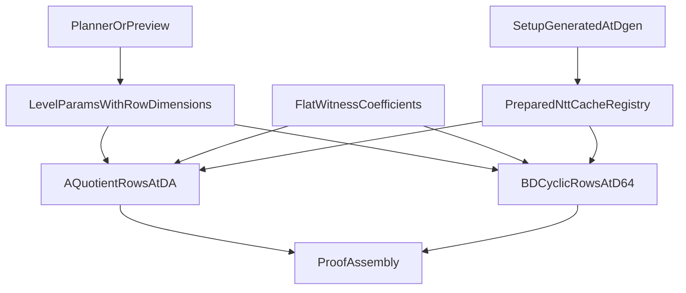

# Mixed Row Ring Dimensions: Implementation Handoff Plan

| Field         | Value |
|---------------|-------|
| Author(s)     | Quang Dao |
| Created       | 2026-06-21 |
| Status        | active |
| Design spec   | [`mixed-row-ring-dimensions.md`](mixed-row-ring-dimensions.md) |
| Branch        | `quang/mixed-row-ring-dimensions` |

## Purpose

This document is the execution handoff for implementing mixed row ring dimensions in Akita.
It is written for an implementation agent that may not have full repo context.

The design spec is authoritative for protocol shape.
This document is authoritative for implementation order, file boundaries, guardrails, and stop conditions.

Do not reopen settled design choices unless a test or benchmark proves they are wrong.

## Execution Summary

Mixed D means one fold level can use a larger ring dimension for A rows while B and D rows stay at D64.

The first implementation target is:

- `D_BD = 64` for B and D rows
- `D_A in {64, 128}` for A rows
- `D_gen = max(D_A, D_BD)` for physical setup generation
- D256 is deferred until D128 is correct and measured

Packet 1 is mandatory before any protocol code changes.
Packet 1 must answer:

1. Does D128 still reduce total proof bytes after the prepared cache cap?
2. Is the win mostly in non-terminal folds or mostly in the terminal tail?
3. Does any mixed D candidate survive the cache cap?

If Packet 1 fails those checks, stop.
Do not implement mixed D.

## Architecture



## Global Rules

Every packet must follow these rules.

- One packet per PR.
- No compatibility aliases or fallback paths for unfinished mixed D shapes.
- No transcript byte changes unless the packet explicitly changes verifier-visible parameters.
- No widening the supported dimension set beyond the packet.
- No unchecked indexing, unchecked slicing, `unwrap`, `expect`, or `panic` in verifier-reachable code.
- Report the exact commands run and the result in the PR description.
- If a packet exposes a larger design problem, stop and write the blocker instead of patching around it.

## Stop Conditions

Stop and report instead of continuing when any of these happen.

- Packet 1 shows no mixed D candidate survives the cache cap.
- Packet 1 shows the proof-size win comes mostly from the terminal tail, not from non-terminal folds.
- A packet needs a new fallback path to keep old and new behavior alive at the same time.
- A packet needs transcript changes that were not planned in the packet.
- Setup envelope math mixes field coefficients, generation-dimension ring slots, and runtime-dimension ring slots.
- A prepared setup request for a small prefix still builds a full shared cache at a larger dimension.
- Homogeneous D64 behavior regresses through the mixed parameter path.

## Packet Order

| Packet | Name | Blocks later work? | Dimension scope |
|--------|------|--------------------|-----------------|
| 1 | Cache-aware planner preview | Yes | D64, D128, D256 in preview only |
| 2 | Mixed parameter types | No | types only, behavior unchanged |
| 3 | Setup generation dimension | No | `D_gen` separation |
| 4 | Prefix-aware prepared setup caches | Yes for Packet 5+ | D64 and D128 caches |
| 5 | Split ring relation by role | Yes for Packet 6 | D64 and D128 relation work |
| 6 | First mixed D128 proof | Yes for Packet 7 | `D_A = 128`, `D_BD = 64` |
| 7 | Planner integration | No | D64 and D128 search |
| 8 | Optional D256 investigation | No | only if Packet 1 and Packet 6 justify it |

Do not start Packet 2 until Packet 1 is complete and its report is attached to the branch or PR.

## Packet 1: Cache-Aware Planner Preview

### Goal

Turn the scratch mixed D preview into a cache-aware report that decides whether protocol work is worth doing.

### May Touch

- `crates/akita-config/src/bin/mixed_d_preview.rs`
- A new checked-in dev tool under `crates/akita-config/src/bin/` if you rename the scratch binary
- Small helper modules used only by the preview tool

### Must Not Touch

- `crates/akita-types`
- `crates/akita-prover`
- `crates/akita-verifier`
- `crates/akita-planner`
- transcript code
- schedule tables

### Required Output

For each `num_vars` in `{20, 22, 24, 26, 28}` print three schedules:

1. homogeneous D64 baseline
2. mixed D with no cache cap
3. mixed D with the hard cache cap

The hard cache cap is:

```text
mixed_prepared_cache_bytes <= min(
    d64_baseline_prepared_cache_bytes * 5 / 4,
    d64_baseline_prepared_cache_bytes + 256 MiB
)
```

For each schedule print:

```text
baseline_total
mixed_total
total_delta
fold_delta
tail_delta
setup_product_delta
other_delta
baseline_cache_bytes
mixed_cache_bytes
cache_delta
```

For each fold level print:

```text
level
D_A
D_BD
log_basis
r_vars
block_len
n_a
n_b
n_d
n_a_times_D_A
num_digits_fold
next_w_len
fold_proof_bytes
tail_bytes_if_terminal
new_cache_bytes
cache_key_count
```

Also print rejected candidates that exceed the cache cap.

### Cache Model

Use unique cache keys across the whole schedule.
Do not charge the same cache once per fold if the prepared setup would reuse it.

Cache key shape:

```text
CacheKey {
    role,
    d,
    natural_ring_len,
    stores_negacyclic,
    stores_cyclic,
}
```

Use exact prefix keys only in Packet 1.
A larger prepared prefix must not serve a smaller request in this model.

Mirror `NttSlotCache` byte accounting from `crates/akita-prover/src/kernels/crt_ntt.rs`.
If the preview cannot call the exact Rust type size, print that cache bytes are modeled and state the assumed bytes per cached ring element.

### Commands

```bash
cargo run -p akita-config --bin mixed_d_preview
```

If the binary is renamed, update this command in the PR description.

### Acceptance

- The report prints `total_delta == fold_delta + tail_delta + setup_product_delta + other_delta`.
- The report states whether savings come from non-terminal folds or the terminal tail.
- The report states whether D128 still wins after the cache cap.
- The report states whether any D256 candidate survives after the cache cap.
- The scratch binary is either committed as a dev tool or removed before the implementation PR.

### Packet 1 Decision Table

| Outcome | Action |
|---------|--------|
| No mixed D survives cache cap | Stop. Do not implement mixed D. |
| Win is mostly tail-only | Stop and reassess before protocol work. |
| D128 survives and win is fold-heavy | Continue to Packet 2. |
| D256 survives but D128 does not | Do not jump to D256 first. Reassess the model. |

## Packet 2: Mixed Parameter Types

### Goal

Represent mixed row dimensions in types without changing prover behavior.

### May Touch

- `crates/akita-types/src/layout/params.rs`
- `crates/akita-types/src/proof/ring_relation.rs`
- serialization and validation for `LevelParams`
- tests near existing `LevelParams` tests

### Must Not Touch

- prover compute backends
- ring relation quotient code
- setup generation
- planner scoring
- verifier protocol replay

### Required Behavior

Add a role-based dimension shape, for example:

```rust
pub struct RowRingDimensions {
    pub d_a: usize,
    pub d_bd: usize,
}
```

Homogeneous D64 must remain:

```text
d_a = d_bd = 64
```

Validation rules:

- supported CRT NTT dimensions only
- `d_a` and `d_bd` divide `D_gen`
- `d_bd = 64` in the first implementation
- `d_a in {64, 128}` in the first implementation

Do not remove `ring_dimension` in this packet unless every call site is updated in the same packet.
Prefer adding the new shape and keeping homogeneous behavior equivalent.

### Commands

```bash
cargo test -p akita-types
cargo clippy --all --message-format=short -q -- -D warnings
```

### Acceptance

- Existing schedules still validate.
- Homogeneous D64 params map to `d_a = d_bd = 64`.
- Invalid `d_a`, invalid `d_bd`, and invalid `D_gen` return errors.
- No prover or verifier behavior changes yet.

## Packet 3: Setup Generation Dimension

### Goal

Separate physical setup generation dimension from runtime row dimensions.

### May Touch

- `crates/akita-types/src/proof/setup.rs`
- `crates/akita-setup/src/lib.rs`
- `crates/akita-config/src/proof_optimized.rs`
- disk persistence under `feature = "disk-persistence"`

### Must Not Touch

- ring relation quotient code
- prepared NTT cache registry
- planner search over `D_A`
- verifier proof replay beyond setup validation

### Required Behavior

Treat `AkitaSetupSeed::gen_ring_dim` as physical `D_gen`.

Rules:

- a D256 generated setup may serve D128 and D64 runtime views
- a D64 generated setup must not serve D128 runtime rows
- setup envelope comparisons must use one unit at a time

Disk cache identity must bind:

- field family
- setup seed
- generation dimension
- max variable count
- max batch count
- setup envelope in generation slots

### Key Existing Code

- `crates/akita-types/src/layout/flat_matrix.rs` for `gen_ring_dim` and `ring_view`
- `crates/akita-setup/src/lib.rs` for cached setup validation against `seed.gen_ring_dim`

### Commands

```bash
cargo test -p akita-setup
cargo test -p akita-config proof_optimized
```

### Acceptance

- Disk cache keys distinguish D64 generated setup from D128 and D256 generated setup.
- Setup validation has no unchecked arithmetic.
- Existing D64 setup generation still works.

## Packet 4: Prefix-Aware Prepared Setup Caches

### Goal

Stop prepared setup from meaning one full shared cache per `D`.

### May Touch

- `crates/akita-prover/src/compute/backend.rs`
- `crates/akita-prover/src/compute/cpu.rs`
- `crates/akita-prover/src/kernels/crt_ntt.rs`
- tests under `crates/akita-prover/src/compute/`

### Must Not Touch

- verifier code
- planner tables
- proof serialization layout
- ring relation assembly logic beyond cache lookup changes

### Required Behavior

Replace the coarse model:

```text
CpuPreparedSetup { ntt_shared: NttSlotCache<D> }
```

with a cache registry keyed by role, dimension, and natural ring length.

Rules:

- build exact prefix caches lazily
- report cache bytes per key and total cache bytes
- keep the homogeneous D64 path working
- use exact prefix keys only
- do not add larger-prefix reuse in this packet

### Key Existing Code

Current full-cache build in `crates/akita-prover/src/compute/cpu.rs`:

```rust
let total = expanded.shared_matrix.total_ring_elements_at::<D>()?;
let ntt_shared = build_ntt_slot(expanded.shared_matrix.ring_view::<D>(1, total)?)?;
```

Cache byte reporting in `crates/akita-prover/src/kernels/crt_ntt.rs`:

```rust
pub fn cache_bytes(&self) -> usize
```

### Commands

```bash
cargo test -p akita-prover compute::
cargo test -p akita-prover kernels::
```

### Acceptance

- A small D128 prefix request does not build a full D128 shared cache.
- Cache byte reporting matches the cache contents.
- Existing dense, one-hot, sparse, and recursive witness commit tests pass.

## Packet 5: Split Ring Relation Work by Role

### Goal

Make quotient computation dimension-safe by construction.

### May Touch

- `crates/akita-prover/src/protocol/ring_relation/relation_quotient.rs`
- `crates/akita-prover/src/compute/plans.rs`
- `crates/akita-prover/src/compute/backend.rs`
- `crates/akita-prover/src/compute/cpu.rs`
- quotient kernel tests

### Must Not Touch

- planner
- schedule tables
- setup seed generation
- verifier unless required for dimension validation only

### Required Behavior

Split the current fused path that uses one `PreparedSetup<D>` for A, B, and D.

Target APIs:

```text
compute_a_quotient_rows<D_A>(...)
compute_bd_cyclic_rows<D_BD>(...)
```

Rules:

- A quotients use `X^D_A + 1`
- B and D cyclic rows use `X^64 + 1`
- row assembly order stays unchanged
- homogeneous D64 output matches old behavior

### Key Existing Code

Current fused relation call in `relation_quotient.rs` uses one `backend.ring_switch_relation_rows::<D>(...)`.
Current CPU implementation passes `&prepared.ntt_shared` into `fused_split_eq_quotients_prover_bounds`.

### Commands

```bash
cargo test -p akita-prover ring_relation
cargo test -p akita-prover kernels::linear
```

### Acceptance

- Schoolbook quotient tests pass for D64 and D128.
- Homogeneous D64 relation tests match old behavior.
- Mixed mode no longer allows one generic `D` for all row groups.

## Packet 6: First Mixed D128 Proof

### Goal

Produce and verify one proof with `D_A = 128` and `D_BD = 64`.

### May Touch

- prover protocol files for commit and ring switch
- verifier protocol files for dimension validation
- `crates/akita-pcs/tests/`
- `crates/akita-types/src/proof_size.rs` and tests

### Must Not Touch

- generated schedule tables
- planner DP integration
- D256 support

### Required Behavior

- one dense singleton mixed proof verifies end to end
- homogeneous D64 through the mixed parameter path still verifies
- proof-size formula matches serialized proof size
- bad dimension metadata is rejected
- bad setup generation dimension is rejected

### Commands

```bash
cargo test -p akita-pcs
cargo test -p akita-types proof_size
./scripts/check-doc-guardrails.sh
```

### Acceptance

- End-to-end D128 A mixed test passes.
- Homogeneous D64 mixed-path test passes.
- Proof-size formula test passes for the mixed shape.

## Packet 7: Planner Integration

### Goal

Move the cache-aware preview logic into the real planner or table-generation path.

### May Touch

- `crates/akita-planner`
- `crates/akita-config`
- generated schedule tooling only if the protocol shape is already stable

### Must Not Touch

- quotient kernels unless required for planner-visible sizing only
- transcript layout
- D256 unless Packet 1 and Packet 6 justify it

### Required Behavior

- search over `D_A in {64, 128}`
- keep `D_BD = 64`
- reject candidates that exceed the cache cap
- print proof-size attribution and cache attribution in planner or profile diagnostics

### Commands

```bash
cargo test -p akita-planner
cargo test -p akita-config
```

### Acceptance

- D64 schedules remain available.
- D128 A schedules are selected only when they survive the cache cap.
- D256 remains disabled unless Packet 1 showed it survives and Packet 6 is stable.

## Packet 8: Optional D256 Investigation

Only do this packet if all of the following are true.

- Packet 1 showed at least one D256 candidate survives the cache cap.
- Packet 6 D128 mixed proof is stable.
- D128 kernel and cache measurements still leave a reason to test D256.

Do not start Packet 8 because D256 looked good in the uncapped preview alone.

## Footguns

### 1. Full Shared Cache At Every Dimension

Symptom:
Mixed D wins on proof bytes but needs multiple full `NttSlotCache` objects for D64, D128, and D256.

Where it happens:
`crates/akita-prover/src/compute/cpu.rs` during `prepare_expanded`.

Wrong fix:
Keep one `PreparedSetup<D>` per dimension and build the whole shared matrix each time.

Right fix:
Prefix-aware cache registry with exact keys and lazy build.

### 2. Quotient Computed At The Wrong Dimension

Symptom:
Proof verifies on homogeneous D64 but fails or becomes inconsistent on mixed D128 A.

Where it happens:
`crates/akita-prover/src/protocol/ring_relation/relation_quotient.rs` and fused quotient kernels.

Wrong fix:
Keep one generic `compute_relation_quotient::<D>` and reinterpret row outputs.

Right fix:
Split A quotient work and B/D cyclic work by role dimension.

### 3. Setup Unit Confusion

Symptom:
Setup appears too small or too large after mixed D lands.
Disk cache reuse looks valid but runtime views fail.

Where it happens:
`flat_matrix.rs`, `proof_optimized.rs`, `akita-setup/src/lib.rs`.

Units to keep separate:

- field coefficients
- generation-dimension ring slots at `D_gen`
- runtime-dimension ring slots at `D_A` or `D_BD`

Wrong fix:
Compare `max_setup_len` at D64 directly with `max_setup_len` at D256.

Right fix:
Convert to one unit before comparison.

### 4. False Proof-Size Wins From Tail Only

Symptom:
Total proof bytes drop, but intermediate fold payloads barely change.

Where it happens:
Packet 1 preview and later planner scoring.

Wrong fix:
Treat any negative `total_delta` as enough reason to implement mixed D.

Right fix:
Require fold-heavy savings or a clearly documented reason the tail-only win still matters.

### 5. Early Fold D128 With Large Setup Prefix

Symptom:
Planner chooses D128 in fold 0 or fold 1 and blows the cache cap.

Where it happens:
Packet 1 and Packet 7.

Wrong fix:
Raise the cache cap until D128 fits.

Right fix:
Reject the candidate and let later folds use D128 when the active setup prefix is small.

### 6. Accidental Transcript Changes

Symptom:
Prover and verifier drift because mixed dimensions were added without binding them in the instance descriptor or schedule digest.

Where it happens:
`LevelParams` serialization, descriptor binding, schedule expansion.

Wrong fix:
Add mixed dimensions only in prover-only structs.

Right fix:
Bind mixed dimensions in verifier-visible parameters in the packet that introduces them.

### 7. Compatibility Shims

Symptom:
The branch adds `_legacy`, `_fallback`, `_old_path`, or dual APIs for the same behavior.

Wrong fix:
Keep both paths to reduce test churn.

Right fix:
Full cutover in the packet that owns the behavior.

## Verification Matrix

Run these checks at the end of every packet that touches code.

| Check | Command |
|-------|---------|
| Format | `cargo fmt -q` |
| Lint | `cargo clippy --all --message-format=short -q -- -D warnings` |
| Tests | `cargo test` |
| Docs | `./scripts/check-doc-guardrails.sh` |

Packet-specific minimum tests:

| Packet | Minimum test scope |
|--------|--------------------|
| 1 | preview command runs and prints attribution |
| 2 | `cargo test -p akita-types` |
| 3 | `cargo test -p akita-setup` |
| 4 | `cargo test -p akita-prover compute::` |
| 5 | `cargo test -p akita-prover ring_relation` |
| 6 | `cargo test -p akita-pcs` |
| 7 | `cargo test -p akita-planner` |

## PR Checklist Template

Each implementation PR should include this checklist.

- [ ] This PR implements exactly one packet.
- [ ] I did not touch files outside the packet boundary.
- [ ] I did not add compatibility shims or fallback paths.
- [ ] I ran the packet minimum tests.
- [ ] I ran `cargo fmt -q`.
- [ ] I ran `cargo clippy --all --message-format=short -q -- -D warnings`.
- [ ] I ran `./scripts/check-doc-guardrails.sh` if specs or book changed.
- [ ] I stated whether the packet exposed a blocker.
- [ ] If this is Packet 1, I attached the cache-aware attribution report.

## References

- Design spec: [`specs/mixed-row-ring-dimensions.md`](mixed-row-ring-dimensions.md)
- Flat setup storage: `crates/akita-types/src/layout/flat_matrix.rs`
- Current prepared setup: `crates/akita-prover/src/compute/cpu.rs`
- NTT cache bytes: `crates/akita-prover/src/kernels/crt_ntt.rs`
- Current quotient path: `crates/akita-prover/src/protocol/ring_relation/relation_quotient.rs`
- Proof-size formulas: `crates/akita-types/src/proof_size.rs`
- D-specific digit sizing: `crates/akita-types/src/sis/norm_bound.rs`
- Setup-prefix context: `specs/setup-prefix-ladder.md`
