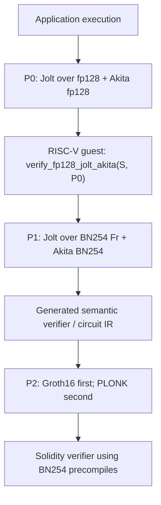
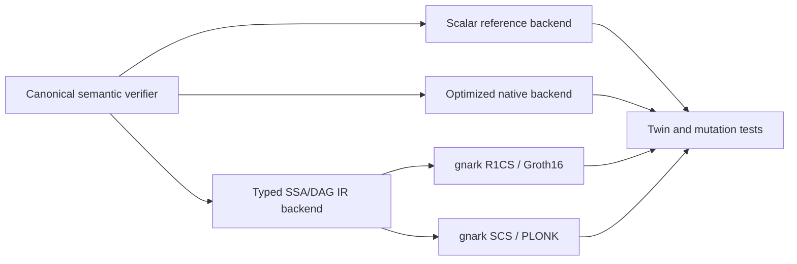

# Spec: Circuit-Oriented BN254 Akita and On-Chain Lattice Jolt

| Field         | Value                    |
|---------------|--------------------------|
| Author(s)     | Quang Dao, Codex         |
| Created       | 2026-09-03               |
| Status        | proposed                 |
| PR            |                          |
| Supersedes    |                          |
| Superseded-by |                          |
| Book-chapter  |                          |

The key words **MUST**, **MUST NOT**, **REQUIRED**, **SHOULD**, **SHOULD NOT**,
and **MAY** in this document are to be interpreted as described in
[BCP 14](https://www.rfc-editor.org/info/bcp14) when, and only when, they appear
in all capitals.

## Summary

This specification proposes an on-chain wrapping pipeline for lattice Jolt. The
application proof remains a fast Jolt proof over the 128-bit Solinas field with
Akita. A second Jolt instance over the BN254 scalar field proves that a RISC-V
program accepted that application proof. A circuit-oriented BN254 Akita profile
makes the second Jolt verifier almost entirely native BN254 field arithmetic.
Finally, a generated Groth16 or PLONK circuit proves that the BN254 Jolt verifier
accepted, and Ethereum verifies only that short outer proof.

The central engineering claim is deliberately narrower than a performance
claim: this route removes the non-native elliptic-curve, extension-field, and
pairing checks that dominate wrapping a Dory verifier. It replaces them with
field arithmetic, range checks, standard-hash gadgets, sparse-challenge
sampling, and a finite setup-MLE base case. That is a materially simpler circuit
surface. Whether the extra field-switch Jolt proof is faster than the current
Dory wrapper is an empirical question and a required decision gate, not an
assumption of this design.

## Intent

### Goal

Build one fixed-profile pipeline that proves, on Ethereum, that a lattice-Jolt
application proof was accepted, while keeping the 128-bit application prover
and using a circuit-generated BN254 Akita verifier rather than hand-maintained
Groth16 or PLONK code.

### Decisions

The first implementation SHOULD make the following choices:

1. The application proof uses the current 128-bit lattice-Jolt path.
2. Field switching is a Jolt proof of a RISC-V verifier program, not a direct
   non-native-field translation into Groth16 or PLONK.
3. The outer Jolt proof uses a purpose-built Akita profile with BN254 `Fr` as
   both its commitment field and its degree-one challenge/evaluation field.
4. The BN254 Akita profile uses uniform power-of-two cyclotomic rings, starting
   with `D = 64`, and a fixed challenge shell with an exact unit-difference
   certificate.
5. The profile uses coordinatewise response bounds and digit range proofs. It
   has no operator-norm rejection sampler and no variable-length terminal
   codec.
6. Direct terminal NTT/CRT work is replaced by a batched matrix-product
   sumcheck whose base case is a small digit MLE and a fixed setup MLE.
7. Schedule, setup seed, transcript, sampler, proof shape, program class, and
   public-input layout are hard-coded into a small number of circuit classes.
8. SHA-256 is the initial standard-hash baseline for both transcripts verified
   inside the wrapper: Jolt's outer transcript and Akita's nested transcript.
   They remain separate, domain-separated states connected by the existing
   statement-challenge bridge. Poseidon is out of scope. Keccak remains
   appropriate for Solidity or an outer PLONK transcript, but is not the
   initial in-circuit proof transcript.
9. One typed semantic verifier emits both concrete checks and a circuit IR.
   Groth16 and PLONK are compiler backends, not separately rewritten
   verifiers.
10. Groth16 is the first on-chain target because fixed circuit classes make a
    circuit-specific setup tolerable and its verifier cost is largely
    independent of circuit size. PLONK follows from the same IR when a universal
    SRS or easier circuit upgrades are more important.

### End-to-end statement

Let `S` be the public application statement. The intended proof stack is:



The on-chain contract accepts only if `P2` proves that the fixed BN254 Jolt
verifier accepts `P1`, whose proved RISC-V execution accepts `P0` for `S`.

The pipeline SHOULD also support a bootstrap mode in which the application is
run directly under BN254 Jolt. That omits `P0` and the field-switch guest, and
is useful for validating the BN254 Akita verifier compiler before paying the
cost of two Jolt proofs. It is not the intended high-performance application
mode.

### Security boundary

The application and field-switch proofs can retain Akita's lattice assumptions,
but the final Groth16 or PLONK proof is pairing-based. The on-chain statement is
therefore **not post-quantum**, even though it certifies a post-quantum proof
stack. `P1` remains useful as a future input to a post-quantum on-chain verifier
or another transparent wrapper.

The public statement MUST bind at least:

- the application program or bytecode digest;
- the public input/output digest;
- the fp128 Jolt and Akita profile identities;
- the BN254 Jolt and Akita profile identities;
- the verifier-guest ELF/program digest;
- the circuit ID and compiler/IR version; and
- the exact outer proof system and verifying key.

No proof-provided schedule, sampler policy, transcript policy, setup geometry,
or relation list may alter the circuit after key generation.

### Invariants

1. **One acceptance program.** The optimized native verifier, scalar reference
   verifier, and circuit emitter MUST execute the same semantic verifier
   program. Backend-specific kernels MAY implement one named primitive, but
   differential tests MUST show that they implement the same operation.
2. **One fixed profile identity.** The circuit ID MUST commit to every value
   that changes the accepted language, including field modulus, ring
   dimensions, challenge shell, transcript, schedule, setup seed, digit widths,
   public inputs, compiler revision, and terminal relation.
3. **Degree-one BN254 challenges.** The circuit profile MUST use BN254 `Fr` for
   proof scalars, sumcheck challenges, opening points, and claimed evaluations.
   It MUST NOT introduce an extension field merely to reuse a small-field
   profile.
4. **Exact sparse challenge law.** The prover and every verifier backend MUST
   derive identical sparse challenges from the transcript. Indices MUST be
   distinct and in range. The first profile uses the injective enumerative
   decoder below; a profile that retains partial Fisher-Yates MUST also prove
   its bounded rejection rule.
5. **Pairwise-unit challenges.** The selected shell MUST have an exact proof
   that every distinct challenge pair has an invertible difference in the
   selected fully split cyclotomic ring.
6. **No operator-norm rejection.** The circuit profile MUST NOT replay the
   fixed-point trigonometric operator-norm predicate. Security and response
   sizing MUST use deterministic shell bounds, starting with the exact `L1`
   bound.
7. **Range, not encoding, proves smallness.** Every terminal and recursive
   digit consumed by the circuit MUST have a fixed signed representation, a
   canonical reconstruction into `Fr`, and an explicit range constraint.
8. **Finite setup closure.** Setup offloading MUST terminate at a fixed,
   circuit-key-bound setup MLE evaluation. It MUST NOT create an unauthenticated
   setup value or an infinite chain of opening claims.
9. **No direct terminal NTT.** The circuit terminal MUST NOT invoke NTT, CRT,
   floating point, architecture-specific prepared caches, Golomb-Rice decode,
   or sparse-ring convolution. Its operations are field arithmetic, Boolean or
   small-range constraints, standard hashing, and fixed-table MLE evaluation.
10. **Transcript parity.** Concrete and symbolic executions MUST emit identical
    ordered event traces and challenges for both the outer Jolt transcript and
    the nested Akita transcript, including the exact bridge challenge, on every
    accepted fixture.
11. **Fail closed.** Malformed proofs, schedules, field encodings, digits,
    sampler traces, setup claims, and circuit inputs MUST reject. The native
    verifier retains Akita's no-panic contract.
12. **No backward-compatibility path.** This profile introduces a new proof,
    schedule, setup, transcript, and circuit identity. It does not decode or
    accept an earlier Akita proof under the new verifier.

### Non-Goals

- Direct verification of an Akita proof in EVM bytecode.
- A post-quantum final on-chain proof.
- Preserving current proof bytes, schedules, setup artifacts, or terminal
  payloads.
- Minimizing unwrapped Akita proof size.
- Minimizing ordinary host verifier latency for the BN254 circuit profile.
- Supporting arbitrary ring dimensions, arbitrary schedules, or arbitrary
  Jolt programs in one circuit.
- Poseidon, MiMC, or another algebraic hash as the circuit transcript.
- Claiming lower end-to-end cost than the Dory wrapper before measurement.

## Evaluation

### Acceptance Criteria

- [ ] `jolt-field::Fr` supports the degree-one `ExtField<Fr>` and
  `MulBaseUnreduced<Fr>` contracts required by Akita, with differential tests
  against arkworks BN254 `Fr`.
- [ ] Akita has a BN254 SIS modulus identity that is not truncated to `u128`,
  and generated security tables cover every matrix role, width, dimension, and
  response bound used by the fixed circuit schedule.
- [ ] An exact checker proves the selected D64 shell's support floor and
  pairwise-unit-difference property over BN254 `Fr`.
- [ ] The fixed sparse sampler has concrete, scalar-reference, symbolic, and
  gnark parity tests for challenge bytes, enumerative indices, magnitudes, and
  signs. The Fisher-Yates fallback also tests swaps and rejection behavior.
- [ ] The fixed Jolt and Akita transcripts use the selected standard-hash
  primitive with separate domain states, and parity tests cover every absorb,
  squeeze, field encoding, and the Jolt-to-Akita bridge challenge.
- [ ] The circuit profile contains no operator-norm predicate and uses only
  verifier-enforced coordinatewise digit bounds.
- [ ] A circuit terminal replaces the current direct terminal NTT path and
  passes a standalone algebraic soundness review.
- [ ] Setup offloading can reach the circuit terminal, and the final fixed
  setup MLE is recomputed in the circuit rather than trusted from the witness.
- [ ] One deterministic, versioned IR is emitted from the canonical semantic
  verifier. Re-emitting the same profile produces an identical IR digest.
- [ ] The concrete optimized verifier, scalar verifier, IR interpreter, gnark
  solver, Groth16 proof, and PLONK proof agree on an accepted corpus and reject
  every single-field mutation in the adversarial corpus.
- [ ] The compiler reports operation counts by source label and protocol layer:
  field multiplication, Boolean/range constraint, Jolt SHA-256 compression,
  Akita SHA-256 compression, sampler swap, setup-MLE multiplication, and public
  input.
- [ ] The bootstrap direct-BN254 Jolt proof is wrapped end to end and accepted
  by generated Solidity contracts for both Groth16 and PLONK.
- [ ] The fp128 verifier guest produces `P1` under BN254 Jolt/Akita, and the
  generated circuit and Solidity contract accept the resulting `P2`.
- [ ] The final benchmark report records `P0` prover time and size, verifier
  guest cycles, `P1` prover time and size, circuit constraints, setup/proving
  key size, `P2` prover time and memory, proof bytes, Solidity bytecode size,
  verification gas, and public-input gas.
- [ ] The final report compares those measurements with the then-current Dory
  wrapper at commit-pinned revisions and states which route wins on engineering
  complexity, prover cost, proof size, and gas.

### Testing Strategy

The implementation requires four layers of tests.

**Protocol tests** cover the BN254 field identity, SIS tables, shell support,
unit-difference certificate, decomposition bounds, terminal relation, and
schedule audit. These are exact integer or field tests and do not depend on a
circuit backend.

**Twin-execution tests** run the same semantic verifier with concrete and IR
backends. They compare accepted/rejected status, all public assertions, the
ordered transcript-event trace, derived challenges, and the final public
statement. Tests MUST include malformed lengths, noncanonical BN254 elements,
wrong schedule/circuit IDs, out-of-range digits, duplicate shuffle positions,
biased or over-cap sampler draws, missing setup values, and unused IR inputs.

**Compiler tests** interpret the IR, solve generated R1CS and SCS constraints,
and create and verify Groth16 and PLONK proofs. Every serialized proof field and
public input receives a tamper test. A compiler audit MUST show that every
private input reaches an assertion and that every assertion reaches the final
constraint system.

**End-to-end tests** prove a small direct-BN254 Jolt program first, then prove
the fp128 verifier guest. The generated Solidity contracts run in an EVM test
harness with gas snapshots and negative tests for the statement digest,
circuit ID, proof, and verifying key.

### Performance Objectives and Decision Gates

This profile optimizes a circuit-weighted verifier objective, not proof bytes or
native host time. The planner SHOULD minimize a measured cost vector rather
than one synthetic scalar until backend measurements justify weights:

```text
(Jolt SHA-256 compressions,
 Akita SHA-256 compressions,
 Boolean/range constraints,
 nonconstant field multiplications,
 Fisher-Yates/RAM constraints,
 residual setup-MLE width,
 public inputs,
 IR nodes,
 proving-key bytes)
```

Fixed proof bytes, extra sumcheck messages, and a slower native verifier are
acceptable when they reduce circuit cost. Hard limits still apply to the RISC-V
guest trace, wrapper prover memory, setup size, Solidity bytecode size, and EVM
gas.

The work MUST stop for design review at these gates:

1. **Hash gate.** Count every Jolt and Akita transcript compression, including
   their bridge, in one representative fixed schedule. If SHA-256 dominates
   the circuit, evaluate batching, challenge coalescing with a proved joint
   bound, or a standard-hash lookup table before tuning field multiplications.
2. **Terminal gate.** Compare the proposed terminal sumcheck plus fixed setup
   MLE with a direct constant-matrix MLE. Keep the smaller complete circuit,
   not the design with fewer native operations.
3. **Guest gate.** Measure the fp128 verifier guest before a full `P1` proof.
   The historical fixed-D64 `nv=20` profile was `65,283,025` cycles after
   zero-copy input, while the current adaptive `nv=32` profile may approach or
   exceed the existing four-billion-cycle harness limit. Field switching is
   not viable until a production-sized guest trace and memory estimate exist.
4. **Wrapper gate.** Compare direct-BN254 Jolt wrapping with the two-proof
   field-switch path. This separates circuit/compiler cost from guest-recursion
   cost.
5. **Dory gate.** Compare against a commit-pinned Dory wrapper. Structural
   simplicity alone does not justify a materially worse production prover.

## Design

### Two Profiles, Not One Compromise

The final pipeline has two different verifier workloads and SHOULD treat them
as separate profiles:

| Profile | Proof it opens | Primary objective |
|---|---|---|
| `Fp128RecursionGuest` | Application proof `P0` inside RISC-V/Jolt | Minimize guest trace, input decode, and guest memory |
| `Bn254Circuit` | Field-switch proof `P1` inside Groth16/PLONK | Minimize circuit operations and standard-hash calls |

The existing fp128 application profile can bootstrap `Fp128RecursionGuest`, but
the recursion profile MAY choose more setup offloading or a different fixed
schedule if that substantially reduces guest cost. The `Bn254Circuit` profile
does not optimize ordinary native verification at all.

### BN254 Field and SIS Work

Power-of-two ring support does not make BN254 a configuration-only change in
the current repository. The implementation has at least three required field
cutovers:

1. `CommitmentConfig::ExtField` supports a degree-one field for the fp128 path,
   but current `jolt-field::Fr` does not implement that degree-one extension
   contract. It must do so without pretending BN254 is pseudo-Mersenne.
2. `CommitmentConfig::validate_sis_modulus_profile` currently reconstructs the
   field modulus through `u128`, and `SisModulusProfileId::modulus()` returns
   `u128`. BN254 therefore needs a wide canonical modulus identity throughout
   config validation, descriptor hashing, estimator conversion, and generated
   table lookup.
3. The generated SIS tables currently cover Q32, Q64, and Q128 profiles. BN254
   needs its own exact rows and review artifacts for every circuit schedule
   matrix and collision bound.

The recommended first geometry is uniform `D = 64`. BN254 `Fr` satisfies
`r = 1 mod 2^28`, so `X^D + 1` splits completely for every power-of-two
`D <= 2^27`. Complete splitting is not itself a blocker: the exact D64
evaluation-kernel certificate at commit
[`743fbeb830423d4430c043b6a220f9b47876511e`](https://github.com/LayerZero-Labs/akita/tree/743fbeb830423d4430c043b6a220f9b47876511e/scripts/bn254_challenge_units)
proves that the kernel contains no nonzero integer vector of squared norm at
most `336`.

### Circuit-Oriented D64 Challenge Shell

The initial shell SHOULD be `(count_pm1, count_pm2) = (24, 13)` unless the
complete response/SIS planner finds a cheaper fixed schedule. Its exact
properties are:

```text
weight          = 37
L1              = 24 + 2*13 = 50
L2^2            = 24 + 4*13 = 76
support          = C(64,37) * C(37,24) * 2^37
log2(support)    = 128.28475074122736
difference L2^2 <= 4*76 = 304 < 336
```

Thus it clears the 128-bit single-draw support floor, and the D64 certificate
proves that every distinct pair has a unit difference. It also improves on the
current raw D64 `(31,10)` profile in both sampled weight (`37` instead of `41`)
and deterministic `L1` bound (`50` instead of `51`). The alternative `(21,15)`
shell uses only 36 positions and has 128.3311 support bits, but raises `L1` to
51 and `L2^2` to 81. The planner SHOULD compare these two exact candidates;
the baseline prefers `(24,13)` because `L1` propagates into every downstream
response bound while one Fisher-Yates step is local.

No operator-norm rejection is needed or allowed. The shell is sampled once,
and the response schedule uses the worst-case shell bounds. This removes the
current fixed-point roots, trigonometric table, retry loop, and verifier replay
from the circuit. It may require more or wider response digits than an
operator-rejected profile; that trade is measured in range constraints.

### Sparse Challenge Decoding and Fisher-Yates Fallback

The current sampler draws distinct positions with a partial Fisher-Yates
shuffle and derives signs from indexed SHAKE256. Replaying that algorithm is
possible, but a fixed circuit profile can avoid both the shuffle and a
hash-based XOF while preserving an exact 128-bit strong challenge set.

The first profile SHOULD take 128 transcript bits as an integer `u` and decode
them injectively into the `(24,13)` shell:

```text
signs = u mod 2^37
q     = floor(u / 2^37)                 # 0 <= q < 2^91
M     = C(37,24) = 3,562,467,300
q     = position_rank * M + magnitude_rank

0 <= position_rank  < C(64,37) = 846,636,978,475,316,672
0 <= magnitude_rank < C(37,24)
```

Lexicographic combinatorial unranking maps `position_rank` to 37 distinct
positions among 64 and maps `magnitude_rank` to the 24 magnitude-one slots
among those 37 positions. The remaining 13 slots have magnitude two, and the
37 low bits select signs. This map is injective because

```text
C(64,37) * C(37,24)
    = 3,016,116,550,789,119,501,144,825,600
    > 2^91.
```

It therefore emits exactly `2^128` equiprobable challenges from a subset of
the certified shell. Distinctness is structural, and the full-shell D64
certificate proves the unit-difference property for the subset. The circuit
needs constant quotient/remainder reconstruction, approximately 101 bounded
rank-comparison steps, and 37 sign bits; it needs no sampler rehash, random RAM,
or rejection failure. The compiler MUST use one specified combinadic ordering
and publish reference vectors at the first, last, and boundary ranks.

The planner SHOULD still benchmark the current partial Fisher-Yates law. For a
shell of weight `w = 37`, step `i` draws `j_i` uniformly from `[i, 63]`, swaps
`perm[i]` and `perm[j_i]`, and emits `perm[i]`. A faithful symbolic lowering
constrains:

1. SHA-256 counter expansion of the sampler seed;
2. fixed-width unsigned candidate words;
3. the exact rejection threshold `floor(2^b / (64-i)) * (64-i)`;
4. selection of the first accepted candidate within a fixed public attempt
   cap;
5. quotient/remainder reconstruction of `j_i - i`;
6. the 64-entry conditional swap; and
7. sign bits and the fixed split between 24 magnitude-one and 13
   magnitude-two positions.

The attempt cap MUST be chosen from a proved union bound over all 37 draws.
Cap exhaustion is a public sampler failure, not modulo reduction. For example,
with 32-bit candidates and five attempts per draw, the exact union bound over
moduli 28 through 64 is below `2^-129.15`; this consumes 740 candidate bytes
before hash-expander framing. A 16-bit decoder needs 13 attempts to push the
same union bound below `2^-132.93` and consumes 962 candidate bytes. Those
extra SHA-256 blocks are why enumerative decoding is the baseline.

The first Groth16 Fisher-Yates backend can use a dense 64-entry array with
one-hot or bitwise index selection. Its swap cost is only thousands of simple
constraints; the hash expansion is expected to dominate. The PLONK backend MAY
lower the same semantic swaps through a lookup/RAM argument. Both backends MUST
match the concrete partial Fisher-Yates output exactly.

Witnessing 37 positions and proving only range/distinctness is not enough to
bind them to the transcript. A permutation/grand-product proof still needs an
exact transcript decoder. A hash-seeded affine permutation or small ad hoc PRP
is not an acceptable shortcut: its support and pairwise-unit argument define a
different challenge family.

### Transcript Choice

The circuit transcript and the Solidity wrapper transcript solve different
problems. Solidity has a cheap `KECCAK256` opcode and SHA-256 precompile. A
Groth16 or PLONK circuit must constrain every bit operation; it receives no
benefit from those EVM operations.

`P2` verifies the complete `P1` verifier, not only its Akita opening proof.
The circuit therefore constrains two Fiat-Shamir states: Jolt's outer
transcript and Akita's nested transcript. Current Jolt native batching first
absorbs the Akita setup and opening statement into the Jolt transcript,
squeezes one Jolt field challenge, and absorbs that challenge into a fresh
Akita transcript. The Akita proof bytes are later absorbed back into Jolt. The
first implementation SHOULD preserve this composition and its domain
separation; replacing it with one shared state would change the protocol and
requires a separate security analysis.

The initial complete-circuit baseline SHOULD use SHA-256 for both states
because it has a mature gnark gadget and was cheaper than legacy Keccak-256 in
a direct BN254 microbenchmark. Current Jolt and Akita do not yet expose this
combination: Jolt has Blake2b, Keccak, and Poseidon transcript backends, while
Akita has Blake2b and Keccak. A fixed SHA-256 transcript implementation and
cross-language vectors are therefore part of the work, not a configuration
toggle. At gnark commit
[`fd5c2443d59970eb1c3e4202fb8f10a23ef60632`](https://github.com/Consensys/gnark/tree/fd5c2443d59970eb1c3e4202fb8f10a23ef60632),
compiling a variable-byte digest circuit with a 32-byte output equality gave:

| Input bytes | SHA-256 R1CS | Keccak-256 R1CS | SHA-256 SCS | Keccak-256 SCS |
|---:|---:|---:|---:|---:|
| 0 | 165,326 | 237,566 | 495,712 | 741,543 |
| 32 | 165,922 | 237,630 | 497,312 | 741,735 |
| 64 | 200,599 | 237,694 | 601,601 | 741,927 |
| 96 | 201,196 | 237,758 | 603,197 | 742,119 |
| 128 | 235,871 | 237,822 | 707,486 | 742,311 |

These counts are selection evidence, not a final `P1` verifier estimate. The
final benchmark MUST count the actual Jolt and Akita absorb/squeeze schedules,
including the bridge, and MUST pin the gnark version. The compiler SHOULD batch
pending transcript bytes into fixed blocks, avoid hashing static profile
material repeatedly, and derive multiple jointly analyzed values from one
digest only when the proof gives a joint soundness bound for doing so.

BLAKE2s or BLAKE3 MAY be benchmarked as standard-hash alternatives, especially
because Jolt already has Blake3 transcript work, but adopting either requires
an audited gadget, exact Rust/Go test vectors, and lower complete-circuit cost.
Current gnark exposes SHA-2 and SHA-3 standard gadgets but no BLAKE2s package.
Keccak SHOULD remain the Solidity-facing default for generated PLONK verifier
transcripts. `P1`, including the nested Akita proof, remains private witness
data to `P2`; the contract replays neither the Jolt nor Akita transcript.

Public application bytes SHOULD be reduced to a small fixed digest before they
become Groth16/PLONK public inputs. If the contract must bind raw calldata, it
can compute SHA-256 through precompile `0x02` and pass two canonical 128-bit
limbs. Otherwise the contract API may accept an already authenticated digest.
The circuit MUST recompute or otherwise soundly inherit the same digest; merely
accepting prover-chosen digest limbs is insufficient.

### Circuit Terminal

The current terminal decodes a variable-length Golomb-Rice payload, checks an
optional L2 norm, multiplies sparse challenges by ring shifts, and performs an
exact CRT/NTT matrix-vector product. Those are sensible native operations and
poor circuit operations.

The circuit profile SHOULD expose a new fixed-width terminal proof. Suppose the
remaining relation includes `m` public A rows and a revealed small vector `z`.
The verifier first batches rows with a fresh field challenge `rho`:

```text
A_rho[j] = sum_i rho^i A[i,j]
t_rho    = sum_i rho^i t[i]
```

It then verifies the matrix product through a multilinear inner-product
sumcheck:

```text
sum_j A_rho[j] * z[j] = t_rho.
```

At the final sumcheck point `r`, the circuit checks
`A_rho_tilde(r) * z_tilde(r)`. It computes `z_tilde(r)` from the fixed-width
terminal digits and computes `A_rho_tilde(r)` from setup constants pinned by
the circuit key. Consistency rows can be included in the same batched relation
when the degree bound permits, or in a second fixed relation sumcheck.

Every coordinate of `z` uses a fixed signed-bit representation and a canonical
field reconstruction. Coordinatewise range checks replace both Golomb-Rice
canonicality and the optional terminal L2 scan. Proof size can increase because
the terminal witness is private input to the short outer proof.

This construction removes NTT and CRT, but it does not make setup work vanish.
The final setup MLE still has a dynamic point. In R1CS, multiplying an equality
weight by a hard-coded setup coefficient is linear, while constructing all
equality weights costs field multiplications. The setup-offloading planner MUST
therefore minimize the residual fixed MLE width and stop at a hard maximum.

### Maximum Setup Offloading With a Finite Base Case

Existing Akita can offload setup contributions only on nonterminal edges. A
later fold authenticates the carried setup-prefix opening, and the terminal has
no successor, so it always evaluates setup directly. Current Jolt integration
additionally rejects provisioned schedules containing any recursive
setup-prefix contribution in `crates/jolt-akita/src/schedule_registry.rs`.

The circuit profile requires both restrictions to change:

1. Jolt's shape guard and schedule registry must admit the exact fixed
   setup-prefix topology.
2. A `CircuitTerminal` must consume the last incoming setup-prefix claim and
   close it against a small fixed setup MLE.

The planner SHOULD offload every earlier contribution for which carrying the
opening reduces the complete circuit cost. It then emits enough ordinary folds
to reduce the witness and setup prefix below fixed terminal caps. The terminal
recomputes the remaining setup MLE from circuit constants. No setup evaluation
is accepted solely because the prover supplied it.

An alternative is to evaluate the complete constant setup MLE directly in the
circuit. The terminal gate compares that full circuit with recursive
offloading. Because constant linear combinations can be cheaper in R1CS than
their native operation count suggests, “maximum” means the measured
circuit-cost optimum, not mechanically selecting every possible Stage 3 edge.

### Symbolic Verifier and Compiler

The compiler SHOULD use a typed, explicit verifier IR rather than making Rust
field operators or equality comparisons perform hidden recording side effects.
The minimum value domains are:

- `FieldVar` for BN254 `Fr`;
- `BoolVar`;
- fixed-size `ByteVar` arrays;
- `SmallSignedVar<bits>`; and
- public and private input handles with stable source labels.

The semantic verifier uses explicit operations such as `add`, `mul`,
`assert_equal`, `range_check_signed`, `sha256_compress`, `sample_shell`, and
`evaluate_fixed_mle`. Assertions are never inferred from `PartialEq`, and IR
state is passed explicitly rather than through thread-local storage.



High-level primitives are allowed only when they have one documented semantic
contract and independent reference/compiled implementations. For example, the
native backend may lower `evaluate_fixed_mle` to a cache-friendly kernel while
the circuit backend emits equality weights. Neither backend may change the
claimed polynomial.

The IR MUST be deterministic, serializable, versioned, source-labelled, and
hashable. It MUST record every assertion explicitly and expose cost counters.
The circuit generator MUST reject unused witness nodes, unconsumed proof
fields, backend operations without a lowering, and profile-dependent control
flow not fixed at compile time.

Jolt PR
[#1322](https://github.com/a16z/jolt/pull/1322) demonstrated a Rust symbolic
verifier to JSON IR to gnark/Groth16 pipeline. It also used a separate
`TranspilableVerifier`, thread-local value tunneling, and `PartialEq` assertion
recording. This design SHOULD reuse the proven Rust-to-gnark path and Jolt's
current `jolt-claims` symbolic relation definitions, but SHOULD NOT reproduce
those hidden-state boundaries. One canonical protocol program and explicit IR
builder better match Akita's single-source-of-truth rule.

### Fixed Circuit Classes

Groth16 circuits are shape-specific, and the user-visible verifying key must not
depend on proof data. The first release SHOULD define one or a few named classes
such as:

```text
LATTICE_JOLT_WRAP_V1_SMALL
LATTICE_JOLT_WRAP_V1_MEDIUM
LATTICE_JOLT_WRAP_V1_LARGE
```

Each class fixes maximum trace variables, advice/program layout, Akita schedule,
setup seed, proof shape, transcript schedule, terminal caps, and public-input
count. Smaller statements pad canonically. A class has one circuit ID, IR
digest, Groth16 key, PLONK key, Solidity contract, and benchmark record.

Key generation MUST NOT record one unverified reference run to discover the
accepted transcript schedule. The schedule is generated from the public
profile, and a reference proof is only a test fixture. Ceremony and key
rotation policy are separate deployment workstreams.

### Jolt Integration

Current Jolt already has a native BN254 `Fr` backend, a generic prover/verifier
surface, symbolic sumcheck relations in `jolt-claims`, and an Akita adapter.
However, `crates/jolt-akita/src/adapters.rs` currently fixes `AkitaField` to
Akita's fp128 field, delegates only fp128 schedules, and contains fp128-specific
one-hot commitment kernels. The BN254 cutover therefore requires a field-generic
adapter boundary and either generic one-hot kernels or a BN254 implementation.

Jolt and Akita also have distinct transcript implementations today. In
`crates/jolt-akita/src/native_batching.rs`, the adapter binds setup and opening
claims to Jolt's transcript, squeezes a Jolt field element, and absorbs it into
a fresh Akita transcript through `bridge_jolt_statement_challenge`. The proof
stores that bridge encoding and is then appended to Jolt's transcript. The
symbolic verifier MUST reproduce this nesting. The initial circuit profile
SHOULD use the same standard primitive for both states to share one audited
bit-gadget lowering, while retaining the separate domains and bridge.

The final two-proof path is:

1. Produce `P0` with fp128 lattice Jolt and Akita.
2. Run a fixed RISC-V guest that strictly decodes `P0`, reconstructs the exact
   public statement, verifies Jolt and Akita, and returns success.
3. Prove that guest execution with Jolt over BN254 `Fr`, using `Bn254Circuit`
   Akita for its polynomial openings, producing `P1`.
4. Run the generated semantic BN254 Jolt/Akita verifier on `P1` to produce the
   circuit witness.
5. Prove the circuit with Groth16 or PLONK, producing `P2`.
6. Verify `P2` in Solidity.

Inside step 2, fp128 arithmetic is ordinary RISC-V word computation proved by
BN254 Jolt; it is not emulated again in the final Groth16/PLONK circuit. Jolt
inlines for fp128 multiplication/reduction, standard hashes, and verifier input
decode MAY reduce the guest trace, provided the RISC-V semantics and Jolt
constraints are reviewed.

The existing `profile/akita-recursion/` harness is the starting measurement
tool. Its trusted expanded-matrix input path is not a production trust boundary.
A production guest MUST either derive setup from a pinned seed, authenticate a
prepared setup artifact, or bind setup through the proof/circuit profile.

### Groth16 and PLONK Outputs

The same IR SHOULD compile through gnark's R1CS and SCS builders. The first
Groth16 artifact is the production candidate because a BN254 Groth16 verifier
uses a constant number of pairing checks plus work linear in the small public
input vector. Ethereum's EIP-1108 prices BN254 addition at 150 gas,
multiplication at 6,000 gas, and a `k`-pair pairing check at
`45,000 + 34,000*k`, before call, memory, calldata, and contract overhead.
Actual gas MUST come from the generated contract.

PLONK is retained because a universal SRS and easier circuit-class changes may
outweigh its larger proof and verifier. gnark currently exports Solidity
verifiers for both BN254 Groth16 and BN254 PLONK. The generated code and exact
gnark revision are part of the deployed artifact and require independent EVM
tests.

Public inputs SHOULD remain a small fixed vector of canonical BN254 elements.
Every additional Groth16 public input adds a verifying-key scalar multiplication,
so large statements are hashed into fixed limbs.

### Why This Is Simpler Than Wrapping Dory

The current Dory wrapper effort in Jolt PR
[#1837](https://github.com/a16z/jolt/pull/1837), head
`89f73577af3ea3e709ddb2557be62d1afb462675`, is a sophisticated single-layer
Spartan/HyperKZG construction. Its field-arithmetic R1CS is only 5,254
constraints, but the deferred Dory final check requires a 201,575-row,
149-column limb table for G1/G2 multi-scalar multiplication, a four-pair Miller
loop, final exponentiation, subgroup checks, GT norm-one checks, canonical
extension-field limbs, and guarded incomplete curve additions. The reported
wrapper proof is 7,488 payload bytes, the prover takes roughly 27--38 seconds
under load, and its op-count EVM model is about 5.05 million gas. The PR does
not yet include a Solidity verifier.

The proposed Akita circuit has no inner curve points, pairings, Miller loop,
final exponentiation, subgroup checks, or Fq/Fq2/Fq12 canonicality. Its hard
parts are standard hashes, small integer ranges, Fisher-Yates, and setup/witness
MLEs. This is a much smaller semantic attack surface.

The comparison is not one-sided. The Dory work is single-layer and already has
concrete measurements. The Akita field-switch path adds an entire Jolt proof of
the fp128 verifier, and current Akita-in-Jolt traces can be extremely large.
The justified expectation is **easier circuit engineering and audit**, not yet
lower prover time or gas.

### Alternatives Considered

**Direct EVM Akita verification.** Rejected for the initial route. BN254
`ADDMOD`/`MULMOD` and `KECCAK256` help, but EVM has no native ring fold,
sumcheck, NTT, sparse sampler, or range-proof verifier. A direct implementation
would expose a large bespoke bytecode verifier and likely cost far more gas than
one outer SNARK.

**Directly arithmetize the fp128 verifier in Groth16/PLONK.** Rejected as the
main design because every fp128 field operation becomes non-native arithmetic.
It remains a useful small benchmark to determine whether the extra Jolt proof
is actually justified.

**Run the application directly over BN254.** Retained as bootstrap mode. It
removes the field-switch proof but makes the complete application prover pay
for 254-bit field arithmetic.

**Reuse the current native terminal.** Rejected for the circuit profile because
Golomb decode, CRT/NTT, prepared caches, and optional L2/operator-norm work are
not the desired circuit language.

**Poseidon transcript.** Explicitly out of scope. It would be cheaper in field
constraints but changes the requested standard-hash trust and compatibility
surface.

**Keccak as the in-circuit Jolt/Akita transcript.** Not selected initially. It
aligns with the EVM opcode but is substantially more expensive than SHA-256 in
the current gnark BN254 microbenchmark. The contract replays neither proof
transcript, so EVM opcode alignment provides little benefit.

**Hand-write separate Groth16 and PLONK verifiers.** Rejected. The maintenance
and soundness risk is exactly what the symbolic verifier/compiler is intended
to remove.

## Execution

### Milestone 0: Reproducible Cost Inventory

- Add operation-count instrumentation to one fixed Jolt/Akita verification.
- Count Jolt and Akita transcript messages and compressions separately,
  including the bridge, plus field operations, digit widths, sampler
  coordinates, setup coefficients, and terminal coordinates.
- Reproduce the SHA-256/Keccak gnark microbenchmark in a pinned tool directory.
- Measure direct fp128-verifier R1CS as a lower-level comparison.
- Record current `profile/akita-recursion` guest cycles and memory at small and
  production-representative sizes.

Deliverable: one evidence report and a go/no-go threshold for the field-switch
guest.

### Milestone 1: BN254 Akita Foundation

- Add wide SIS modulus identities and BN254 generated tables.
- Add degree-one BN254 extension contracts.
- Add a uniform D64 BN254 config with fixed decomposition and source classes.
- Import or independently replay the D64 challenge-unit certificate.
- Add exact `(24,13)` and `(21,15)` support/unit tests.
- Generate one fixed schedule for dense and one-hot Jolt groups.

Deliverable: native setup, commit, open, and verify for fixed BN254 Akita
fixtures, without circuit work.

### Milestone 2: Canonical Semantic Verifier IR

- Define typed values, explicit assertions, transcript events, and operation
  labels.
- Route one Akita verification slice through reference, optimized, and IR
  backends.
- Extend slice by slice until the full fixed verifier is emitted.
- Add deterministic IR serialization/digest and unused-input checks.

Deliverable: the IR interpreter and concrete verifier agree on the full
mutation corpus.

### Milestone 3: Standard Transcript and Sparse Sampler

- Specify SHA-256 duplex/rolling transcripts for Jolt and Akita, their domain
  separation, exact field/byte encodings, and the existing one-challenge
  bridge. Preserve separate states in the first implementation.
- Add the SHA-256 transcript backends to both Rust protocols and generate
  Rust/IR/Go vectors for every absorb and squeeze.
- Specify the 128-bit enumerative decoder and canonical combinadic order.
- Compile and benchmark dense Fisher-Yates for R1CS and lookup/RAM lowering for
  SCS as a compatibility fallback, including its cap failure bound.
- Remove operator-norm rejection and retune response digit bounds.

Deliverable: native/IR/gnark parity fixtures for both transcripts, their
bridge, and the sparse challenge.

### Milestone 4: Circuit Terminal and Setup Closure

- Specify the exact batched terminal relation and degrees.
- Implement fixed signed-digit range checks and MLE evaluation.
- Allow the fixed Jolt schedule to carry setup-prefix openings.
- Implement a circuit terminal that consumes the final setup claim.
- Compare recursive offloading with full constant setup-MLE evaluation.

Deliverable: no verifier path selected by `Bn254Circuit` reaches terminal
NTT/CRT, Golomb-Rice, operator norm, or an unauthenticated setup value.

### Milestone 5: Groth16 and PLONK Backends

- Generate gnark R1CS and SCS from the same IR.
- Produce solver, setup, proof, verification, and Solidity artifacts.
- Pin tool versions, circuit IDs, keys, and public-input layouts.
- Add EVM gas and bytecode snapshots.

Deliverable: direct-BN254 Jolt proof wrapped end to end.

### Milestone 6: Field-Switch Jolt Proof

- Freeze the fp128 verifier guest and strict input format.
- Add verifier-specific Jolt inlines only where measurements justify them.
- Produce `P1` with BN254 Jolt and `Bn254Circuit` Akita.
- Feed `P1` through the generated circuit and contract.

Deliverable: `P0 -> P1 -> P2 -> Solidity` acceptance and mutation rejection.

### Milestone 7: Audit and Deployment Decision

- Audit the shell certificate, transcript/sampler, terminal identity, setup
  closure, compiler completeness, and statement binding independently.
- Reproduce the full benchmark on a fixed machine and EVM fork.
- Compare with the current Dory wrapper and direct-BN254 bootstrap.
- Decide Groth16, PLONK, both, or stop.

## Risks and Open Questions

1. **Guest recursion may dominate everything.** The extra `P1` proof is the
   largest performance risk. A generic RISC-V fp128 verifier may be too large
   even if the final circuit is excellent.
2. **Standard hashes may dominate the circuit.** `P2` constrains the complete
   Jolt transcript as well as Akita's nested transcript. Hundreds of
   Fiat-Shamir challenges multiplied by SHA-256 gadgets can produce millions
   of constraints. Transcript scheduling is likely more important than field
   multiplication tuning.
3. **Setup offloading may not be cheapest in R1CS.** Constant setup
   coefficients enter linear combinations cheaply. The planner must measure
   the complete circuit rather than inherit the native setup-scan objective.
4. **BN254 SIS work is substantial.** Power-of-two ring compatibility avoids a
   non-cyclotomic redesign, but it does not avoid wide-modulus plumbing, table
   generation, decomposition retuning, or security review.
5. **Fixed circuit classes create key operations.** Groth16 needs a setup per
   class, and even PLONK needs versioned verifying keys and deployment policy.
6. **Compiler soundness becomes a security boundary.** A missed assertion,
   unused proof input, or mismatched hash encoding can accept false statements
   even when the Rust verifier is correct.
7. **The final proof is classical.** The wrapper should be described as
   on-chain verification of a lattice proof, not a post-quantum on-chain proof.
8. **Jolt and Akita move quickly.** Commit-pinned evidence and generated
   artifacts are mandatory; branch-head assumptions are not durable.

## Documentation

This proposed design remains in `specs/` until implementation stabilizes. It
must not be described as current behavior in the Akita Book. When the BN254
profile and compiler ship, durable material should be split between:

- `book/src/foundations/rings-and-fields.md` for BN254 and D64 rings;
- `book/src/how/configuration.md` for the fixed circuit profile;
- `book/src/how/transcript.md` for the standard-hash transcript and sampler;
- `book/src/how/verification.md` for the semantic verifier and circuit
  terminal;
- `book/src/how/setup-offloading.md` for terminal setup closure; and
- a new usage chapter for Jolt wrapping and Solidity deployment.

The spec should then be marked implemented, folded, and archived under the
normal lifecycle policy.

## References

- Akita terminal implementation:
  `crates/akita-verifier/src/protocol/core/terminal_direct.rs` and
  `crates/akita-verifier/src/protocol/core/terminal_ntt.rs`.
- Akita setup offloading explanation:
  `book/src/how/setup-offloading.md`.
- Akita transcript and sparse sampler:
  `crates/akita-transcript/src/sponge.rs` and
  `crates/akita-challenges/src/sampler/position_sample.rs`.
- Jolt transcript and Akita bridge:
  `crates/jolt-transcript/src/lib.rs`,
  `crates/jolt-akita/src/native_batching.rs`, and
  `crates/jolt-akita/src/adapters.rs` in the Jolt repository.
- Akita verifier-in-Jolt measurements:
  `profile/akita-recursion/README.md`.
- Exact BN254 D64 challenge certificate:
  [commit `743fbeb830423d4430c043b6a220f9b47876511e`](https://github.com/LayerZero-Labs/akita/tree/743fbeb830423d4430c043b6a220f9b47876511e/scripts/bn254_challenge_units).
- D128 follow-up and modulus-portability analysis:
  [commit `35ce4aad248b1d51b8d730f2030b87c01bbee769`](https://github.com/LayerZero-Labs/akita/tree/35ce4aad248b1d51b8d730f2030b87c01bbee769/scripts/bn254_challenge_units).
- Jolt symbolic verifier/Groth16 transpiler:
  [a16z/jolt PR #1322](https://github.com/a16z/jolt/pull/1322).
- Current Jolt/Dory wrapper:
  [a16z/jolt PR #1837](https://github.com/a16z/jolt/pull/1837).
- gnark Groth16 BN254 Solidity exporter:
  [BN254 verifier source](https://github.com/Consensys/gnark/blob/master/backend/groth16/bn254/verify.go).
- gnark PLONK BN254 Solidity verifier:
  [BN254 Solidity source](https://github.com/Consensys/gnark/blob/master/backend/plonk/bn254/solidity.go).
- gnark SHA-2 and SHA-3 gadgets:
  [`std/hash`](https://github.com/Consensys/gnark/tree/master/std/hash).
- Ethereum BN254 precompile pricing:
  [EIP-1108](https://eips.ethereum.org/EIPS/eip-1108).
- Ethereum SHA-256 and other precompiled contracts:
  [Ethereum Yellow Paper](https://ethereum.github.io/yellowpaper/paper.pdf).
