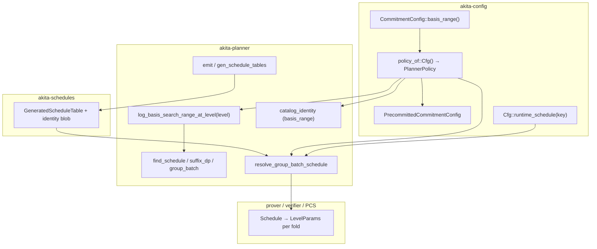

# Spec: Fixed root `log_basis` for proof-optimized presets

| Field         | Value |
|---------------|-------|
| Author(s)     | (experiment owners) |
| Created       | 2026-07-20 |
| Updated       | 2026-07-23 |
| Status        | proposed |
| PR            | |
| Supersedes    | |
| Superseded-by | |
| Book-chapter  | how/configuration.md |

## Summary

The offline schedule planner chooses per-fold `log_basis` (digit base
\(b = 2^{\text{log\_basis}}\)) to minimize proof size subject to candidate,
setup, and SIS validation. The proof-optimized policy already declares the
supported range as `basis_range = (2, 6)`. This spec makes that existing policy
authoritative:

- the root fold uses `basis_range.0` exactly;
- recursive folds search the full `basis_range`, subject to the
  non-decreasing-basis rule;
- field width and `decomposition.log_basis` impose no additional planner floor.

There is no separate root-basis configuration field or catalog-identity field.
All shipped fp128, fp64, and fp32 proof-optimized families therefore use root
`log_basis = 2`.

**Self-contained document.** All methodology, tables, schedule anatomy, and
root-cause analysis live here in [§ Empirical study](#empirical-study); there is
no separate empirical appendix.

### TL;DR outcome

- **`root=2`** (recommended) — power-of-two root (64 balanced digits @ L0),
  runtime proof **−0.2%** and aggregate planner bytes **−0.4%** vs unpinned, for
  **~+15% prover time** (commit-dominated). Verify is flat.
- **`root=4`** — power-of-two (32 digits) and prover-competitive, but the
  **largest proof** (**+2.3%**, fat cleartext tail). It *should* be the fastest to
  prove (smallest witness) but is not, because of a **stage-1 range-check
  unoptimization** ([§ Why prove is non-monotonic](#why-prove-is-non-monotonic-the-key-finding)).
- **unpinned** — fastest prover, non-power-of-two root digits (43 @ L0); defeats
  the verifier/precommit motivations.

## Motivation

The fixed root is primarily a **precommit / security simplification**, and
secondarily a **verifier** and **planner** simplification. All three are unlocked
by deriving the root-fold `log_basis` from an existing preset policy input
instead of making it a per-`nv` planner choice.

### 1. Precommitted polynomials no longer need a conservative rank (primary)

Staggered and multi-group workflows precommit polynomials before the final group
is known. `PrecommittedCommitmentConfig` plans that standalone commitment under
the singleton range `(basis_range.0, basis_range.0)` and freezes the resulting
root layout. The adapter keeps the exact A/B ranks and norm bounds selected for
that basis. It does not widen them across alternative opening bases.

The singleton planning probe also prevents a hypothetical higher-basis suffix
from changing the frozen root block geometry. This matters for distributed
consumers: each precommitted group at a W8R2 root needs at least eight live
blocks. Only the probe is single-basis; ordinary recursive schedules remain
free to search the configured range.

### 2. Improved verifier: power-of-two digit counts for the ê and t̂ components

Opening digits are decomposed in base \(b = 2^{\text{log\_basis}}\). The **opening
digit count** `num_digits_open` ≈ \(\lceil \text{field\_bits} / \log\_basis \rceil\)
(see `num_digits_for_bound` in `akita-types`) governs the **digit axis of the ê and
t̂ relation components** — their structured MLE cells are indexed with a `dig`
axis of size `num_digits_open` (see
[`distributed-relation-verifier.md`](../book/src/how/verifying/distributed-relation-verifier.md):
`e_hat` cell `do·C·B_loc`, `t_hat` cell `do·n_A·C·B_loc`, where `do = num_digits_open`).
For fp128 presets (`field_bits = 128`):

| `log_basis` | Base \(b\) | `num_digits_open` @ 128 bits | Power of two? |
|-------------|-----------|------------------------------|---------------|
| 2 | 4 | 64 | **yes** |
| 3 | 8 | 43 | no |
| 4 | 16 | 32 | **yes** |
| 5 | 32 | 26 | no |
| 6 | 64 | 22 | no |

When the root `log_basis` is a **power of two** (2 or 4), `num_digits_open` is a
power of two (64 or 32). The verifier's **structured component evaluation** peels
power-of-two windows (it already exploits the power-of-two block axis `B` — see the
`matrix_evaluation` / window-peeling discussion in the chapter above). A
power-of-two digit axis lets ê and t̂ be peeled just as cleanly **on the digit
axis too** — uniform loop bounds, no partial final tree level, no dense fallback on
that axis — i.e. a more efficient structured evaluation of the ê and t̂
components.

**ẑ is unaffected.** The ẑ component's digit axes are `dc · df` — the commit-bound
digit count times `num_digits_fold` — **not** `num_digits_open` (same chapter:
`z_hat` cell `dc·df·num_positions_per_block`). Those counts are set by
`log_commit_bound` and the fold-digit schedule, so ẑ's digit count is **not** a
power of two regardless of the root `log_basis`; pinning the root changes nothing
for ẑ. The win is specifically on ê and t̂.

Further verifier background:
[`book/src/how/verifying/distributed-relation-verifier.md`](../book/src/how/verifying/distributed-relation-verifier.md)
(structured component evaluation, block/window peeling) and the opening-points
layout chapter.

**Product constraint:** shipped root pin values should be **powers of two** (`2`
or `4`). The mechanism allows any `u32` in `basis_range`; non-POT choices should be
documented as exceptional.

### 3. Simpler, faster planner — without growing the proof

The offline DP searches `log_basis` at every fold level alongside block splits,
ranks, and terminal choice. The root is the **widest, most expensive** search node
(largest witness, most security-sensitive geometry). Pinning collapses the root
`log_basis` dimension from a range to a **singleton**:

- Fewer DP branches at the root and the group-batch root scorer → **faster**
  brute-force planning.
- Faster `gen_schedule_tables` regen and CI drift tests on cache misses.
- **Deterministic root geometry** across the `nv` axis — easier human audit of
  generated tables.

Deeper levels (`n_a`, `n_b`, block layout, terminal depth, and their `log_basis`)
are still searched; only the root digit base is fixed.

**Hard requirement:** this simplification must **not meaningfully increase proof
size at large `nv`**. The empirical study confirms it does not — the recommended
`root=2` is actually **smaller** than unpinned: −0.2% runtime bytes at `nv = 36`
and **−0.4% on aggregate planner bytes over `nv = 30…43`**; even the worst pin
(`root=4`) is at most +1.4% aggregate ([§ Empirical study](#empirical-study),
[§ Trade-offs and recommendations](#trade-offs-and-recommendations)).

## Goal

Use existing planner policy as the only basis authority:

1. `basis_range.0` fixes the root fold.
2. Recursive folds search `basis_range`.
3. The suffix DP enforces `next_log_basis >= current_log_basis`.
4. Normal candidate, setup, and SIS checks reject infeasible choices.
5. Exact precommit planning uses the same root basis without conservative
   widening.

The prover and verifier continue to consume `Schedule` / `LevelParams`; they do
not need a root-basis-specific branch.

### Invariants

1. **Single source of truth** — `PlannerPolicy::basis_range` is the only policy
   input that bounds per-level basis search.
2. **Exact root** — absolute fold level 0 evaluates only `basis_range.0`.
3. **Planner-owned recursion** — levels ≥ 1 search the full configured range.
   There is no field-width or decomposition-default floor.
4. **Non-decreasing bases** — a recursive candidate below the preceding fold's
   selected basis is rejected.
5. **Normal feasibility checks remain authoritative** — fixed root basis 2 does
   not bypass setup-envelope, contraction, or SIS validation.
6. **Exact frozen layouts** — precommitted descriptors contain the ranks, bounds,
   bases, and block geometry produced by the singleton root-basis probe.
7. **Prover ≡ verifier schedule** — both sides resolve through the same
   `runtime_schedule` / `get_params_for_prove` path.

### Non-Goals

- **Fixing fold levels ≥ 1** — only the root fold is fixed; deeper levels stay
  planner-chosen.
- **Per-`nv` root tables** — one root rule per policy, not a lookup table over
  `nv`.
- **Planner objective change** — no prover-cost term added to the DP here.
- **Small-`nv` scheduling policy** — no acceptance criteria for `nv < 30`.
- **Stage-1 range-check fast path for basis 16** — the non-monotonic prover cost
  ([§ Why prove is non-monotonic](#why-prove-is-non-monotonic-the-key-finding)) is
  a *documented finding*, not fixed by this spec.

## Design

### Architecture overview

The existing `basis_range` flows from config to policy, planner, generated
catalog, and runtime resolution. Prover, verifier, and PCS consume the resulting
`Schedule` unchanged.



**Data flow at prove time:**

1. PCS calls `Cfg::get_params_for_prove(layout)` → `runtime_schedule(key)`.
2. `policy_of::<Cfg>()` builds `PlannerPolicy` including `basis_range`.
3. If `Cfg::schedule_catalog()` is `Some(table)`: `validate_catalog_identity`
   validates the policy identity; on hit it expands the compact entry, and on
   miss it runs DP with the same policy.
4. If no catalog: DP only.
5. Prover and verifier execute folds using `LevelParams.log_basis` per level — no
   pin-specific branches downstream.

### Component responsibilities

#### `akita-config` — declaration and bridge

| Piece | Responsibility |
|-------|----------------|
| `CommitmentConfig::basis_range()` | Declares the supported basis interval. Proof-optimized presets use `(2, 6)`. |
| `policy_of::<Cfg>()` | Copies `basis_range` into `PlannerPolicy`. |
| `PrecommittedCommitmentConfig` | Plans under the singleton root basis and freezes exact commitment metadata. |
| `RecursiveCommitmentConfig` | Inherits `basis_range`; catalog identity remains distinct through the recursion-policy fields. |

**Preset example (illustrative):**

```rust
impl_proof_optimized_preset!(
    D64OneHot,
    // ...
    256,
    schedules = ("schedules-fp128-d64-onehot", "fp128_d64_onehot", fp128_d64_onehot_table)
);
```

#### `akita-planner` — search constraint

| Piece | Responsibility |
|-------|----------------|
| `PlannerPolicy::basis_range` | Inclusive basis interval carried through the DP. |
| `log_basis_search_range_at_level(level)` | Returns `(basis_range.0, basis_range.0)` at level 0 and `basis_range` at deeper levels. **Single source of truth** for all three DP loops. |
| `schedule_params.rs` (root DP) | Root loop calls `log_basis_search_range_at_level(0)`. |
| `schedule_params/suffix_dp.rs` (levels ≥ 1) | Suffix loop calls `log_basis_search_range_at_level(level)` and applies the non-decreasing-basis constraint. |
| `group_batch.rs` | Group-batch root search calls `log_basis_search_range_at_level(0)`. |

**Important:** fixing the root constrains which basis the DP may evaluate at
level 0; it does not short-circuit the DP. The suffix DP keeps `log_basis`
non-decreasing across levels.

#### `akita-planner` — catalog identity and emit

| Piece | Responsibility |
|-------|----------------|
| `expected_catalog_identity` / `validate_catalog_identity` | Mismatch → `AkitaError` with family name. |
| `gen_schedule_tables` binary | Regenerates all families from current `policy_of` + preset hooks. |

Changing `basis_range` without regeneration leaves stale identity in the
generated module and causes runtime identity failure.

#### `akita-schedules` — generated artifacts

- Each family module embeds `basis_range` in its catalog identity.
- Companion families inherit the parent preset policy at emit time.

#### Downstream consumers (no pin-aware code)

`akita-pcs` / `akita-prover` / `akita-verifier` use the `Schedule` from config.
The profile example resolves layout via
`get_params_for_batched_commitment` and benefits from the catalog when the
policy identity matches.

### Alternatives considered

| Alternative | Why not |
|-------------|---------|
| **Separate `root_log_basis` config field** | Duplicates `basis_range.0`, widens config and catalog identity, and permits contradictory policy inputs. |
| **Fix all levels** | Removes DP freedom where the witness is already small; used only for the internal precommit planning probe. |
| **Silent catalog fallback on identity mismatch** | Hides config/table skew; violates schedule-catalog hardening ([`schedule-catalog-ownership.md`](schedule-catalog-ownership.md)). |
| **Prover-cost-aware DP** | Correct direction for future work but a separate project; the root pin is a simpler byte/geometry knob. |
| **Per-key root basis in table entries** | Makes the root unknown before planning and recreates the conservative-precommit problem. |

## Empirical study

All numbers were regenerated on the typed-fold-schedule code (post `#317`
cutover). This section is the canonical empirical record.

### Methodology and workload

- **Preset:** `akita_config::proof_optimized::fp128::D64OneHot`
- **Field:** fp128 (`p = 2^128 − 2^32 + 22537`); **ring dimension** `D = 64`
- **Encoding:** binary onehot, `onehot_k = 256`, `log_commit_bound = 1`
- **Profile mode:** `onehot_fp128_d64`, `AKITA_NUM_VARS = 36`, `AKITA_NUM_POLYS = 1`
- **Machine:** 16 physical cores, 64 GB RAM, 16 Rayon threads, release build.
- **Scope:** large `nv` only (`nv ≥ 30`); planner sweep over `nv = 30…43`; runtime
  proofs measured at `nv = 36` (executed proofs are infeasible at the top of the
  range).

Two number sources:

- **Planner bytes** — `find_group_batch_schedule` →
  `FoldScheduleEstimate::estimated_direct_proof_payload_bytes`. Estimates, useful
  for catalog sizing / large-`nv` trends. They **overcount** the runtime proof by
  a stable ~5 KB ([§ Planner vs runtime](#planner-vs-runtime-proof-bytes)).
- **Runtime proofs / timings** — the `akita-pcs` `profile` example, serialized
  on-wire proof sizes and wall-clock phase timings.

### Policies compared

This table records the historical experiment that motivated the fixed-root
decision. The `unpinned` row and the `Option<u32>` staging hook are not current
APIs. The current diagnostic varies `basis_range.0`; deeper levels remain
planner-chosen.

| Policy | Root policy | Effective root at nv=36 |
|--------|-------------------------|-------------------------|
| unpinned (historical) | free root search | planner chooses **3** |
| `root=2` | `basis_range.0 = 2` | fixed **2** |
| `root=3` | `basis_range.0 = 3` | fixed **3** (= historical unpinned result at nv=36) |
| `root=4` | `basis_range.0 = 4` | fixed **4** |

> **Historical note on `root=4`.** The experiment predated removal of the
> decomposition-default floor. The non-decreasing rule still ensures that a
> basis-4 root prevents later levels from selecting a smaller basis.

### Headline results (nv = 36, np = 1)

| Policy | Root | Planner bytes | **Runtime proof** | Commit | Prove | Verify | **C+P+V** |
|--------|------|--------------:|------------------:|-------:|------:|-------:|----------:|
| unpinned | 3 | 98,364 | **93,400** | 27.1 s | 3.1 s | 0.052 s | **30.3 s** |
| `root=2` | 2 | 98,140 | **93,180** | 30.8 s | 4.2 s | 0.044 s | **34.9 s** (+15%) |
| `root=4` | 4 | 100,260 | **95,552** | 27.3 s | 3.5 s | 0.053 s | **30.9 s** (+2%) |

(`root=3` resolves to the unpinned schedule at `nv = 36`, so it is omitted from the
runtime rows.) Proof breakdown: unpinned `fold=41,012 / tail=52,388 / 9 levels`;
`root=2` `40,788 / 52,392 / 9`; `root=4` `32,668 / 62,884 / 7`.

- **Proof-size ordering:** `root=2` < unpinned < `root=4`.
- **Runtime proof Δ vs unpinned:** `root=2` −220 B (−0.2%); `root=4` +2,152 B (+2.3%).
- **Prover wall-time ordering:** unpinned ≈ `root=4` ≪ `root=2`.
- **Verify** is flat (~44–53 ms) across all policies.

Timings are averages of three runs per policy; commit/prove vary ~±10% run to run
(so `root=4` vs unpinned, +2%, is within noise). One `root=2` commit outlier
(50.7 s) was excluded; its rerun (30.9 s) matches the other measurements.

### Planner proof-size study (large nv)

Per-`nv` planner bytes, `nv = 30…43`, `np = 1`:

| nv | unpinned | `root=2` | `root=3` | `root=4` |
|----|---------:|---------:|---------:|---------:|
| 30 | 94,744 | 96,148 | 94,744 | 94,760 |
| 31 | 96,216 | 96,868 | 96,948 | 96,216 |
| 32 | 97,700 | 96,900 | 97,700 | 99,044 |
| 33 | 97,732 | 97,092 | 97,732 | 99,332 |
| 34 | 97,956 | 97,388 | 97,956 | 99,332 |
| 35 | 98,252 | 97,468 | 98,252 | 99,476 |
| 36 | 98,364 | 98,140 | 98,364 | 100,260 |
| 37 | 99,004 | 98,364 | 99,004 | 100,764 |
| 38 | 99,292 | 98,364 | 99,292 | 101,052 |
| 39 | 99,292 | 99,228 | 99,292 | 101,836 |
| 40 | 100,828 | 100,572 | 100,828 | 102,220 |
| 41 | 102,504 | 101,512 | 102,504 | 102,860 |
| 42 | 103,368 | 102,232 | 103,368 | 104,204 |
| 43 | 103,512 | 102,344 | 103,512 | 106,556 |

Aggregate over `nv = 30…43` (14 keys, `np = 1`):

| Policy | Root | Sum planner bytes | vs unpinned |
|--------|------|------------------:|------------:|
| unpinned | planner | 1,388,764 | — |
| `root=2` | 2 | 1,382,620 | **−0.44%** |
| `root=3` | 3 | 1,389,496 | +0.05% |
| `root=4` | 4 | 1,407,912 | +1.38% |

**Conclusion:** `root=2` is the best byte policy on aggregate. `root=3` tracks the
unpinned planner (which usually picks `3` at the root anyway). `root=4` regresses
and degrades fastest at the top of the range (`nv = 43`: +2.9%).

### Schedule anatomy (nv = 36, np = 1)

`unpinned` and `root=2` use **9 fold levels**; `root=4` uses **7** (a shallower
ladder with a fatter cleartext tail). All terminate at `final_log_basis = 6` and
diverge only in the first 3–4 levels.

Per-level `log_basis` and folded witness (`next_w`, field elements):

| Lv | unpinned lb / next_w | `root=2` lb / next_w | `root=4` lb / next_w |
|----|----------------------|----------------------|----------------------|
| 0 | 3 / 146,041,728 | **2** / 251,699,200 | **4** / 130,043,904 |
| 1 | 3 / 6,528,000 | 3 / 8,195,712 | 4 / 5,685,248 |
| 2 | 3 / 1,371,904 | 3 / 1,586,560 | 4 / 950,272 |
| 3 | 4 / 471,040 | 4 / 520,192 | 5 / 386,304 |
| 4– | 5→6 (converge) | 6 (converge) | 6 (converge) |

`root=2` keeps the shallow root (`lb = 2` → `next_w = 251.7M`) but the planner
**recovers `lb = 3` at L1**, so its deep ladder closely tracks unpinned. `root=4`
shrinks most aggressively at the root and keeps `lb = 4` for two more levels (the
non-decreasing constraint), terminating in 7 levels.

Root shrink factor (`current_w = 2^36 ≈ 68.7 B` field elements) and commit
geometry:

| Policy | root lb | root shrink | `n_a` | `delta_open` | num_live_blocks |
|--------|---------|-------------|-------|--------------|-----------------|
| unpinned | 3 | 470× | 6 | 43 | 4,096 |
| `root=2` | 2 | 273× | **7** | 64 | 4,096 |
| `root=4` | 4 | 528× | 6 | 32 | 2,048 |

`n_a` is `inner_commit_matrix.output_rank()`, the A-role SIS rank the min-rank
solver returns for the root basis (`num_digits_inner = 1` because
`log_commit_bound = 1`). It is the key driver of commit cost below.

### Why commit changes (it's `n_a`, not `delta_open`)

For a one-hot `log_commit_bound = 1` polynomial the root A-role commit ingests the
**raw indicator** (`num_digits_inner = 1`, independent of the fold basis). Its
dominant cost is a sparse column sweep of `n_a × (fixed one-hot support ≈ 2^28)`
shift-accumulates (`OneHotPoly::commit_inner` → `column_sweep_ajtai_onehot`). So
**commit ∝ `n_a`**:

- `root=2` has `n_a = 7` → ~14% slower (7/6 = 1.167; observed 30.8/27.1 = 1.137).
- `root=3` and `root=4` both have `n_a = 6` → commit ties (27.1 ≈ 27.3 s at
  nv=36; at nv=32 `root=4` was slightly *faster*, 0.40 s vs 0.44 s).

`delta_open` (64/43/32) only sizes the much smaller downstream `t̂` / B-role work,
so `root=4`'s fewer digits buy nothing on commit, and `root=4` commit is **not**
slower than `root=3`.

### Why prove is non-monotonic (the key finding)

The prover cost is **non-monotonic in the root `log_basis`**: both `root=2` and
`root=4` are slower to prove than `root=3`, even though `root=4` shrinks the
witness *more* at every level. The two deviations have **different** causes.

**`root=2` (expected).** Same fast range-check path as `root=3`, but `lb = 2`
means ~1.5× more digit planes at every fold (`num_digits ∝ 1/log_basis`) and a
larger stage-1 domain, plus the fatter witness (272M vs 146M after L0). Prove rises
~3.1 s → ~4.2 s. This is inherent, not a bug.

**`root=4` (an unoptimization).** It has the smallest witness at every level, so
it *should* prove fastest — but it does not, because of a **hard basis cutover in
the stage-1 digit range check**:

```
crates/akita-prover/src/protocol/sumcheck/digit_range/mod.rs:205
    if plan.basis() <= 8 { /* fast single-stage LowBasisRangeCheckProver */ }
```

- **basis 4 and 8** (`lb = 2, 3`) → a fast, specialized **single-stage**
  `LowBasisRangeCheckProver` (`RangePolynomialPrecomputation` only implements
  `basis ∈ {4, 8}`; `direct_range_leaf.rs` asserts `matches!(basis, 4 | 8)`).
- **basis ≥ 16** (`lb ≥ 4`) → a generic **multi-stage tree**:
  `DigitRangePlan::product_stage_arities` jumps from `[]` at `lb = 3` to `[2]` at
  `lb = 4` (`akita-types/src/proof/stage1.rs`), adding an **extra full-domain
  product sumcheck** (`ClassIndexedProductSubcheckProver`) plus a
  `ClassIndexedRangeLeafProver`, and rebuilding folded range-image tables twice
  instead of using the fixed 256-entry b8 LUTs.

`root=4` folds `lb = 4` at the **early, large-witness** levels (L0–L2), so it pays
that extra stage where it hurts most. Per-span profiling at `nv = 32` isolates it:

| Policy | early-fold basis | Σ `stage1_sumcheck` busy | prove total |
|--------|------------------|--------------------------|-------------|
| `root=3` | 8 (fast path) | **156.6 ms** | 0.700 s |
| `root=4` | 16 (tree path) | **264.4 ms** (+69%) | 0.735 s |

The stage-1 regression (+108 ms) is **larger** than the net prove increase
(+35 ms): `root=4` genuinely saves time elsewhere (smaller witness → cheaper
decomposition / matvec / stage-2), but the range-check cutover overwhelms those
savings.

> The i8 decomposition threshold `MAX_I8_LOG_BASIS = 8` (i.e. `log_basis ≤ 8`,
> basis ≤ 256) is **unrelated**: `lb = 4` stays on the fast i8 decomposition
> kernel. Decomposition is monotonic in basis (fewer digits at higher basis); it
> is not the cause.

**Implication / follow-up.** Extending the fast single-stage range check to
**basis 16** (a degree-4 octet-class leaf analogous to the existing b8 quartic
path) would let `root=4` prove **faster** than `root=3` (as its witness geometry
predicts), removing the non-monotonicity. This is a prover optimization tracked as
a follow-up, **out of scope** for this spec.

### Verifier

Verify is flat at **~44–53 ms** across all policies. (The pre-refactor `[4, 4]`
verify blow-up is gone on the current verifier.)

### Planner vs runtime proof bytes

```
[onehot_fp128_d64] proof: total=93400 bytes, akita_fold=41012 bytes, tail=52388 bytes, levels=9
[onehot_fp128_d64] NOTE: planned estimate 98364 overcounts runtime proof 93400 by 4964 bytes
```

The **~5 KB systematic overcount** is a known planner artifact (stage-2 degree-2
round micro-optimization; `specs/planner-refactor.md`). It is stable across
policies, so **cite runtime bytes for bandwidth budgeting.**

| Policy | Root | Planner | Runtime | Δ |
|--------|------|--------:|--------:|--:|
| unpinned | 3 | 98,364 | 93,400 | 4,964 |
| `root=2` | 2 | 98,140 | 93,180 | 4,960 |
| `root=4` | 4 | 100,260 | 95,552 | 4,708 |

### Reproducing the study

Planner comparison + schedule anatomy (fast, planner-only):

```bash
cargo test -p akita-config --test root_log_basis_sweep -- --ignored --nocapture
# rtk summarizes stdout; run the compiled binary directly for the full table:
# target/debug/deps/root_log_basis_sweep-* --ignored --nocapture
```

End-to-end profile for the shipped policy:

```bash
AKITA_NUM_VARS=36 AKITA_NUM_POLYS=1 \
AKITA_MODE=onehot_fp128_d64 AKITA_PROFILE_TRACE=0 AKITA_PROFILE_LOG=error \
cargo run --release -p akita-pcs --example profile \
  --no-default-features --features parallel
```

The alternative runtime rows are retained as historical evidence. Reproducing
them requires a local policy variant; there is intentionally no production
root-basis override.

Stage-1 attribution (per-span, at a smaller nv for speed): run the profile with
`AKITA_PROFILE_LOG=info` and sum the `stage1_sumcheck: close time.busy=…` spans.

### Caveats

| Topic | Note |
|-------|------|
| **Single machine** | 16 cores / 64 GB, one release build. |
| **Run-to-run noise** | Commit/prove vary ~±10%; C+P+V are averages of three runs. `root=4` vs unpinned (+2%) is within noise. |
| `np = 1` **only** | `np = 4` at nv=36 not benchmarked. |
| **Proof-size sweep** | `nv = 30…43` uses planner estimates; runtime proofs measured at `nv = 36` only. |
| **Catalog disabled** | DP resolution uses the same fixed-root policy. |
| **Setup time** | One-time; excluded from C+P+V. |

## Trade-offs and recommendations

The root pin is a three-way trade among **verifier digit geometry**, **proof
bytes**, and **prover latency**.

| Axis | unpinned (root 3) | `root=2` | `root=4` |
|------|-------------------|----------|----------|
| Root digit count | 43 (non-POT) | **64 (POT)** | **32 (POT)** |
| Runtime proof @ nv36 | 93,400 B | **93,180 B (−0.2%)** | 95,552 B (+2.3%) |
| Aggregate bytes (30…43) | baseline | **−0.4%** | +1.4% |
| Prover C+P+V @ nv36 | **30.3 s** | 34.9 s (+15%) | 30.9 s (+2%) |
| Verify | ~50 ms | ~44 ms | ~53 ms |
| Precommit rank | conservative | **constant** | **constant** |

**Reading the trade-offs:**

- **`root=2` is the recommended default.** It is the only option that is
  simultaneously **verifier-friendly** (power-of-two root digits, constant
  precommit rank) and **byte-favorable** (smaller than unpinned). Its cost is
  prover latency (~+15% C+P+V), dominated by commit (`n_a = 7`) and the fatter
  early witness — an accepted trade for a verifier-bound recursion target (Jolt).
- **`root=4` is tempting but currently dominated.** Power-of-two digits and
  prover-competitive C+P+V, but the **largest proof** (+2.3%, from a fat cleartext
  tail) and it *should* be the fastest prover yet is not, because of the stage-1
  basis-16 unoptimization. If that fast path is added and the tail cost is
  addressed, `root=4` becomes attractive; until then, `root=2` dominates it.
- **unpinned wins only on raw prover latency**, at the cost of non-power-of-two
  root digits and conservative precommit rank — i.e. it defeats the primary
  motivations.

| Option | Root | When to choose |
|--------|------|----------------|
| **`root=2`** (shipped for fp128 onehot) | 2 | Verifier geometry + precommit simplification matter; ~+15% prover acceptable; want smaller proof. |
| `root=4` | 4 | Only if the basis-16 range-check fast path lands and the fat tail is acceptable. |
| unpinned | planner | Prover latency is the sole priority and POT digits are not needed. |

### Shipped scope (implemented)

Every proof-optimized preset uses `basis_range = (2, 6)`, so every shipped root
uses `log_basis = 2`.

| Preset family | Root | Recursive search | Notes |
|---------------|------|------------------|-------|
| fp128 one-hot, dense, tensor, and chunked families | 2 | 2…6 | `fp128::{D64Dense,D64DenseMultiChunk}` cap at `nv = 48` because their basis-2 root cannot produce a valid schedule beyond that. |
| fp64 dense and one-hot families | 2 | 2…6 | No field-specific floor. |
| fp32 one-hot families | 2 | 2…6 | No field-specific floor. |
| `RecursiveCommitmentConfig<…>` | 2 | 2…6 | Inherits the base policy and retains recursion-specific catalog identity. |
| `PrecommittedCommitmentConfig<…>` | 2 | singleton probe at 2 | Freezes exact root metadata; no conservative widening. |

All 16 shipped tables are regenerated from this rule. Catalog identity already
contains `basis_range`, so changing the policy range still requires
regeneration.

## Evaluation

### Acceptance criteria

- [x] `policy_of::<Cfg>()` derives `basis_range` from `CommitmentConfig`.
- [x] Level 0 returns the singleton `(basis_range.0, basis_range.0)`.
- [x] Levels ≥ 1 return the full `basis_range`.
- [x] fp128, fp64, and fp32 policy tests all resolve root basis 2.
- [x] `PrecommittedCommitmentConfig` freezes exact basis-2 metadata without
      conservative rank widening.
- [x] The W8R2 recursive multi-group catalog regenerates with exact precommits.
- [x] All shipped tables regenerated.
- [ ] `generated_tables`, `basis_envelope`, and focused small-field E2E tests pass.
- [ ] Profile / e2e at `nv = 36`: prove and verify succeed for the shipped preset
      with catalog enabled.
- [ ] Shipped-pin benchmark row (runtime proof bytes + C+P+V) recorded in the PR
      description, sourced from [§ Empirical study](#empirical-study).

### Testing strategy

| Layer | Tests |
|-------|-------|
| Planner | Search-range unit tests, catalog identity, and optional golden schedule at `nv = 36`. |
| Config | `runtime_fallback`, `generated_tables`, `basis_envelope`; ignored `root_log_basis_sweep` proof-size + anatomy comparison over `nv = 30…43`. |
| Integration | fp32/fp64 one-hot E2E, recursive W8R2 setup-offload E2E, and fp128 profile `onehot_fp128_d64` at `nv = 36`. |
| Regen | Full `gen_schedule_tables` diff reviewed when `basis_range` or planner rules change. |

Run CI-relevant checks per `AGENTS.md`: `cargo test`, `cargo clippy`,
`generated_tables` with schedule features.

### Performance expectations

| Metric | Expectation |
|--------|-------------|
| **Proof bytes @ large `nv`** | `root=2` smaller than unpinned; `root=4` within ~2.2 KB of the optimum at `nv = 36`. |
| **Verifier structure** | Fixed basis-2 root uses a power-of-two `num_digits_open`. |
| **Prover latency @ `nv = 36`** | ~+15% C+P+V for `root=2` (commit-dominated); `root=4` ≈ unpinned (but see the non-monotonicity finding). |
| **Verifier latency** | Flat ~44–53 ms across all policies. |
| **Catalog resolve** | No new identity field or hot-path branch. |
| **Table size** | No root-basis identity field. Entry counts follow ordinary schedule feasibility. |

## Execution

### Phase 1 — Use the existing policy surface (implemented)

1. Remove the separate config, planner, macro, and catalog root-basis fields.
2. Make `log_basis_search_range_at_level(0)` return `basis_range.0` exactly.
3. Let deeper levels search `basis_range`; retain the non-decreasing constraint.
4. Remove field-width and decomposition-default floors.

### Phase 2 — Exact precommitment (implemented)

1. Replace `ConservativeCommitmentConfig` with
   `PrecommittedCommitmentConfig`.
2. Plan the frozen commitment under the singleton root basis.
3. Preserve the selected block geometry and exact A/B ranks and bounds.
4. Delete widening over alternative bases.

### Phase 3 — Catalog regeneration (implemented)

1. Regenerate all 16 shipped families with root basis 2.
2. Regenerate the W8R2 recursive family with exact frozen precommits.
3. Refresh generated module wiring.

### Phase 4 — Validation

1. Profile `onehot_fp128_d64` at `nv = 36` with **catalog enabled** for the
   shipped preset.
2. Confirm runtime proof bytes and C+P+V match
   [§ Empirical study](#empirical-study) within normal variance.
3. Optional: `np = 4` row at `nv = 36` if product requires batched evidence.

### Phase 5 — Ship

1. Land PR with spec status → `implemented`.
2. Fold configuration guidance into the book.
3. Track the stage-1 basis-16 range-check fast path
   ([§ Why prove is non-monotonic](#why-prove-is-non-monotonic-the-key-finding)).

### Risks and mitigations

| Risk | Mitigation |
|------|------------|
| Catalog / config range skew in production | Identity validation errors loudly; regeneration and `assert_policy_matches_cfg` cover the policy bridge. |
| Integrators build without schedule feature | DP fallback uses the same root and recursive search rule. |
| Wrong ship choice for Jolt latency | Default to `root=2`; prover regression (~+15%) documented above; profile at `nv = 36` in CI. |
| Exact precommit geometry becomes too compact for W8R2 | Singleton-basis planning preserves at least one live block per chunk; the recursive catalog and E2E test pin the profile. |
| Multi-chunk companions alias parent identity | Companions inherit the parent policy; `witness_chunk` keeps catalog identities distinct. |

## References

- [`specs/schedule-catalog-ownership.md`](schedule-catalog-ownership.md) — catalog identity and resolve path
- [`specs/planner-incidence-generalization.md`](planner-incidence-generalization.md) — schedule key shape
- [`specs/planner-refactor.md`](planner-refactor.md) — stage-2 planner-vs-runtime overcount
- `crates/akita-planner/src/lib.rs` — `PlannerPolicy::basis_range`, `log_basis_search_range_at_level`
- `crates/akita-planner/src/catalog_identity.rs` — identity validation
- `crates/akita-config/src/precommitted_commitment.rs` — exact frozen precommit planning
- `crates/akita-config/tests/root_log_basis_sweep.rs` — root-pin planner byte comparison + schedule anatomy over `nv = 30…43` (diagnostic)
- `crates/akita-prover/src/protocol/sumcheck/digit_range/mod.rs` — stage-1 range-check basis cutover (`plan.basis() <= 8`)
