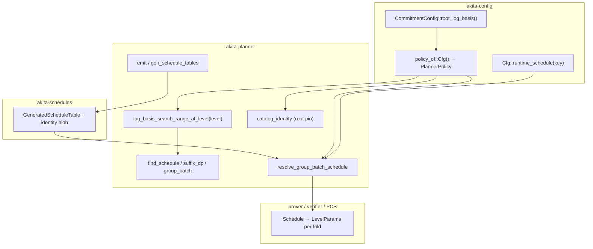

# Spec: Pinned root `log_basis` for proof-optimized presets

| Field         | Value |
|---------------|-------|
| Author(s)     | (experiment owners) |
| Created       | 2026-07-20 |
| Updated       | 2026-07-22 |
| Status        | proposed |
| PR            | |
| Supersedes    | |
| Superseded-by | |
| Book-chapter  | how/configuration.md |

## Summary

The offline schedule planner chooses per-fold `log_basis` (digit base
\(b = 2^{\text{log\_basis}}\)) to minimize proof size subject to SIS floors. Left
free, the planner **might pick** a non-power-of-two value at the root fold (e.g.
`3` at `nv = 36`), and — more importantly — the root basis is **not known ahead of
time**. That forces precommitted polynomials to assume a **conservative rank**,
complicates verifier digit geometry, and widens the planner search.

This spec defines **root pinning**: fixing `log_basis` at the **root fold
(absolute level 0)** to a **preset constant** (intended to be a power of two: `2`
or `4`), while leaving **all deeper fold levels (≥ 1)** to the DP search. The pin
flows `CommitmentConfig` → `PlannerPolicy` → DP / catalog emit / runtime
resolution, and is part of **catalog identity**.

**Self-contained document.** All methodology, tables, schedule anatomy, and
root-cause analysis live here in [§ Empirical study](#empirical-study); there is
no separate empirical appendix.

### TL;DR outcome

- **`root=2`** (recommended) — power-of-two root (64 balanced digits @ L0),
  runtime proof **−0.2%** and aggregate planner bytes **−0.4%** vs unpinned, for
  **~+15% prover time** (commit-dominated). Verify is flat.
- **`root=4`** — power-of-two (32 digits) and prover-competitive, but the
  **largest proof** (**+2.3%**, fat cleartext tail). It *should* be the fastest to
  prove (smallest witness) but is not, because of a **stage-1 range-check
  unoptimization** ([§ Why prove is non-monotonic](#why-prove-is-non-monotonic-the-key-finding)).
- **unpinned** — fastest prover, non-power-of-two root digits (43 @ L0); defeats
  the verifier/precommit motivations.

## Motivation

Root pinning is primarily a **precommit / security simplification**, and
secondarily a **verifier** and **planner** simplification. All three are unlocked
by the same fact: making the root-fold `log_basis` a **known compile-time
constant** instead of a per-`nv` planner choice.

### 1. Precommitted polynomials no longer need a conservative rank (primary)

Staggered / multi-group workflows **precommit** polynomials *before* the final
root-fold geometry is planned. Because the root `log_basis` is unknown at precommit
time, `ConservativeCommitmentConfig` sizes those precommits against a
**conservative rank** envelope — a worst-case A/B-role rank that stays secure no
matter which root basis the later schedule ends up choosing
([`conservative_commitment.rs`](../crates/akita-config/src/conservative_commitment.rs)).
That envelope inflates the setup-matrix width and commit rows relative to what any
single concrete basis actually needs.

Pinning the root makes its `log_basis` a **compile-time constant**. A precommitted
group formed under the preset then knows exactly the digit width the final root
path will use, so it can commit and prove with the **same** `log_basis` — and the
conservative-rank envelope is no longer needed to cover an unknown future basis.
This is the main reason to land the pin.

> **Explicitly not done in this spec.** This spec lands the *mechanism* (a known
> root basis). It does **not** remove the conservative-rank path yet:
> `ConservativeCommitmentConfig` still clears the pin and continues to size
> precommits with conservative ranks. **Replacing the conservative rank with the
> pinned root basis is the next implementation step** (see
> [Non-Goals](#non-goals) and the [Phase 6 follow-on](#phase-6--ship)); this spec
> is a prerequisite for it.

### 2. Improved verifier: power-of-two digit counts for the ê and t̂ components

Opening digits are decomposed in base \(b = 2^{\text{log\_basis}}\). The **opening
digit count** `num_digits_open` ≈ \(\lceil \text{field\_bits} / \log\_basis \rceil\)
(see `num_digits_for_bound` in `akita-types`) governs the **digit axis of the ê and
t̂ relation components** — their structured MLE cells are indexed with a `dig`
axis of size `num_digits_open` (see
[`distributed-relation-verifier.md`](../book/src/how/verifying/distributed-relation-verifier.md):
`e_hat` cell `do·C·B_loc`, `t_hat` cell `do·n_A·C·B_loc`, where `do = num_digits_open`).
For fp128 presets (`field_bits = 128`):

| `log_basis` | Base \(b\) | `num_digits_open` @ 128 bits | Power of two? |
|-------------|-----------|------------------------------|---------------|
| 2 | 4 | 64 | **yes** |
| 3 | 8 | 43 | no |
| 4 | 16 | 32 | **yes** |
| 5 | 32 | 26 | no |
| 6 | 64 | 22 | no |

When the root `log_basis` is a **power of two** (2 or 4), `num_digits_open` is a
power of two (64 or 32). The verifier's **structured component evaluation** peels
power-of-two windows (it already exploits the power-of-two block axis `B` — see the
`matrix_evaluation` / window-peeling discussion in the chapter above). A
power-of-two digit axis lets ê and t̂ be peeled just as cleanly **on the digit
axis too** — uniform loop bounds, no partial final tree level, no dense fallback on
that axis — i.e. a more efficient structured evaluation of the ê and t̂
components.

**ẑ is unaffected.** The ẑ component's digit axes are `dc · df` — the commit-bound
digit count times `num_digits_fold` — **not** `num_digits_open` (same chapter:
`z_hat` cell `dc·df·num_positions_per_block`). Those counts are set by
`log_commit_bound` and the fold-digit schedule, so ẑ's digit count is **not** a
power of two regardless of the root `log_basis`; pinning the root changes nothing
for ẑ. The win is specifically on ê and t̂.

Further verifier background:
[`book/src/how/verifying/distributed-relation-verifier.md`](../book/src/how/verifying/distributed-relation-verifier.md)
(structured component evaluation, block/window peeling) and the opening-points
layout chapter.

**Product constraint:** shipped root pin values should be **powers of two** (`2`
or `4`). The mechanism allows any `u32` in `basis_range`; non-POT choices should be
documented as exceptional.

### 3. Simpler, faster planner — without growing the proof

The offline DP searches `log_basis` at every fold level alongside block splits,
ranks, and terminal choice. The root is the **widest, most expensive** search node
(largest witness, most security-sensitive geometry). Pinning collapses the root
`log_basis` dimension from a range to a **singleton**:

- Fewer DP branches at the root and the group-batch root scorer → **faster**
  brute-force planning.
- Faster `gen_schedule_tables` regen and CI drift tests on cache misses.
- **Deterministic root geometry** across the `nv` axis — easier human audit of
  generated tables.

Deeper levels (`n_a`, `n_b`, block layout, terminal depth, and their `log_basis`)
are still searched; only the root digit base is fixed.

**Hard requirement:** this simplification must **not meaningfully increase proof
size at large `nv`**. The empirical study confirms it does not — the recommended
`root=2` is actually **smaller** than unpinned: −0.2% runtime bytes at `nv = 36`
and **−0.4% on aggregate planner bytes over `nv = 30…43`**; even the worst pin
(`root=4`) is at most +1.4% aggregate ([§ Empirical study](#empirical-study),
[§ Trade-offs and recommendations](#trade-offs-and-recommendations)).

## Goal — the pin surface

Ship a **single, coherent root-pin surface** for proof-optimized presets:

1. **Config hook** — `CommitmentConfig::root_log_basis() -> Option<u32>`, default
   `None` (unpinned).
2. **Planner hook** — `PlannerPolicy::root_log_basis` constrains the DP search at
   the root fold (level 0) only, via `PlannerPolicy::log_basis_search_range_at_level`.
3. **Catalog hook** — generated tables embed the pin in
   `GeneratedScheduleCatalogIdentity`; runtime resolution **rejects** identity
   mismatch (no silent fallback).
4. **Regen hook** — `gen_schedule_tables` / family emit writes the pin into
   generated Rust modules; changing it requires a table regen for that family.
5. **Preset declaration** — proof-optimized macro (`impl_proof_optimized_preset!`)
   accepts optional `root_log_basis = L0`.

No prover or verifier code changes are required beyond what they already consume
from `Schedule` / `LevelParams`: root pinning is entirely a **planner + config +
catalog** concern.

### Invariants

1. **Single source of truth** — `Cfg::root_log_basis()` is the only config-level
   source; `policy_of::<Cfg>()` copies it into `PlannerPolicy` without
   transformation (except conservative adapters that explicitly clear the pin).
2. **Root fold (level 0) only** — `root_log_basis` applies to absolute fold level
   0. Fold levels ≥ 1 always use `PlannerPolicy::basis_range` (subject to existing
   `log_basis` minimum rules and the non-decreasing-across-levels constraint).
3. **Pin lies in `basis_range`** — `log_basis_search_range_at_level` clamps a
   `Some(lb)` into `(PROOF_OPTIMIZED_LOG_BASIS_MIN, PROOF_OPTIMIZED_LOG_BASIS_MAX)`;
   resolution never panics on a malformed pin (verifier-reachable no-panic
   contract).
4. **Catalog identity includes the pin** — `None` and `Some(2)` are distinct
   identities; a table generated for one cannot satisfy runtime resolution for the
   other.
5. **Identity mismatch is an error** — `resolve_group_batch_schedule` calls
   `validate_catalog_identity` before lookup; mismatch returns `AkitaError`, not
   DP fallback. (Table **miss** still falls back to DP.)
6. **Conservative / frozen layouts do not inherit the pin** —
   `ConservativeCommitmentConfig` and multi-group precommit paths clear
   `root_log_basis` to `None`.
7. **Prover ≡ verifier schedule** — both sides resolve through the same
   `runtime_schedule` / `get_params_for_prove` path; the pin affects planning only.
8. **Generated entry expansion honors the pin** — the catalog walk rejects a
   compact root entry whose `log_basis` disagrees with the pinned root basis.

### Non-Goals

- **Pinning fold levels ≥ 1** — only the root fold is pinned; deeper levels stay
  planner-chosen.
- **Per-`nv` pin tables** — one root pin per preset, not a lookup table over `nv`.
- **Planner objective change** — no prover-cost term added to the DP here.
- **Small-`nv` scheduling policy** — no acceptance criteria for `nv < 30`.
- **Conservative rank elimination** — follow-on refactor to size precommits from
  the pinned root basis instead of the conservative-rank envelope (motivation §1).
- **Stage-1 range-check fast path for basis 16** — the non-monotonic prover cost
  ([§ Why prove is non-monotonic](#why-prove-is-non-monotonic-the-key-finding)) is
  a *documented finding*, not fixed by this spec.

> **Runtime override note:** the shipped pin is a compile-time preset constant.
> `policy_of` additionally honors an `AKITA_ROOT_LOG_BASIS` environment override,
> used **only** by the benchmark harness / diagnostic sweep to exercise every root
> value from a single build; it is not a production configuration surface.

## Design

### Architecture overview

Root pinning is a **vertical slice** through config → policy → planner → catalog →
runtime resolution. Prover, verifier, and PCS consume the resulting `Schedule`
unchanged.



**Data flow at prove time:**

1. PCS calls `Cfg::get_params_for_prove(layout)` → `runtime_schedule(key)`.
2. `policy_of::<Cfg>()` builds `PlannerPolicy` including `root_log_basis`.
3. If `Cfg::schedule_catalog()` is `Some(table)`: `validate_catalog_identity`
   **must pass** (root pin included); on hit expand the compact entry, on miss DP
   fallback with the same policy.
4. If no catalog: DP only.
5. Prover and verifier execute folds using `LevelParams.log_basis` per level — no
   pin-specific branches downstream.

### Component responsibilities

#### `akita-config` — declaration and bridge

| Piece | Responsibility |
|-------|----------------|
| `CommitmentConfig::root_log_basis()` | Default `None`; overridden per preset. |
| `policy_of::<Cfg>()` | Copies the root pin into `PlannerPolicy` (honoring the `AKITA_ROOT_LOG_BASIS` bench override). |
| `impl_proof_optimized_preset!` | Optional `root_log_basis = L0` macro arg → `Some(L0)`. |
| `ConservativeCommitmentConfig` | Clears the pin (`None`) when adapting frozen precommits. |
| `RecursiveCommitmentConfig` | Inherits the base preset pin unless spec'd otherwise; catalog identity distinct per adapter flag. |

**Preset example (illustrative):**

```rust
impl_proof_optimized_preset!(
    D64OneHot,
    // ...
    256,
    root_log_basis = 2,   // optional; omit for unpinned. Recommended: 2.
    schedules = ("schedules-fp128-d64-onehot", "fp128_d64_onehot", fp128_d64_onehot_table)
);
```

#### `akita-planner` — search constraint

| Piece | Responsibility |
|-------|----------------|
| `PlannerPolicy::root_log_basis` | `Option<u32>` carried through the DP. |
| `log_basis_search_range_at_level(level)` | Returns `(lb, lb)` when `level == 0` and the root is pinned (clamped into `basis_range`); else the ordinary `basis_range` range with gadget-base / field-bit floors. **Single source of truth** for all three DP loops. |
| `schedule_params.rs` (root DP) | Root loop calls `log_basis_search_range_at_level(0)`. |
| `schedule_params/suffix_dp.rs` (levels ≥ 1) | Suffix loop calls `log_basis_search_range_at_level(level)` — unaffected by the root pin, but sees the non-decreasing-`lb` constraint. |
| `group_batch.rs` | Group-batch root search calls `log_basis_search_range_at_level(0)`. |
| `generated/walk.rs` | Entry expansion validates the stored root `log_basis` against the pin (planned; Phase 3). |

**Important:** pinning constrains *which* `log_basis` values the DP may evaluate at
the root; it does **not** short-circuit the DP. Because the suffix DP keeps
`log_basis` non-decreasing across levels, a large root pin (e.g. `4`) can
indirectly raise the second fold's floor — expected schedule behavior, not a
second pin.

#### `akita-planner` — catalog identity and emit

| Piece | Responsibility |
|-------|----------------|
| `CatalogIdentityExpectation::root_log_basis` | Compared on resolve. |
| `expected_catalog_identity` / `validate_catalog_identity` | Mismatch → `AkitaError` with family name. |
| `emit/mod.rs` | Serializes `None` vs `Some(2)` into the generated identity struct. |
| `gen_schedule_tables` binary | Regenerates all families from current `policy_of` + preset hooks. |

Changing the pin **without** regen leaves stale identity in the `.rs` file →
runtime identity failure (by design).

#### `akita-schedules` — generated artifacts

- Each family module embeds `root_log_basis: Option<u32>` in its catalog identity
  constant.
- Companion / placeholder families use the parent preset's pin at emit time, or
  `None` if intentionally unpinned.

#### Downstream consumers (no pin-aware code)

`akita-pcs` / `akita-prover` / `akita-verifier` use the `Schedule` from config; no
`root_log_basis` reads. The profile example resolves layout via
`get_params_for_batched_commitment` and benefits from the catalog when the pin
matches.

### Alternatives considered

| Alternative | Why not |
|-------------|---------|
| **Two-slot pin `[Option<u32>; 2]`** (levels 0 and 1) | The original design; the study shows the root pin alone captures the verifier-geometry win (planner recovers a good L1 basis), so the extra slot adds surface, catalog width, and prover cost for little benefit. Simplified to a scalar root pin. |
| **Pin all levels** | Explodes catalog size and removes DP freedom where the witness is already small; prover win negligible. |
| **Silent catalog fallback on identity mismatch** | Hides config/table skew; violates schedule-catalog hardening ([`schedule-catalog-ownership.md`](schedule-catalog-ownership.md)). |
| **Prover-cost-aware DP** | Correct direction for future work but a separate project; the root pin is a simpler byte/geometry knob. |
| **Per-key pin in table entries** | Would bloat compact entries and break the identity model; the pin is preset-global. |

## Empirical study

All numbers were regenerated on the typed-fold-schedule code (post `#317`
cutover). This section is the canonical empirical record.

### Methodology and workload

- **Preset:** `akita_config::proof_optimized::fp128::D64OneHot`
- **Field:** fp128 (`p = 2^128 − 2^32 + 22537`); **ring dimension** `D = 64`
- **Encoding:** binary onehot, `onehot_k = 256`, `log_commit_bound = 1`
- **Profile mode:** `onehot_fp128_d64`, `AKITA_NUM_VARS = 36`, `AKITA_NUM_POLYS = 1`
- **Machine:** 16 physical cores, 64 GB RAM, 16 Rayon threads, release build.
- **Scope:** large `nv` only (`nv ≥ 30`); planner sweep over `nv = 30…43`; runtime
  proofs measured at `nv = 36` (executed proofs are infeasible at the top of the
  range).

Two number sources:

- **Planner bytes** — `find_group_batch_schedule` →
  `FoldScheduleEstimate::estimated_direct_proof_payload_bytes`. Estimates, useful
  for catalog sizing / large-`nv` trends. They **overcount** the runtime proof by
  a stable ~5 KB ([§ Planner vs runtime](#planner-vs-runtime-proof-bytes)).
- **Runtime proofs / timings** — the `akita-pcs` `profile` example, serialized
  on-wire proof sizes and wall-clock phase timings.

### Policies compared

Policies are labeled by the **root** (`level 0`) `log_basis`. `unpinned` lets the
planner choose the root per `nv` (it picks `3` at `nv = 36`). `root=b` pins only
the root fold; **all deeper levels remain planner-chosen**.

| Policy | Config `root_log_basis` | Effective root at nv=36 |
|--------|-------------------------|-------------------------|
| unpinned | `None` | planner chooses **3** |
| `root=2` | `Some(2)` | fixed **2** |
| `root=3` | `Some(3)` | fixed **3** (= unpinned at nv=36) |
| `root=4` | `Some(4)` | fixed **4** |

> **Note on `root=4`.** Because the suffix DP keeps `log_basis` non-decreasing and
> the deep-fold floor is `3`, pinning the root to `4` also nudges the second fold
> to `≥ 4`. At `nv = 36` `root=4` therefore matches the schedule a both-levels
> `[4, 4]` pin would produce, but at other `nv` (e.g. `nv = 43`) the planner lifts
> a deeper level and the two diverge — this study measures **root-only** pins
> throughout.

### Headline results (nv = 36, np = 1)

| Policy | Root | Planner bytes | **Runtime proof** | Commit | Prove | Verify | **C+P+V** |
|--------|------|--------------:|------------------:|-------:|------:|-------:|----------:|
| unpinned | 3 | 98,364 | **93,400** | 27.1 s | 3.1 s | 0.052 s | **30.3 s** |
| `root=2` | 2 | 98,140 | **93,180** | 30.8 s | 4.2 s | 0.044 s | **34.9 s** (+15%) |
| `root=4` | 4 | 100,260 | **95,552** | 27.3 s | 3.5 s | 0.053 s | **30.9 s** (+2%) |

(`root=3` resolves to the unpinned schedule at `nv = 36`, so it is omitted from the
runtime rows.) Proof breakdown: unpinned `fold=41,012 / tail=52,388 / 9 levels`;
`root=2` `40,788 / 52,392 / 9`; `root=4` `32,668 / 62,884 / 7`.

- **Proof-size ordering:** `root=2` < unpinned < `root=4`.
- **Runtime proof Δ vs unpinned:** `root=2` −220 B (−0.2%); `root=4` +2,152 B (+2.3%).
- **Prover wall-time ordering:** unpinned ≈ `root=4` ≪ `root=2`.
- **Verify** is flat (~44–53 ms) across all policies.

Timings are averages of three runs per policy; commit/prove vary ~±10% run to run
(so `root=4` vs unpinned, +2%, is within noise). One `root=2` commit outlier
(50.7 s) was excluded; its rerun (30.9 s) matches the other measurements.

### Planner proof-size study (large nv)

Per-`nv` planner bytes, `nv = 30…43`, `np = 1`:

| nv | unpinned | `root=2` | `root=3` | `root=4` |
|----|---------:|---------:|---------:|---------:|
| 30 | 94,744 | 96,148 | 94,744 | 94,760 |
| 31 | 96,216 | 96,868 | 96,948 | 96,216 |
| 32 | 97,700 | 96,900 | 97,700 | 99,044 |
| 33 | 97,732 | 97,092 | 97,732 | 99,332 |
| 34 | 97,956 | 97,388 | 97,956 | 99,332 |
| 35 | 98,252 | 97,468 | 98,252 | 99,476 |
| 36 | 98,364 | 98,140 | 98,364 | 100,260 |
| 37 | 99,004 | 98,364 | 99,004 | 100,764 |
| 38 | 99,292 | 98,364 | 99,292 | 101,052 |
| 39 | 99,292 | 99,228 | 99,292 | 101,836 |
| 40 | 100,828 | 100,572 | 100,828 | 102,220 |
| 41 | 102,504 | 101,512 | 102,504 | 102,860 |
| 42 | 103,368 | 102,232 | 103,368 | 104,204 |
| 43 | 103,512 | 102,344 | 103,512 | 106,556 |

Aggregate over `nv = 30…43` (14 keys, `np = 1`):

| Policy | Root | Sum planner bytes | vs unpinned |
|--------|------|------------------:|------------:|
| unpinned | planner | 1,388,764 | — |
| `root=2` | 2 | 1,382,620 | **−0.44%** |
| `root=3` | 3 | 1,389,496 | +0.05% |
| `root=4` | 4 | 1,407,912 | +1.38% |

**Conclusion:** `root=2` is the best byte policy on aggregate. `root=3` tracks the
unpinned planner (which usually picks `3` at the root anyway). `root=4` regresses
and degrades fastest at the top of the range (`nv = 43`: +2.9%).

### Schedule anatomy (nv = 36, np = 1)

`unpinned` and `root=2` use **9 fold levels**; `root=4` uses **7** (a shallower
ladder with a fatter cleartext tail). All terminate at `final_log_basis = 6` and
diverge only in the first 3–4 levels.

Per-level `log_basis` and folded witness (`next_w`, field elements):

| Lv | unpinned lb / next_w | `root=2` lb / next_w | `root=4` lb / next_w |
|----|----------------------|----------------------|----------------------|
| 0 | 3 / 146,041,728 | **2** / 251,699,200 | **4** / 130,043,904 |
| 1 | 3 / 6,528,000 | 3 / 8,195,712 | 4 / 5,685,248 |
| 2 | 3 / 1,371,904 | 3 / 1,586,560 | 4 / 950,272 |
| 3 | 4 / 471,040 | 4 / 520,192 | 5 / 386,304 |
| 4– | 5→6 (converge) | 6 (converge) | 6 (converge) |

`root=2` keeps the shallow root (`lb = 2` → `next_w = 251.7M`) but the planner
**recovers `lb = 3` at L1**, so its deep ladder closely tracks unpinned. `root=4`
shrinks most aggressively at the root and keeps `lb = 4` for two more levels (the
non-decreasing constraint), terminating in 7 levels.

Root shrink factor (`current_w = 2^36 ≈ 68.7 B` field elements) and commit
geometry:

| Policy | root lb | root shrink | `n_a` | `delta_open` | num_live_blocks |
|--------|---------|-------------|-------|--------------|-----------------|
| unpinned | 3 | 470× | 6 | 43 | 4,096 |
| `root=2` | 2 | 273× | **7** | 64 | 4,096 |
| `root=4` | 4 | 528× | 6 | 32 | 2,048 |

`n_a` is `inner_commit_matrix.output_rank()`, the A-role SIS rank the min-rank
solver returns for the root basis (`num_digits_inner = 1` because
`log_commit_bound = 1`). It is the key driver of commit cost below.

### Why commit changes (it's `n_a`, not `delta_open`)

For a one-hot `log_commit_bound = 1` polynomial the root A-role commit ingests the
**raw indicator** (`num_digits_inner = 1`, independent of the fold basis). Its
dominant cost is a sparse column sweep of `n_a × (fixed one-hot support ≈ 2^28)`
shift-accumulates (`OneHotPoly::commit_inner` → `column_sweep_ajtai_onehot`). So
**commit ∝ `n_a`**:

- `root=2` has `n_a = 7` → ~14% slower (7/6 = 1.167; observed 30.8/27.1 = 1.137).
- `root=3` and `root=4` both have `n_a = 6` → commit ties (27.1 ≈ 27.3 s at
  nv=36; at nv=32 `root=4` was slightly *faster*, 0.40 s vs 0.44 s).

`delta_open` (64/43/32) only sizes the much smaller downstream `t̂` / B-role work,
so `root=4`'s fewer digits buy nothing on commit, and `root=4` commit is **not**
slower than `root=3`.

### Why prove is non-monotonic (the key finding)

The prover cost is **non-monotonic in the root `log_basis`**: both `root=2` and
`root=4` are slower to prove than `root=3`, even though `root=4` shrinks the
witness *more* at every level. The two deviations have **different** causes.

**`root=2` (expected).** Same fast range-check path as `root=3`, but `lb = 2`
means ~1.5× more digit planes at every fold (`num_digits ∝ 1/log_basis`) and a
larger stage-1 domain, plus the fatter witness (272M vs 146M after L0). Prove rises
~3.1 s → ~4.2 s. This is inherent, not a bug.

**`root=4` (an unoptimization).** It has the smallest witness at every level, so
it *should* prove fastest — but it does not, because of a **hard basis cutover in
the stage-1 digit range check**:

```
crates/akita-prover/src/protocol/sumcheck/digit_range/mod.rs:205
    if plan.basis() <= 8 { /* fast single-stage LowBasisRangeCheckProver */ }
```

- **basis 4 and 8** (`lb = 2, 3`) → a fast, specialized **single-stage**
  `LowBasisRangeCheckProver` (`RangePolynomialPrecomputation` only implements
  `basis ∈ {4, 8}`; `direct_range_leaf.rs` asserts `matches!(basis, 4 | 8)`).
- **basis ≥ 16** (`lb ≥ 4`) → a generic **multi-stage tree**:
  `DigitRangePlan::product_stage_arities` jumps from `[]` at `lb = 3` to `[2]` at
  `lb = 4` (`akita-types/src/proof/stage1.rs`), adding an **extra full-domain
  product sumcheck** (`ClassIndexedProductSubcheckProver`) plus a
  `ClassIndexedRangeLeafProver`, and rebuilding folded range-image tables twice
  instead of using the fixed 256-entry b8 LUTs.

`root=4` folds `lb = 4` at the **early, large-witness** levels (L0–L2), so it pays
that extra stage where it hurts most. Per-span profiling at `nv = 32` isolates it:

| Policy | early-fold basis | Σ `stage1_sumcheck` busy | prove total |
|--------|------------------|--------------------------|-------------|
| `root=3` | 8 (fast path) | **156.6 ms** | 0.700 s |
| `root=4` | 16 (tree path) | **264.4 ms** (+69%) | 0.735 s |

The stage-1 regression (+108 ms) is **larger** than the net prove increase
(+35 ms): `root=4` genuinely saves time elsewhere (smaller witness → cheaper
decomposition / matvec / stage-2), but the range-check cutover overwhelms those
savings.

> The i8 decomposition threshold `MAX_I8_LOG_BASIS = 8` (i.e. `log_basis ≤ 8`,
> basis ≤ 256) is **unrelated**: `lb = 4` stays on the fast i8 decomposition
> kernel. Decomposition is monotonic in basis (fewer digits at higher basis); it
> is not the cause.

**Implication / follow-up.** Extending the fast single-stage range check to
**basis 16** (a degree-4 octet-class leaf analogous to the existing b8 quartic
path) would let `root=4` prove **faster** than `root=3` (as its witness geometry
predicts), removing the non-monotonicity. This is a prover optimization tracked as
a follow-up, **out of scope** for this spec.

### Verifier

Verify is flat at **~44–53 ms** across all policies. (The pre-refactor `[4, 4]`
verify blow-up is gone on the current verifier.)

### Planner vs runtime proof bytes

```
[onehot_fp128_d64] proof: total=93400 bytes, akita_fold=41012 bytes, tail=52388 bytes, levels=9
[onehot_fp128_d64] NOTE: planned estimate 98364 overcounts runtime proof 93400 by 4964 bytes
```

The **~5 KB systematic overcount** is a known planner artifact (stage-2 degree-2
round micro-optimization; `specs/planner-refactor.md`). It is stable across
policies, so **cite runtime bytes for bandwidth budgeting.**

| Policy | Root | Planner | Runtime | Δ |
|--------|------|--------:|--------:|--:|
| unpinned | 3 | 98,364 | 93,400 | 4,964 |
| `root=2` | 2 | 98,140 | 93,180 | 4,960 |
| `root=4` | 4 | 100,260 | 95,552 | 4,708 |

### Reproducing the study

Planner comparison + schedule anatomy (fast, planner-only):

```bash
cargo test -p akita-config --test root_log_basis_sweep -- --ignored --nocapture
# rtk summarizes stdout; run the compiled binary directly for the full table:
# target/debug/deps/root_log_basis_sweep-* --ignored --nocapture
```

End-to-end profile (per policy):

```bash
for ROOT in none 2 3 4; do
  AKITA_ROOT_LOG_BASIS="$ROOT" AKITA_NUM_VARS=36 AKITA_NUM_POLYS=1 \
  AKITA_MODE=onehot_fp128_d64 AKITA_PROFILE_TRACE=0 AKITA_PROFILE_LOG=error \
  cargo run --release -p akita-pcs --example profile \
    --no-default-features --features parallel \
    2>&1 | tee /tmp/profile_nv36_root${ROOT}.log
done
sed 's/\x1b\[[0-9;]*m//g' /tmp/profile_nv36_root<root>.log | \
  rg '\] (proof:|commit:|prove:|verify OK:)'
```

Stage-1 attribution (per-span, at a smaller nv for speed): run the profile with
`AKITA_PROFILE_LOG=info` and sum the `stage1_sumcheck: close time.busy=…` spans.

### Caveats

| Topic | Note |
|-------|------|
| **Single machine** | 16 cores / 64 GB, one release build. |
| **Run-to-run noise** | Commit/prove vary ~±10%; C+P+V are averages of three runs. `root=4` vs unpinned (+2%) is within noise. |
| `np = 1` **only** | `np = 4` at nv=36 not benchmarked. |
| **Proof-size sweep** | `nv = 30…43` uses planner estimates; runtime proofs measured at `nv = 36` only. |
| **Catalog disabled** | DP resolution via `AKITA_ROOT_LOG_BASIS`; regenerate the catalog for any shipped pin. |
| **Setup time** | One-time; excluded from C+P+V. |

## Trade-offs and recommendations

The root pin is a three-way trade among **verifier digit geometry**, **proof
bytes**, and **prover latency**.

| Axis | unpinned (root 3) | `root=2` | `root=4` |
|------|-------------------|----------|----------|
| Root digit count | 43 (non-POT) | **64 (POT)** | **32 (POT)** |
| Runtime proof @ nv36 | 93,400 B | **93,180 B (−0.2%)** | 95,552 B (+2.3%) |
| Aggregate bytes (30…43) | baseline | **−0.4%** | +1.4% |
| Prover C+P+V @ nv36 | **30.3 s** | 34.9 s (+15%) | 30.9 s (+2%) |
| Verify | ~50 ms | ~44 ms | ~53 ms |
| Precommit rank | conservative | **constant** | **constant** |

**Reading the trade-offs:**

- **`root=2` is the recommended default.** It is the only option that is
  simultaneously **verifier-friendly** (power-of-two root digits, constant
  precommit rank) and **byte-favorable** (smaller than unpinned). Its cost is
  prover latency (~+15% C+P+V), dominated by commit (`n_a = 7`) and the fatter
  early witness — an accepted trade for a verifier-bound recursion target (Jolt).
- **`root=4` is tempting but currently dominated.** Power-of-two digits and
  prover-competitive C+P+V, but the **largest proof** (+2.3%, from a fat cleartext
  tail) and it *should* be the fastest prover yet is not, because of the stage-1
  basis-16 unoptimization. If that fast path is added and the tail cost is
  addressed, `root=4` becomes attractive; until then, `root=2` dominates it.
- **unpinned wins only on raw prover latency**, at the cost of non-power-of-two
  root digits and conservative precommit rank — i.e. it defeats the primary
  motivations.

| Option | Root | When to choose |
|--------|------|----------------|
| **`root=2`** (shipped for fp128 onehot) | 2 | Verifier geometry + precommit simplification matter; ~+15% prover acceptable; want smaller proof. |
| `root=4` | 4 | Only if the basis-16 range-check fast path lands and the fat tail is acceptable. |
| unpinned | planner | Prover latency is the sole priority and POT digits are not needed. |

### Shipped scope (implemented)

Every proof-optimized preset now pins its root `log_basis` to a **per-preset
constant** (no shared constant): **fp128 → `2`** (one-hot and dense),
**small fields (fp32/fp64) → `5`** (their field-bit floor). The literal lives at
each declaration site.

| Preset family | `root_log_basis()` | Notes |
|---------------|--------------------|-------|
| `fp128::{D64OneHot, D128OneHot, D64OneHotK16}` | `Some(2)` | One-hot (`log_commit_bound = 1`); power-of-two root digits. |
| `fp128::D64OneHotMultiChunk{,W2R2,W4R2}` | `Some(2)` (inherits `D64OneHot`) | One-hot chunked companions. |
| `tensor_verifier::fp128::D64OneHotTensor` | `Some(2)` | One-hot tensor verifier variant. |
| `RecursiveCommitmentConfig<fp128 …>` | `Some(2)` (inherits inner) | Recursive adapter mirrors its base. |
| `fp128::D128Full` (dense) | `Some(2)` | Dense; root=2 plans across the full `nv = 1…50` range. |
| `fp128::{D64Full, D64FullMultiChunk}` (dense) | `Some(2)` | Dense; root=2 **cannot fold `nv = 50`**, so the family range is **capped at `nv = 49`** (the unsupported `nv` are removed). |
| `fp32::*`, `fp64::*` (small fields) | `Some(5)` | `5` is the `field_bits < 128` floor (`log_basis ≥ 5`); pinning below it is unsound, so small fields pin at the floor. Not a power of two, so the verifier digit win (motivation §2) does **not** apply — the payoff is the known-root-basis precommit/planner simplification. |
| `ConservativeCommitmentConfig<…>` | `None` (cleared) | Frozen precommit layouts must not force a pinned root (invariant 6). |

All 16 shipped tables were regenerated: fp128 families carry `root_log_basis:
Some(2)` (root `log_basis: 2` entries), small-field families `Some(5)` (root
`log_basis: 5`). `fp128_d64_full` and `fp128_d64_full_multi_chunk` drop `nv = 50`
(capped at 49). Catalog identity now includes the pin, so a pinned runtime policy
cannot resolve an unpinned table (or a differently-pinned one).

## Evaluation

### Acceptance criteria

- [x] `CommitmentConfig::root_log_basis()` exists; default `None`.
- [x] `PlannerPolicy::root_log_basis` populated by `policy_of::<Cfg>()`; covered by
      `runtime_fallback::assert_policy_matches_cfg`.
- [x] When the root is pinned, DP search never considers a root `log_basis ≠ pin`;
      covered by the `root_log_basis_sweep` dump (effective root `log_basis = 2`).
- [x] Catalog identity includes `root_log_basis`, so `validate_catalog_identity`
      fails when the runtime root pin differs from the embedded table identity.
- [ ] The catalog walk rejects a compact root entry whose `log_basis` disagrees
      with the pin (identity check covers the family-level guard; the per-entry
      walk assertion is a follow-up).
- [x] `ConservativeCommitmentConfig` clears the pin.
- [x] All shipped tables regenerated (fp128 one-hot `Some(2)`, others `None`);
      `generated_tables` + `basis_envelope` pass.
- [ ] Profile / e2e at `nv = 36`: prove and verify succeed for the shipped preset
      with catalog enabled.
- [ ] Shipped-pin benchmark row (runtime proof bytes + C+P+V) recorded in the PR
      description, sourced from [§ Empirical study](#empirical-study).

### Testing strategy

| Layer | Tests |
|-------|-------|
| Planner | `catalog_identity` unit tests with varied `root_log_basis`; optional golden schedule at `nv = 36`. |
| Config | `runtime_fallback`, `generated_tables`, `basis_envelope`; ignored `root_log_basis_sweep` proof-size + anatomy comparison over `nv = 30…43`. |
| Integration | `akita-pcs` profile `onehot_fp128_d64` at `nv = 36`; existing fp128 D64 onehot e2e suites. |
| Regen | Full `gen_schedule_tables` diff reviewed when the pin or ship choice changes. |

Run CI-relevant checks per `AGENTS.md`: `cargo test`, `cargo clippy`,
`generated_tables` with schedule features.

### Performance expectations

| Metric | Expectation |
|--------|-------------|
| **Proof bytes @ large `nv`** | `root=2` smaller than unpinned; `root=4` within ~2.2 KB of the optimum at `nv = 36`. |
| **Verifier structure** | Pinned root uses a power-of-two `num_digits_open` (64 for `lb = 2`, 32 for `lb = 4`). |
| **Prover latency @ `nv = 36`** | ~+15% C+P+V for `root=2` (commit-dominated); `root=4` ≈ unpinned (but see the non-monotonicity finding). |
| **Verifier latency** | Flat ~44–53 ms across all policies. |
| **Catalog resolve** | No hot-path regression; identity check is O(1). |
| **Table size** | Unchanged entry count; identity struct grows by one `Option<u32>`. |

## Execution

The planner + config surface and the benchmark driver are already implemented on
this branch (Phases 1–2 partial); the catalog/emit/regen work (Phases 3–4) is the
remaining ship path.

### Phase 0 — Spec approval and ship choice

1. Review [§ Empirical study](#empirical-study) and
   [§ Trade-offs](#trade-offs-and-recommendations).
2. Confirm `fp128::D64OneHot` ship value: **`root=2`** recommended.
3. Record the decision in the PR description and `book/src/how/configuration.md`.

### Phase 1 — Planner policy surface (implemented)

1. Add `root_log_basis: Option<u32>` to `PlannerPolicy`.
2. Implement `log_basis_search_range_at_level` (root pin collapses level-0 range
   to a singleton).
3. Thread through `schedule_params` (root), `suffix_dp`, and `group_batch` (all
   consult the single helper).
4. Unit tests: pinned root search range is a singleton; deeper levels unaffected.

### Phase 2 — Config bridge (implemented)

1. Add `CommitmentConfig::root_log_basis()` with default `None`.
2. Wire `policy_of::<Cfg>()` (+ `AKITA_ROOT_LOG_BASIS` bench override).
3. Extend `impl_proof_optimized_preset!` / `impl_multi_chunk_companion!` with an
   optional per-preset `root_log_basis = L0`; set `= 2` on all fp128 presets and
   `= 5` on the small-field (fp32/fp64) presets (see
   [Shipped scope](#shipped-scope-implemented)).
4. Recursive adapter inherits the inner pin; conservative adapter clears it.

### Phase 3 — Catalog identity and emit (implemented)

1. Add `root_log_basis` to `GeneratedScheduleCatalogIdentity` and
   `CatalogIdentityExpectation`.
2. Update `policy_digest` / `identity_digest` and `validate_catalog_identity`.
3. Update `emit/mod.rs` to write the `root_log_basis` literal for generated modules.
4. **Follow-up:** the per-entry catalog walk root-`log_basis` assertion (invariant
   8) is not yet added; the identity check is the current family-level guard.

### Phase 4 — Table regen (implemented)

1. Regenerated all 16 shipped families via `gen_schedule_tables`
   (`--no-default-features`): fp128 families `root_log_basis: Some(2)`, small-field
   families `Some(5)`. `fp128_d64_full` / `fp128_d64_full_multi_chunk` are capped
   at `nv = 49` (root=2 cannot fold `nv = 50`).
2. `generated_tables`, `basis_envelope`, `runtime_fallback`,
   `schedule_catalog_miswire`, `schedule_catalog_feature_off` all pass.

### Phase 5 — Validation at large `nv`

1. Profile `onehot_fp128_d64` at `nv = 36` with **catalog enabled** for the
   shipped preset.
2. Confirm runtime proof bytes and C+P+V match
   [§ Empirical study](#empirical-study) within normal variance.
3. Optional: `np = 4` row at `nv = 36` if product requires batched evidence.

### Phase 6 — Ship

1. Land PR with spec status → `implemented`.
2. Fold configuration guidance into the book.
3. **Follow-on tickets:** (a) conservative precommit refactor (motivation §1) —
   the primary payoff, removing the conservative rank now that the root basis is known;
   (b) stage-1 basis-16 range-check fast path
   ([§ Why prove is non-monotonic](#why-prove-is-non-monotonic-the-key-finding)).

### Risks and mitigations

| Risk | Mitigation |
|------|------------|
| Catalog / config pin skew in production | Identity validation errors loudly; regen checklist in Phase 4; CI `assert_policy_matches_cfg`. |
| Integrators build without schedule feature | DP fallback still honors the pin; document that the table fast path needs matching feature + regen. |
| Wrong ship choice for Jolt latency | Default to `root=2`; prover regression (~+15%) documented above; profile at `nv = 36` in CI. |
| Conservative adapter still clears the pin | Documented Phase 6 follow-on; precommit simplification not blocked on initial merge. |
| Multi-chunk companions alias parent identity | Companions inherit the parent `policy_of` pin at emit; separate catalog identity via `witness_chunk`. |

## References

- [`specs/schedule-catalog-ownership.md`](schedule-catalog-ownership.md) — catalog identity and resolve path
- [`specs/planner-incidence-generalization.md`](planner-incidence-generalization.md) — schedule key shape
- [`specs/planner-refactor.md`](planner-refactor.md) — stage-2 planner-vs-runtime overcount
- `crates/akita-planner/src/lib.rs` — `PlannerPolicy`, `root_log_basis`, `log_basis_search_range_at_level`
- `crates/akita-planner/src/catalog_identity.rs` — identity validation
- `crates/akita-config/src/proof_optimized.rs` — preset macro
- `crates/akita-config/tests/root_log_basis_sweep.rs` — root-pin planner byte comparison + schedule anatomy over `nv = 30…43` (diagnostic)
- `crates/akita-prover/src/protocol/sumcheck/digit_range/mod.rs` — stage-1 range-check basis cutover (`plan.basis() <= 8`)
