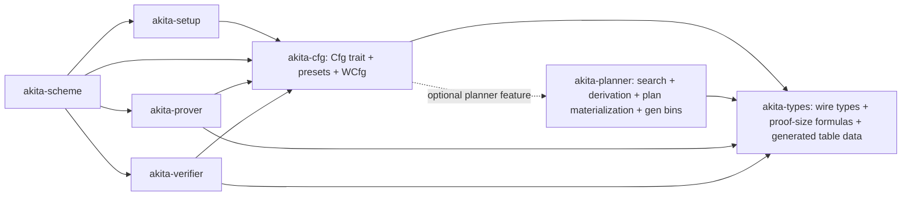

# Spec: Planner / Config Consolidation — Single `Cfg` Trait, Single Planner Crate

| Field       | Value                          |
|-------------|--------------------------------|
| Author(s)   |                                |
| Created     | 2026-05-21                     |
| Status      | proposed                       |
| PR          |                                |

## Summary

Today, parameter selection and configuration are scattered across three crates with three overlapping traits and several duplicated models. `akita-types` owns wire types but also hosts substantive search/derivation logic (`schedule_plan_from_generated_entry`, `optimal_m_r_split`, the loops in `layout/sis_derivation.rs`) plus a data trait `ScheduleProvider`. `akita-config` defines `CommitmentConfig` (extending `ScheduleProvider`), all preset structs, `WCommitmentConfig`, and runtime adapter modules (`schedule_policy.rs`, `sis_policy.rs`) whose only role is to translate `Cfg` shape into planner shape. `akita-planner` defines a third trait, `PlannerConfig`, whose hooks mirror `CommitmentConfig`, and ships parallel copies of `proof_size` and `sis_security`. `akita-scheme` ties everything together with verbose `_with_policy` closure adapters because `akita-prover`/`akita-verifier` are not allowed to know about config.

This refactor collapses the trait sprawl and crate sprawl. There will be exactly one `Cfg` trait, owned by a dedicated `akita-cfg` crate. All parameter computation lives in a single `akita-planner` crate (offline DP, plan-from-table materialization, SIS derivation, optimal `(m,r)` split, the universal benchmark planner, and the generated-table emission binaries). `Cfg` is the only parameter-selection API consumed by `akita-prover`, `akita-verifier`, `akita-scheme`, and `akita-setup`; for the stock presets, `Cfg`'s default method bodies delegate to `akita-planner`. `akita-prover` / `akita-verifier` / `akita-scheme` become generic over `Cfg` directly. They do not call `akita-planner` themselves; they go through `Cfg::...` only.

This is an explicit design tradeoff: `akita-cfg` may depend on `akita-planner` (gated by a `planner` feature for builds that want a table-only path), and therefore `akita-prover` / `akita-verifier` / `akita-scheme` may transitively depend on `akita-planner`. That tradeoff is deliberately accepted to keep `Cfg` as the single user-facing API. Anyone who wants a planner-free configuration writes a custom `Cfg` impl that overrides every default and references no planner symbols; commit/prove/verify are unaffected.

The refactor is purely a code organization change. Generated schedules, proof bytes, transcript streams, prover/verifier behavior, and the SIS-security model are unchanged. There are no backward-compatibility shims; old trait names, old `_with_policy` entry points, and old crate names are deleted in the same PR.

## Intent

### Goal

Restructure planner/config code around two crates and one trait:

1. **`akita-planner`** computes all params. It owns offline DP, plan-from-table materialization, SIS derivation, optimal `(m,r)` search, the universal benchmark planner, and the binaries that emit generated tables. Its API is free functions taking concrete data structs; it exposes no traits.
2. **`akita-cfg`** (replacement for `akita-config`) defines the single `Cfg` trait and ships every preset implementation. Stock presets delegate parameter computation to `akita-planner`; this is implemented as default method bodies on `Cfg` (gated by the `planner` feature) so that custom `Cfg` impls can override every method and avoid planner code entirely.
3. **`akita-prover` / `akita-verifier` / `akita-scheme` / `akita-setup`** become generic over `Cfg` directly. They consume parameters exclusively through `Cfg::...`. They do **not** call `akita-planner` symbols. The verbose `_with_policy` closure adapters in `akita-scheme` collapse into one-line `<Cfg>` generic calls.
4. **`akita-types`** keeps wire-protocol data only: `LevelParams`, `Schedule`, `AkitaSchedulePlan`, generated schedule table types, generated SIS floor tables, proof shapes, transcript descriptor types, and the proof-size formulas that the verifier needs for shape validation. `ScheduleProvider`, `GeneratedSchedulePlanPolicy`, `schedule_plan_from_generated_entry`, `optimal_m_r_split`, and the search/derivation loops in `layout/sis_derivation.rs` move to `akita-planner`.

#### Dependency direction



`akita-cfg`'s dependency on `akita-planner` is gated by the `planner` feature. `akita-scheme` (and `akita-pcs`) enable that feature, which is what every production caller uses. With Cargo's feature unification, `akita-prover` and `akita-verifier` linked into the same binary will see `akita-cfg` with `planner` enabled, and therefore transitively link `akita-planner`. That is acceptable; it is **not** a violation of any invariant. Builds that need a planner-free graph (for example, custom `Cfg` impls that override every method) can disable the feature and accept that the stock presets will not compile in that mode.

#### Consumption rule (the real boundary)

The boundary the spec enforces is at the **API**, not the dependency graph:

- `akita-prover`, `akita-verifier`, and `akita-scheme` source code must not contain `akita_planner::` paths. They acquire all parameters through `Cfg::...`.
- `akita-cfg` and `akita-planner` (and tests, examples, tooling) may call planner APIs freely.
- A user who wants a planner-free `Cfg` implementation overrides every `Cfg` default with their own logic. Commit / prove / verify code paths do not change.

### Invariants

This is an organizational refactor. The implementation must preserve:

1. **Protocol behavior.** Every currently valid proof verifies after the refactor, and every invalid proof rejected by current `main` remains rejected. Generated schedules emitted by `gen_schedule_tables` are byte-identical before and after, modulo cosmetic header comments (e.g. crate-name strings in generator preamble) which the spec explicitly allows.
2. **Transcript determinism.** Fiat-Shamir absorption order, labels, challenge derivation, sparse challenge sampling, and `AkitaInstanceDescriptor` byte encoding are unchanged. `PlanSection::from_schedule`, `SetupSection::level_params_digest`, and `AlgebraSection::for_fields` produce identical digests for identical inputs.
3. **Serialization compatibility.** `AkitaSerialize` / `AkitaDeserialize` encodings for commitments, proof objects, setup data, ring elements, flat vectors, and digit blocks remain byte-identical.
4. **Prover/verifier wire consistency.** Both sides consume the same `Schedule`, `LevelParams`, and `AkitaSchedulePlan` definitions from `akita-types`. No parallel copies of these shapes may exist in `akita-planner` or `akita-cfg`.
5. **Single user-facing trait.** Exactly one `Cfg` trait exists, in `akita-cfg`. `CommitmentConfig`, `ScheduleProvider`, `PlannerConfig`, and `PlannerFallbackConfig` are deleted, not renamed-and-aliased. `WCommitmentConfig` is renamed `WCfg<D, Cfg>` and stays as a derived recursive-w config.
6. **API boundary, not dependency boundary.** `akita-prover`, `akita-verifier`, and `akita-scheme` source code must not contain `akita_planner::` paths or any `use akita_planner::` imports. They obtain parameters only through `Cfg::...`. Transitive Cargo dependencies on `akita-planner` are explicitly allowed; this is a deliberate tradeoff to keep `Cfg` as the single API. CI enforces this via a source-grep, not via `cargo metadata`.
7. **Verifier no-panic contract** (AGENTS.md). Every `Cfg` method reachable from the verifier replay path returns `Result<_, AkitaError>` (or `Result<_, SerializationError>`) on malformed input. After the refactor, planner code is verifier-reachable transitively; therefore the no-panic contract extends to `akita-cfg` and to all verifier-reachable functions in `akita-planner`. Specifically, verifier-reachable `Cfg` hooks that today return non-`Result` values are migrated to `Result` returning variants:
   - `level_params_with_log_basis(...) -> Result<LevelParams, AkitaError>`
   - `log_basis_at_level(...) -> Result<u32, AkitaError>`
   - `stage1_challenge_config(d) -> Result<SparseChallengeConfig, AkitaError>`
   This is a breaking change, accepted under the no-backward-compat goal. `akita_types::scheduled_next_level_params` and `scheduled_fold_execution` are updated to accept `Result`-returning callbacks.
8. **Single source of truth per concern.**
   - One SIS-floor lookup: `akita_types::min_rank_for_secure_width` (drop `akita_planner/src/sis_security.rs`).
   - One production proof-size model: `akita_types::layout::proof_size`. The benchmark-only variants in `akita_planner/src/proof_size.rs` are kept under distinct names (e.g. `optimized_stage1_bytes`) and are confined to the universal-benchmark planner.
   - One runtime schedule type: `akita_types::Schedule`. The benchmark planner's internal `search::Schedule` is renamed `BenchmarkSchedule` and confined to `akita-planner`.
9. **Feature flags.** `akita-cfg` exposes a `planner` feature that gates the `akita-planner` dependency and the planner-backed default bodies on `Cfg`. `akita-scheme`, `akita-setup`, and `akita-pcs` enable `akita-cfg/planner` so their stock builds work end-to-end. Crates that want a planner-free graph disable the feature and supply custom `Cfg` impls that override every default. `parallel` and `zk` features survive in the same crates as today, propagated through `akita-cfg` to `akita-planner` and `akita-types` as needed.
10. **Generated tables remain the production fast path.** `Cfg::get_params_for_prove` (and the other parameter accessors) check the generated schedule table first; when the table contains an entry for the lookup key, the trait returns the materialized `Schedule` immediately, with no DP search. Planner DP runs only on table miss, and only when the `planner` feature is enabled. Verifier replay therefore does not run from-scratch DP in any production build.
11. **No churn beyond the refactor.** No protocol changes, no new presets, no field/ring changes, no Jolt-side migrations in the same PR. `profile/akita-recursion/` (a separate workspace) gets a small import-path follow-up; it is not in this PR.

Existing protections for these invariants:

- Generated schedule materialization tests: today in `crates/akita-config/src/schedule_policy.rs::tests` (move with the policy code into `akita-planner`).
- Transcript determinism: `crates/akita-pcs/tests/akita_e2e.rs`, `crates/akita-pcs/examples/transcript_schedule.rs`, logging-transcript event-stream tests.
- Verifier replay: `crates/akita-pcs/tests/akita_e2e.rs`, `crates/akita-pcs/tests/zk.rs`, `crates/akita-scheme/src/tests.rs`.
- Planner determinism: `crates/akita-planner/src/schedule_params.rs::tests`, `crates/akita-planner/src/search.rs::tests`, `crates/akita-planner/src/baseline.rs::tests::baseline_matches_expected`.
- Recursion soundness: `profile/akita-recursion/` standalone subworkspace (out-of-band; pinned-toolchain).

### Non-Goals

1. Changing protocol behavior, schedule selection, proof layout semantics, Fiat-Shamir labels, field arithmetic, or SIS security policy. Any "while we're in there" optimization belongs in a separate spec.
2. Adding or removing presets. The fp128/fp32/fp64/fp16 preset matrix is identical before and after.
3. Changing prover or verifier algorithms. Only their function signatures change (closure-based `_with_policy` entry points become `<Cfg>` generic).
4. Splitting `Cfg` into multiple subtraits (`AlgebraCfg`, `SisCfg`, `ScheduleCfg`, …). One unified trait is the chosen design; subtraits can be reintroduced later if a real use case appears.
5. Replacing generated table data with runtime DP. Tables remain the production fast path; the planner is the table-emitter and the table-miss fallback.
6. Migrating Jolt or `profile/akita-recursion/` to the new APIs in this PR. Those updates are follow-ups; the standalone profile subworkspace is excluded from this workspace.
7. Removing `WCfg<D, Cfg>` (the recursive-w derived config). It keeps its role; only the name changes.
8. Publishing crates to crates.io.
9. Preserving any backward compatibility. Old trait names, old function names, old crate names, and old `_with_policy` signatures are deleted in this PR. There are no compatibility shims, deprecated aliases, or transitional re-exports.

## Evaluation

### Acceptance Criteria

- [ ] Workspace has exactly two planning crates: `akita-planner` and `akita-cfg`. The `akita-config` crate name is gone.
- [ ] Exactly one trait `Cfg` in `akita-cfg`. `CommitmentConfig`, `ScheduleProvider`, `PlannerConfig`, and `PlannerFallbackConfig` no longer exist anywhere in the workspace.
- [ ] `akita-planner` exposes only free functions and plain data structs. No public trait remains in `crates/akita-planner/src/`.
- [ ] `akita-prover`, `akita-verifier`, and `akita-scheme` source code contains zero `akita_planner::` paths and zero `use akita_planner` imports. CI grep enforces this on the source tree of those three crates only (excluding tests, benches, examples, and the `_with_policy`-style internals during the migration window if any remain).
- [ ] `akita-cfg` has a `planner` feature that gates the optional `akita-planner` dependency and the planner-backed `Cfg` default method bodies. `akita-scheme`, `akita-setup`, and `akita-pcs` enable `akita-cfg/planner` in their default features.
- [ ] All `_with_policy` functions are removed from `akita-prover` and `akita-verifier` public APIs. The complete inventory listed in the Design section is migrated.
- [ ] `cargo test --workspace` passes. `cargo test -p akita-pcs --features zk` passes. `cargo test -p akita-pcs --no-default-features` passes.
- [ ] `cargo clippy --all --message-format=short -q -- -D warnings` passes.
- [ ] `cargo fmt -q --check` passes.
- [ ] `cargo run --release -p akita-planner --bin gen_schedule_tables -- <tmp_out>` produces generated schedule table content byte-identical to today's `crates/akita-types/src/generated/fp*.rs`, ignoring header comment lines that mention the old crate name. The diff tool used in CI excludes the leading `// generated by ...` block.
- [ ] `AKITA_MODE=onehot AKITA_NUM_VARS=32 cargo run --release --example profile` (in `crates/akita-pcs`) reports identical proof bytes, level counts, and transcript-bound digests pre/post refactor.
- [ ] `crates/akita-planner/src/baseline.rs::tests::baseline_matches_expected` continues to pass with identical totals.
- [ ] New test `crates/akita-pcs/tests/no_panic_verifier_cfg.rs` exercises adversarial inputs (malformed incidence summary, malformed `Schedule`, malformed setup envelope) and confirms `verify_batched::<Cfg>` rejects each with an `AkitaError`. No panic is observed under release or debug.
- [ ] New tests `crates/akita-cfg/tests/cfg_planner_free_overrides.rs` define a tiny custom `Cfg` impl that overrides every default and references no `akita_planner::` symbol; the test compiles and verifies a small fixture proof. This is the "planner-free Cfg" smoke test.
- [ ] CI source-grep job: `rg 'akita_planner' crates/akita-prover/src crates/akita-verifier/src crates/akita-scheme/src` returns empty.

### Testing Strategy

Existing test suites that must continue passing (with import-path updates only):

- `crates/akita-config/src/schedule_policy.rs::tests::*` move with the policy code into `akita-planner/src/materialize.rs` (or whatever final filename the implementer picks; see Design).
- `crates/akita-config/src/proof_optimized.rs::tests::*` move into `akita-cfg/src/proof_optimized.rs`.
- `crates/akita-config/src/lib.rs::tests::*` (fp128 SIS audits, extension-role tests) move with `Cfg` into `akita-cfg/src/lib.rs`.
- `crates/akita-planner/src/{baseline,schedule_params,search}.rs::tests::*` survive in place. The `sis_security.rs` and `proof_size.rs` test contents migrate into whichever module owns the merged code (`akita-types::layout::proof_size`, etc.).
- `crates/akita-pcs/tests/akita_e2e.rs`, `tests/zk.rs`, `tests/setup.rs`, `tests/ring_switch.rs` survive with import-path updates.
- `crates/akita-scheme/src/tests.rs`: the custom `PlannerConfig` impls (`Fp32RingSubfieldRootFoldCfg`, `Fp32RingSubfieldOuterFallbackCfg`, `RuntimePlanned<Cfg>` from `pcs/tests/zk.rs`) collapse into custom `Cfg` impls. The `RuntimePlanned` wrapper continues to exist as a test-only `Cfg` that disables generated-table fast-path and forces planner DP; this exercises the `planner` feature on the merged trait.

New tests to add:

- `crates/akita-pcs/tests/no_panic_verifier_cfg.rs`: feeds adversarial `Schedule`/`LevelParams`/incidence to `verify_batched::<Cfg>` and confirms `Result::Err(AkitaError::...)` rather than panic. Run under both `--release` and `--debug`.
- `crates/akita-cfg/tests/cfg_planner_free_overrides.rs`: defines a minimal `Cfg` impl that hard-codes a tiny `Schedule` and overrides every `Cfg` default. Builds with `--no-default-features` (planner feature off) and runs a round-trip prove/verify against a small claim. This is the contract test for the "planner-free Cfg" path.
- `crates/akita-cfg/tests/cfg_blanket_presets.rs`: one assertion per preset that `Cfg::sis_modulus_family()`, `Cfg::decomposition()`, and `Cfg::get_params_for_prove(...)` succeed for a small known `AkitaScheduleLookupKey`.
- A `LoggingTranscript` golden test, comparing event streams pre/post refactor under the `logging-transcript` feature, to catch any reorderings introduced by collapsing the closure layer.

Required CI matrix:

- default features (which include `akita-cfg/planner`)
- `--no-default-features`
- `--features zk` on `akita-pcs`
- `--features logging-transcript` on `akita-transcript` (and the consuming tests)
- `--release` build for the profile example (mandatory; the example's `AKITA_ALLOW_DEBUG_PROFILE` guard is unaffected)
- `cargo build -p akita-cfg --no-default-features` succeeds (planner-free configs compile; presets that depend on planner-backed defaults are gated behind `cfg(feature = "planner")`)

### Performance

This refactor must not change:

- **Proof bytes** for any preset on any `AkitaScheduleLookupKey`. Verified by `gen_schedule_tables` byte-diff (modulo header comments) and by reading `schedule.total_bytes` from a small fixture set in the transcript-schedule example.
- **Verifier hot path latency.** Today's closure-based `verify_batched_with_policy` and tomorrow's `verify_batched::<Cfg>` are both monomorphized per `Cfg`, so inlining is preserved. Verifier wallclock on the standard fp128 profile example stays within ±5% noise. (Tighter targets are infeasible without dedicated hardware; ±5% is the project's current measurement floor.)
- **Prover wallclock** for `AKITA_MODE=onehot AKITA_NUM_VARS=32 cargo run --release --example profile`. Same ±5% noise band.
- **Schedule planner DP wallclock** for `find_optimal_schedule_from_scratch` on the standard fixture set. The DP itself is byte-for-byte identical; only its trait surface changes.
- **Setup matrix sizing** (`AkitaSetupSeed::max_stride`, `max_num_batched_polys`, etc.) for all presets across the `(num_vars, num_polys, num_points)` tuples exercised by tests.
- **Generated-table fast path** is preserved. With the `planner` feature enabled, `Cfg::get_params_for_prove(...)` first calls `Cfg::schedule_plan(key)`, which checks the generated table and returns the materialized plan immediately on hit. Planner DP runs only on table miss. Verifier replay therefore performs no DP search in any production build; it materializes from the table and proceeds.

If `gen_schedule_tables` produces a non-cosmetic diff, or if `schedule.total_bytes` changes for any standard fixture, the refactor is incorrect and must be fixed before merge.

## Design

### Architecture

#### Crate inventory after the refactor

- **`akita-types`** — verifier-safe wire data. Unchanged in spirit; trimmed of search/derivation logic.
- **`akita-planner`** — all parameter-computation algorithms. Free-function API. Owns the `gen_schedule_tables` and `tune_small_field_schedules` binaries.
- **`akita-cfg`** — the `Cfg` trait, all preset implementations, `WCfg<D, Cfg>`, and the planner-backed default method bodies for `Cfg`. `planner` feature gates the `akita-planner` dependency.
- **`akita-setup`** — generic over `Cfg`. Calls `Cfg::envelope`, `Cfg::commitment_layout`, `Cfg::schedule_key`, etc.
- **`akita-scheme`** — thin glue. `batched_prove` / `batched_verify` are one-line calls into `akita-prover` / `akita-verifier`. Owns `bind_transcript_instance_descriptor` and the `D`-dispatch helpers.
- **`akita-prover`** — generic over `Cfg`. No `_with_policy` siblings. No `akita_planner::` references.
- **`akita-verifier`** — generic over `Cfg`. No `_with_policy` siblings. No `akita_planner::` references.
- **`akita-pcs`** — umbrella unchanged in spirit; re-exports updated; `planner` feature retained and wired through `akita-cfg`.

#### What stays in `akita-types`

`akita-types` continues to be the wire-data crate. After the refactor it owns:

- Layout primitives: [`LevelParams`](crates/akita-types/src/layout/params.rs), `AjtaiKeyParams`, `MRowLayout`, `RingOpeningPoint<F>`, `BasisMode`, `BlockOrder`.
- Runtime schedule types: `Schedule`, `Step`, `FoldStep`, `DirectStep`, `AkitaSchedulePlan` and the `AkitaPlanned*` sub-structs, `AkitaScheduleInputs`, `AkitaScheduleLookupKey`.
- Generated schedule table types: `GeneratedScheduleTable`, `GeneratedScheduleTableEntry`, `GeneratedScheduleKey`, `GeneratedStep`, `GeneratedFoldStep`, `GeneratedDirectStep`.
- **Generated schedule table data** (`crates/akita-types/src/generated/fp*.rs`) stays in `akita-types`. The data is small, pure, and does not bring search code with it. The `gen_schedule_tables` binary in `akita-planner` writes its output back into `crates/akita-types/src/generated/`. We pick this over moving the data files because (a) presets get to keep their `Cfg::schedule_table()` returning a static table without crossing crates, and (b) `akita-types` is already the canonical home for verifier-reachable static data.
- SIS floor tables: [`SisModulusFamily`](crates/akita-types/src/generated/sis_floor.rs), `sis_max_widths`, `min_rank_for_secure_width`, `ceil_supported_collision`.
- Decomposition / envelope: `DecompositionParams`, `CommitmentEnvelope`, `AjtaiRole`.
- Transcript binding: `AkitaInstanceDescriptor` + all `*Section` types, `digest_effective_schedule`, `digest_level_params`.
- Plan-translation helpers used at runtime: `schedule_from_plan`, `schedule_root_fold_step`. `scheduled_fold_execution` and `scheduled_next_level_params` stay here too, but their callback signatures change to `Result`-returning (see Invariants).
- Verifier-reachable proof-size formulas: `layout/proof_size.rs` (`level_proof_bytes`, `terminal_level_proof_bytes`, `direct_witness_bytes`, `extension_opening_reduction_proof_bytes`, `sumcheck_rounds`, `planned_w_ring_element_count`, `planned_next_w_len`).
- Proof wire shapes: everything under `proof/`.

`AkitaSchedulePlan::direct_step` and `AkitaSchedulePlan::initial_state` panic today on malformed plans; these are converted to `Result` since they are reachable from verifier-reachable code paths once `Cfg::get_params_for_prove` errors propagate through the new generic surface.

#### What moves out of `akita-types`

| From | To | Notes |
|------|----|-------|
| `ScheduleProvider` trait | deleted | folded into `Cfg` |
| `GeneratedSchedulePlanPolicy<Stage1Config, ScaleBatchedRoot, DirectLevelParams>` | `akita_planner::PlanPolicy` | becomes a plain struct of `fn(...)` pointers, not generic over three callable types |
| `schedule_plan_from_generated_entry` | `akita_planner::schedule_plan_from_table` | free function |
| `generated_schedule_plan_from_table` | absorbed into `akita_planner::schedule_plan_from_table` |
| `optimal_m_r_split` (in `layout/digit_math.rs`) | `akita_planner::digit_math::optimal_m_r_split` | search loop |
| `sis_secure_level_params`, `sis_derived_root_params_for_layout`, `sis_derived_recursive_params_for_layout`, `derived_root_commitment_layout_from_params`, `recursive_level_layout_from_params`, `level_layout_from_params` (all in `layout/sis_derivation.rs`) | `akita_planner::derivation::*` | derivation loops |

Note: `GeneratedScheduleTable` *types* stay in `akita-types`. The accessor functions (`fp128_d64_onehot_table()` etc.) currently in `crates/akita-types/src/generated/mod.rs` and family-specific modules also stay in `akita-types` so presets can call them without a planner-feature gate.

#### What `akita-planner` looks like

```
crates/akita-planner/
├── Cargo.toml
└── src/
    ├── lib.rs            — re-exports
    ├── search.rs         — production DP: find_optimal_schedule, SearchOptions
    ├── benchmark.rs      — universal multi-D ring-ladder planner (was search.rs::run_universal_planner)
    ├── baseline.rs       — legacy fixed-(D,na,nb,nd) DP for regression tests
    ├── materialize.rs    — schedule_plan_from_table + PlanPolicy + plan validation
    ├── derivation.rs     — sis_secure_level_params, derive_root_layout, derive_recursive_layout, etc.
    ├── digit_math.rs     — optimal_m_r_split and helpers moved from akita-types
    ├── proof_size.rs     — only the benchmark-optimized variants (renamed e.g. optimized_stage1_bytes)
    └── bin/
        ├── akita-planner.rs            — diagnostic CLI
        ├── gen_schedule_tables.rs      — moved from akita-config; writes output into akita-types/src/generated/
        └── tune_small_field_schedules.rs — moved from akita-config
```

`PlannerConfig`, `sis_security.rs`, and the duplicate `proof_size.rs::field_bytes`/`ring_vec_bytes`/`stage1_bytes_*`/`packed_digits_bytes`/`baseline_*` style helpers are deleted (their callers move to `akita_types::layout::proof_size`).

The production `find_optimal_schedule` takes a value-typed `SearchOptions`:

```rust
pub struct SearchOptions {
    pub key: AkitaScheduleLookupKey,
    pub decomposition: DecompositionParams,
    pub sis_modulus_family: SisModulusFamily,
    pub challenge_field_bits: u32,
    pub extension_opening_width: usize,
    pub recursive_witness_expansion: usize,
    pub recursive_public_rows: usize,
    pub allow_table_fast_path: bool,
    pub table: Option<&'static GeneratedScheduleTable>,
    pub stage1_challenge_config: fn(usize) -> Result<SparseChallengeConfig, AkitaError>,
    pub root_level_layout_with_log_basis:
        fn(AkitaScheduleInputs, u32) -> Result<LevelParams, AkitaError>,
    pub current_level_layout_with_log_basis:
        fn(AkitaScheduleInputs, u32) -> Result<LevelParams, AkitaError>,
    pub direct_level_params_with_log_basis:
        fn(AkitaScheduleInputs, u32) -> Result<LevelParams, AkitaError>,
    pub root_level_params_for_layout_with_log_basis:
        fn(AkitaScheduleInputs, &LevelParams) -> Result<LevelParams, AkitaError>,
    pub log_basis_search_range: fn(AkitaScheduleInputs) -> (u32, u32),
}

pub fn find_optimal_schedule(opts: &SearchOptions) -> Result<Schedule, AkitaError>;
pub fn find_optimal_schedule_from_scratch(opts: &SearchOptions) -> Result<Schedule, AkitaError>;
```

`SearchOptions` includes `direct_level_params_with_log_basis` because the production DP needs both the recursive layout hook and the terminal/direct layout hook (current `PlannerConfig::planner_direct_level_params_with_log_basis`). Without it the DP cannot evaluate the "ship witness directly" branch on recursive levels.

The `fn(...)` pointers replace today's `PlannerConfig` associated functions. They are passed as plain values, so the planner has no generic config parameter. For `WCfg<D, Cfg>` paths that delegate to the parent `Cfg`'s associated functions, the preset module supplies named `fn` items per ring degree (no closure captures needed); if a future config does need captures, the field becomes `Box<dyn Fn(...) -> _ + Send + Sync + 'static>`.

Plan-from-table materialization is similar:

```rust
pub struct PlanPolicy {
    pub sis_family: SisModulusFamily,
    pub root_decomp: DecompositionParams,
    pub challenge_field_bits: u32,
    pub recursive_public_rows: usize,
    pub extension_opening_width: usize,
    pub stage1_challenge_config: fn(usize) -> Result<SparseChallengeConfig, AkitaError>,
    pub scale_batched_root_layout: fn(
        layout: &LevelParams,
        num_claims: usize,
        challenge_l1_mass: usize,
        field_bits: u32,
    ) -> Result<LevelParams, AkitaError>,
    pub direct_level_params: fn(
        AkitaScheduleInputs,
        u32,
    ) -> Result<LevelParams, AkitaError>,
}

pub fn schedule_plan_from_table(
    table: &GeneratedScheduleTable,
    key: AkitaScheduleLookupKey,
    policy: &PlanPolicy,
) -> Result<Option<AkitaSchedulePlan>, AkitaError>;
```

The benchmark planner (`run_universal_planner`) keeps its own multi-D ring-ladder DP and its own internal struct types, but the public-facing schedule wire type is `akita_types::Schedule` everywhere; the old `akita_planner::search::Schedule` is renamed `BenchmarkSchedule` and confined to `benchmark.rs`.

#### What `akita-cfg` looks like

```
crates/akita-cfg/
├── Cargo.toml          — planner feature gates the akita-planner dep + planner-backed default bodies
└── src/
    ├── lib.rs              — Cfg trait, WCfg<D, Cfg>, default-body helpers
    └── proof_optimized.rs  — fp128, fp32, fp64, fp16 preset modules
```

`Cargo.toml` (sketch):

```toml
[features]
default = ["parallel", "planner"]
parallel = ["akita-planner?/parallel", "akita-types/parallel"]
planner = ["dep:akita-planner"]
zk = ["akita-planner?/zk", "akita-types/zk"]

[dependencies]
akita-planner = { path = "../akita-planner", optional = true }
akita-types = { path = "../akita-types" }
# ... transcript / challenges / field / etc.
```

The `Cfg` trait is the single user-facing trait. Verifier-reachable hooks return `Result`; preset bodies are the only place where panics could exist today, and the migration eliminates them.

```rust
//! crates/akita-cfg/src/lib.rs (sketch)

use akita_challenges::SparseChallengeConfig;
use akita_field::{AkitaError, CanonicalField, ExtField, FieldCore};
#[cfg(feature = "planner")]
use akita_planner::{PlanPolicy, SearchOptions};
use akita_transcript::{append_ext_field, sample_ext_challenge, Transcript};
use akita_types::{
    AjtaiRole, AkitaScheduleInputs, AkitaScheduleLookupKey, AkitaSchedulePlan,
    ClaimIncidenceSummary, CommitmentEnvelope, DecompositionParams, GeneratedScheduleTable,
    LevelParams, Schedule, SisModulusFamily,
};

pub trait Cfg: Clone + Send + Sync + 'static {
    // -------- algebra --------
    type Field: CanonicalField + FieldCore;
    type ClaimField: ExtField<Self::Field>;
    type ChallengeField: ExtField<Self::Field> + ExtField<Self::ClaimField>;

    const D: usize;
    const CLAIM_EXT_DEGREE: usize = <Self::ClaimField as ExtField<Self::Field>>::EXT_DEGREE;
    const CHAL_EXT_DEGREE: usize = <Self::ChallengeField as ExtField<Self::Field>>::EXT_DEGREE;

    // -------- required config "facts" (no defaults) --------
    fn decomposition() -> DecompositionParams;
    fn sis_modulus_family() -> SisModulusFamily;
    fn stage1_challenge_config(d: usize) -> Result<SparseChallengeConfig, AkitaError>;
    fn envelope(max_num_vars: usize) -> CommitmentEnvelope;
    fn audited_root_rank(role: AjtaiRole, max_num_vars: usize) -> usize;
    fn max_setup_matrix_size(
        max_num_vars: usize,
        max_num_batched_polys: usize,
        max_num_points: usize,
    ) -> Result<(usize, usize), AkitaError>;
    fn ring_subfield_embedding_norm_bound() -> u32 {
        if Self::CLAIM_EXT_DEGREE == 1 { 1 } else { 2 }
    }

    fn schedule_table() -> Option<GeneratedScheduleTable> { None }
    fn schedule_key(key: AkitaScheduleLookupKey) -> String;

    // -------- layout hooks (verifier-reachable; all return Result) --------
    fn level_params_with_log_basis(
        inputs: AkitaScheduleInputs,
        log_basis: u32,
    ) -> Result<LevelParams, AkitaError>;
    fn root_level_layout_with_log_basis(
        inputs: AkitaScheduleInputs,
        log_basis: u32,
    ) -> Result<LevelParams, AkitaError>;
    fn root_level_params_for_layout_with_log_basis(
        inputs: AkitaScheduleInputs,
        lp: &LevelParams,
    ) -> Result<LevelParams, AkitaError>;
    fn log_basis_at_level(inputs: AkitaScheduleInputs) -> Result<u32, AkitaError>;
    fn log_basis_search_range(inputs: AkitaScheduleInputs) -> (u32, u32);

    // -------- planner-backed defaults (gated by `planner` feature) --------
    //
    // These are the API surface that prover/verifier/scheme call. With the
    // `planner` feature enabled, defaults delegate to akita-planner. With it
    // disabled, defaults route through the generated table only and return
    // `AkitaError` on table miss; users that want any other behavior must
    // override every default.

    #[cfg(feature = "planner")]
    fn plan_policy() -> PlanPolicy;
    #[cfg(feature = "planner")]
    fn search_options(key: AkitaScheduleLookupKey) -> SearchOptions;

    fn schedule_plan(
        key: AkitaScheduleLookupKey,
    ) -> Result<Option<AkitaSchedulePlan>, AkitaError> {
        let Some(table) = Self::schedule_table() else {
            return Ok(None);
        };
        #[cfg(feature = "planner")]
        {
            akita_planner::schedule_plan_from_table(&table, key, &Self::plan_policy())
        }
        #[cfg(not(feature = "planner"))]
        {
            // Pure-table mode: only generated entries are honored. Override
            // this method in a custom `Cfg` impl to plug in a different
            // materializer.
            akita_types::generated::table_entry(&table, key.into())
                .map(/* materialize without planner; helper lives in akita-types */)
                .transpose()
        }
    }

    fn commitment_layout(max_num_vars: usize) -> Result<LevelParams, AkitaError> {
        // Table → first fold → planner fallback (with feature) → tiny-root fallback.
        // Same control flow as today's CommitmentConfig::commitment_layout, but
        // routed through Cfg APIs only.
        default_commitment_layout::<Self>(max_num_vars)
    }

    fn get_params_for_commitment(
        num_vars: usize,
        num_polys_per_point: usize,
        max_num_points: usize,
    ) -> Result<LevelParams, AkitaError> {
        default_get_params_for_commitment::<Self>(num_vars, num_polys_per_point, max_num_points)
    }

    fn get_params_for_prove(
        incidence: &ClaimIncidenceSummary,
    ) -> Result<Schedule, AkitaError> {
        let key = AkitaScheduleLookupKey::new_from_incidence(incidence)?;

        // 1. Fast path: generated table.
        if let Some(plan) = Self::schedule_plan(key)? {
            return Ok(akita_types::schedule_from_plan(
                &plan,
                Self::decomposition().field_bits(),
            ));
        }

        // 2. Fallback: planner DP, only when feature is enabled.
        #[cfg(feature = "planner")]
        {
            return akita_planner::find_optimal_schedule(&Self::search_options(key));
        }

        // 3. No planner feature: refuse rather than guess.
        #[cfg(not(feature = "planner"))]
        {
            Err(AkitaError::InvalidSetup(format!(
                "no generated schedule for key {key:?}; enable akita-cfg/planner or override Cfg::get_params_for_prove"
            )))
        }
    }

    fn get_params_for_batched_commitment(
        incidence: &ClaimIncidenceSummary,
    ) -> Result<LevelParams, AkitaError> {
        let schedule = Self::get_params_for_prove(incidence)?;
        match schedule.steps.first() {
            Some(akita_types::Step::Fold(root_step)) => Ok(root_step.params.clone()),
            _ => Self::commitment_layout(incidence.num_vars()),
        }
    }

    // -------- transcript convenience (unchanged behavior) --------
    fn append_claim_field<T: Transcript<Self::Field>>(
        transcript: &mut T,
        label: &[u8],
        x: &Self::ClaimField,
    ) {
        append_ext_field::<Self::Field, Self::ClaimField, T>(transcript, label, x);
    }

    fn sample_challenge_field<T: Transcript<Self::Field>>(
        transcript: &mut T,
        label: &[u8],
    ) -> Self::ChallengeField {
        sample_ext_challenge::<Self::Field, Self::ChallengeField, T>(transcript, label)
    }
}
```

Two things to call out for reviewers:

1. **`planner` is a feature on `akita-cfg`, not on the API surface.** Prover/verifier/scheme only see `Cfg::get_params_for_prove` and friends. Whether those defaults call planner DP or refuse on table miss is decided per-build by enabling the feature. The default features of `akita-scheme`, `akita-setup`, and `akita-pcs` include `akita-cfg/planner`, so production builds keep working out of the box.
2. **Overriding all defaults gives you a planner-free Cfg.** Anyone who wants no planner code in the binary disables `akita-cfg/planner` and supplies a custom `Cfg` impl that overrides every default (`schedule_plan`, `commitment_layout`, `get_params_for_commitment`, `get_params_for_prove`, `get_params_for_batched_commitment`). They reference no `akita_planner::` symbols and the Cargo build will not link the planner crate. The `cfg_planner_free_overrides.rs` test enforces this path keeps working.

`WCfg<D, Cfg>` keeps the recursive-w derived-config role. It delegates every required hook to the parent `Cfg`, except `decomposition` (recursive `w` entries are balanced digits, so `log_commit_bound = log_basis`) and `commitment_layout` (recursive configs do not own a commitment layout):

```rust
#[derive(Clone, Copy, Debug)]
pub struct WCfg<const D: usize, C: Cfg> {
    _cfg: PhantomData<C>,
}

impl<const D: usize, C: Cfg> Cfg for WCfg<D, C> {
    type Field = C::Field;
    type ClaimField = C::ClaimField;
    type ChallengeField = C::ChallengeField;
    const D: usize = D;

    fn decomposition() -> DecompositionParams {
        akita_types::recursive_level_decomposition_from_root(C::decomposition())
    }

    fn sis_modulus_family() -> SisModulusFamily { C::sis_modulus_family() }
    fn stage1_challenge_config(d: usize) -> Result<SparseChallengeConfig, AkitaError> {
        C::stage1_challenge_config(d)
    }
    fn envelope(max_num_vars: usize) -> CommitmentEnvelope { C::envelope(max_num_vars) }
    fn audited_root_rank(role: AjtaiRole, max_num_vars: usize) -> usize {
        C::audited_root_rank(role, max_num_vars)
    }
    fn max_setup_matrix_size(...) -> Result<(usize, usize), AkitaError> {
        C::max_setup_matrix_size(...)
    }

    fn schedule_table() -> Option<GeneratedScheduleTable> { C::schedule_table() }
    fn schedule_key(key: AkitaScheduleLookupKey) -> String { C::schedule_key(key) }

    fn level_params_with_log_basis(inputs: AkitaScheduleInputs, log_basis: u32)
        -> Result<LevelParams, AkitaError>
    {
        C::level_params_with_log_basis(inputs, log_basis)
    }
    fn root_level_layout_with_log_basis(inputs: AkitaScheduleInputs, log_basis: u32)
        -> Result<LevelParams, AkitaError>
    {
        C::root_level_layout_with_log_basis(inputs, log_basis)
    }
    fn root_level_params_for_layout_with_log_basis(inputs: AkitaScheduleInputs, lp: &LevelParams)
        -> Result<LevelParams, AkitaError>
    {
        C::root_level_params_for_layout_with_log_basis(inputs, lp)
    }
    fn log_basis_at_level(inputs: AkitaScheduleInputs) -> Result<u32, AkitaError> {
        C::log_basis_at_level(inputs)
    }
    fn log_basis_search_range(inputs: AkitaScheduleInputs) -> (u32, u32) {
        C::log_basis_search_range(inputs)
    }

    #[cfg(feature = "planner")]
    fn plan_policy() -> PlanPolicy { C::plan_policy() }
    #[cfg(feature = "planner")]
    fn search_options(key: AkitaScheduleLookupKey) -> SearchOptions { C::search_options(key) }

    fn commitment_layout(_: usize) -> Result<LevelParams, AkitaError> {
        Err(AkitaError::InvalidSetup(
            "WCfg has no commitment layout".into(),
        ))
    }
}
```

A concrete preset (fp128 D64 onehot) goes from this:

```rust
// today: crates/akita-config/src/proof_optimized.rs
impl ScheduleProvider for fp128::D64OneHot { /* table, key, plan */ }
impl CommitmentConfig for fp128::D64OneHot { /* algebra + hooks */ }
#[cfg(feature = "planner")]
impl akita_planner::PlannerConfig for fp128::D64OneHot { /* mirror hooks */ }
```

to this:

```rust
// after: crates/akita-cfg/src/proof_optimized.rs
impl Cfg for fp128::D64OneHot {
    type Field = Prime128OffsetA7F7;
    type ClaimField = Prime128OffsetA7F7;
    type ChallengeField = Prime128OffsetA7F7;
    const D: usize = 64;

    fn decomposition() -> DecompositionParams { fp128_decomposition(/* ... */) }
    fn sis_modulus_family() -> SisModulusFamily { SisModulusFamily::Q128 }
    fn stage1_challenge_config(d: usize) -> Result<SparseChallengeConfig, AkitaError> {
        fp128_stage1_challenge_config(d)
    }
    fn envelope(max_num_vars: usize) -> CommitmentEnvelope { /* ... */ }
    fn audited_root_rank(role: AjtaiRole, max_num_vars: usize) -> usize { /* ... */ }
    fn max_setup_matrix_size(...) -> Result<(usize, usize), AkitaError> { /* ... */ }

    fn schedule_table() -> Option<GeneratedScheduleTable> {
        Some(akita_types::generated::fp128_d64_onehot::table())
    }
    fn schedule_key(key: AkitaScheduleLookupKey) -> String { format!("fp128_d64_onehot::{key:?}") }

    fn level_params_with_log_basis(inputs: AkitaScheduleInputs, log_basis: u32)
        -> Result<LevelParams, AkitaError> { /* ... */ }
    fn root_level_layout_with_log_basis(inputs: AkitaScheduleInputs, log_basis: u32)
        -> Result<LevelParams, AkitaError> { /* ... */ }
    fn root_level_params_for_layout_with_log_basis(inputs: AkitaScheduleInputs, lp: &LevelParams)
        -> Result<LevelParams, AkitaError> { /* ... */ }
    fn log_basis_at_level(inputs: AkitaScheduleInputs) -> Result<u32, AkitaError> { /* ... */ }
    fn log_basis_search_range(_: AkitaScheduleInputs) -> (u32, u32) {
        (PROOF_OPTIMIZED_LOG_BASIS_MIN, PROOF_OPTIMIZED_LOG_BASIS_MAX)
    }

    #[cfg(feature = "planner")]
    fn plan_policy() -> PlanPolicy { fp128_plan_policy::<Self>() }
    #[cfg(feature = "planner")]
    fn search_options(key: AkitaScheduleLookupKey) -> SearchOptions {
        fp128_search_options::<Self>(key)
    }
}
```

The `fp128_plan_policy::<Self>` and `fp128_search_options::<Self>` helpers are family-shared functions that build value-typed planner inputs from `Cfg::` associated functions; they live in `akita-cfg/src/proof_optimized.rs`. The `impl_fp128_preset!` / `impl_small_field_preset!` macros are simplified to emit a single `impl Cfg` block per preset.

#### What `akita-prover` looks like

`prove_batched_with_policy` becomes `prove_batched::<F, Cfg, T, P, D>`:

```rust
// before: crates/akita-prover/src/protocol/flow.rs (today)
pub fn prove_batched_with_policy<
    F, ClaimF, ChalF, T, P, const D: usize,
    SelectSchedule: FnOnce(&ClaimIncidenceSummary) -> Result<Schedule, AkitaError>,
    SelectRootNext: FnOnce(&Schedule, AkitaScheduleInputs) -> Result<LevelParams, AkitaError>,
    BindDescriptor: FnOnce(&mut T, &ClaimIncidenceSummary, &Schedule, BasisMode) -> Result<(), AkitaError>,
    ProveFolded: FnOnce(...) -> Result<AkitaBatchedProof<F, ChalF>, AkitaError>,
>(
    setup: &AkitaExpandedSetup<F, D>,
    claims: ProverClaims<'_, ClaimF, RingCommitment<F, D>>,
    transcript: &mut T,
    basis: BasisMode,
    select_schedule: SelectSchedule,
    select_root_next: SelectRootNext,
    bind_descriptor: BindDescriptor,
    prove_folded: ProveFolded,
) -> Result<AkitaBatchedProof<F, ChalF>, AkitaError>
```

```rust
// after: crates/akita-prover/src/protocol/flow.rs
pub fn prove_batched<F, Cfg, T, P, const D: usize>(
    setup: &AkitaExpandedSetup<F, D>,
    claims: ProverClaims<'_, Cfg::ClaimField, RingCommitment<F, D>>,
    transcript: &mut T,
    basis: BasisMode,
) -> Result<AkitaBatchedProof<F, Cfg::ChallengeField>, AkitaError>
where
    F: FieldCore + CanonicalField + /* ... */,
    Cfg: akita_cfg::Cfg<Field = F>,
    Cfg::ClaimField: RingSubfieldEncoding<F>,
    Cfg::ChallengeField: RingSubfieldEncoding<F> + /* ... */,
    T: Transcript<F>,
    P: AkitaPolyOps<F, D>,
{
    let incidence = claims.incidence_summary().clone();
    let schedule = Cfg::get_params_for_prove(&incidence)?;
    bind_transcript_instance_descriptor::<F, T, D, Cfg>(setup, &incidence, &schedule, basis, transcript)?;
    let next_params = scheduled_next_level_params(
        &schedule,
        1,
        root_next_inputs(&incidence),
        Cfg::level_params_with_log_basis,
    )?;
    prove_folded_batched::<F, Cfg, T, P, D>(
        setup, transcript, claims, &schedule, basis, &next_params,
    )
}
```

The same pattern applies to every `_with_policy` entry point. The full inventory and the migration target for each:

| Today (in crate) | Becomes | Notes |
|------------------|---------|-------|
| `prove_batched_with_policy` (`akita-prover`) | `prove_batched::<F, Cfg, T, P, D>` | top-level prove API |
| `prove_folded_batched_with_policy` (`akita-prover`) | `prove_folded_batched::<F, Cfg, T, P, D>` | called from `prove_batched` |
| `prove_recursive_suffix_with_policy` (`akita-prover`) | `prove_recursive_suffix::<F, Cfg, T, D>` | recursive suffix driver |
| `prove_recursive_level_with_policy` (`akita-prover`) | `prove_recursive_level::<F, Cfg, T, D>` | per-intermediate-level |
| `prove_terminal_recursive_level_with_policy` (`akita-prover`) | `prove_terminal_recursive_level::<F, Cfg, T, D>` | per-terminal-level |
| `commit_with_policy` (`akita-prover`) | `commit::<F, Cfg, P, D>` | commitment API |
| `batched_commit_with_policy` (`akita-prover`) | `batched_commit::<F, Cfg, P, D>` | batched commitment API |
| `commit_next_w_with_policy` (`akita-prover`) | `commit_next_w::<F, Cfg, D>` | recursive `w` commit + ring-switch |
| `verify_batched_with_policy` (`akita-verifier`) | `verify_batched::<F, Cfg, T, D>` | top-level verify API |

`commit_with_params` / `batched_commit_with_params` (low-level helpers used by tests and benches that already take an explicit `LevelParams`) are kept as-is: they have nothing to do with `Cfg`. They are the "I already know my params, just commit" entry points.

`bind_transcript_instance_descriptor` (currently in `akita-scheme`) moves into `akita-prover` as a free function `bind_transcript_instance_descriptor::<F, T, D, Cfg>`. `akita-verifier` re-uses the same function via a `pub use` (or via `akita-types`, since the function only needs setup digests + descriptor types). Choosing prover-or-verifier-or-types as the home is a small implementation detail; the spec is agnostic, but the function must be reachable from both prover and verifier without going through `akita-scheme`.

#### What `akita-verifier` looks like

`verify_batched_with_policy` collapses into `verify_batched::<F, Cfg, T, D>`. The body covers everything today's `verify_batched_with_policy` does — schedule selection, root-direct fallback, descriptor binding, schedule-context preparation, root-direct commitment recheck, recursive replay — but with `Cfg::` calls in place of closures:

```rust
pub fn verify_batched<F, Cfg, T, const D: usize>(
    proof: &AkitaBatchedProof<F, Cfg::ChallengeField>,
    setup: &AkitaVerifierSetup<F>,
    transcript: &mut T,
    claims: VerifierClaims<'_, Cfg::ClaimField, RingCommitment<F, D>>,
    basis: BasisMode,
) -> Result<(), AkitaError>
where
    F: FieldCore + CanonicalField + /* ... */,
    Cfg: akita_cfg::Cfg<Field = F>,
    Cfg::ClaimField: RingSubfieldEncoding<F>,
    Cfg::ChallengeField: RingSubfieldEncoding<F> + /* ... */,
    T: Transcript<F>,
{
    check_batched_proof_step_shape(proof)?;

    let prepared = prepare_verifier_claims(&setup.expanded, &claims)?;
    let num_vars = prepared.incidence_summary.num_vars();

    // 1. Schedule selection. Cfg owns the table-vs-planner choice.
    let mut schedule = Cfg::get_params_for_prove(&prepared.incidence_summary)
        .map_err(|_| AkitaError::InvalidProof)?;

    // 2. Root-direct fallback if the folded root cannot serve the opening shape.
    if let Some(root_step) = schedule_root_fold_step(&schedule) {
        let alpha_bits = root_step.params.ring_dimension.trailing_zeros() as usize;
        if !folded_root_supports_opening_shape::<F, Cfg::ClaimField, Cfg::ChallengeField, D>(
            &prepared.opening_points,
            &root_step.params,
            alpha_bits,
        ) && !root_tensor_projection_enabled::<F, Cfg::ClaimField, Cfg::ChallengeField, D>(num_vars)
        {
            schedule = root_direct_schedule(num_vars).map_err(|_| AkitaError::InvalidProof)?;
        }
    }

    // 3. Bind the canonical descriptor preamble.
    bind_transcript_instance_descriptor::<F, T, D, Cfg>(
        setup, &prepared.incidence_summary, &schedule, basis, transcript,
    )?;

    // 4. Recursive level params successor closure (now Result-returning).
    let schedule_context = prepare_batched_verifier_schedule_context(num_vars, &schedule, |next_inputs| {
        scheduled_next_level_params(
            &schedule, 1, next_inputs, Cfg::level_params_with_log_basis,
        )
    })
    .map_err(|_| AkitaError::InvalidProof)?;

    // 5. Verifier replay; uses Cfg::get_params_for_batched_commitment for the
    //    root-direct commit recheck.
    verify_batched_proof_with_schedule::<F, Cfg, T, D>(
        proof, setup, transcript, prepared, basis, &schedule, schedule_context,
        |witnesses, commitments, incidence_summary, direct_commitment_payload| {
            let params = Cfg::get_params_for_batched_commitment(incidence_summary)
                .map_err(|_| AkitaError::InvalidProof)?;
            verify_root_direct_commitments_with_params::<F, D>(
                witnesses, setup, commitments, incidence_summary,
                &params, direct_commitment_payload,
            )
        },
    )
}
```

The verifier no-panic contract requires that every `Cfg` method reachable from this body returns `Result<_, AkitaError>`. The Invariants section lists the trait signatures that change accordingly. The new `tests/no_panic_verifier_cfg.rs` regression covers adversarial inputs.

#### What `akita-scheme` looks like

Scheme keeps two responsibilities:

1. The `CommitmentScheme<F, D>` / `CommitmentProver<F, D>` / `CommitmentVerifier<F, D>` trait impls (the public scheme API).
2. The intermediate `D`-dispatch helpers that today live in `crates/akita-scheme/src/lib.rs::dispatch_prove_level` / `dispatch_prove_terminal_level`. These remain in scheme because they pin concrete ring dimensions for codegen reasons that are independent of `Cfg`. They become `<Cfg>`-generic but otherwise unchanged.

The closure-zoo blocks in today's `batched_prove` and `batched_verify` collapse to one-liners:

```rust
impl<F, const D: usize, Cfg, P> CommitmentProver<F, D> for AkitaCommitmentScheme<D, Cfg>
where
    F: /* ... */,
    Cfg: akita_cfg::Cfg<Field = F>,
    P: AkitaPolyOps<F, D>,
    /* ... */
{
    fn batched_prove<'a, T: Transcript<F>>(
        setup: &Self::Setup, claims: Self::ProverClaims<'a>,
        transcript: &mut T, basis: BasisMode,
    ) -> Result<Self::BatchedProof, AkitaError> {
        akita_prover::prove_batched::<F, Cfg, T, P, D>(
            &setup.expanded, claims, transcript, basis,
        )
    }
}

impl<F, const D: usize, Cfg> CommitmentVerifier<F, D> for AkitaCommitmentScheme<D, Cfg>
where
    F: /* ... */,
    Cfg: akita_cfg::Cfg<Field = F>,
    /* ... */
{
    fn batched_verify<'a, T: Transcript<F>>(
        proof: &Self::BatchedProof, setup: &Self::VerifierSetup,
        transcript: &mut T, claims: VerifierClaims<'a, Cfg::ClaimField, Self::Commitment>,
        basis: BasisMode,
    ) -> Result<(), AkitaError> {
        akita_verifier::verify_batched::<F, Cfg, T, D>(
            proof, setup, transcript, claims, basis,
        )
    }
}
```

The 80+ line closure block in today's `AkitaCommitmentScheme::batched_prove` collapses to one call. The dispatch helpers (multi-`D` ring switching, root tensor projection trigger, recursive suffix wiring) stay in scheme because they own `D`-time ring-degree codegen. They are simplified — closures become direct `Cfg::` calls — but they do not move out of scheme.

#### What `akita-types::generated` looks like

`akita-types::generated` keeps both the table types and the table data, since the data is small, pure, and verifier-reachable for descriptor digest validation:

```rust
// crates/akita-types/src/generated/mod.rs
mod sis_floor;
pub use sis_floor::{
    SisModulusFamily, ceil_supported_collision, min_rank_for_secure_width, sis_max_widths,
};

pub struct GeneratedFoldStep { /* unchanged */ }
pub enum GeneratedStep { /* unchanged */ }
pub struct GeneratedScheduleKey { /* unchanged */ }
pub struct GeneratedScheduleTableEntry { /* unchanged */ }
pub struct GeneratedScheduleTable { /* unchanged */ }

// Static table data — produced by the gen_schedule_tables binary in akita-planner,
// but the .rs files live here for verifier accessibility and to avoid forcing
// every Cfg::schedule_table() call to cross the planner-feature gate.
pub mod fp128_d32_full;
pub mod fp128_d32_onehot;
// ... and so on for every preset family/D, with `_zk` variants behind the zk feature.

pub fn table_entry(
    table: &GeneratedScheduleTable,
    key: GeneratedScheduleKey,
) -> Option<&'static GeneratedScheduleTableEntry> { /* unchanged */ }
```

#### Removed code summary

- `crates/akita-config/` → renamed to `crates/akita-cfg/`. Internal modules `schedule_policy.rs` and `sis_policy.rs` move to `akita-planner` (as `materialize.rs` and `derivation.rs`, or whatever final names). `bin/` moves to `akita-planner/src/bin/`.
- `crates/akita-planner/src/lib.rs::PlannerConfig` — deleted; replaced by `SearchOptions` and `PlanPolicy` value structs.
- `crates/akita-planner/src/sis_security.rs` — deleted; callers use `akita_types::min_rank_for_secure_width` directly.
- `crates/akita-planner/src/proof_size.rs` — pruned to only the benchmark-optimized variants (renamed `optimized_*`); duplicates of `akita_types::layout::proof_size` are deleted.
- `crates/akita-config/src/lib.rs::PlannerFallbackConfig` — deleted; `akita-cfg` exposes a `planner` feature that gates the optional `akita-planner` dependency and the planner-backed default method bodies.
- `crates/akita-prover/**::*_with_policy` and `crates/akita-verifier/**::*_with_policy` — deleted (replaced by `<Cfg>` generic siblings, full inventory above).
- `crates/akita-types/src/layout/sis_derivation.rs` — search/derivation loops move to `akita-planner`. Pure layout helpers that the verifier still uses (`level_layout_from_params`, `recursive_level_layout_from_params`, `recursive_level_decomposition_from_root`) stay in `akita-types`.

### Alternatives Considered

1. **Keep policy-closure decoupling; only merge `akita-config` into `akita-planner`.** Verifier never compiles config or planner. Rejected because the user explicitly chose the generic-over-`Cfg` model. The closure-soup in `akita-scheme` is hard to read and hard to extend (every new policy hook adds a generic parameter to `prove_batched_with_policy`).
2. **Put `Cfg` in `akita-types`.** Lets `akita-verifier` depend only on `akita-types` for the trait. Rejected because `Cfg` impls (presets) want to live next to the trait, and presets pull in algebra/SIS dependencies that do not belong in the wire-types crate.
3. **Split `Cfg` trait into a verifier-safe core crate and a presets-and-planner crate so verifier depends only on the core.** Matches a stricter dependency invariant. Rejected because the user explicitly accepted transitive `akita-planner` in the verifier graph in exchange for a single `Cfg` trait crate. If we later want a planner-free verifier graph, this split is the next refactor; the current spec preserves that option by keeping all planner-backed bodies inside `#[cfg(feature = "planner")]` defaults.
4. **One consolidated crate (single `akita-planner` containing trait + presets + search).** Matches the literal reading of "only one planner crate". Rejected because `Cfg` deserves its own crate to keep the trait surface readable and so that the planner crate stays a free-function utility library.
5. **Split `Cfg` into subtraits (`AlgebraCfg`, `SisCfg`, `ScheduleCfg`, `PlannerCfg`).** Could give compile-error locality. Rejected as more ceremony than benefit; one `Cfg` matches the user's intent. Subtraits can be reintroduced later.
6. **Replace generated tables with runtime-only planner runs.** Rejected: tables are the production fast path and remain so.
7. **Make `PlanPolicy` and `SearchOptions` generic over closures instead of `fn(...)` pointers.** More flexible (allows captures). Rejected for now: every current call site is a `Cfg` associated function (no captures needed); `fn(...)` pointers keep `PlanPolicy` `Clone`-able and `'static`. If a future config needs captures, switch the relevant field to `Box<dyn Fn(...) -> _ + Send + Sync + 'static>`; the change is local to `akita-planner`.

## Documentation

- `AGENTS.md` — update the "Crate Structure" section to remove `akita-config` and add `akita-cfg`. Update "Key Abstractions" to list `Cfg` (replacing the `CommitmentConfig` + `ScheduleProvider` + `PlannerConfig` triad). Update "Verifier No-Panic Contract" to add `akita-cfg` and the verifier-reachable parts of `akita-planner` to the list of no-panic-boundary crates.
- Crate-level docs: rewrite the top-of-file `//!` doc in `crates/akita-cfg/src/lib.rs`, `crates/akita-planner/src/lib.rs`, and `crates/akita-types/src/layout/mod.rs`.
- `crates/akita-pcs/examples/profile/` — update `Cfg` references and example imports.
- `specs/akita-pcs-crate-decomposition.md` — add a "Superseded by" link where it described `akita-config`.
- `profile/akita-recursion/README.md` — note the import path change (`akita_config` → `akita_cfg`) for the guest/artifact glue (this is the only change the profile subworkspace needs; it remains pinned to its own toolchain).
- This document is the spec; no separate companion doc is created.

## Execution

There is no backward-compatibility goal, so the recommended order optimizes for review legibility, not for keeping `cargo test --workspace` green at every commit. CI is expected to be green only at the head of the PR.

1. **Move planner-search and SIS-derivation algorithms out of `akita-types` into `akita-planner`.** This includes `schedule_plan_from_generated_entry` (becomes `schedule_plan_from_table`), `GeneratedSchedulePlanPolicy` (becomes `PlanPolicy`), `optimal_m_r_split`, and the derivation loops in `layout/sis_derivation.rs`. Static schedule table data (`fp*_d*.rs`) **stays** in `akita-types/src/generated/`. The pure layout helpers verifier code uses (`level_layout_from_params`, `recursive_level_layout_from_params`, `recursive_level_decomposition_from_root`) **stay** in `akita-types`.
2. **Drop the `PlannerConfig` trait.** Convert `find_optimal_schedule<Cfg: PlannerConfig>` into `find_optimal_schedule(opts: &SearchOptions)`. Add `direct_level_params_with_log_basis` to `SearchOptions`. Update planner callers (the three binaries) to build `SearchOptions` value-typed.
3. **Move `schedule_policy.rs` and `sis_policy.rs` from `akita-config` into `akita-planner`** (under whatever final names: `materialize.rs`, `derivation.rs`). Move both binaries (`gen_schedule_tables`, `tune_small_field_schedules`) from `akita-config/src/bin/` to `akita-planner/src/bin/`. The `gen_schedule_tables` binary continues to write its output into `crates/akita-types/src/generated/`.
4. **Rename `akita-config` to `akita-cfg`.** Replace the three traits (`CommitmentConfig`, `ScheduleProvider`, `PlannerConfig`, `PlannerFallbackConfig`) with one `Cfg`. Migrate every preset and `WCommitmentConfig` → `WCfg`. Convert verifier-reachable hooks to `Result`-returning signatures (`level_params_with_log_basis`, `log_basis_at_level`, `stage1_challenge_config`). Update `scheduled_next_level_params` and `scheduled_fold_execution` in `akita-types` to take `Result`-returning callbacks.
5. **Delete `_with_policy` entry points.** For each function in the inventory above, replace it with a `<Cfg>` generic version. `akita-prover`, `akita-verifier`, and `akita-scheme` add `[dependencies] akita-cfg = { path = "../akita-cfg", features = ["planner"] }` (verifier may use `default-features = false` + explicit `features = ["planner"]` if it wants to keep its own `parallel`/`zk` features clean — small choice for the implementer).
6. **Migrate `akita-scheme` and `akita-setup`** to call `prove_batched::<Cfg>` / `verify_batched::<Cfg>` / etc. Delete the closure plumbing. Move (or re-export) `bind_transcript_instance_descriptor` so it is reachable from `akita-prover` and `akita-verifier` without depending on `akita-scheme`.
7. **De-duplicate.** Delete `akita-planner/src/sis_security.rs` (replace with re-exports from `akita_types::generated::sis_floor`). Collapse `akita-planner/src/proof_size.rs` to only the optimized-benchmark variants (rename `optimized_*`). Rename `akita-planner::search::Schedule` to `BenchmarkSchedule` so there is one runtime `Schedule` type (the one in `akita-types`).
8. **Add the new tests.** `crates/akita-pcs/tests/no_panic_verifier_cfg.rs`, `crates/akita-cfg/tests/cfg_planner_free_overrides.rs`, `crates/akita-cfg/tests/cfg_blanket_presets.rs`. Add the CI source-grep job that asserts `akita-prover`, `akita-verifier`, and `akita-scheme` source code does not contain `akita_planner::`.
9. **Update `profile/akita-recursion/{guest,artifact}`** with the new crate name (`akita_config` → `akita_cfg`). This is a one-shot import-path follow-up; the profile subworkspace is excluded from this workspace's `cargo test` and uses pinned toolchains, so it lands in a separate commit.
10. **Documentation pass.** `AGENTS.md`, crate `//!` headers, `crates/akita-pcs/examples/profile/*` docs.

Risks to resolve early:

- **Result-returning verifier hooks ripple into `scheduled_next_level_params` callbacks.** Today's signature is `FnOnce(...) -> LevelParams`; we make it `FnOnce(...) -> Result<LevelParams, AkitaError>`. Any caller passing `Cfg::level_params_with_log_basis` directly (today: scheme dispatch helpers, `prove_recursive_suffix`) updates to propagate the error. This is straightforward but touches several files; do it in step 4 alongside the trait rename so the diff stays coherent.
- **`fn(...)` pointer rigidity in `PlanPolicy`/`SearchOptions`.** `WCfg<D, C>::level_params_with_log_basis` etc. should still coerce to `fn(...) -> Result<...>` because there are no captures (everything routes through `C::`). Confirm this compiles before relying on it; if it does not, switch the relevant field to `Box<dyn Fn(...) -> _ + Send + Sync + 'static>`. This decision can be made at step 2 when `SearchOptions` lands.
- **Logging-transcript event stream.** Removing the closure layer subtly changes call-stack shape but must not change transcript bytes. Run the logging-transcript golden test (under `logging-transcript` feature) after step 6 and confirm zero diff.
- **Generated table byte-identity.** Re-run `gen_schedule_tables` after step 3 (planner moves but data stays in place) and confirm no diff except header comments referencing crate names. Add the cosmetic-header exclusion to the diff tool used in CI.

## References

- Original three-trait map (this PR's research output): inline in this spec's Design section.
- AGENTS.md — "Crate Structure", "Key Abstractions", "Verifier No-Panic Contract".
- `specs/akita-pcs-crate-decomposition.md` — the previous decomposition that established the current crate boundaries; this spec is the natural follow-up that consolidates the over-split planner/config triad.
- `specs/planner-incidence-generalization.md` — relevant for the `AkitaScheduleLookupKey` shape used throughout the new `SearchOptions` / `PlanPolicy` APIs.
- `specs/transcript-hardening.md` — relevant for the `AkitaInstanceDescriptor` binding contract preserved across the refactor.
- Profiling command: `AKITA_MODE=onehot AKITA_NUM_VARS=32 cargo run --release --example profile` (per AGENTS.md).
- CLI: `cargo run --release -p akita-planner --bin akita-planner -- --validate` for baseline regression after step 3.
