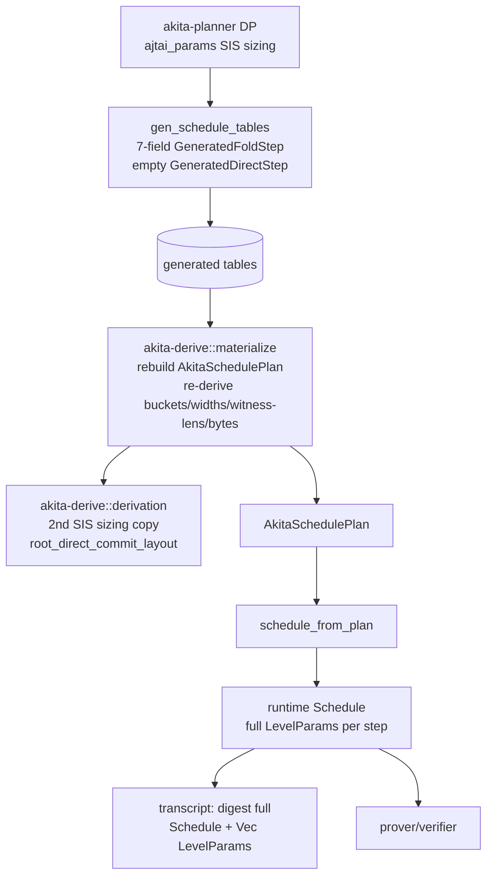
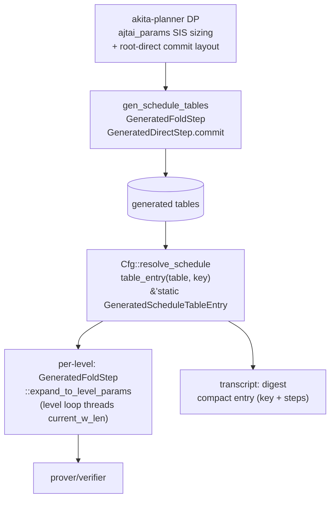

# Spec: Planner Runtime Flow Cleanup — Expand Table Entries Into `LevelParams` On Demand

| Field       | Value                          |
|-------------|--------------------------------|
| Author(s)   |                                |
| Created     | 2026-05-29                     |
| Status      | proposed                       |
| PR          |                                |

## Summary

The path from "offline planner output" to "runtime per-level parameters" is three overlapping layers that each re-derive the same data. `akita-planner` runs a DP search (with its own SIS sizing in `ajtai_params.rs`) and emits a compact generated table that keeps only seven integers per fold step. `akita-derive` then *re-derives* everything those integers imply at runtime: `materialize.rs` rebuilds a full `AkitaSchedulePlan` (collision buckets, full `LevelParams`, cumulative witness lengths, per-level proof bytes), and `derivation.rs` re-runs SIS rank/collision math (a second copy of what the planner already did). The plan is flattened to a runtime `Schedule` that bakes a full `LevelParams` into every step, and that whole `Schedule` plus the `Vec<LevelParams>` setup envelope is Blake2b-digested into the Fiat-Shamir preamble. The result is two parallel "plan" models (`AkitaSchedulePlan` and `Schedule`), two copies of the proof-size formula, two copies of SIS sizing, and a lot of verifier-reachable re-derivation whose only extra consumer is a transcript digest.

This refactor collapses it into one flow that reuses the data types already in the codebase. The planner stays the offline generator and stores only the brute-forced numbers — now including the root-direct commit layout, which is also a search output (`optimal_m_r_split`). `Cfg` looks up the single matching `GeneratedScheduleTableEntry` (which already exists: `{ key, steps: &'static [GeneratedStep] }`) and hands that compact, `Copy`, `'static` value to the prover/verifier. Full `LevelParams` are computed on demand by one method, `GeneratedFoldStep::expand_to_level_params(...)`, which fills in the deterministic components from the stored numbers plus a few caller-supplied inputs. `akita-derive` is deleted, the `AkitaSchedulePlan` family and the runtime `Schedule`/`FoldStep` model are removed, the proof-size formula gets a single home in `akita-types`, and the transcript binds the compact entry.

## Intent

### Goal

Make the planner the sole producer of brute-forced parameters, store them in the existing `GeneratedScheduleTableEntry`, and have the runtime compute full `LevelParams` on demand via one `expand_to_level_params` method — with no `akita-derive`, no second plan model, and no re-derivation layer.

Key changes (all types in `akita-types`):

- **Reuse `GeneratedScheduleTableEntry`** (`crates/akita-types/src/generated/mod.rs`) as *the* resolved-schedule value. It is already `{ key: GeneratedScheduleKey, steps: &'static [GeneratedStep] }`, already `Copy`, and `table_entry(table, key)` already returns `&'static GeneratedScheduleTableEntry`. `Cfg` stores/returns this entry. No new `ResolvedSchedule`/`ResolvedStep` type is introduced.
- **Extend `GeneratedDirectStep`** from a unit struct to `GeneratedDirectStep { commit: Option<GeneratedFoldStep> }`. `Some` carries the brute-forced root-direct commit layout (root-direct commits with the same 7-field shape as a fold step); `None` is a terminal-direct handoff (`fold_level > 0`, no commitment). This stores what `root_direct_commit_layout` currently recomputes at runtime.
- **Add one method**: `GeneratedFoldStep::expand_to_level_params(&self, ...inputs...) -> Result<LevelParams, AkitaError>`. It computes the missing, deterministic components (SIS collision buckets, layout geometry, batched-root scaling) from the stored numbers plus caller-supplied values. The root-direct commit reuses the same method on `GeneratedDirectStep.commit` at `fold_level == 0`.
- **`Cfg` API** (`akita-config`): `Cfg::resolve_schedule(incidence) -> Result<&'static GeneratedScheduleTableEntry, AkitaError>` replaces `schedule_plan` / `get_params_for_prove`; `Cfg::level_params(entry, fold_level, current_w_len) -> Result<LevelParams, AkitaError>` and `Cfg::root_commit_params(incidence) -> Result<LevelParams, AkitaError>` are thin wrappers that resolve `Cfg` hooks into plain values and call `expand_to_level_params`. `get_params_for_batched_commitment` and `level_params_with_log_basis` are removed.
- **Proof-byte estimation**: the single `level_proof_bytes` formula plus `estimate_proof_bytes(entry, ...)` live in `akita-types`, used at commit time by the `fp128` preset selector and offline by the planner DP — never on the verifier replay path.

`expand_to_level_params` signature (plain values, no `PlanPolicy`, no function pointers — the caller, which is `Cfg`-generic, resolves the hooks):

```rust
impl GeneratedFoldStep {
    pub fn expand_to_level_params(
        &self,
        sis_family: SisModulusFamily,         // from GeneratedScheduleTable / Cfg
        fold_level: usize,                     // 0 = root, >0 = recursive
        current_w_len: usize,                  // threaded by the caller's level loop
        root_decomp: DecompositionParams,      // Cfg::decomposition()
        stage1: SparseChallengeConfig,         // Cfg::stage1_challenge_config(self.ring_d)?
        fold_shape: TensorChallengeShape,      // Cfg::fold_challenge_shape_at_level(inputs)
        ring_subfield_norm_bound: u32,         // Cfg::ring_subfield_embedding_norm_bound()
        batched_root: Option<(usize, u32)>,    // (num_t_vectors, field_bits); Some only at a batched root
    ) -> Result<LevelParams, AkitaError>;
}
```

Crate-boundary changes:

- **Delete `akita-derive`.** `materialize.rs` (plan reconstruction) is replaced by `expand_to_level_params`; `derivation.rs` (runtime SIS re-derivation) loses its last user once the root-direct layout is stored. Its `generated_level_buckets` / `generated_level_params` / batched-scaling glue move into `akita-types` as the body of `expand_to_level_params`.
- `akita-planner` drops its `akita-derive` dependency and emits `GeneratedDirectStep.commit` for root-direct entries.

### Invariants

This is a structural refactor of parameter flow. The implementation must preserve:

1. **Prover/verifier consistency.** For every key, prover and verifier read the same `GeneratedScheduleTableEntry` and expand identical `LevelParams` per level, so every proof valid on `main` stays valid and every rejected proof stays rejected (modulo the deliberate transcript-byte change in invariant 7). Protected by the end-to-end suites in [crates/akita-pcs/tests/akita_e2e.rs](crates/akita-pcs/tests/akita_e2e.rs) and [crates/akita-pcs/tests/zk.rs](crates/akita-pcs/tests/zk.rs).
2. **Deterministic expansion.** `GeneratedFoldStep::expand_to_level_params` for a given `(sis_family, fold_level, current_w_len, root_decomp, stage1, fold_shape, norm_bound, batched_root)` must equal the `LevelParams` `akita-derive::materialize` produces today for the same generated entry. Protected by a new golden equivalence test (see Testing Strategy) captured before `akita-derive` is deleted.
3. **SIS security.** Expanded keys carry the same audited A and B/D collision buckets and ranks as today (`generated_level_buckets` math ported verbatim); the strict `AjtaiKeyParams::try_new` audit still fires at the layout boundary. Protected by the `fp128_policy_tests` SIS-width audits in [crates/akita-config/src/lib.rs](crates/akita-config/src/lib.rs).
4. **Verifier no-panic contract** (AGENTS.md). `expand_to_level_params`, `resolve_schedule`, and `level_params` are all `Result`-returning; their errors map to `AkitaError`/`InvalidProof` at the verifier boundary exactly as the verifier level loop does today. No new `panic!`/`unwrap`/unchecked indexing on verifier-reachable paths; the checked-arithmetic overflow guards in the current materializer (`checked_shl`, `checked_mul`) are preserved.
5. **Single source of truth.** Exactly one proof-size formula (`akita-types`), one SIS-sizing implementation reachable at codegen time (`akita-planner::ajtai_params`), one schedule representation (`GeneratedScheduleTableEntry`). No `AkitaSchedulePlan`, no runtime `Schedule`/`FoldStep`/`DirectStep`, no `akita-derive`.
6. **Setup sizing unchanged.** `Cfg::max_setup_matrix_size` produces the same packed setup envelope — it now expands `LevelParams` per level from the entry and applies the same width math. Generated setup matrices and the disk cache stay shape-compatible for a given key. Protected by [crates/akita-setup/src/lib.rs](crates/akita-setup/src/lib.rs) tests.
7. **Transcript binding (deliberately changed).** The Fiat-Shamir preamble binds the compact `GeneratedScheduleTableEntry` (key + compact steps) instead of the full materialized `Schedule` + `Vec<LevelParams>`. Preamble bytes change (allowed: no backward compatibility) but soundness holds because the entry plus the already-bound `decomposition` / `sis_modulus_family` / incidence fully determine every expanded `LevelParams`. The descriptor round-trip tests in [crates/akita-types/src/instance_descriptor.rs](crates/akita-types/src/instance_descriptor.rs) are updated, not preserved.

### Non-Goals

- Changing the DP search, the chosen `(m_vars, r_vars, log_basis, n_a, n_b, n_d)` for any key, or fold-root proof sizes.
- Changing the `CommitmentConfig` field-role model, ZK hiding witness layout, or the ring-switch / sumcheck protocols.
- Adding a runtime DP fallback to production presets. The `PlannerCfg<Cfg>` test wrapper keeps its role; it now overrides `resolve_schedule` instead of `get_params_for_prove`.
- Memoizing expansion. Per-level expansion is cheap; the prover/verifier already iterate levels and thread `current_w_len`, so no schedule-wide cache is added.

## Evaluation

### Acceptance Criteria

- [ ] `akita-derive` crate is removed from the workspace; no `akita_derive::` / `use akita_derive` paths remain.
- [ ] `GeneratedDirectStep` carries `commit: Option<GeneratedFoldStep>`; all generated tables and `crates/akita-planner/tests/old_tables/*` snapshots are regenerated.
- [ ] `Cfg` exposes `resolve_schedule` + `level_params` + `root_commit_params`; `schedule_plan`, `get_params_for_prove`, `get_params_for_batched_commitment`, and `level_params_with_log_basis` are gone.
- [ ] `AkitaSchedulePlan`, `AkitaPlannedLevel`, `AkitaPlannedState`, `AkitaPlannedDirectStep`, `AkitaPlannedStep`, `AkitaPlannedLevelExecution`, `Schedule`, `Step`, `FoldStep`, `DirectStep`, `schedule_from_plan`, `scheduled_fold_execution`, `scheduled_next_level_params`, and `exact_planned_level_execution` are removed from `akita-types`.
- [ ] Exactly one `level_proof_bytes` exists, in `akita-types`; the planner DP and `fp128` selector call it.
- [ ] A golden test asserts `expand_to_level_params` reproduces the pre-refactor materializer `LevelParams` for a representative key set.
- [ ] `cargo fmt -q`, `cargo clippy --all -- -D warnings`, and `cargo test` pass under default features and `--features zk`.
- [ ] `AKITA_MODE=onehot_fp128_d32 AKITA_NUM_VARS=32 cargo run --release --example profile` succeeds and reports the same proof size as `main` for that mode.

### Testing Strategy

Must keep passing (retargeted to the entry-based flow): end-to-end [akita_e2e.rs](crates/akita-pcs/tests/akita_e2e.rs) / [zk.rs](crates/akita-pcs/tests/zk.rs), the SIS-width audits and `fp128_policy_tests` in [crates/akita-config/src/lib.rs](crates/akita-config/src/lib.rs), the drift-guard [crates/akita-planner/tests/regen_diff.rs](crates/akita-planner/tests/regen_diff.rs), the proof-size comparison [crates/akita-planner/tests/proof_size_comparison.rs](crates/akita-planner/tests/proof_size_comparison.rs), the descriptor round-trip tests in [instance_descriptor.rs](crates/akita-types/src/instance_descriptor.rs), and the setup tests in [akita-setup](crates/akita-setup/src/lib.rs).

New tests:

- **Expansion equivalence (golden):** before deleting `akita-derive`, capture per-level `LevelParams` (and `setup_level_params_from_plan` output) for a spread of keys (singleton + batched, multiple presets, fold-root and root-direct) and assert the new `expand_to_level_params` reproduces them byte-for-byte (`append_descriptor_bytes`). This is the primary guard for invariant 2.
- **Malformed-entry contract:** move the `schedule_plan_from_table_entry` contract tests (empty entry, fold-without-terminal, non-terminal direct, overflow-shaped key, unsupported `recursive_public_rows`, SIS-family mismatch) from `akita-derive/materialize.rs` to live next to `Cfg::resolve_schedule` / the entry validator; they must still return `AkitaError`, never panic.
- **Root-direct determinism:** assert a root-direct entry's stored `commit` expands (at `fold_level == 0`) to the same committable `LevelParams` the runtime produced via `root_direct_commit_layout` on `main`.

Feature combinations: run the full suite under both default and `zk` features (proof-byte and witness-length math differs under `zk`).

### Performance

No prover/verifier throughput regression. Expansion is cheap arithmetic + a SIS-floor table lookup, run once per level in the existing level loop. Memory drops: the runtime carries a `Copy` `&'static GeneratedScheduleTableEntry` instead of an owned `Schedule` with a full `LevelParams` per step, and there is no second `AkitaSchedulePlan`.

Fold-root proof sizes are unchanged. Root-direct commit sizes are unchanged iff the planner emits the same layout `root_direct_commit_layout` derived on `main` (the porting step in §Execution must reproduce its `optimal_m_r_split` result, or the SIS-width / proof-size audits will flag a shift). Verify with `cargo run --release --example profile` and [crates/akita-planner/tests/proof_size_comparison.rs](crates/akita-planner/tests/proof_size_comparison.rs).

## Design

### Architecture

Current flow (three layers, two plan models):



Target flow (one model, on-demand expansion):



Affected modules:

- **`akita-types`**: `GeneratedDirectStep` gains `commit: Option<GeneratedFoldStep>`; `GeneratedFoldStep` gains `expand_to_level_params`; the single `level_proof_bytes` + `estimate_proof_bytes(entry, ...)` land here; the simplified descriptor binding lives here. Loses the `AkitaPlanned*` family, `Schedule`/`Step`/`FoldStep`/`DirectStep`, `schedule_from_plan`, `scheduled_fold_execution`, `scheduled_next_level_params`, and `exact_planned_level_execution`. Keeps `LevelParams`, `AjtaiKeyParams`, `level_layout_from_params`, `scale_batched_root_layout*`, `w_ring_element_count_*`, `DirectWitnessShape`, `AkitaScheduleInputs`, `AkitaScheduleLookupKey`, `generated_schedule_lookup_key`, and the lightweight entry-navigation helpers (`schedule_num_fold_levels` / `schedule_is_root_direct` retargeted to `&GeneratedScheduleTableEntry`).
- **`akita-config`**: `CommitmentConfig` gets `resolve_schedule` + `level_params` + `root_commit_params`; `WCommitmentConfig` forwards them; setup-matrix sizing and `Fp128ScheduleSelection` consume the entry; the `akita-derive` dependency is dropped.
- **`akita-planner`**: emits `GeneratedDirectStep.commit` (porting `root_direct_commit_layout`'s `optimal_m_r_split` choice into the generator); its `use_lookup` fast path returns the entry; DP scoring uses the `akita-types` `level_proof_bytes`; the `akita-derive` dependency is dropped. `ajtai_params.rs`, `schedule_params.rs`, and the family/key cross-product stay.
- **`akita-prover` / `akita-verifier` / `akita-scheme` / `akita-setup`**: hold `&'static GeneratedScheduleTableEntry`; their level loops thread `(current_w_len, current_log_basis)` and call `Cfg::level_params(entry, level, current_w_len)` instead of reading a baked `step.params`. The terminal-direct witness shape is computed in the loop (`FieldElements(current_w_len)` at root, `PackedDigits((terminal_field_len, current_log_basis))` recursive) exactly as the materializer does today.

`expand_to_level_params` body (the consolidated `generated_level_params` + `level_layout_from_params` + batched-scaling pipeline from [crates/akita-derive/src/materialize.rs](crates/akita-derive/src/materialize.rs), now the single copy):

```rust
// fold_level 0 uses root_decomp; recursive levels collapse log_commit_bound to log_basis.
let level_decomp = if fold_level == 0 {
    DecompositionParams { log_basis: self.log_basis, ..root_decomp }
} else {
    DecompositionParams {
        log_basis: self.log_basis,
        log_commit_bound: self.log_basis,
        log_open_bound: Some(root_decomp.log_open_bound.unwrap_or(root_decomp.log_commit_bound)),
    }
};
let (a_bucket, bd_bucket) = generated_level_buckets(   // ported verbatim
    sis_family, self.ring_d as usize, self.log_basis,
    level_decomp.log_commit_bound, stage1.infinity_norm(), ring_subfield_norm_bound)?;
let mut params = LevelParams::params_only(
    sis_family, self.ring_d as usize, self.log_basis,
    self.n_a as usize, self.n_b as usize, self.n_d as usize, stage1)
    .with_fold_challenge_shape(fold_shape);
params.a_key = AjtaiKeyParams::new_unchecked(sis_family, self.n_a as usize, 0, a_bucket, self.ring_d as usize);
params.b_key = AjtaiKeyParams::new_unchecked(sis_family, self.n_b as usize, 0, bd_bucket, self.ring_d as usize);
params.d_key = AjtaiKeyParams::new_unchecked(sis_family, self.n_d as usize, 0, bd_bucket, self.ring_d as usize);
let layout = level_layout_from_params(
    self.m_vars as usize, self.r_vars as usize, &params,
    level_decomp, current_w_len / self.ring_d as usize)?;
let mut lp = params.with_layout(&layout);
if let Some((num_t_vectors, field_bits)) = batched_root {   // fold_level == 0, batched key
    lp = scale_batched_root_layout(&lp, num_t_vectors, field_bits)?;
}
Ok(lp)
```

`current_w_len` threading (caller's level loop, replacing the materializer's forward pass): start at `1 << num_vars`; after expanding level `lp`, `next_w_len = w_ring_element_count_with_counts_bits(field_bits, &lp, counts...)? * lp.ring_dimension` (root uses the key's `(num_points, num_t_vectors, num_w_vectors, num_z_vectors)`; recursive uses `1,1,1,1`). The prover/verifier already iterate levels in order, so this is local state, not a precomputed cache.

`estimate_proof_bytes(entry, ...)` (commit-time selection only) walks the same loop, summing `level_proof_bytes` per level; `Fp128ScheduleSelection` stores `(preset, entry, estimated_bytes)` instead of an `AkitaSchedulePlan` and `best_by_exact_bytes` minimizes `estimated_bytes`.

Transcript binding ([crates/akita-types/src/instance_descriptor.rs](crates/akita-types/src/instance_descriptor.rs)): `PlanSection::from_schedule` digests the entry (`key` + per-step compact fields). `SetupSection.level_params_digest` is dropped — `setup_seed_digest` binds matrix capacity, `decomposition` / `sis_modulus_family` are already bound, and the per-proof entry digest pins the layout. [crates/akita-config/src/transcript_binding.rs](crates/akita-config/src/transcript_binding.rs) drops the `setup_level_params_from_runtime_schedule` call.

### Alternatives Considered

- **Introduce a new `ResolvedSchedule { key, steps, policy }` value (earlier draft).** Rejected per review: `GeneratedScheduleTableEntry` already *is* "key + compact steps", is `Copy`/`'static`, and has a ready lookup (`table_entry`). A parallel wrapper would duplicate it. The config-policy inputs are resolved by the `Cfg`-generic caller and passed as plain values into `expand_to_level_params`, so no `policy` field (and no function-pointer `PlanPolicy`) is needed.
- **Keep `akita-derive` as a thin expansion home.** Rejected: `expand_to_level_params` must be an inherent method on `GeneratedFoldStep` (orphan rule), which lives in `akita-types`, and every input it needs is already in `akita-types`. A separate crate would only re-export.
- **Leave `GeneratedDirectStep` empty and re-derive the root-direct commit at runtime.** Rejected: the root-direct commit layout is a brute-forced `optimal_m_r_split` output, so by the "store the brute-forced ones, derive the rest" rule it belongs in the table; storing it removes the last user of `derivation.rs` and lets the crate be deleted.
- **Memoize expanded `LevelParams` per step.** Rejected as default: expansion is cheap and the prover/verifier already thread per-level state. A cache can be added later behind the same method without changing call sites if profiling ever justifies it.
- **Preserve transcript bytes by re-expanding full `LevelParams` at bind time.** Rejected: that keeps the only reason the runtime would materialize full per-step `LevelParams` for the digest, and the entry plus bound policy already pin the schedule. (Confirmed with the requester.)

## Documentation

- Update [AGENTS.md](AGENTS.md) crate list: remove `akita-derive`, fold its description into `akita-types` (on-demand `expand_to_level_params`) and `akita-planner` (offline derivation), and update the `akita-config` line (no `akita-derive` dependency).
- Update [STACK.md](STACK.md) dependency graph to drop `akita-derive`.
- Add a short module doc near `expand_to_level_params` in `akita-types` stating the contract: the planner stores brute-forced numbers in the entry; the runtime fills in deterministic components from them.
- Note the transcript-binding change (compact entry digest, dropped `level_params_digest`) in [specs/transcript-hardening.md](specs/transcript-hardening.md).
- This spec supersedes the materialization portions of [specs/planner-config-consolidation.md](specs/planner-config-consolidation.md).

## Execution

Land in dependency order so the tree compiles at each step:

1. **`akita-types` additions (non-breaking).** Add `GeneratedDirectStep.commit`, `GeneratedFoldStep::expand_to_level_params` (port `generated_level_buckets` + `generated_level_params` + `level_layout_from_params` + batched scaling), the single `level_proof_bytes` + `estimate_proof_bytes(entry, ...)`, and entry-based `schedule_num_fold_levels` / `schedule_is_root_direct`. Keep the old types temporarily so golden fixtures can be captured.
2. **Capture golden fixtures.** Record current `materialize.rs` per-level `LevelParams` (descriptor bytes) and setup levels for a representative key set; wire the equivalence test.
3. **Planner emission.** Port `root_direct_commit_layout`'s `optimal_m_r_split` choice into the generator so `emit_direct` writes `commit: Some(GeneratedFoldStep{..})` for root-direct entries (and `None` otherwise); point the `use_lookup` fast path and DP scoring at `akita-types`; drop the `akita-derive` dep. Regenerate all generated tables and `old_tables` snapshots; confirm `regen_diff.rs` passes.
4. **`akita-config` switch.** Implement `resolve_schedule` (lookup + the materializer's structural validation: non-empty, terminal-direct, SIS-family match, `recursive_public_rows == 1`), `level_params`, and `root_commit_params`; retarget setup-matrix sizing and `Fp128ScheduleSelection`; delete `level_params_with_log_basis`; drop the `akita-derive` dep.
5. **Consumer retarget.** Move `akita-scheme` callbacks, `akita-prover`, `akita-verifier`, and `akita-setup` from `Schedule` to `&GeneratedScheduleTableEntry` with per-level `Cfg::level_params`, threading `(current_w_len, current_log_basis)`; preserve verifier `AkitaError` mapping. `scheduled_fold_execution`'s runtime-vs-baked consistency check is dropped (the threaded value is now the only source).
6. **Transcript simplification.** Update `PlanSection`/`SetupSection` and `bind_transcript_instance_descriptor`; fix descriptor tests.
7. **Delete + prune.** Remove the `akita-derive` crate and workspace member; prune the `AkitaPlanned*` family and `Schedule`/`Step`/`FoldStep`/`DirectStep` (+ helpers) from `schedule.rs`; fix `akita-types/src/lib.rs` re-exports; update `AGENTS.md` / `STACK.md`.
8. **Green CI.** `cargo fmt -q`, `cargo clippy --all -- -D warnings`, `cargo test` (default + `zk`), and a profile sanity run.

Risks to resolve first:

- **Root-direct layout parity** (step 3): the planner must emit the same committable, SIS-secure layout `root_direct_commit_layout` derived on `main`, including the tiny-root (`num_vars <= log2(D)`) fixed-point branch. Validate against the golden fixtures and SIS-width audits.
- **`zk` witness-length math**: the level loop must reproduce the `zk`-gated `w_ring_element_count_*` results; run the equivalence fixtures under `zk`.
- **Verifier no-panic**: the lazy `Cfg::level_params` must thread `Result` cleanly through every verifier call site that previously borrowed a baked `step.params`.

## References

- [specs/planner-config-consolidation.md](specs/planner-config-consolidation.md) — prior trait/crate consolidation; this spec supersedes its materialization model.
- [specs/transcript-hardening.md](specs/transcript-hardening.md) — instance descriptor binding pillars.
- [specs/terminal-fold-cutover.md](specs/terminal-fold-cutover.md) — `MRowLayout::Terminal` / direct-witness shape background.
- Key sources: [crates/akita-derive/src/materialize.rs](crates/akita-derive/src/materialize.rs), [crates/akita-derive/src/derivation.rs](crates/akita-derive/src/derivation.rs), [crates/akita-types/src/generated/mod.rs](crates/akita-types/src/generated/mod.rs), [crates/akita-types/src/schedule.rs](crates/akita-types/src/schedule.rs), [crates/akita-types/src/layout/params.rs](crates/akita-types/src/layout/params.rs), [crates/akita-types/src/layout/digit_math.rs](crates/akita-types/src/layout/digit_math.rs), [crates/akita-planner/src/schedule_params.rs](crates/akita-planner/src/schedule_params.rs), [crates/akita-planner/src/bin/gen_schedule_tables.rs](crates/akita-planner/src/bin/gen_schedule_tables.rs), [crates/akita-config/src/proof_optimized/fp128.rs](crates/akita-config/src/proof_optimized/fp128.rs).
- Profile command: `AKITA_MODE=onehot_fp128_d32 AKITA_NUM_VARS=32 cargo run --release --example profile`.
