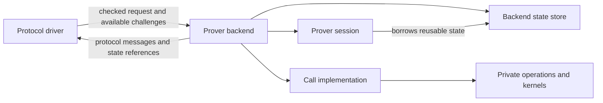
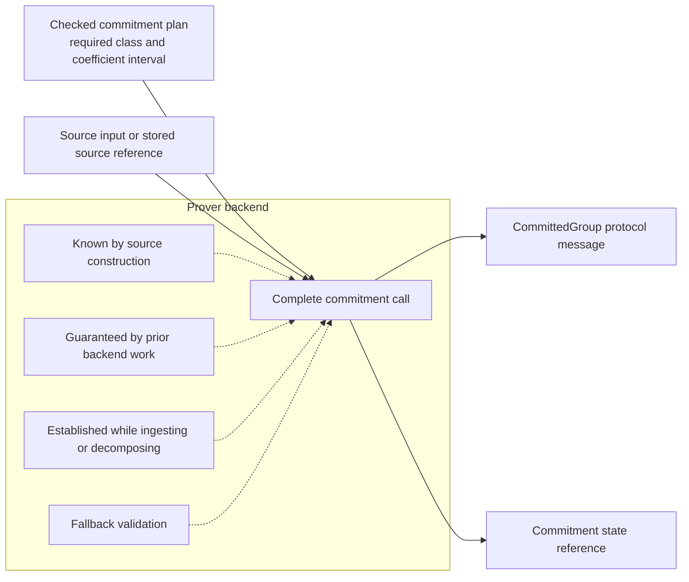

# Prover backend architecture

| Field | Value |
|---|---|
| Package | [`README.md`](README.md) |
| Status | proposed |
| Role | normative architecture contract |

## Outcome

Akita proving becomes a protocol driver plus a prover backend. The protocol
driver advances the transcript. The backend keeps private prover state and
returns protocol messages. A prover session holds state needed by one proof;
the backend state store holds data that may be reused across proofs. Arithmetic
operations and hardware kernels remain private implementation details.



Backend calls are Akita-specific or Jolt-specific. The backend state store,
prover session, state references, and support checks are candidates for eventual
sharing. Arithmetic and kernel implementations may already share
`jolt-field` without forcing the two protocols to share a driver.

## Terms

### Protocol driver

The protocol driver is the authoritative prover-side implementation of the
verifier's message schedule. It owns public validation, message ordering,
transcript operations, challenge draws, and proof construction.

### Protocol message

A protocol message is a verifier-visible value, or an ordered set of values,
that is serialized into the proof, absorbed into the transcript, or both. Its
representation is fixed by the protocol, not by the backend.

### Backend call

A backend call is one request to a prover backend and its response. The request
contains checked protocol input, available challenges, and state references.
The response contains protocol messages and new state references. Commitment is
a backend call made before transcript work starts.

### Transcript step

A transcript step is all prover work available after one challenge draw and
before the next. The first step begins after checked transcript initialization.
A final transcript step may end without another challenge draw.

A step may return several values when the verifier absorbs them consecutively
before drawing another challenge. Those values cross a remote boundary
together, in protocol order. Consecutive challenge draws with no intervening
prover message become one input to the next step; they do not create empty
calls.

### Prover backend

A prover backend executes backend calls and owns private prover state. It
may use CPU memory, GPU memory, remote objects, recomputation recipes, or any
other internally consistent representation. It never receives the transcript.

### Backend state store

A backend state store owns live backend state that may outlive one proof, such
as a committed witness reused by several opening proofs. It owns state identity,
storage location, borrowing, and invalidation. It does not imply persistence
across a process boundary.

### Prover session

A prover session contains backend-owned mutable state for exactly one proof. It
owns transient folded tables, values carried between steps, proof-local
allocations, memory pools, and the selected execution plan. It may borrow
long-lived state from the backend state store under explicit rules.

### State reference

A state reference is a typed name for one backend-owned state object that does
not expose the stored representation. It identifies the backend and whether
the state belongs to the long-lived store or one prover session.

### Internal operation

An internal operation is a reusable computation inside a backend call, such as
a grouped commitment, MLE fold, ring decomposition, compression map, or matrix
product. Internal operations are implementation details, not transcript
messages or public backend APIs.

### Checkpoint

A checkpoint is an explicitly exported, versioned representation used for
persistence or planned state transfer. A portable checkpoint can be imported by
different backend implementations. A backend-specific checkpoint can be
imported only by a compatible backend. Neither is live backend state or part of
protocol identity unless a separate protocol rule says otherwise.

## Layering contract

### Protocol layer

The protocol layer MUST own:

- proof statement and schedule validation;
- all transcript domain separators, labels, absorbs, and squeezes;
- the exact order and shape of protocol messages;
- public challenge derivation and rejection/grinding policy;
- prover entropy selection and the mapping from entropy to protocol blinds;
- proof object construction and serialization;
- verifier-visible error classification;
- protocol plans, including commitment and compression geometry.

The protocol layer MUST NOT:

- inspect or downcast private backend state;
- require live state to use a field-vector, ring-vector, digit, CPU, cloneable,
  default, or serializable representation;
- rebuild backend-private intermediates merely to call the next operation;
- choose an arithmetic kernel, device stream, chunk size, memory layout, or
  backend fallback after a proof begins.

### Backend requests and call implementations

The protocol driver prepares each backend request from checked protocol data.
The prover backend implements the call. There MUST be one authoritative request
builder and one CPU backend implementation for each call. An implementation MAY
turn a verifier-owned relation or plan into a list of internal operations, but
it MUST NOT create a second source of truth for dimensions or relations.

A backend MAY execute the call with either:

- an optimized call implementation; or
- a composition of its private internal operations.

The path MUST be selected before the call begins. The choice MUST be observable
and MUST NOT change the protocol message.

### Backend layer

The backend MUST own:

- construction and teardown of backend state stores and prover sessions;
- state allocation, storage location, identity, and lifetime;
- discovery of supported operations and execution planning;
- source input and upload reuse;
- backend-private caches and scratch storage;
- explicit state export, import, or transfer operations;
- per-call observability, including selected implementation and transferred
  bytes.

The backend MUST NOT receive a transcript object, transcript sponge state, or
unbounded RNG. It MUST NOT choose protocol message order, transcript labels,
challenge families, schedule rows, or compression maps.

### Internal operations and kernels

Internal operations and kernels MUST be transcript-free. Their inputs and
outputs MAY use representations private to one backend implementation.

The CPU backend MUST consume the same checked protocol plans that the verifier
and request builder use. An optimized call implementation MUST produce the same
protocol messages as the CPU backend.

The internal operation set SHOULD remain small enough that a new backend can
support general execution without reimplementing every Akita or Jolt relation.
Protocol-specific optimized call implementations MAY exist when they materially
reduce passes, synchronization, or memory traffic.

## Message contract

Each protocol message type MUST define or delegate to exactly one
implementation for each of:

1. shape validator;
2. proof serialization path, when serialized;
3. transcript append path, when absorbed;
4. verifier parse or reconstruction path.

Before absorption, the driver MUST also enforce every cheap protocol transition
predicate available from public state. This is more than length checking. For a
sum-check round it includes the degree bound and
`round_poly(0) + round_poly(1) == prior_claim`; for commitment and relation
messages it includes canonical representation, group order, checked-plan, and public
geometry consistency. These checks SHOULD call the same helpers used by
verifier replay. Witness correctness that cannot be checked without repeating
prover work remains the prover backend's responsibility and is still
enforced by final verification; the backend is not a new soundness trust
boundary.

The backend MUST return canonical field or group values at the message
boundary. It may use Montgomery values, unreduced accumulators, projective
points, sharded buffers, or other representations internally, but those forms
must not cross the message boundary.

Message construction MUST be backend-invariant. Given identical protocol
inputs, witness, and host-provided entropy, different conforming backends MUST
produce byte-identical messages and proof bytes.

If a value retained today is later absorbed or serialized, it is a message and
MUST be modeled explicitly as one. It MUST NOT be recovered by inspecting a
generic private-state object. The terminal `t_fields` message currently read
from `AkitaCommitmentHint::inner_rows` is the motivating example.

## Prover session and state references

The public state reference is conceptually:

```rust,ignore
pub struct BackendStateRef<K> {
    backend: BackendInstanceId,
    session: Option<SessionId>,
    slot: StateSlot,
    generation: u64,
    marker: PhantomData<fn() -> K>,
}
```

Each backend instance owns exactly one long-lived state store. `session == None`
denotes state in that store; a session ID denotes state owned by one proof and
is scoped to that backend instance. The exact fields may change during
implementation, but the following properties are required:

- `BackendInstanceId` identifies one backend instance and its one long-lived
  state store, not a Rust backend type.
- A reference MUST name one live object in one backend instance.
- Commitment and imported-source kinds MAY live in a long-lived store and be
  borrowed by multiple prover sessions according to explicit sharing rules.
- Fold, relation, sum-check, and other transient kinds MUST normally be bound
  to exactly one prover session.
- A reference MUST identify its state kind without exposing the stored
  Rust type.
- An output that contains both a protocol message and a state reference MUST
  link that message to the checked plan, setup identity, backend, and state
  generation. The backend MUST construct the output as one value and MUST
  recheck the link whenever the state is used.
- These output fields MUST be private. Protocol code may borrow the message for
  validation and absorption but MUST NOT pair it with another state reference.
- Stale, wrong-session, wrong-backend, and wrong-kind references MUST return a
  typed prover error.
- Protocol code MUST NOT index session state by `TypeId`, string, relation ID,
  or unchecked integer.
- Backend implementations MAY use safe type erasure internally after the
  reference and backend checks.
- Cloneability and sharing MUST follow the state kind. References MUST
  NOT be universally `Clone` merely because a CPU value is cloneable.
- Session teardown MUST release or invalidate its proof-local references and
  resources. It MUST NOT implicitly invalidate long-lived committed state.

State kinds should describe what later work they support, not how they are
stored, for example `CommitmentState`, `RingRelationState`, or
`SumcheckBatchState`. Names such as `CpuInnerRows` or `GpuBuffer` do not belong
in protocol-facing reference types.

The private link between a message and its stored state is backend metadata,
not a transcript field. It MAY use a digest or a backend-validated record. It
only needs to reject a swapped message, state reference, plan, or setup before
the next transcript mutation.

## Backend call contract

The illustrative shape of two backend calls is:

```rust,ignore
pub struct CommitGroupRequest<'a, F> {
    pub plan: &'a CheckedCommitmentPlan<F>,
    pub source: &'a dyn CommitmentSource<F>,
}

pub trait CommitGroupCall<F> {
    fn commit(
        &self,
        store: &mut BackendStateStore,
        request: CommitGroupRequest<'_, F>,
    ) -> Result<CommittedGroupWithState<F>, ProverBackendError>;
}

pub trait SumcheckRoundCall<F> {
    fn prove_round(
        &self,
        session: &mut ProverSession,
        state: BackendStateRef<SumcheckBatchState>,
        input: SumcheckGroupRoundRequest<F>,
    ) -> Result<SumcheckRoundOutput<F>, ProverBackendError>;
}
```

This is a design sketch, not a requirement to introduce one universal trait or
one trait per source representation. Interfaces selected while proving are
appropriate when their call cost is negligible compared with the arithmetic or
remote work.

A backend input MUST contain only:

- checked public plans or relation instances;
- challenges sampled since the prior message;
- host-provided blinds or entropy-derived values required by the protocol;
- source input or a prior-state reference;
- public claims and expected message bounds needed for checked execution.

A backend output MUST contain only:

- the next protocol messages, in protocol order;
- state references for private prover state needed later;
- backend diagnostics that are explicitly outside proof and transcript
  identity.

Large witness-proportional intermediates MUST NOT cross from a remote backend to
host orchestration unless they are themselves protocol messages. A
sum-check batch round therefore returns the final batched round message, not one
polynomial per member for the host to combine.

## Source input

The source representation and the representation saved by the backend are
separate choices.

The checked commitment plan defines what the source must satisfy: its source
class and accepted centered-coefficient interval. This is a producer-admission
requirement derived from planner sizing, not a verifier check and not a required
"check coefficient range" operation. The complete commitment call MUST NOT
return a public commitment for a source that does not satisfy the plan, but the
protocol driver MUST NOT prescribe how the backend establishes that fact.



The four dotted mechanisms are backend-private alternatives, not request fields
or sequential stages. A backend MAY use any of them, or another equivalent
method.

A reusable guarantee satisfies a plan only when all of the following hold:

1. the guarantee is bound to the exact stored source identity and generation;
2. for a `UnitOneHot` plan, it proves unit one-hot structure at the plan's exact
   chunk size; a `BalancedSignedDigit` plan adds no structural restriction; and
3. it bounds the source's negative and positive coefficient reach under the
   plan's decomposition-centering convention within
   `CommittedSourceContract::accepted_bounds`.

The coefficient guarantee MAY be conservative. It need not record that the
source previously passed that exact plan: a stronger guarantee may imply a
weaker plan. If a guarantee uses another coefficient interpretation or
centering convention, the backend MUST prove the conversion before reusing it.

The backend MUST support both:

- a host source provider used by the CPU backend or streamed
  into a backend on first use; and
- a stored source reference produced by an earlier import or backend call.

Source-specific adapters MAY preserve dense, one-hot, recursive-witness, or
Jolt witness-plane structure. They MUST terminate at the backend input
boundary. A backend interface MUST NOT require every application source type
and every ring dimension to appear in a public supertrait ladder.

For a source known by construction, such as one-hot positions, the construction
invariant is sufficient when it implies the plan. Stored bounded digits also
need recorded negative and positive reaches that fit the plan's accepted
interval. A stored source reference MAY carry guarantees established by earlier
kernels, imports, or source construction. A backend MAY also establish the
condition while it performs work that already reads the source, such as upload,
decomposition, or inner commitment. Any source without a sufficient
construction invariant, stored guarantee, or fused check needs fallback
validation.

Host-declared metadata alone is not evidence that arbitrary raw values satisfy
the plan. Conversely, the driver MUST NOT ask a backend-owned source to expose
coefficients merely to repeat a condition already guaranteed by backend state.
No conforming interface may require a host pre-scan followed by a duplicate
remote upload or device traversal.

The one-request-and-response requirement counts synchronization between the
driver and backend. A large source MAY be streamed in chunks during the same
request. Transport chunking does not create additional backend calls.

The eventual Jolt/Akita backend should permit Jolt to import the trace once and
give Akita commitment calls a stored source reference to the same owned
data. The initial Akita replacement MAY retain existing source-generic adapters as
an internal bridge, but those generics must not constrain private prover state or
later backend-call APIs.

## Backend selection and state transfer

A proof plan chooses a backend for each backend call and records where each
private state value will remain. Planning MUST complete before the first
affected message is absorbed.

Backend support reporting MUST distinguish:

- an optimized implementation of the complete backend call;
- CPU composition from supported internal operations;
- explicit checkpoint export/import support;
- source-input formats;
- resource limits that can be checked before execution.

A proof that uses multiple backends MUST NOT infer that two implementations can
share state merely because their Rust types or prepared setups are equal. State
sharing is allowed only when both steps use the same backend and store, or when
an explicit transfer is supported.

If call `B` consumes state produced by call `A`, the plan MUST select one of:

1. the same backend for both calls;
2. an explicit direct transfer supported by both backends;
3. a supported checkpoint export/import at a named boundary;
4. recomputation from an explicitly retained source; or
5. rejection before proving.

Implicit host materialization, silent recomputation, and mid-proof fallback are
not permitted state-transfer policies.

## CPU backend and optimized calls

The CPU backend defines the expected result. Its live state store
may privately store the same rows, digits, compression witnesses, and quotients
that `AkitaCommitmentHint` stores today. This is an implementation fact, not
part of the new contract.

CPU composition MUST occur beneath one backend call. It may call several
internal operations locally, but protocol orchestration must observe one call
and one protocol response.

An optimized call implementation MAY replace any number of internal
operations. It assumes responsibility for all plan and shape requirements
enforced by the CPU path. Tests MUST compare its messages and relevant
diagnostics with the CPU backend.

Fallback from optimized to CPU execution MAY occur only when:

- it is selected before the call begins;
- all input state is already owned by or explicitly transferable to the
  CPU backend;
- the selection is observable; and
- no prior message requires rollback.

## Transcript and randomness

Only the protocol driver may mutate the live transcript. A backend API that
accepts `Transcript`, a transcript callback, transcript bytes, sponge state, or
a challenge-sampling closure violates this design.

The host MUST sample or derive protocol randomness and pass the required values
to the step input. A backend MAY maintain non-protocol randomness for
blinding memory addresses, scheduling, or transport, but it must not affect
messages, proof bytes, or observable protocol behavior.

Rejection sampling and grinding remain protocol operations. For remote-safe
grinding, the driver snapshots the pre-grind transcript, derives a bounded
ordered batch of candidate nonces and decoded challenge bundles, and submits
that batch in one backend input. The backend may evaluate witness-dependent
acceptance and retain winning state. It MUST return the first accepting
candidate in driver order. The driver validates batch membership and replays
only that candidate against the live transcript. Because rejection is
witness-dependent, first-accept behavior must be tested for every backend,
not something the driver can independently prove from the chosen nonce alone.
Proof soundness MUST NOT rely on minimality. The backend MUST NOT receive the
transcript, choose candidate ordering, or commit the live challenge draw.

## Persistence and checkpoints

Live state MUST NOT implement a universal serialization contract.

Persistence-capable backends MAY expose explicit operations equivalent to:

```rust,ignore
fn export_committed_state(
    &self,
    store: &BackendStateStore,
    commitment: &CommittedGroupWithState<F>,
) -> Result<CommitmentCheckpoint, ProverBackendError>;

fn import_committed_state(
    &self,
    store: &mut BackendStateStore,
    checkpoint: CommitmentCheckpoint,
) -> Result<CommittedGroupWithState<F>, ProverBackendError>;
```

The checkpoint file format, allocation limits, legacy-cache rejection,
and setup-prefix regeneration behavior are specified in
[`commitment-replacement.md`](commitment-replacement.md#checkpoint-file-format).
Phase 3 MUST NOT land a serialized format that omits those requirements.

A checkpoint MUST bind enough metadata to reject use with the wrong public
commitment, setup identity, protocol plan, field, or checkpoint schema. Its
lengths and allocations MUST be validated before materialization.

Checkpoint bytes are prover data. They MUST NOT be absorbed or
included in protocol identity unless a separate protocol specification requires
that behavior. A backend may import a checkpoint into a different live
representation.

Setup-prefix and precommitted-object persistence MUST migrate to this explicit
checkpoint model. `akita-types`, proof types, and verifier-facing registries
must not own backend live-state representations.

## Error and recovery contract

Backend failures MUST be typed and separated from invalid public protocol data.
The minimum categories are:

- unsupported operation or shape;
- resource exhaustion detected before execution;
- invalid, stale, foreign, or wrong-kind reference;
- setup, plan, public commitment, or checkpoint mismatch;
- transport or device execution failure;
- backend invariant violation;
- protocol message validation failure.

A backend-call failure MUST NOT partially append a message to the transcript. The
driver validates the complete result before absorption.

After a transport or device failure, retry on another backend is permitted only
when the input state is still valid and the backend plan provides an explicit
transfer or reconstruction path. Otherwise the proof attempt must restart from
a valid checkpoint or from the beginning.

## Async and remote execution

The backend contract must remain compatible with asynchronous execution, but
the first implementation need not expose Rust `async` methods. A backend may
enqueue work, overlap independent steps whose challenges are already known,
and prefetch sources.

The protocol-forced synchronization point is availability of the complete
protocol message before the driver absorbs it and performs the next squeeze.
Backend APIs must not promise host materialization of internal state merely
because a method returns.

## Observability

Every backend call SHOULD emit one parent tracing span containing:

- protocol and step identity;
- selected implementation and backend holding the state;
- public shape metrics;
- input, output, and checkpoint/transfer bytes;
- number of backend control submissions and synchronizations;
- device-aware duration when available;
- explicit fallback or transfer decisions.

Diagnostics MUST NOT affect proof bytes or transcript state. Silent fallback is
a defect.

## Verifier boundary

The verifier remains independent of the prover backend. It consumes protocol
messages and the same protocol plans used to validate their shape. It MUST NOT
consume state references, backend identities, checkpoints, backend support data,
device metadata, or backend diagnostics.

This refactor must not weaken the verifier no-panic contract. Any new
serialization or public message shape must validate lengths and dimensions
before allocation or indexing and return `AkitaError` or `SerializationError`
for malformed input.

## Backend tests

A conforming backend implementation MUST pass:

1. message and proof byte equality against the CPU backend;
2. transcript-state equality at every squeeze boundary;
3. source-representation differential tests for supported source classes;
4. invalid-reference, wrong-backend, wrong-session, stale-generation, and
   wrong-checkpoint tests;
5. planning tests that reject an unplanned backend change;
6. a mock-remote test proving that witness-proportional private prover state never
   crosses the message boundary;
7. one backend request and response for every documented backend call;
8. existing protocol and verifier negative tests.

Performance evidence must name the exact backend, host/device, command,
protocol profile, source representation, base SHA, and head SHA. Kernel
microbenchmarks are not evidence of end-to-end step improvement unless the
protocol benchmark shows the corresponding transfer and synchronization
change.

## Alternatives rejected

### Add one combined method to each existing kernel trait

This improves one pipeline while preserving the wrong public boundary. It still
returns host-shaped intermediate state, leaves compression and opening outside
the combined operation, and multiplies source/ring-dimension trait bounds.

### Make `AkitaCommitmentHint` an enum of CPU and device representations

An Akita-owned enum makes every new backend a protocol-type change. It also
confuses live state with persistence and forces device or remote state to fit a
serializable host value.

### Put the transcript inside the backend

This permits fusion but gives the backend protocol authority, complicates
verifier byte-identity review, and prevents one protocol driver from working
across reference and optimized backends.

### Expose only primitive arithmetic kernels

Primitive-only APIs maximize reuse but force host orchestration and
witness-proportional round trips. They remain useful as private operations
inside a step, not as the remote API.

### One trait containing every Akita and Jolt operation

A single trait containing every operation couples backend implementations to
both protocol surfaces and repeats Jolt's rejected design in which each
relation expands the backend interface. The eventual common
layer is backend state storage, prover sessions, state references, and support
checks, with protocol-specific transcript steps above it.

### Use an untyped session map as the protocol API

Safe type erasure can be an internal implementation technique, but exposing
`TypeId -> Any` to protocol orchestration turns missing state and phase errors
into late backend failures and provides no backend or transfer contract.
