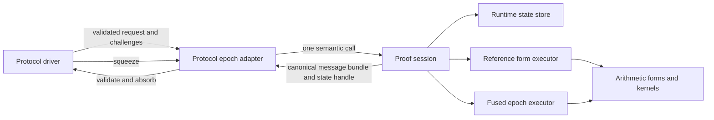

# Target architecture

| Field | Value |
|---|---|
| Package | [`README.md`](README.md) |
| Status | proposed |
| Role | normative target contract |

## Outcome

Akita proving becomes a protocol state machine over a runtime-owned state store
and a proof-scoped compute session. The protocol driver advances the
transcript. The selected runtime advances private prover state and returns
canonical messages. Computational forms and hardware kernels remain below that
semantic boundary.



The protocol epoch adapter is Akita-specific or Jolt-specific. The runtime
store, proof session, and their state/capability machinery are candidates for
eventual common ownership. The form and kernel implementations may already
share arithmetic through `jolt-field` without forcing the two protocols to
share a driver.

## Terms

### Protocol driver

The protocol driver is the canonical prover-side implementation of the
verifier's message schedule. It owns public validation, message ordering,
transcript operations, challenge draws, and proof construction.

### Canonical prover message

A canonical prover message is a verifier-visible value or ordered value bundle
that is serialized into the proof, absorbed into the transcript, or both. Its
representation is fixed by the protocol rather than by the selected backend.

### Fiat–Shamir epoch

A Fiat–Shamir epoch is the maximal prover computation after one challenge
squeeze and before the next challenge squeeze. The first transcript-bound epoch
begins after validated transcript initialization. Commitment and other
pretranscript message production use the same semantic-operation rules but do
not pretend to have a preceding squeeze. A terminal epoch may end without
another squeeze.

An epoch may produce several values when the verifier absorbs them
consecutively before drawing another challenge. Those values form one canonical
message bundle and should cross a remote boundary together. Consecutive
squeezes with no intervening prover message form one challenge bundle for the
next epoch; they do not create empty backend calls.

### Runtime state store

A runtime state store owns live backend state that may outlive one proof, such
as a committed witness reused by several opening proofs. It owns state identity,
residency, borrowing, and invalidation. It does not imply persistence across a
process boundary.

### Proof session

A proof session is backend-owned mutable state with exactly one proof lifetime.
It owns transient folded tables, cross-epoch residues, proof-local allocations,
memory pools, and the instantiated execution plan. It may borrow long-lived
state from the runtime store under explicit runtime-enforced rules.

### State handle

A state handle is a typed, opaque capability to one runtime-owned state object.
It identifies the owning backend and state domain but does not expose the stored
representation. A state domain is either long-lived runtime/store state or one
proof session. The semantic kind determines which domain is valid.

### Computational form

A computational form is a reusable algebraic operation below the protocol
epoch boundary, such as a grouped commitment, sum-check batch round, MLE fold,
ring decomposition, compression map, or matrix product. Forms are backend
implementation vocabulary, not transcript messages.

### Portable checkpoint

A portable checkpoint is an explicitly exported, versioned representation used
for persistence or planned state transfer. It is not live runtime state and is
not part of protocol identity unless a separate protocol rule explicitly binds
it.

## Layering contract

### Protocol layer

The protocol layer MUST own:

- proof statement and schedule validation;
- all transcript domain separators, labels, absorbs, and squeezes;
- the exact order and shape of canonical prover messages;
- public challenge derivation and rejection/grinding policy;
- prover entropy selection and the mapping from entropy to protocol blinds;
- proof object construction and serialization;
- verifier-visible error classification;
- protocol plans, including commitment and compression geometry.

The protocol layer MUST NOT:

- inspect or downcast backend-retained state;
- require live state to use a field-vector, ring-vector, digit, CPU, cloneable,
  default, or serializable representation;
- rebuild backend-private intermediates merely to call the next operation;
- choose an arithmetic kernel, device stream, chunk size, memory layout, or
  backend fallback after a proof begins.

### Protocol epoch adapter

An epoch adapter translates validated protocol data into one semantic runtime
request. It MUST have one canonical implementation per epoch. It MAY compile a
verifier-owned relation or plan into reusable form descriptors, but it MUST NOT
create a parallel geometry or relation authority.

An epoch adapter MAY use:

- a backend-provided fused epoch implementation; or
- the reference executor, which composes computational forms inside the same
  state domain.

Selection between those paths MUST happen before the epoch begins. The
selection MUST be observable and MUST NOT change the resulting canonical
message.

### Runtime layer

The runtime MUST own:

- state-store and proof-session construction and teardown;
- state allocation, residency, identity, and lifetime;
- capability discovery and execution planning;
- source ingress and upload reuse;
- backend-private caches and scratch storage;
- explicit state export, import, or transfer operations;
- per-epoch observability, including selected implementation and transferred
  bytes.

The runtime MUST NOT receive a transcript object, transcript sponge state, or
unbounded RNG. It MUST NOT choose protocol message order, transcript labels,
challenge families, schedule rows, or compression maps.

### Form and kernel layer

Forms and kernels MUST be transcript-free. Their inputs and outputs MAY use
backend-friendly representations internal to one runtime implementation.

The reference form executor MUST consume the same validated protocol plans that
the verifier and epoch adapter use. A fused implementation MUST be
differentially equivalent to this reference path.

The form vocabulary SHOULD remain small enough that a new backend can implement
general execution without reimplementing the Akita or Jolt protocol surface.
Protocol-specific fused implementations MAY exist where they materially reduce
passes, synchronization, or memory traffic.

## Message contract

Each canonical message type MUST define or delegate to exactly one canonical:

1. shape validator;
2. proof serialization path, when serialized;
3. transcript append path, when absorbed;
4. verifier parse or reconstruction path.

Before absorption, the driver MUST also enforce every cheap protocol transition
predicate available from public state. This is more than length checking. For a
sum-check round it includes the degree bound and
`round_poly(0) + round_poly(1) == prior_claim`; for commitment and relation
messages it includes canonical-form, group/order, checked-plan, and public
geometry consistency. These checks SHOULD call the same canonical helpers used
by verifier replay. Witness-semantic correctness that cannot be checked without
repeating prover work remains the prover runtime's responsibility and is still
enforced by final verification; the runtime is not a new soundness trust
boundary.

The backend MUST return canonical field or group values at the message
boundary. It may use Montgomery values, unreduced accumulators, projective
points, sharded buffers, or other representations internally, but those forms
must not cross the message boundary.

Message construction MUST be backend-invariant. Given identical protocol
inputs, witness, and host-provided entropy, different conforming backends MUST
produce byte-identical messages and proof bytes.

If a value retained today is later absorbed or serialized, it is a message and
MUST be modeled explicitly as one. It MUST NOT be recovered by inspecting a
generic retained-state object. The terminal inner-state binding currently read
from `AkitaCommitmentHint::inner_rows` is the motivating example.

## Proof-session and handle contract

The public semantic model is:

```rust,ignore
pub struct StateHandle<K> {
    owner: BackendId,
    domain: StateDomainId,
    slot: StateSlot,
    generation: u64,
    marker: PhantomData<fn() -> K>,
}

pub struct Produced<M, K> {
    message: M,
    retained: StateHandle<K>,
    binding: ArtifactBinding,
}
```

The exact fields and generics may change during implementation, but the
following properties are required:

- A handle MUST be bound to one live state domain and one backend owner.
- Commitment and imported-source kinds MAY live in a long-lived store and be
  borrowed by multiple proof sessions according to explicit sharing rules.
- Fold, relation, sum-check, and other transient kinds MUST normally be bound
  to exactly one proof session.
- A handle MUST identify its semantic state kind without exposing the stored
  Rust type.
- A produced artifact MUST bind its canonical message, checked protocol plan,
  setup identity, state owner, and state generation. The runtime MUST construct
  it atomically and MUST revalidate that binding at every state consumer.
- Produced-artifact fields MUST be private. Protocol code may borrow the message
  for validation and absorption but MUST NOT construct a new artifact or pair a
  message with another same-kind handle.
- Stale, foreign-domain, wrong-owner, and wrong-kind handles MUST return a
  typed prover error.
- Protocol code MUST NOT index session state by `TypeId`, string, relation ID,
  or unchecked integer.
- Backend implementations MAY use safe type erasure internally after the
  handle and owner checks.
- Cloneability and sharing MUST follow the semantic state kind. Handles MUST
  NOT be universally `Clone` merely because a CPU value is cloneable.
- Session teardown MUST release or invalidate its proof-local handles and
  resources. It MUST NOT implicitly invalidate long-lived committed state.

State kinds should describe semantic obligations rather than representations,
for example `CommittedGroupState`, `RingRelationState`, or
`SumcheckBatchState`. Names such as `CpuInnerRows` or `GpuBuffer` do not belong
in protocol-facing handle types.

`ArtifactBinding` is operational metadata, not a transcript field. It MAY use a
canonical commitment/message digest or a runtime-authenticated record. Its only
semantic requirement is deterministic rejection of a message/state/plan/setup
swap before the next transcript mutation.

## Epoch execution contract

The illustrative shape of an epoch operation is:

```rust,ignore
pub trait CommitGroupEpoch<F> {
    fn commit(
        &self,
        store: &mut ProverStateStore,
        request: CommitGroupRequest<'_, F>,
    ) -> Result<Produced<CommittedGroup<F>, CommittedGroupState>, ProverRuntimeError>;
}

pub trait SumcheckBatchRoundEpoch<F> {
    fn prove_round(
        &self,
        session: &mut ProofSession,
        state: StateHandle<SumcheckBatchState>,
        request: SumcheckRoundRequest<F>,
    ) -> Result<Produced<SumcheckRoundMessage<F>, SumcheckBatchState>, ProverRuntimeError>;
}
```

This is a semantic sketch, not a requirement to introduce one universal generic
trait or one trait per source representation. The implementation SHOULD prefer
object-safe, runtime-selectable epoch capabilities where the cost of dynamic
dispatch is negligible compared with arithmetic or RPC work.

An epoch request MUST contain only:

- validated public plans or relation instances;
- challenges sampled since the prior message;
- host-provided blinds or entropy-derived values required by the protocol;
- source or prior-state capabilities;
- public claims and expected message bounds needed for checked execution.

An epoch result MUST contain only:

- the next canonical message bundle;
- opaque handles for retained state needed later;
- backend diagnostics that are explicitly outside proof and transcript
  identity.

Large witness-proportional intermediates MUST NOT cross from a remote backend to
host orchestration unless they are themselves canonical protocol messages. A
sum-check batch round therefore returns the final batched round message, not one
polynomial per member for the host to combine.

## Source ingress

Source representation and backend-retained representation are separate
concerns.

The runtime MUST support both:

- a host source provider used by the CPU reference implementation or streamed
  into a backend on first use; and
- a resident source handle produced by an earlier import or protocol epoch.

Source-specific adapters MAY preserve dense, one-hot, recursive-witness, or
Jolt witness-plane structure. They MUST terminate at the runtime ingress
boundary. A backend capability MUST NOT require every application source type
and every ring dimension to appear in a public supertrait ladder.

The runtime MUST enforce the checked source-class and accepted-interval
contract while it ingests or traverses source values; host-declared metadata is
not authoritative. A resident source handle MAY skip rescanning only when its
runtime-owned binding proves that the same source has already passed the exact
contract. Admission MUST NOT require a host pre-scan followed by a duplicate
remote upload.

The one-control-round-trip requirement counts semantic request/response
synchronization. A large source MAY be streamed in chunks during the same
request. Transport chunking does not create additional protocol epochs.

The eventual Jolt/Akita runtime should permit Jolt to import the trace once and
give Akita commitment epochs a resident source capability over the same owned
data. The initial Akita cutover MAY retain existing source-generic adapters as
an internal bridge, but those generics must not constrain retained state or
later epoch APIs.

## Execution capabilities and planning

A runtime plan maps each semantic epoch to an executor and each state chain to
an owner. Planning MUST complete before the first affected message is absorbed.

Capability reporting MUST distinguish:

- full fused epoch support;
- reference composition from supported forms;
- explicit checkpoint export/import support;
- source-ingress formats;
- resource limits that can be checked before execution.

A composite runtime MUST NOT infer that two executors can share state merely
because their Rust backend types or prepared setups are equal. State sharing is
authorized only by a common owner/domain or an explicit transfer capability.

If epoch `B` consumes state produced by epoch `A`, the plan MUST select one of:

1. the same owner for both epochs;
2. an explicit direct transfer supported by both owners;
3. a portable export/import checkpoint at a named boundary; or
4. rejection before proving.

Implicit host materialization, silent recomputation, and mid-proof fallback are
not permitted state-transfer policies.

## Reference and fused execution

The CPU implementation is the initial semantic reference. Its live state store
may privately store the same rows, digits, compression witnesses, and quotients
that `AkitaCommitmentHint` stores today. This is an implementation fact, not
part of the new contract.

Reference composition MUST occur beneath one epoch call. It may call several
forms locally, but protocol orchestration must observe one semantic operation
and one canonical response.

A fused executor MAY replace any number of forms inside the epoch. It assumes
responsibility for all plan and shape requirements enforced by the reference
path. Tests MUST compare its messages and relevant diagnostics with the
reference executor.

Fallback from fused to reference execution MAY occur only when:

- it is selected before the epoch begins;
- all input state is already owned by or explicitly transferable to the
  reference executor;
- the selection is observable; and
- no prior message requires rollback.

## Transcript and randomness

Only the protocol driver may mutate the live transcript. A backend API that
accepts `Transcript`, a transcript callback, transcript bytes, sponge state, or
a challenge-sampling closure violates this design.

The host MUST sample or derive protocol randomness and pass the required values
to the epoch request. A backend MAY maintain non-protocol randomness for
blinding memory addresses, scheduling, or transport, but it must not affect
messages, proof bytes, or observable protocol behavior.

Rejection sampling and grinding remain protocol operations. For remote-safe
grinding, the driver snapshots the pre-grind transcript, derives a bounded
ordered batch of candidate nonces and decoded challenge bundles, and submits
that batch in one semantic request. The runtime may evaluate witness-dependent
acceptance and retain winning state. It MUST return the first accepting
candidate in driver order. The driver validates batch membership and replays
only that candidate against the live transcript. Because rejection is
witness-dependent, first-accept semantics are a runtime conformance property,
not something the driver can independently prove from the chosen nonce alone.
Proof soundness MUST NOT rely on minimality. The runtime MUST NOT receive the
transcript, choose candidate ordering, or commit the live challenge draw.

## Persistence and checkpoints

Live state MUST NOT implement a universal serialization contract.

Persistence-capable runtimes MAY expose explicit operations equivalent to:

```rust,ignore
fn export_committed_state(
    &self,
    store: &ProverStateStore,
    artifact: &CommittedArtifact<F>,
) -> Result<CommitmentCheckpoint, ProverRuntimeError>;

fn import_committed_state(
    &self,
    store: &mut ProverStateStore,
    checkpoint: CommitmentCheckpoint,
) -> Result<CommittedArtifact<F>, ProverRuntimeError>;
```

The canonical checkpoint envelope, allocation limits, legacy-cache rejection,
and setup-prefix regeneration behavior are specified in
[`commitment-cutover.md`](commitment-cutover.md#canonical-checkpoint-envelope).
Phase 3 MUST NOT land a serialized format that omits those requirements.

A checkpoint MUST bind enough metadata to reject use with the wrong public
commitment, setup identity, protocol plan, field, or checkpoint schema. Its
lengths and allocations MUST be validated before materialization.

Checkpoint bytes are operational prover artifacts. They MUST NOT be absorbed or
included in protocol identity unless a separate protocol specification requires
that behavior. A backend may import a checkpoint into a different live
representation.

Setup-prefix and precommitted-object persistence MUST migrate to this explicit
checkpoint model. `akita-types`, proof types, and verifier-facing registries
must not own backend live-state representations.

## Error and recovery contract

Runtime failures MUST be typed and separated from invalid public protocol data.
The minimum categories are:

- unsupported capability or shape;
- resource exhaustion detected before execution;
- invalid, stale, foreign, or wrong-kind handle;
- setup, plan, public commitment, or checkpoint mismatch;
- transport or device execution failure;
- backend invariant violation;
- canonical message validation failure.

An epoch failure MUST NOT partially append a message to the transcript. The
driver validates the complete result before absorption.

After a transport or device failure, retry on another owner is permitted only
when the input state is still valid and the runtime plan provides an explicit
transfer or reconstruction path. Otherwise the proof attempt must restart from
a valid checkpoint or from the beginning.

## Async and remote execution

The semantic contract must remain compatible with asynchronous execution, but
the first implementation need not expose Rust `async` methods. A runtime may
enqueue work, overlap independent epochs whose challenges are already known,
and prefetch sources.

The protocol-forced synchronization point is availability of the complete
canonical message before its absorb and subsequent squeeze. Backend APIs must
not promise host materialization of internal state merely because a method
returns.

## Observability

Every semantic epoch SHOULD emit one parent tracing span containing:

- protocol and epoch identity;
- selected executor and state owner;
- public shape metrics;
- input, output, and checkpoint/transfer bytes;
- number of backend control submissions and synchronizations;
- device-aware duration when available;
- explicit fallback or transfer decisions.

Diagnostics MUST NOT affect proof bytes or transcript state. Silent fallback is
a defect.

## Verifier boundary

The verifier remains independent of the prover runtime. It consumes canonical
messages and the same protocol plans used to validate their shape. It MUST NOT
consume state handles, backend identities, checkpoints, runtime capabilities,
device metadata, or backend diagnostics.

This refactor must not weaken the verifier no-panic contract. Any new
serialization or public message shape must validate lengths and dimensions
before allocation or indexing and return `AkitaError` or `SerializationError`
for malformed input.

## Conformance requirements

A conforming runtime implementation MUST pass:

1. message and proof byte equality against the reference runtime;
2. transcript-state equality at every squeeze boundary;
3. source-representation differential tests for supported source classes;
4. invalid-handle, wrong-owner, wrong-domain, stale-generation, and
   wrong-checkpoint tests;
5. capability-planning tests that reject an unplanned owner transition;
6. a mock-remote test proving that witness-proportional retained state never
   crosses the message boundary;
7. per-epoch control-round-trip assertions;
8. existing protocol and verifier negative tests.

Performance evidence must name the exact backend, host/device, command,
protocol profile, source representation, base SHA, and head SHA. Kernel
microbenchmarks are not evidence of end-to-end epoch improvement unless the
protocol benchmark shows the corresponding transfer and synchronization
change.

## Alternatives rejected

### Add one fused method to each existing kernel trait

This improves one pipeline while preserving the wrong public boundary. It still
returns host-shaped intermediate state, leaves compression and opening outside
the fused operation, and multiplies source/ring-dimension capability bounds.

### Make `AkitaCommitmentHint` an enum of CPU and device representations

An Akita-owned enum makes every new backend a protocol-type change. It also
confuses live state with persistence and forces device or remote state to fit a
serializable host carrier.

### Put the transcript inside the backend

This permits fusion but gives the backend protocol authority, complicates
verifier byte-identity review, and prevents one protocol driver from working
across reference and optimized runtimes.

### Expose only primitive arithmetic kernels

Primitive-only APIs maximize reuse but force host orchestration and
witness-proportional round trips. They remain useful as forms below the epoch
boundary, not as the remote semantic API.

### One trait containing every Akita and Jolt operation

A joint mega-trait couples backend implementations to both protocol surfaces
and repeats Jolt's rejected relation-major failure mode. The eventual common
layer is the runtime/session/handle/capability machinery, with protocol-specific
epoch adapters above it.

### Use an untyped session map as the protocol API

Safe type erasure can be an internal implementation technique, but exposing
`TypeId -> Any` to protocol orchestration turns missing state and phase errors
into late runtime failures and provides no owner or transfer contract.
