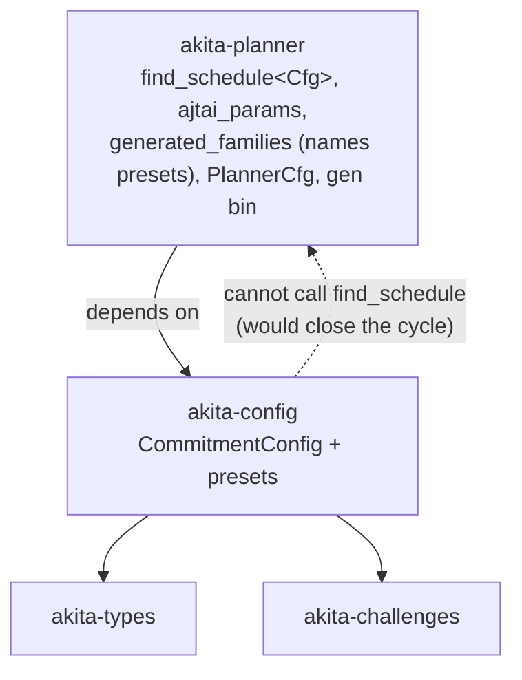
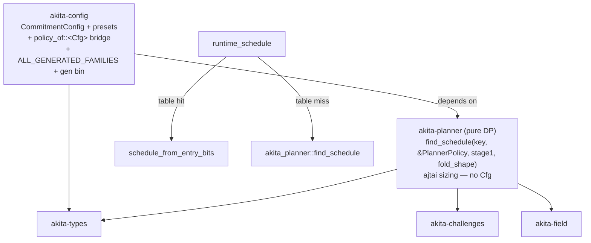

# Spec: `Cfg`-Free Planner DP + Dependency Inversion for Runtime Schedule Fallback

| Field       | Value                          |
|-------------|--------------------------------|
| Author(s)   |                                |
| Created     | 2026-05-31                     |
| Status      | proposed                       |
| PR          |                                |

## Summary

Akita's runtime can only serve schedule parameters that were brute-forced
offline and shipped in the generated tables (`crates/akita-types/src/generated/*`).
On a table miss, `CommitmentConfig::runtime_schedule` errors out. The offline DP
search that *could* fill the gap — `akita_planner::find_schedule` — lives in
`akita-planner`, which sits **above** `akita-config`: it is `<Cfg: CommitmentConfig>`-generic,
so it names the `CommitmentConfig` trait and therefore depends on `akita-config`.
That dependency direction is exactly why `akita-config` cannot call it:
`akita-config → akita-planner → akita-config` is a crate cycle, which Cargo
rejects.

We want to **support every possible input at runtime, regenerating parameters
whenever the table is missing an entry**, on both prover and verifier, with no
reliance on a pre-shipped table.

This spec proposes the cleanest realization: **make the planner DP `Cfg`-free and
invert the `planner ↔ config` dependency.** Concretely:

1. Replace `find_schedule`'s `<Cfg>` generic with a plain `PlannerPolicy` value
   plus two small closures (`stage1`, `fold_shape`). The DP and the SIS sizing
   (`ajtai_params`) then reference *no* `akita-config` types.
2. Move the only genuinely `Cfg`-aware glue — the preset family list, the
   table-emitter binary, `PlannerCfg`, and the preset-using tests — out of
   `akita-planner` and into `akita-config` (which is where the presets are
   defined).
3. With `akita-planner` reduced to a pure, trait-free DP library that depends
   only on `akita-types`/`akita-challenges`/`akita-field`, **`akita-config` now
   depends on `akita-planner`** (the arrow flips). `runtime_schedule` calls
   `akita_planner::find_schedule(key, &policy_of::<Self>(), …)` on a table miss.

`PlannerCfg`, the `use_lookup` flag, the `runtime_schedule` default-vs-override
split, and the `test-utils` feature all disappear. Runtime DP fallback becomes
the default for every preset, so any input is supported.

The deliberate, accepted cost: the DP search becomes **verifier-reachable**, so
it must satisfy the verifier no-panic contract.

## Intent

### Goal

Make `CommitmentConfig::runtime_schedule` produce a valid schedule for **any**
lookup key — serving the shipped table when present and regenerating via the DP
when absent — without a dependency cycle, without an opt-in wrapper, and
identically on prover and verifier.

Why this shape (vs. merging crates):

- **A circular dependency is a property of the crate graph, not the call
  graph.** `A → B` means "compile B before A"; edges both ways have no build
  order and Cargo rejects them. Feature flags don't help — the cycle exists at
  the package level before features apply.
- **Closures alone do not break the cycle.** Passing `find_schedule` a
  `PlannerPolicy` + closures removes its dependency on the `CommitmentConfig`
  *trait*, but if the function stays in `akita-planner`, the *crate* still
  depends on `akita-config` (its family list names the presets). Crate
  dependencies are all-or-nothing.
- **The fix is therefore "decouple **and** relocate."** Once the DP names no
  `akita-config` types, the planner crate can drop its `akita-config`
  dependency, which lets `akita-config` depend on `akita-planner` instead — no
  cycle. The closures are the *mechanism*; the dependency flip is what actually
  enables the runtime call.

### Key changes (by crate)

**`akita-planner` (becomes a pure DP library, `Cfg`-free):**

- New value type `PlannerPolicy` carrying the brute-force inputs the DP needs:

  ```rust
  pub struct PlannerPolicy {
      pub ring_dimension: usize,              // was Cfg::D
      pub decomposition: DecompositionParams, // was Cfg::decomposition()
      pub sis_family: SisModulusFamily,       // was Cfg::sis_modulus_family()
      pub ring_subfield_norm_bound: u32,      // was Cfg::ring_subfield_embedding_norm_bound()
      pub claim_ext_degree: usize,            // was Cfg::CLAIM_EXT_DEGREE
      pub chal_ext_degree: usize,             // was Cfg::CHAL_EXT_DEGREE
      pub basis_range: (u32, u32),            // was Cfg::basis_range()
  }
  ```

- `find_schedule` loses its generic and its `use_lookup` flag; the table consult
  (`offline_schedule_for_key`) is deleted (it moves into `runtime_schedule`):

  ```rust
  pub fn find_schedule(
      key: AkitaScheduleLookupKey,
      policy: &PlannerPolicy,
      stage1: impl Fn(usize) -> Result<SparseChallengeConfig, AkitaError>,
      fold_shape: impl Fn(AkitaScheduleInputs) -> TensorChallengeShape,
  ) -> Result<Schedule, AkitaError>;
  ```

- `ajtai_params.rs` helpers (`compute_all_ajtai_keys_params`,
  `WitnessType::{binding_norm, decomposed_num_digits}`) take `&PlannerPolicy`
  + `stage1` instead of `<Cfg>`.
- `akita-planner`'s dependencies drop `akita-config` (and `akita-algebra` if it
  proves unused), leaving `akita-types`, `akita-challenges`, `akita-field`.

**`akita-config` (gains the `Cfg`-aware glue and the runtime call):**

- A bridge that derives the policy from a preset — the **single source of
  truth** is still the `Cfg` impl:

  ```rust
  pub fn policy_of<Cfg: CommitmentConfig>() -> PlannerPolicy {
      PlannerPolicy {
          ring_dimension: Cfg::D,
          decomposition: Cfg::decomposition(),
          sis_family: Cfg::sis_modulus_family(),
          ring_subfield_norm_bound: Cfg::ring_subfield_embedding_norm_bound(),
          claim_ext_degree: Cfg::CLAIM_EXT_DEGREE,
          chal_ext_degree: Cfg::CHAL_EXT_DEGREE,
          basis_range: Cfg::basis_range(),
      }
  }
  ```

- `runtime_schedule` becomes one body (no override hook, no `PlannerCfg`):

  ```rust
  fn runtime_schedule(key: AkitaScheduleLookupKey) -> Result<Option<Schedule>, AkitaError> {
      if let Some(entry) = Self::resolve_schedule(key)? {
          // table hit — expand as today
          return Ok(Some(akita_types::schedule_from_entry_bits(
              entry, key, Self::sis_modulus_family(), Self::decomposition(),
              Self::decomposition().field_bits() * Self::CHAL_EXT_DEGREE as u32,
              Self::CLAIM_EXT_DEGREE, Self::ring_subfield_embedding_norm_bound(),
              Self::stage1_challenge_config, Self::fold_challenge_shape_at_level,
          )?));
      }
      // table miss — regenerate via the (now lower) planner crate
      Ok(Some(akita_planner::find_schedule(
          key, &policy_of::<Self>(),
          Self::stage1_challenge_config, Self::fold_challenge_shape_at_level,
      )?))
  }
  ```

- The preset family **list** (`ALL_GENERATED_FAMILIES`), the `regen::<Cfg>` /
  `Cfg::schedule_table` fn-pointer construction, and the `gen_schedule_tables`
  binary move here (they must name the presets). The `Cfg`-free `GeneratedFamily`
  **struct** and `family_keys` key-cross-product are concrete and stay in
  `akita-planner`, populated from `akita-config` — see §Design.
- `PlannerCfg` and the `test-utils` feature are deleted; fallback is the default.

### Invariants

1. **Prover/verifier consistency.** For every key, prover and verifier resolve
   the same schedule (table hit *or* identical DP regeneration). `find_schedule`
   is deterministic in `(policy, key)`, and the effective schedule is
   Fiat-Shamir-bound (`PlanSection` digest), so any divergence surfaces as a
   rejected proof, not a soundness hole. Guarded by
   [crates/akita-pcs/tests/akita_e2e.rs](../crates/akita-pcs/tests/akita_e2e.rs)
   and [crates/akita-pcs/tests/zk.rs](../crates/akita-pcs/tests/zk.rs).
2. **Table parity.** For every key in a shipped table, `runtime_schedule`
   returns the table-expanded schedule (the DP branch is not taken); existing
   proofs and setup envelopes stay byte-identical.
3. **DP regeneration parity.** `find_schedule(key, &policy_of::<Cfg>(), …)`
   produces the exact schedule today's `find_schedule::<Cfg>(key)` produces — the
   DP body is unchanged apart from the de-generic mechanics. Guarded by the
   `generated_tables` drift test (regenerated DP == shipped table) and a no-op
   `gen_schedule_tables` diff.
4. **Single source of truth for policy.** The per-preset `PlannerPolicy` is
   *derived* from the `Cfg` impl via `policy_of::<Cfg>()` — never hand-written as
   literals in the planner. There is exactly one place each preset's
   `(D, decomposition, sis_family, norm_bound, ext degrees, basis_range)` is
   defined: the `CommitmentConfig` impl.
5. **Verifier no-panic contract** (AGENTS.md). With the DP now reachable from
   `verify_batched`, `find_schedule`, `ajtai_params`, and every helper they call
   must reject malformed input with `AkitaError`, never panic — no
   `panic!`/`unwrap`/`expect`/`unreachable!`/unchecked indexing/overflow-prone
   shape math/unbounded allocation.
6. **Determinism across features.** The `zk` feature changes witness-length and
   proof-byte math; regeneration must match the shipped `zk` tables too.

### Non-Goals

- Changing the DP algorithm, the chosen `(m_vars, r_vars, log_basis, n_a, n_b, n_d)`
  for any key, or any proof sizes.
- Changing the `CommitmentConfig` field-role model, ZK hiding layout, or the
  ring-switch / sumcheck protocols.
- Keeping the lean, planner-free verifier dependency tree. This invariant is
  intentionally repealed (the DP is now verifier-reachable; see §Risks).
- Adding a runtime DP *cache* in this pass (noted under §Performance as a
  follow-up).

## Evaluation

### Acceptance Criteria

- [ ] `akita-planner` no longer depends on `akita-config`; no `akita_config::` /
  `CommitmentConfig` / `<Cfg>` paths remain in the crate.
- [ ] `akita-config` depends on `akita-planner`; `runtime_schedule` serves the
  table on hit and calls `akita_planner::find_schedule` on miss.
- [ ] `find_schedule(key, &PlannerPolicy, stage1, fold_shape)` has no generic
  and no `use_lookup`; `offline_schedule_for_key` is gone.
- [ ] `PlannerCfg`, the `test-utils` feature, and the `akita-planner/test-utils`
  dev-dep wiring in `akita-pcs`/`akita-scheme`/`akita-setup` are removed; fixtures
  use the bare preset `Cfg`.
- [ ] A fresh `gen_schedule_tables` run yields no diff against the shipped
  tables (proves the de-generic refactor preserved the math).
- [ ] No `unreachable!`/`unwrap`/`expect`/unchecked indexing remains on any path
  reachable from `find_schedule`.
- [ ] `cargo fmt -q`, `cargo clippy --all -- -D warnings`, and `cargo test` pass
  under default features and `--features zk`.
- [ ] `AKITA_MODE=onehot_fp128_d32 AKITA_NUM_VARS=32 cargo run --release --example profile`
  succeeds with the same reported proof size.
- [ ] A new test proves DP fallback fires for a key **not** in any shipped table,
  on both prove and verify, and the proof round-trips.

### Testing Strategy

Must keep passing: end-to-end
[akita_e2e.rs](../crates/akita-pcs/tests/akita_e2e.rs) /
[zk.rs](../crates/akita-pcs/tests/zk.rs); the SIS-width audits and
`fp128_policy_tests` in [crates/akita-config/src/lib.rs](../crates/akita-config/src/lib.rs);
the setup tests in [crates/akita-setup/src/lib.rs](../crates/akita-setup/src/lib.rs).

Relocated (preset-using, so they move with the family list into `akita-config`'s
test tree): `generated_tables.rs` (regenerated DP == shipped table; the key
sentinel), `proof_size_comparison.rs`, `regen_diff.rs`. The
`find_schedule(_, true)` vs `find_schedule(_, false)` comparisons collapse to
"table (`Cfg::runtime_schedule` with an entry) vs pure DP (`find_schedule`)".

New tests:

- **Table-miss fallback (primary):** an incidence with no shipped entry (e.g. a
  multipoint or non-singleton `num_t_vectors` shape) yields `Some` from
  `Cfg::runtime_schedule`, and a full prove/verify round-trip passes (prover and
  verifier independently regenerate and agree).
- **Policy bridge parity:** assert `policy_of::<Cfg>()` reproduces the values the
  DP read off `Cfg` before the refactor (a guard for invariant 4).
- **No-panic fuzz (verifier boundary):** adversarial-but-bounded keys (large
  `num_vars` within setup capacity, degenerate vector counts) through
  `runtime_schedule` return `AkitaError`, never panic.

Run the full suite under both default and `zk` features.

### Performance

A single-key DP is cheap (the full ~1,172-key sweep is empirically
indistinguishable from one run), but it now runs on the prove/verify path on a
table miss. Mitigation (follow-up): a process-wide memo keyed by
`AkitaScheduleLookupKey` in `akita-config` so repeated openings of the same shape
reuse the first result. Table **hits** are unchanged (no DP). Fold-root and
root-direct proof sizes are unchanged.

## Design

### Architecture

Today — the planner is generic over `Cfg`, so the arrow points up and config
cannot call it:



Target — the DP is `Cfg`-free, so the arrow flips and config calls it directly:



### What `Cfg` coupling exists today, and where each piece goes

A review of `akita-planner` found four kinds of `Cfg` coupling, very different in
difficulty:

| Site | Coupling | Disposition |
|---|---|---|
| `schedule_params.rs` (DP core) | `<Cfg>`-generic; uses 9 hooks | de-`Cfg` → `PlannerPolicy` + closures; **stays in planner** |
| `ajtai_params.rs` (SIS sizing) | `<Cfg>`-generic; same hooks | de-`Cfg` → `&PlannerPolicy` + `stage1`; **stays in planner** |
| `generated_families.rs`: `GeneratedFamily` struct + `family_keys` | `Cfg`-free (plain fn-pointers + `num_vars` range) | **stays in planner** (concrete families) |
| `generated_families.rs`: `ALL_GENERATED_FAMILIES` const | **names every preset type** + builds `regen::<Cfg>` / `Cfg::schedule_table` fn-pointers | **moves to `akita-config`** (only config knows presets) |
| `test_utils.rs` (`PlannerCfg`) | *implements* `CommitmentConfig` | **deleted** (fallback is now default) |

The full hook set the DP consumes — and the only thing the `PlannerPolicy` +
closures must carry — is: `Cfg::D`, `Cfg::decomposition()`,
`Cfg::sis_modulus_family()`, `Cfg::stage1_challenge_config(D)`,
`Cfg::ring_subfield_embedding_norm_bound()`, `Cfg::fold_challenge_shape_at_level(..)`,
`Cfg::basis_range()`, `Cfg::CLAIM_EXT_DEGREE`, `Cfg::CHAL_EXT_DEGREE`. There is
direct precedent: `akita_types::schedule_from_entry_bits` already takes exactly
this plain-value + `stage1`/`fold_shape` closure shape.

`generated_families.rs` is the one place `Cfg` is unavoidable, because each row
maps a preset to its regen hook and shipped table:

```108:110:crates/akita-planner/src/generated_families.rs
        regen: regen::<fp128::D32Full>,
        regen_with_lookup: regen_with_lookup::<fp128::D32Full>,
        schedule_table: fp128::D32Full::schedule_table,
```

That mapping can only be written where the presets are defined (`akita-config`).
But it is worth separating the two things `generated_families.rs` contains today,
because they sit on **opposite sides** of the `Cfg` boundary:

1. **The `GeneratedFamily` struct + `family_keys` — concrete and `Cfg`-free.**
   `family_keys` reads only `module_name`, `const_name`, `min_num_vars`, and
   `max_num_vars` to build the singleton + 4-batched key cross-product; it never
   touches the `regen`/`schedule_table` fn-pointers. The struct itself stores plain
   function pointers (`fn(AkitaScheduleLookupKey) -> Result<Schedule, AkitaError>`,
   `fn() -> Option<GeneratedScheduleTable>`), so it names no preset and no
   `CommitmentConfig`. **These are the "concrete families" — they can and should
   live in `akita-planner`.**
2. **The `ALL_GENERATED_FAMILIES` const — *not* concrete.** Each row binds
   `regen::<fp128::D32Full>` and `fp128::D32Full::schedule_table`, which name preset
   `Cfg` types. Only `akita-config` can name presets, so **the const stays in
   `akita-config`** — and it *must*, to preserve invariant 4 (single source of
   truth): the alternative, hand-coding each family's `PlannerPolicy` as literals so
   the list becomes movable data, would duplicate every preset's
   `(D, decomposition, sis_family, …)` outside its `Cfg` impl.

So the answer to "what is `families` in `family_keys`": it is the `Cfg`-free
struct, not the preset-bound list — which is exactly why the recommended split
puts the struct + `family_keys` in `akita-planner` and keeps only the const-list
construction in `akita-config`:

- **(Recommended) `GeneratedFamily` + `family_keys` in `akita-planner`
  (`Cfg`-free); build `ALL_GENERATED_FAMILIES` in `akita-config`.** `akita-config`
  defines `fn regen<Cfg>(key) -> Result<Schedule, …> { find_schedule(key, &policy_of::<Cfg>(), Cfg::stage1_challenge_config, Cfg::fold_challenge_shape_at_level) }`
  and constructs the const with `regen::<fp128::D32Full>` etc. The planner owns the
  reusable struct + key-cross-product; config owns only the preset binding.
- **(Simpler) Move all of `generated_families.rs` + the bin into `akita-config`.**
  `akita-planner` then exposes only `find_schedule`, `PlannerPolicy`, and ajtai
  helpers. Fewer cross-crate types; `akita-planner` becomes a tight algorithm
  crate. Pick this only if you do not want the struct reused outside config.

Either way the `gen_schedule_tables` binary becomes a `akita-config` bin (it
consumes the family list); the emitter string-formatting helpers move with it.

### Final layout (recommended split)

```
crates/akita-planner/              # pure DP, no akita-config dep
└── src/
    ├── lib.rs                     # pub use find_schedule, PlannerPolicy, GeneratedFamily, family_keys
    ├── schedule_search.rs         # find_schedule(key, &PlannerPolicy, stage1, fold_shape)
    ├── ajtai_params.rs            # &PlannerPolicy + stage1
    └── families.rs                # Cfg-free GeneratedFamily struct + family_keys

crates/akita-config/
├── Cargo.toml                     # + akita-planner dep; + [[bin]] gen_schedule_tables
└── src/
    ├── lib.rs                     # policy_of::<Cfg>(); runtime_schedule = table-then-DP
    ├── generated_families.rs      # ALL_GENERATED_FAMILIES + regen::<Cfg> / schedule_table glue
    ├── proof_optimized.rs / …     # presets (unchanged)
    ├── tensor_verifier.rs
    └── bin/gen_schedule_tables.rs # moved from akita-planner
```

### Alternatives Considered

The requirement — serve any input at runtime, regenerating on a table miss, on
both prover and verifier — forces runtime DP onto the verify path in every viable
option except D1. The options differ in *where the DP lives* and *how it is
invoked without a cycle*.

- **(Chosen) De-`Cfg` the planner DP + flip the dependency.** `find_schedule`
  becomes trait-free (policy + closures), the preset glue moves to config, and
  `akita-config → akita-planner`. Keeps `akita-config` lean (it only gains a tiny
  `policy_of` bridge + the family list/bin it already morally owns), reuses
  `akita-planner` as the low DP crate (no new crate), and makes fallback the
  default. Cost: the de-generic edit to `find_schedule`/`ajtai_params`, the
  no-panic hardening, and DP on the verify path.

- **A1 — Merge `akita-planner` into `akita-config`.** One crate, no boundary to
  be circular; `find_schedule` stays `<Cfg>`-generic (no signature change).
  **Not chosen:** `akita-config` absorbs the entire DP + SIS sizing + family list
  + emitter, and every downstream crate (verifier included) compiles all of it.
  The chosen approach achieves the same runtime behavior while keeping the DP in
  its own crate.

- **A2 (new crate) — Move the de-`Cfg`'d DP into a brand-new
  `akita-schedule-search` crate below config.** Functionally identical to the
  chosen approach. **Not chosen:** it adds a crate when `akita-planner` itself can
  be that low crate once it sheds its `akita-config` dependency. (If one prefers
  `akita-planner` to remain strictly "offline codegen," the new-crate split is the
  variant to pick.)

- **B1 / B2 — Promote `PlannerCfg`, or named planner-resident presets with
  fallback baked in.** Reuse existing dependency-inversion shims. **Fail the
  requirement as a default:** fallback only happens for call sites that remember
  to wrap, and prover/verifier must be wrapped *symmetrically* or proofs fail.
  Opt-in, discipline-dependent — not "support every input everywhere."

- **C1 — Runtime schedule-provider injection (a `dyn`/fn-pointer provider config
  consults, installed from planner).** Avoids the cycle without de-genericizing.
  **Rejected:** global/injected state and an install point easy to forget on the
  verifier (silent liveness bug); still runs DP on verify, so it carries the same
  no-panic cost without the simplicity.

- **C2 — Startup-materialized in-memory table.** Run DP once at startup / lazily
  memoize; keep steady-state verify table-only. **Rejected as primary:** for a
  truly open-ended key space you cannot pre-materialize everything, so "lazy on
  first miss" still runs DP on the verify path, and it still needs the DP code to
  live somewhere reachable (i.e. this spec's design underneath). Good as a
  *caching layer on top of* the chosen approach (see §Performance).

- **D1 — Bound the input space and pre-generate the full cross-product.** Zero
  runtime DP, lean verifier. **Rejected by premise:** inputs are explicitly not
  bounded to the shipped table; if they were, we'd just extend the table.

### Why the "obvious" shortcuts fail

- **"Call `find_schedule` from the preset impls and delete `PlannerCfg`."**
  Re-creates the cycle: the presets live *in* `akita-config`
  (`proof_optimized.rs`, `tensor_verifier.rs`), so naming
  `akita_planner::find_schedule` from a preset is the `config → planner` edge,
  and `planner → config` already exists.
- **"Just pass closures to `find_schedule`, keep it where it is."** Closures
  remove the dependency on the `CommitmentConfig` *trait*, but the `akita-planner`
  *crate* still depends on `akita-config` (its family list names the presets), so
  the crate cycle persists. Decoupling must be paired with relocation — which is
  this spec.

## Documentation

- Update [AGENTS.md](../AGENTS.md): redescribe `akita-planner` as a `Cfg`-free DP
  library that `akita-config` depends on (not a `<Cfg>`-generic crate above it);
  move the family-list / table-emitter ownership to `akita-config`; **repeal** the
  "verifier dep tree excludes `akita-planner` / never reaches DP code" statements
  and replace with "the DP search is verifier-reachable and audited under the
  no-panic contract"; remove the `test-utils` / `PlannerCfg` notes; update the
  `akita-config` line (now depends on `akita-planner`).
- Update [STACK.md](../STACK.md) dependency graph to flip the `planner`/`config`
  edge.
- Update the crate-level docs in `akita-planner/src/lib.rs`, which currently
  claim the crate sits above config and the verifier never reaches DP code.
- This spec supersedes the "verifier excludes planner" portions of
  [specs/planner-runtime-flow-cleanup.md](planner-runtime-flow-cleanup.md).

## Execution

Land so the tree compiles at each step:

1. **De-`Cfg` the DP in `akita-planner`.** Add `PlannerPolicy`; rewrite
   `find_schedule` and `ajtai_params` to take `&PlannerPolicy` + `stage1` /
   `fold_shape` closures; drop `use_lookup` and `offline_schedule_for_key`. At
   this step `akita-planner` still depends on `akita-config` only through
   `generated_families`/`PlannerCfg`/tests.
2. **No-panic hardening.** Restructure `best_fold_per_lb` to carry the `FoldStep`
   directly so the two `unreachable!("…start with Step::Fold")` sites
   (`schedule_params.rs:299`, `:583`) and the `suffix_sched[0]` indexing become
   compile-time-impossible; re-verify `checked_shl`/`checked_mul` cover every
   shape multiply.
3. **Move the `Cfg`-aware glue to `akita-config`.** Relocate
   `ALL_GENERATED_FAMILIES` + `regen`/`schedule_table` construction + the
   `gen_schedule_tables` bin into `akita-config`; add `policy_of::<Cfg>()`. Keep
   the `Cfg`-free `GeneratedFamily` struct + `family_keys` in `akita-planner` (or
   move them too — see §Design).
4. **Drop the planner→config dependency; add config→planner.** Remove
   `akita-config` from `akita-planner/Cargo.toml`; add `akita-planner` to
   `akita-config/Cargo.toml`. Delete `PlannerCfg` and the `test-utils` feature;
   remove the `akita-planner/test-utils` dev-deps from
   `akita-pcs`/`akita-scheme`/`akita-setup`; update fixtures to the bare preset.
5. **Wire `runtime_schedule`.** Table hit → `schedule_from_entry_bits`; miss →
   `akita_planner::find_schedule(key, &policy_of::<Self>(), …)`. Optionally add
   the per-key memo.
6. **Move the drift tests.** `generated_tables.rs` / `regen_diff.rs` /
   `proof_size_comparison.rs` → `crates/akita-config/tests/`; retarget the
   `true`/`false` comparisons.
7. **Regenerate + verify.** Run `gen_schedule_tables`; confirm a no-op diff
   against shipped tables. Update `AGENTS.md` / `STACK.md` / lib docs.
8. **Green CI.** `cargo fmt -q`, `cargo clippy --all -- -D warnings`, `cargo test`
   (default + `zk`), and a profile sanity run.

### Risks to resolve first

- **No-panic restructure (step 2) is the real engineering work** — the rest is
  mechanical de-generic + relocation. Budget for the `best_fold_per_lb` type
  change and a verifier-boundary fuzz test.
- **Invariant repeal is load-bearing.** The DP is now on the verify path;
  document it loudly in AGENTS.md so it is not "fixed" back, and ensure the
  verifier validates `key.num_vars` against setup capacity *before* DP runs (so
  the search's bounded state space cannot be blown up by a malformed proof).
- **Single-source policy.** `policy_of::<Cfg>()` must *derive* from the preset
  hooks; never hand-write `PlannerPolicy` literals per family (that would split
  the source of truth and let generated tables diverge from runtime expansion).
- **Table-drift masking.** With fallback always on, a stale/missing table entry
  no longer errors loudly at runtime — keep `generated_tables.rs` as the guard
  that shipped tables still equal the DP output.

## Known issue: planner overcounts stage-2 degree-2 sumcheck rounds

The header-stripped proof-size formula
([`akita_types::level_proof_bytes`](../crates/akita-types/src/proof_size.rs))
assumes **every** stage-2 sumcheck round ships a degree-3 compressed
univariate (three challenge-field coefficients). The prover does not: a handful
of stage-2 rounds are emitted at degree 2 via the y-/x-prefix
micro-optimization (`compute_round_*_prefix_*` /
`Stage2BivariateSkipState::reconstruct_round0_polys`), which trims one leading
coefficient. `UniPoly::from_coeffs` then drops that trailing zero, so the real
`SumcheckProof` carries one fewer challenge element per such round.

Consequence: for some schedules the planner's `total_bytes` **overcounts** the
real serialized proof by a few challenge elements (observed: 16 bytes for
`onehot_fp128_d32` nv32 np1, 48 bytes for nv12). The estimate stays a
*conservative upper bound*, so it is safe for planning and transcript binding,
but it is not byte-exact against the runtime proof.

This is **pre-existing**, not introduced by the planner refactor: `origin/main`
reproduces the same mismatch on `nv` values whose terminal sumcheck folds an
odd-shaped witness (e.g. `onehot_fp128_d32` nv12). The refactor only changed
which schedule a few keys resolve to, so `nv32` (which the profile-bench CI
exercises) flipped from a matching schedule to a mismatching one.

Interim handling: the profile example
([workload.rs](../crates/akita-pcs/examples/profile/workload.rs)) no longer
asserts byte-exact equality. It requires `proof.size() <= planned` (the estimate
must remain an upper bound) and accepts an overcount up to
`ACCEPTED_PLANNER_PROOF_SIZE_OVERCOUNT_BYTES`, logging a `NOTE` when nonzero. A
real structural regression (a dropped commitment, level, or witness payload) is
far larger than that bound and still fails loudly.

Proper fix (deferred): teach the offline formula the exact per-round stage-2
degree schedule (mirroring the prover's prefix-round predicates) so the estimate
is byte-exact again, then regenerate the schedule tables and restore the
byte-exact assertion.

## References

- [specs/planner-runtime-flow-cleanup.md](planner-runtime-flow-cleanup.md) — the
  prior consolidation that made `runtime_schedule` / `schedule_from_entry_bits`
  the single expansion path; this spec builds on its `Cfg` API.
- [specs/transcript-hardening.md](transcript-hardening.md) — `PlanSection` binds
  the effective schedule digest (the basis for invariant 1).
- Key sources: [crates/akita-planner/src/schedule_params.rs](../crates/akita-planner/src/schedule_params.rs),
  [crates/akita-planner/src/ajtai_params.rs](../crates/akita-planner/src/ajtai_params.rs),
  [crates/akita-planner/src/generated_families.rs](../crates/akita-planner/src/generated_families.rs),
  [crates/akita-planner/src/bin/gen_schedule_tables.rs](../crates/akita-planner/src/bin/gen_schedule_tables.rs),
  [crates/akita-planner/src/test_utils.rs](../crates/akita-planner/src/test_utils.rs),
  [crates/akita-config/src/lib.rs](../crates/akita-config/src/lib.rs).
- Profile command: `AKITA_MODE=onehot_fp128_d32 AKITA_NUM_VARS=32 cargo run --release --example profile`.
