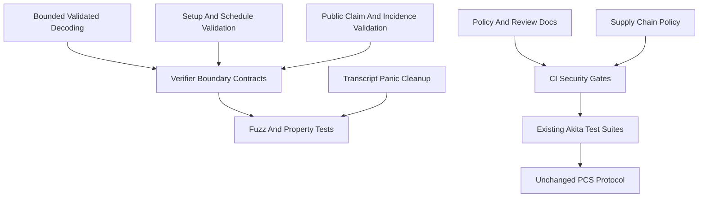

# Spec: Security Hardening

| Field       | Value                    |
|-------------|--------------------------|
| Author(s)   | Quang Dao                |
| Created     | 2026-05-14               |
| Status      | implemented              |
| PR          | #81                      |

## Summary

This change strengthens Akita's security posture without changing the polynomial commitment protocol.
It adds explicit disclosure and review process, supply-chain checks, fuzz and property-test entry points, bounded validated vector decoding, verifier-side panic hardening, and CI gates for hygiene, portability, and proof-size drift.
The goal is to make security-sensitive changes easier to review while removing concrete verifier-facing denial-of-service risks from untrusted bytes, untrusted public inputs, malformed setup artifacts, and malformed low-level verifier API inputs.

## Intent

### Goal

Build a security hardening layer around the existing Akita workspace by adding policy documents, CI checks, fuzz targets, bounded deserialization, verifier input validation, and review checklists while preserving the current prover, verifier, transcript, and proof-format semantics.

The verifier must reject malformed verifier-facing inputs by returning `AkitaError` or `SerializationError`.
It must not panic, abort through debug assertions, or allocate unbounded memory when processing:

- serialized proofs and proof shapes,
- serialized verifier setup artifacts,
- public opening points, claimed openings, commitments, and claim incidence summaries,
- config-derived schedules and `LevelParams` supplied to verifier APIs,
- in-memory proof/setup values passed through public verifier APIs without deserialization,
- verifier dependency helpers reached from `akita-verifier`, including `akita-types`, `akita-serialization`, `akita-algebra`, `akita-sumcheck`, `akita-transcript`, `akita-challenges`, and verifier-used `akita-field` code.

### Verifier No-Panic Contract

Verifier-reachable execution is a no-panic boundary.
For every public verifier entry point, and for every helper reachable from that entry point while processing public proof, setup, schedule, claim, opening, commitment, or transcript data, malformed input must produce a typed error rather than a panic.

This contract includes panics from:

- explicit `panic!`, `assert!`, `assert_eq!`, `expect`, `unwrap`, `unreachable!`, and unchecked debug-only assertions that can be triggered by malformed verifier input,
- bounds checks from indexing or slicing,
- shift, multiplication, addition, and allocation overflows,
- shape-derived allocations whose size is not bounded by validated verifier inputs.

Verifier code may still use indexing, assertions, and infallible helper APIs only after an earlier verifier boundary has established the required invariant.
When a verifier-reachable panic-shaped operation remains, the code or nearby validation must make the invariant clear enough that reviewers can trace why public malformed input cannot reach it.
Regression tests should target the boundary validation, not the internal assertion.

### Invariants

- Verifier acceptance behavior must not change for existing valid proofs.
  The non-zk verifier check and all-features workspace test suite protect this locally; CI may run the same coverage through `cargo nextest`.
- Verifier rejection behavior must be total over malformed public verifier inputs.
  Any malformed proof, setup, schedule, claim incidence, opening point, direct witness, or verifier-facing shape must return a typed error instead of panicking.
- The verifier no-panic contract is part of the security boundary.
  New verifier-reachable panics are regressions unless they are proven unreachable from all public verifier inputs by existing validation.
- Panic hardening should strengthen existing contracts at construction, deserialization, setup validation, schedule selection, and verifier entry boundaries.
  Hot verifier arithmetic loops should continue to rely on already-validated invariants rather than adding repeated defensive checks or fallback execution paths.
- Panic hardening must not introduce alternate protocol semantics.
  In particular, do not add compatibility shims, slow fallback evaluators, or secondary arithmetic paths merely to avoid panics; validate the shape before reaching the existing evaluator.
- Existing Fiat-Shamir transcript framing for current labels must remain byte-for-byte compatible.
  The bounded-L1 reference vector and transcript framing tests protect this.
- Transcript labels remain one-byte-framed internal protocol labels.
  Serialization into the transcript remains fail-fast because there is no safe way to continue after transcript serialization fails.
- Validated deserialization of self-described vectors and proof-shape-controlled buffers must not allocate from attacker-controlled lengths without a generic cap.
  `akita-serialization` and `akita-types` tests plus the `serialization_vec` and `proof_shapes` fuzz targets protect this boundary.
- Unchecked deserialization remains available only as a trusted internal API.
  The contract is documented on the unchecked methods and in `docs/security-posture.md`.
- Verifier setup validation must reject malformed matrix metadata before matrix views are used.
  `FlatMatrix` and `AkitaVerifierSetup` validation must rule out zero generation dimensions, wrapped field counts, non-divisible ring dimensions for verifier use, and insufficient shared matrix capacity for selected schedules.
- Schedule and `LevelParams` validation must be authoritative.
  Ring dimension, `log_basis`, block geometry, row counts, digit depths, and derived widths must be checked once before verifier replay.
- Public low-level verifier APIs must validate claim incidence summaries and proof object shape even when callers bypass the top-level claim-normalization and deserialization helpers.
- Crate dependency direction remains unchanged.
  `scripts/check-crate-deps.sh` and `cargo machete --with-metadata` protect this.
- Supply-chain policy must make current Git dependencies and advisories visible.
  `cargo deny check bans licenses sources advisories` and `cargo audit` protect this.
- Performance gates must not block on noisy runtime timing.
  The benchmark workflow gates only stable proof-size regressions when a main baseline artifact exists.

### Non-Goals

- This does not audit or rewrite the SIMD, NTT, or wide-arithmetic unsafe kernels.
- This does not change Akita proof formats, setup formats, transcript labels, or verifier semantics.
- This does not remove the current Jolt and arkworks Git dependencies.
- This does not make every benchmark result a merge-blocking signal.
- This does not introduce a full `cargo vet` policy or SBOM release pipeline.
- This does not require prover-only helpers to become panic-free in this PR.
  Prover-only asserts may remain when their inputs are trusted prover internals.
- This does not require replacing every internal `assert!`, `expect`, or indexing expression with `Result`.
  The target is verifier-reachable panic freedom through stronger existing validation boundaries.

## Evaluation

### Acceptance Criteria

- [x] `SECURITY.md`, a PR template, and security posture documentation exist.
- [x] `deny.toml`, Dependabot, and security CI are configured.
- [x] Workspace lint policy is centralized and every crate opts into it.
- [x] Validated vector and proof-shape decoding reject allocation lengths above the default cap.
- [x] Transcript serialization and label handling preserve the existing fail-fast one-byte label contract.
- [x] Fuzz targets exist for serialization, transcript labels, and proof-shape decoding.
- [x] Property tests cover serialization round trips and canonical bool decoding.
- [x] CI includes Taplo, Machete, Typos, portability, fuzz, and proof-size regression checks.
- [x] The local verification command set passes.
- [x] Verifier setup deserialization and validation reject malformed `FlatMatrix` metadata and wrapped matrix sizes before allocation or matrix view construction.
- [x] Verifier setup/schedule validation proves every verifier-used matrix view has sufficient capacity for the selected root and recursive layouts.
- [x] `LevelParams` validation rejects invalid verifier layouts, including zero or non-power-of-two ring dimensions, unsupported `log_basis`, zero `num_blocks`, inconsistent `r_vars`, zero `block_len`, overflowing row/column widths, and malformed digit depths.
- [x] Ring-switch preparation rejects inconsistent opening-point, challenge, gamma, group-routing, block, and row-weight shapes before constructing `RingSwitchDeferredRowEval`.
- [x] Stage-1 to stage-2 verifier wiring checks challenge vector dimensions before calling algebra helpers that assert equal lengths.
- [x] Root folded verification rejects a `root_lp` whose ring dimension does not match the dispatch dimension before deriving `alpha_bits`.
- [x] Root-direct commitment recomputation validates setup matrix capacity and direct witness shape once before matrix views and packed-digit reads.
- [x] Public low-level verifier APIs validate `ClaimIncidenceSummary` routing/count vectors before transcript absorption.
- [x] In-memory `PackedDigits` and direct witness proof objects passed to public verifier APIs cannot panic when malformed; they must be validated at entry or expose only fallible reads on verifier paths.
- [x] Split batched-sumcheck verifier APIs reject inconsistent `max_num_rounds`, verifier counts, batching coefficients, and `r_sumcheck` lengths before slicing.
- [x] Verifier panic regression tests cover malformed setup, malformed incidence summaries, malformed packed direct witnesses, invalid `LevelParams`, and dimension-mismatched stage wiring.
- [x] A verifier panic audit over `akita-verifier` and verifier-reachable dependency code documents every remaining `panic!`, `assert!`, `expect`, `unwrap`, unchecked slice/index, and overflow-prone shape calculation as either unreachable from public verifier input or guarded by boundary validation.

### Testing Strategy

Run the existing Akita suites and the new security checks.
The local verifier-hardening pass completed:

```bash
cargo fmt --all
cargo check -p akita-verifier --no-default-features
cargo test -p akita-verifier --all-features
cargo clippy --all --message-format=short -q -- -D warnings
git diff --check
cargo test --workspace --all-features
```

CI should continue to run the broader policy and supply-chain gates:

```bash
cargo fmt --all --check
taplo fmt --check
cargo clippy --all --all-targets --all-features -- -D warnings
cargo clippy --all --all-targets --no-default-features -- -D warnings
cargo nextest run --no-default-features --features parallel,disk-persistence
cargo nextest run --all-features
cargo doc -q --no-deps --all-features
cargo deny check bans licenses sources advisories
cargo machete --with-metadata
typos
scripts/check-crate-deps.sh akita-verifier
scripts/check-crate-deps.sh akita-prover
scripts/check-crate-deps.sh akita-config
scripts/check-crate-deps.sh akita-setup
scripts/check-crate-deps.sh akita-scheme
cargo run -p akita-planner --bin akita-planner -- --validate
RUSTFLAGS="-D warnings -C target-cpu=x86-64" cargo check -p akita-verifier --no-default-features
rustup target add wasm32-unknown-unknown
cargo check -p akita-serialization --target wasm32-unknown-unknown
cargo +nightly fuzz list
cargo +nightly fuzz run serialization_vec -- -max_total_time=1
```

`cargo audit` should be run as well, and it should pass without ignored advisories in the main workspace.

For the verifier panic-hardening work, add targeted negative tests that call public verifier-facing APIs with malformed but type-constructible inputs and assert typed errors.
Where a bug was previously a panic, the test should exercise the same reachable path without using `#[should_panic]`.
Use fuzzing for serialized proof/setup byte boundaries and focused unit tests for in-memory malformed structs that are hard to reach through canonical decoding.

### Performance

No prover, verifier, or proof-size improvement is expected.
The only merge-blocking performance check added here is a proof-size regression threshold in the onehot benchmark workflow.
The threshold compares `proof_size_bytes` against the main baseline artifact and fails only when the current proof size exceeds the baseline by more than 5%.
Runtime timing remains informational because it is noisy on shared CI runners.

Verifier panic hardening must preserve the current execution model.
Validation should happen at deserialization, setup construction, schedule selection, or verifier API entry points; hot arithmetic helpers may continue to use indexing and debug assertions once their preconditions are established.
Any proposed fix that adds a fallback evaluator, recomputes shape checks inside tight loops, materializes larger tables, or changes asymptotic verifier cost must be called out explicitly and avoided unless there is no boundary-level fix.

## Design

### Architecture

The change adds security review and verification layers around the existing workspace:



The policy layer consists of `SECURITY.md`, `.github/pull_request_template.md`, `docs/security-posture.md`, and `docs/soundness-audit.md`.
The supply-chain layer consists of `deny.toml`, Dependabot, `security.yml`, `cargo audit`, and `cargo machete`.
The input-boundary layer is implemented in `akita-serialization` and `akita-types`.
Validated `Vec<T>` decoding now enforces `DEFAULT_MAX_SEQUENCE_LEN`, and validated proof-shape decoding applies the same cap before shape-controlled proof buffers allocate.
The verifier-boundary layer covers both byte decoding and public in-memory verifier APIs.
It makes the existing verifier preconditions explicit in the types or validation functions that construct verifier state.
The transcript boundary keeps the existing one-byte label length contract and fail-fast serialization behavior.
The fuzz target exercises labels inside that protocol contract rather than treating arbitrary-length byte strings as supported labels.

### Verifier Panic Hardening Scope

The audit identified these verifier-reachable panic classes and the implementation addressed them at existing validation boundaries:

- **Setup matrix shape:** `FlatMatrix` deserialization currently multiplies `total_ring * gen_ring_dim`, and matrix views assert on zero or incompatible generation dimensions and insufficient capacity.
  Addressed by strengthening `FlatMatrix`/`AkitaVerifierSetup` validation and checking selected schedule matrix envelopes before verifier replay.
- **Level layout shape:** ring-switch and folded-root verification assume valid `LevelParams`.
  Addressed by shared verifier layout guards for `ring_dimension`, `log_basis`, `num_blocks`, `block_len`, `m_vars`, `r_vars`, digit depths, row counts, and derived widths.
- **Ring-switch prepared state:** `RingSwitchDeferredRowEval::eval_at_point` assumes preparation already validated challenge lengths, block summaries, opening-point lengths, `eq_tau1` rows, group routing, and setup capacity.
  Addressed in `prepare_ring_switch_row_eval`, `ring_switch_verifier`, and the row-eval entry checks, without fallback arithmetic paths.
- **Claim incidence routing:** transcript absorption indexes `claim_to_point`, `claim_to_group`, and `claim_poly_indices` according to `num_claims`.
  Addressed by `ClaimIncidenceSummary::check` before low-level verifier transcript append.
- **Direct witness shape:** `PackedDigits` is safe after validated deserialization but public fields allow malformed in-memory values.
  Addressed by validating direct witnesses at public verifier entry and exposing fallible packed-digit reads on verifier paths.
- **Stage challenge dimensions:** `EqPolynomial::mle` and multilinear evaluators assume matching dimensions and bounded shifts.
  Addressed by validating stage wiring and verifier variable counts before calling algebra helpers.
- **Split sumcheck API shape:** lower-level batched sumcheck helpers trust caller-supplied round counts and challenge vectors.
  Addressed by validating those public split API inputs once before slicing.
- **Offset-equality structured slices:** the aligned fast path assumes factor bit-width fits the verifier challenge vector.
  Addressed by proving those dimensions from validated slice/ring-switch layout before entering the helper.

Verifier dependencies outside this list remain in scope if they are reached by `akita-verifier` on public verifier inputs.
Known prover-only, test-only, or setup-generation-only panics are not blockers for this PR unless a verifier path reaches them.

### Alternatives Considered

One option was to deny Jolt's full lint wall immediately, including undocumented unsafe blocks, `print_stdout`, and all pedantic lints.
That exposed a broad legacy cleanup in SIMD, planner, prover, and CLI code, so this spec chooses a staged policy instead.
The enforceable deny set now catches `dbg!`, `todo!`, and `unimplemented!`, while the unsafe audit and stricter panic policy remain explicit future work.

Another option was to remove suspected unused dependencies reported by `cargo machete`.
This change records explicit ignore metadata instead because dependency removal is a separate ownership decision and would distract from hardening.

For verifier panic hardening, one option is to replace all verifier-reachable indexing and assertions with fallible helper calls.
That would be broad, noisy, and likely slower in the row-evaluation hot path.
This spec instead requires strengthening existing construction and validation boundaries so hot helpers operate on validated state.

Another option is to add fallback arithmetic paths when a fast path's assumptions are not met.
That is not acceptable for this PR unless the fallback already represents existing intended semantics.
Malformed verifier input should be rejected before entering the fast path; valid input should continue through the same arithmetic path as before.

## Documentation

New documentation:

- `SECURITY.md` for disclosure and scope.
- `docs/security-posture.md` for trust boundaries, unsafe policy, and resource-limit expectations.
- `docs/soundness-audit.md` for reviewer invariants and commands.
- `.github/pull_request_template.md` for security review prompts.
- This spec for review context.

## Execution

The implementation is intentionally incremental:

1. Add policy and supply-chain files.
2. Centralize workspace lint inheritance and add CI hygiene jobs.
3. Harden validated vector and proof-shape decoding and document unchecked decoding.
4. Preserve transcript label and serialization contracts while fuzzing the supported label domain.
5. Add fuzz and property tests for the first verifier-facing byte boundaries.
6. Add portability checks and a stable proof-size regression gate.
7. Audit verifier-reachable panic sites across `akita-verifier` and dependencies.
8. Strengthen verifier setup, schedule, level-parameter, incidence, and direct-witness validation boundaries.
9. Add negative tests for malformed verifier inputs that previously reached panicking helpers.
10. Re-run verifier, serialization, proof-shape, and relevant workspace checks.

Follow-up work should perform a dedicated unsafe audit, decide whether to replace or vendor the current arkworks and Jolt Git dependencies, evaluate `cargo vet` or SBOM generation once release packaging is defined, and decide whether public prover APIs should eventually receive the same panic-freedom treatment.

## References

- `CONTRIBUTING.md`
- `docs/crate-graph.md`
- `specs/akita-pcs-crate-decomposition.md`
- Jolt-style security practices from the upstream Jolt project.
- Binius64 portability and regression-test practices.
