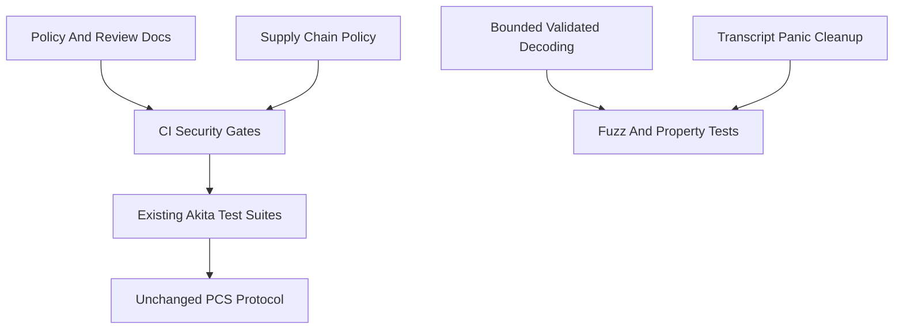

# Spec: Security Hardening

| Field       | Value                    |
|-------------|--------------------------|
| Author(s)   | Quang Dao, Cursor        |
| Created     | 2026-05-14               |
| Status      | proposed                 |
| PR          | #81                      |

## Summary

This change strengthens Akita's security posture without changing the polynomial commitment protocol.
It adds explicit disclosure and review process, supply-chain checks, fuzz and property-test entry points, bounded validated vector decoding, and CI gates for hygiene, portability, and proof-size drift.
The goal is to make security-sensitive changes easier to review while removing a concrete verifier-facing denial-of-service risk.

## Intent

### Goal

Build a security hardening layer around the existing Akita workspace by adding policy documents, CI checks, fuzz targets, bounded deserialization, and review checklists while preserving the current prover, verifier, transcript, and proof-format semantics.

### Invariants

- Verifier acceptance behavior must not change for existing valid proofs.
  The non-zk and all-features `cargo nextest` suites protect this.
- Existing Fiat-Shamir transcript framing for current labels must remain byte-for-byte compatible.
  The bounded-L1 reference vector and transcript framing tests protect this.
- Transcript labels remain one-byte-framed internal protocol labels.
  Serialization into the transcript remains fail-fast because there is no safe way to continue after transcript serialization fails.
- Validated deserialization of self-described vectors must not allocate from attacker-controlled lengths without a generic cap.
  `akita-serialization` tests and the `serialization_vec` fuzz target protect this boundary.
- Unchecked deserialization remains available only as a trusted internal API.
  The contract is documented on the unchecked methods and in `docs/security-posture.md`.
- Crate dependency direction remains unchanged.
  `scripts/check-crate-deps.sh` and `cargo machete --with-metadata` protect this.
- Supply-chain policy must make current Git dependencies and advisories visible.
  `cargo deny check bans licenses sources advisories` and `cargo audit` protect this.
- Performance gates must not block on noisy runtime timing.
  The benchmark workflow gates only stable proof-size regressions when a main baseline artifact exists.

### Non-Goals

- This does not audit or rewrite the SIMD, NTT, or wide-arithmetic unsafe kernels.
- This does not change Akita proof formats, setup formats, transcript labels, or verifier semantics.
- This does not remove the current Jolt and arkworks Git dependencies.
- This does not make every benchmark result a merge-blocking signal.
- This does not introduce a full `cargo vet` policy or SBOM release pipeline.

## Evaluation

### Acceptance Criteria

- [x] `SECURITY.md`, a PR template, and security posture documentation exist.
- [x] `deny.toml`, Dependabot, and security CI are configured.
- [x] Workspace lint policy is centralized and every crate opts into it.
- [x] Validated vector decoding rejects lengths above the default cap.
- [x] Transcript serialization and label handling preserve the existing fail-fast one-byte label contract.
- [x] Fuzz targets exist for serialization, transcript labels, and proof-shape decoding.
- [x] Property tests cover serialization round trips and canonical bool decoding.
- [x] CI includes Taplo, Machete, Typos, portability, fuzz, and proof-size regression checks.
- [x] The local verification command set passes.

### Testing Strategy

Run the existing Akita suites and the new security checks:

```bash
cargo fmt --all --check
taplo fmt --check
cargo clippy --all --all-targets --all-features -- -D warnings
cargo clippy --all --all-targets --no-default-features -- -D warnings
cargo nextest run --no-default-features --features parallel,planner,disk-persistence
cargo nextest run --all-features
cargo doc -q --no-deps --all-features
cargo deny check bans licenses sources advisories
cargo machete --with-metadata
typos
scripts/check-crate-deps.sh akita-verifier
scripts/check-crate-deps.sh akita-prover
scripts/check-crate-deps.sh akita-config
scripts/check-crate-deps.sh akita-setup
scripts/check-crate-deps.sh akita-scheme
cargo run -p akita-planner --bin akita-planner -- --validate
RUSTFLAGS="-D warnings -C target-cpu=x86-64" cargo check -p akita-verifier --no-default-features
rustup target add wasm32-unknown-unknown
cargo check -p akita-serialization --target wasm32-unknown-unknown
cargo +nightly fuzz list
cargo +nightly fuzz run serialization_vec -- -max_total_time=1
```

`cargo audit` should be run as well.
It currently reports the known unmaintained `paste` advisory through the arkworks Git dependency.
That advisory is documented in `deny.toml` and should be revisited when the arkworks fork upgrades or replaces `paste`.

### Performance

No prover, verifier, or proof-size improvement is expected.
The only merge-blocking performance check added here is a proof-size regression threshold in the onehot benchmark workflow.
The threshold compares `proof_size_bytes` against the main baseline artifact and fails only when the current proof size exceeds the baseline by more than 5%.
Runtime timing remains informational because it is noisy on shared CI runners.

## Design

### Architecture

The change adds security review and verification layers around the existing workspace:



The policy layer consists of `SECURITY.md`, `.github/pull_request_template.md`, `docs/security-posture.md`, and `docs/soundness-audit.md`.
The supply-chain layer consists of `deny.toml`, Dependabot, `security.yml`, `cargo audit`, and `cargo machete`.
The input-boundary layer is implemented in `akita-serialization`, where validated `Vec<T>` decoding now enforces `DEFAULT_MAX_SEQUENCE_LEN`.
The transcript boundary keeps the existing one-byte label length contract and fail-fast serialization behavior.
The fuzz target exercises labels inside that protocol contract rather than treating arbitrary-length byte strings as supported labels.

### Alternatives Considered

One option was to deny Jolt's full lint wall immediately, including undocumented unsafe blocks, `print_stdout`, and all pedantic lints.
That exposed a broad legacy cleanup in SIMD, planner, prover, and CLI code, so this spec chooses a staged policy instead.
The enforceable deny set now catches `dbg!`, `todo!`, and `unimplemented!`, while the unsafe audit and stricter panic policy remain explicit future work.

Another option was to remove suspected unused dependencies reported by `cargo machete`.
This change records explicit ignore metadata instead because dependency removal is a separate ownership decision and would distract from hardening.

## Documentation

New documentation:

- `SECURITY.md` for disclosure and scope.
- `docs/security-posture.md` for trust boundaries, unsafe policy, and resource-limit expectations.
- `docs/soundness-audit.md` for reviewer invariants and commands.
- `.github/pull_request_template.md` for security review prompts.
- This spec for review context.

## Execution

The implementation is intentionally incremental:

1. Add policy and supply-chain files.
2. Centralize workspace lint inheritance and add CI hygiene jobs.
3. Harden validated vector decoding and document unchecked decoding.
4. Preserve transcript label and serialization contracts while fuzzing the supported label domain.
5. Add fuzz and property tests for the first verifier-facing byte boundaries.
6. Add portability checks and a stable proof-size regression gate.

Follow-up work should perform a dedicated unsafe audit, decide whether to replace or vendor the current arkworks and Jolt Git dependencies, and evaluate `cargo vet` or SBOM generation once release packaging is defined.

## References

- `CONTRIBUTING.md`
- `docs/crate-graph.md`
- `specs/akita-pcs-crate-decomposition.md`
- Jolt-style security practices in `/Users/quang.dao/Documents/SNARKs/jolt`
- Binius64 portability and regression-test practices in `/Users/quang.dao/Documents/SNARKs/binius64`
