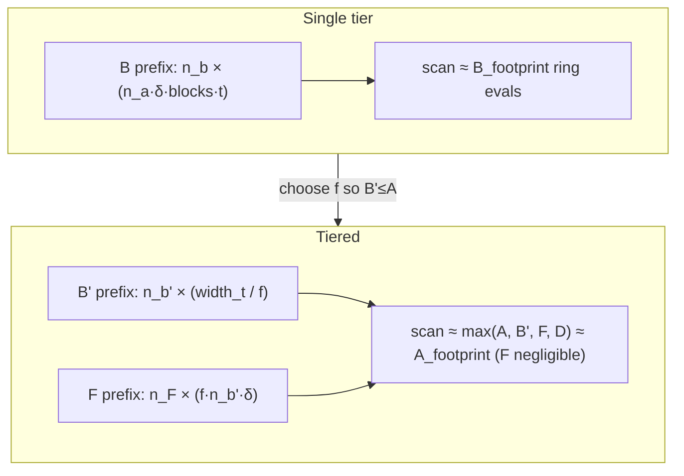

# Spec: Tiered Commitment (shrink the B preprocessing matrix below A)

| Field       | Value                          |
|-------------|--------------------------------|
| Author(s)   |                                |
| Created     | 2026-06-04                     |
| Status      | proposed                       |
| PR          |                                |

## Summary

Akita verification is dominated by evaluating the virtual relation matrix `M`
at a random ring point `alpha`. The heaviest part of that is the **setup
contribution** in
[`crates/akita-verifier/src/protocol/slice_mle/setup_contribution`](crates/akita-verifier/src/protocol/slice_mle/setup_contribution/evaluator.rs):
it scans the shared preprocessing matrix and evaluates one ring element per
covered entry. That scan length is

```text
required = max(A_footprint, B_footprint, D_footprint)
```

and `B_footprint = n_b · (n_a · delta_open · num_blocks · t_vectors)` is the
largest of the three for batched and high-block-count levels (it carries the
batch factor `t_vectors` and the block count `num_blocks`). `A` commits the
real witness and cannot shrink; `D` is always smaller than `A` in our regime.
So `B` is the lever.

**Tiered commitment** reuses a *smaller* `B` on `f` column-slices of the opening
witness `t̂` instead of one wide `B`:

```text
B · t̂_1 = u_1 , … , B · t̂_f = u_f      (same small B on each slice)
```

Sending the `u_i` in clear would inflate the proof, so we instead **commit**
them with a second-tier matrix `F`:

```text
u_final = F · decompose(u_1 ‖ … ‖ u_f)
```

The `u_i` become part of the witness; only `u_final` is sent (it replaces the
old commitment `u`). The planner chooses the smallest `f` whose shrunk
`B_footprint' <= A_footprint`, making `A` the bottleneck for the shared
preprocessing matrix. `F` commits to decomposed intermediate images `u_i`
(balanced digits), so it stays very small in practice — sizing `F` under `A` is
not a planner constraint and is not the optimization focus. Net effect: a smaller
shared preprocessing matrix, a faster verifier setup scan (≈ `f×` fewer ring
evaluations), and proof size that stays in check because `F` replaces clear
`u_i`.

This is gated by a new `CommitmentConfig` flag `TIERED_COMMITMENT` (default
`false`; tiering is off for all existing presets) and a new preset
`fp128::D64OneHotTiered` with the flag set. **Backward compatibility with
historical `main` is not claimed:** this branch also lands the K256 one-hot
schedule migration and a planner tie-break tweak (see Intent → Bundled planner
changes), so regenerated non-tiered tables differ from pre-PR `main` even when
`tiered == false`.

## Intent

### Goal

Add an opt-in second commitment tier (`F`) that lets the planner reuse a smaller
first-tier matrix (`B`) across `f` witness slices, sizing every level so the
shared preprocessing matrix is bounded by the inner matrix `A`, without sending
the intermediate images `u_i` in clear.

Key abstractions / surfaces introduced or modified:

- **`CommitmentConfig::TIERED_COMMITMENT: bool`** (`crates/akita-config/src/lib.rs`)
  — new associated const, default `false`. Threaded into the planner via
  `PlannerPolicy` and read by prover/verifier/commit. New preset
  `fp128::D64OneHotTiered` sets it `true`.
- **`LevelParams.f_key: Option<AjtaiKeyParams>`** and
  **`LevelParams.tier_split: usize`** (`crates/akita-types/src/layout/params.rs`)
  — the second-tier matrix dimensions and the split factor `f`. `tier_split == 1`
  and `f_key == None` is the non-tiered *relation layout* (single-tier A→B);
  it does not imply schedule bytes match pre-PR `main` (see bundled planner
  changes below).
- **Canonical row-offset helpers** on `LevelParams` — `effective_commit_rows`,
  `b_inner_rows_per_group`, `d_start`/`f_start`/`b_inner_start`/`a_start` — the
  single source of the `M`-row layout that every offset site must call (Part 3),
  plus the `effective_commit_rows` commitment-length selector used by every
  validator/proof-size site that means "length of the sent commitment".
- **`PlannerPolicy.tiered: bool`** (`crates/akita-planner/src/lib.rs`) +
  `policy_of` mapping (`crates/akita-config/src/lib.rs`). The planner DP
  (`crates/akita-planner/src/schedule_params.rs`) gains the per-level
  `f`-selection + `F`-sizing pass; `shipped_table`
  (`crates/akita-planner/src/resolve.rs`) gains a `tiered` discriminator.
- **A fourth role view `F`** of the existing shared flat matrix
  (`crates/akita-types/src/proof/setup.rs`, `crates/akita-config/src/proof_optimized.rs`)
  — `F` is a prefix `ring_view::<D>(n_F, width_F)` exactly like A/B/D; no new
  seed/label. `max_setup_len` includes the `F` and shrunk-`B` footprints.
- **Relation extension** — the virtual `M` row layout grows by an `F` block, and
  the `B` block changes role from *outer commitment* (public RHS `u`) to *inner
  consistency* (RHS `0`, image lives in the witness `w`). This is the existing
  A→B two-tier structure extended to A→B→F. Touches
  `crates/akita-prover/src/protocol/ring_relation*`,
  `crates/akita-types/src/setup_contribution.rs`,
  `crates/akita-types/src/proof/relation.rs`, and the verifier replay in
  `crates/akita-verifier/src/protocol/ring_switch.rs` /
  `crates/akita-verifier/src/protocol/batched.rs`.

### Invariants

- **Flag-off tiering is a no-op.** With `TIERED_COMMITMENT == false` the tiering
  pass is skipped: every level gets `tier_split == 1`, `f_key == None`, and the
  relation/setup layout collapses to single-tier A→B (no `F` block, no
  `B_inner`). This does **not** mean schedules or proofs are byte-identical to
  pre-PR `main` — see **Bundled planner changes** below. What stays true:
  tiering fields are inert when the flag is off, and `generated_tables.rs` /
  `regen_diff.rs` prove each shipped table matches the **current-branch** DP
  (not a diff against historical `main`).
- **B fits under A.** For every scheduled level under a tiered config,
  `n_b' · width_t' <= n_a · width_s` whenever a feasible `f` exists; and the
  resulting setup envelope `max_setup_len` equals the A footprint (not the B
  footprint). New planner assertion + test
  (`crates/akita-planner` unit test; `crates/akita-config` envelope test).
- **Composition binding.** `u_final = F · decompose((B·t̂_1) ‖ … ‖ (B·t̂_f))`
  binds `t̂` as strongly as the current `u = B · t̂`. The A→B→F composition is
  the existing A→B composition extended by one identical tier (same
  decompose-then-commit pattern, same overlapping shared-matrix prefix views),
  so its security argument is the same one A→B already relies on. Security
  review item; see Design → Security.
- **Prover/verifier symmetry.** A proof produced under a tiered config verifies
  under that config and is rejected under the non-tiered sibling and vice
  versa, because the `M` row count, the descriptor digest (`f_key`,
  `tier_split` are bound), and the commitment length (`u_final` vs `u`) differ.
  New e2e test `crates/akita-pcs/tests/tiered_e2e.rs`.
- **Verifier no-panic.** All new verifier-reachable sizing (planner `f`-search,
  `F` `AjtaiKeyParams::try_new`, setup-contribution `F`-block indexing,
  `LevelParams` validation, descriptor decode) rejects malformed input with
  `AkitaError`, never panics (AGENTS.md no-panic contract). New checked
  arithmetic mirrors the existing `setup_contribution.rs` `checked_mul`/
  `checked_add` style.
- **Transcript determinism.** No new absorb label is required: `u_final` plays
  the role the old `u` played (absorbed at commit time via `ABSORB_COMMITMENT`);
  the hidden `u_i` are never absorbed (they live only in `w`, like `ê`/`t̂`).
  Covered by the `logging-transcript` event-stream checks.
- **Single source of row offsets.** Every row-offset site
  (`m_row_count_for`, `compute_relation_quotient`/`generate_y`,
  `SetupContributionPlan::prepare`, `relation_claim_from_rows_extension`, the
  ring-switch row eval) computes block starts from the canonical helpers
  (`effective_commit_rows`, `f_start`, `b_inner_start`, `a_start`), never inline.
  Protected by a `LevelParams` unit test asserting the helpers equal the
  previously open-coded offsets for every shipped non-tiered preset.
- **Setup-contribution folding equivalence.** The folded `evaluate_direct`
  (one ring eval per stored `B'` entry + the `F` segment) equals the naive
  contribution over the explicit `blockdiag(B', …, B')` and explicit `F`.
  Protected by the materialized-equivalence test in
  `crates/akita-verifier/src/protocol/slice_mle/setup_contribution/tests.rs`.
- **Commitment-length selector consistency.** Every site that means
  "length of the sent commitment" uses `effective_commit_rows(lp)`; every site
  that means "rows of the first-tier matrix B" keeps `b_key.row_len()`. Protected
  by the cross-config rejection test (a length mismatch must reject) plus a
  grep-backed implementation checklist.

### Non-Goals

- **Tiering D.** `D` stays one tier. The mechanism generalizes to `D`
  identically, but we rely on `D_footprint <= A_footprint` in the target regime
  (see Design → Edge cases for the batched-`D` exception and how the planner
  reports it).
- **A third tier (F→G).** Out of scope; the design is structurally recursive but
  we add exactly one tier.
- **ZK blinding of the F tier.** The first cut targets the non-`zk` path; the
  `zk` feature interplay (the `zk_b_matrix`/`zk_d_matrix` blinding domains) is a
  follow-up. `tiered_e2e` is gated `#![cfg(not(feature = "zk"))]`.
- **Backward compatibility with pre-PR `main` schedules/proofs.** Per repo
  policy there is none. Bundled K256 migration + tie-break regenerate existing
  tables; tiered configs additionally change the sent commitment wire shape
  (`u_final` replaces `u`).

### Bundled planner changes (intentional, rides with this PR)

These land in the same branch as tiered commitment but are **independent of
`TIERED_COMMITMENT`**. They regenerate the existing schedule tables (including
`fp128_d64_onehot`) to new optima; the repo makes no backward-compatibility
guarantee.

1. **K256 one-hot schedules (`onehot_chunk_size = 256`).** fp128 D64 one-hot
   presets (`D64OneHot`, `D64OneHotTiered`) require `K = 256` one-hot chunks
   (`K/D = 4` ring elements per chunk). Witness norms in the planner use
   `nonzeros = ⌈D/K⌉` instead of `D`, which lowers SIS ranks and often picks
   smaller `log_basis` / `(m, r, n_a, n_b)` layouts — e.g. `fp128_d64_onehot`
   nv=32 singleton first fold on this branch: `log_basis: 2, n_a: 5, n_b: 1` vs
   pre-migration `main`: `log_basis: 3, n_a: 7, n_b: 2` (same `m_vars`/`r_vars`).
2. **`optimal_m_r_split` / schedule-DP tie-break.** Fold split search iterates
   `r` descending (`(1..reduced_vars).rev()` in
   [`digit_math.rs`](crates/akita-types/src/layout/digit_math.rs) and
   `(min_r_vars..=max_r_vars).rev()` in the root DP in
   [`schedule_params.rs`](crates/akita-planner/src/schedule_params.rs)). When
   fold-digit or proof-size scores tie, the first candidate wins — a
   deterministic tie-break bundled here. **Primary schedule deltas vs pre-PR
   `main` come from the K256 migration**, not this tie-break (e.g. nv=32
   singleton first fold keeps the same `m_vars`/`r_vars` but changes
   `log_basis`/`n_a`/`n_b`).

**Drift guard scope:** `crates/akita-config/tests/generated_tables.rs` compares
each shipped table against the **current-branch** pure DP for every covered
key. It catches table/expand regressions on this branch but **cannot** detect
divergence from historical `main`; that is expected and acceptable here.

**Tiered table format:** compact `GeneratedFoldStep` rows gain optional
`tier_split` / `n_f` columns for the new `fp128_d64_onehot_tiered` table.
Non-tiered tables are **regenerated** with the K256 migration (not left as
byte-identical copies of pre-PR `main`).

## Evaluation

### Acceptance Criteria

- [ ] `CommitmentConfig::TIERED_COMMITMENT` exists (default `false`);
      `fp128::D64OneHotTiered` sets it `true`; `policy_of` carries it.
- [ ] Planner emits `tier_split == 1` / `f_key == None` for every non-tiered
      preset when `TIERED_COMMITMENT == false`. Regenerated schedule tables
      (including `fp128_d64_onehot`) match the **current-branch** DP via
      `generated_tables.rs` / `regen_diff.rs`; they are **not** required to match
      pre-PR `main` (K256 migration + tie-break ride along).
- [ ] For `fp128::D64OneHotTiered`, for every scheduled level with a feasible
      split: `b_footprint' <= a_footprint` and
      `max_setup_matrix_size(...) == a_footprint` via **both** the per-level and
      the root-incidence-widening paths (skewed multipoint incidence exercised).
      (`F` is not required to fit under `A`; it commits decomposed `u_i` and
      stays small — the planner only searches on `B'`.)
- [ ] Canonical row-offset helpers exist on `LevelParams`; an invariant test
      asserts they equal the open-coded offsets for every non-tiered preset, and
      every row-offset site calls them.
- [ ] The setup-contribution materialized-equivalence test passes: folded
      `evaluate_direct` equals naive `blockdiag(B', …, B')` + explicit `F` for
      several `(f, n_b', width_t', n_F)`.
- [ ] `crates/akita-pcs/tests/tiered_e2e.rs` proves + serializes + verifies a
      tiered onehot D=64 instance (singleton and batched), and a cross-config
      rejection test passes (commitment-length / row-count mismatch rejects).
- [ ] `AKITA_MODE=onehot_fp128_d64_tiered cargo run --release --example profile`
      runs, prints the layout (showing `B < A`, the `F` row, the smaller
      `max_setup_len`), and reports a smaller verifier setup-contribution scan
      than `onehot_fp128_d64`.
- [ ] `cargo fmt`, `cargo clippy --all -- -D warnings`, `cargo test` green
      (and `--features zk` still builds; tiered e2e is non-zk-gated).

### Testing Strategy

- **New** `crates/akita-pcs/tests/tiered_e2e.rs`: tiered round-trip at a
  singleton and a same-point batch (so `t_vectors > 1` exercises the heavy `B`),
  plus a cross-config rejection (`D64OneHot` proof rejected by `D64OneHotTiered`
  and vice versa). Uses `run_on_large_stack` and the shared `common` fixtures.
- **New** planner unit tests in `crates/akita-planner`: `f`-selection picks the
  smallest power-of-two split that drops `B` under `A`; rank reduction
  (`n_b' <= n_b`) is observed; `F` is sized at the digit-range collision bucket;
  the no-feasible-split edge falls back to `tier_split == 1`.
- **New** envelope test in `crates/akita-config`: `max_setup_matrix_size` for the
  tiered preset equals the A footprint and is strictly smaller than the
  non-tiered sibling — for both a singleton key (per-level path) and a **skewed
  multipoint** key (root-incidence-widening path).
- **New** setup-contribution folding test (the correctness anchor): folded
  `evaluate_direct` == naive `blockdiag(B', …, B')` + explicit `F`.
- **New** row-offset helper invariant test: helpers equal the open-coded offsets
  for every non-tiered preset.
- **Must stay green:** all `Direct`-mode e2e suites (`single_poly_e2e`,
  `akita_e2e`, `multipoint_batched_e2e`, `batched_aggregated_e2e`,
  `transcript_hardening*`), the `setup_contribution` unit/equivalence fixtures,
  and the generated-table drift tests (table vs current-branch DP; tiering
  fields inert when `TIERED_COMMITMENT == false`).

### Performance

Direction and how to verify:

- **Shared matrix (`max_setup_len`):** strictly smaller for the tiered preset —
  drops from `~B_footprint` to `A_footprint`. Verify with the `print_layout`
  output and the new envelope test; compare `onehot_fp128_d64` vs
  `onehot_fp128_d64_tiered`.
- **Verifier setup contribution:** `required` (the scan length in
  `SetupContributionPlan::prepare` →
  [`evaluate_direct`](crates/akita-types/src/setup_contribution.rs)) drops from
  `max(D,B,A) ≈ B` to `max(D, B', F, A) ≈ A`, i.e. ≈ `f×` fewer
  `eval_ring_at_pows` calls. Verify with the profile harness (native and the
  `profile/akita-recursion` zkVM cycle counts on `akita_verify`).
- **Prover:** slightly *more* work — it still does the full `B` matvec (now `f`
  applications of the small `B`, same total) plus the new `F` matvec
  (`n_F · width_F`) plus decomposing `u_concat`. This is acceptable; the prover
  is not the optimization target.
- **Proof size:** approximately neutral. The sent commitment changes from `u`
  (`n_b` ring elements) to `u_final` (`n_F` ring elements) — usually `n_F` is
  small (the `F` width is small), so this is flat or slightly smaller. The
  recursive witness `w` grows by `width_F = f · n_b' · delta_open` ring elements
  (the hidden `û_concat`), which propagates into the next level's
  commit/terminal-direct cost. The planner's proof-size DP
  (`level_proof_bytes`, `w_ring_element_count_*`) accounts for this once the
  `F`/`B'` layout is wired in; report the measured delta from the
  `gen_schedule_tables` / profile comparison and keep it bounded.

If this regresses proof size beyond a small constant, the `f`-selection should
prefer the largest `f` that still satisfies `B' <= A`. (`F` is sized from
decomposed `u_i` and is not a sizing bottleneck in practice.)

## Design

### Background: the current commitment and where the cost is

One flat random vector `shared_matrix` backs all role matrices; each role is a
prefix `ring_view::<D>(rows, cols)` of it
([`crates/akita-types/src/proof/setup.rs`](crates/akita-types/src/proof/setup.rs)).
Per level (`LevelParams`,
[`crates/akita-types/src/layout/params.rs`](crates/akita-types/src/layout/params.rs)):

- `A` (inner): `n_a × width_s`, `width_s = block_len · delta_commit`
  (`decomposed_s_block_ring_count`).
- `B` (outer commitment): `n_b × width_t`,
  `width_t = n_a · delta_open · num_blocks · t_vectors`
  (`decomposed_t_ring_count`).
- `D` (prover): `n_d × width_w`, `width_w = delta_open · num_blocks · t_vectors`.

The commitment pipeline today is already **two-tier** (A then B):

```text
s ──decompose──▶ A·digits = t_rows ──decompose──▶ t̂ ──B──▶ u   (commitment, sent)
```

`u = B·t̂` has `n_b` ring elements. The verifier evaluates the `M` relation at a
random `alpha`; the dominant step is the setup-contribution scan whose length is
`required = max(A,B,D)` footprints
([`setup_contribution.rs:371`](crates/akita-types/src/setup_contribution.rs)).

The SIS sizing is monotone in width: `min_secure_rank(family, d, collision,
width)` is non-decreasing in `width`
([`crates/akita-types/src/sis/ajtai_key.rs`](crates/akita-types/src/sis/ajtai_key.rs)).
So a narrower `B` can take a **smaller rank** `n_b`, shrinking the footprint
super-linearly in `f`.

### The tiered idea

Split the columns of `B` into `f` equal slices and reuse the **same** small `B`
on each slice; commit the `f` partial images with a second-tier matrix `F`:


Equivalently `u_concat = blockdiag(B, …, B) · t̂` (the same `B` on each disjoint
slice), then `u_final = F · decompose(u_concat)`.

Splitting reuses `B`, so the setup matrix stores `B` **once** at the small size;
the verifier scans those small-`B` entries once and folds the `f` slice weights
into each entry's coefficient (the `eval_ring_at_pows` call — the expensive
`O(D)` step — runs once per stored entry, not `f` times).

### Part 1 — Config family, the flag, and the planner

#### 1a. The flag

Add to `CommitmentConfig` (`crates/akita-config/src/lib.rs`):

```rust
/// Enable the second commitment tier (matrix F). Default false → single-tier
/// (A→B) relation layout; tiering pass skipped (`tier_split == 1`, `f_key == None`).
const TIERED_COMMITMENT: bool = false;
```

It is read in exactly the places a behavioral discriminator must be read (the
same set the report identified for onehot/tensor):

- `policy_of::<Cfg>()` → `PlannerPolicy.tiered` (planner sizing).
- `shipped_table` discriminator (so a tiered policy never aliases the
  non-tiered table).
- Prover `commit` / `prove_batched` and verifier `batched_verify` (so they build
  / replay the F tier). Because the schedule already carries `tier_split` /
  `f_key` in `LevelParams`, most code branches on the *level params*, not the
  flag directly — the flag is only the planner input + the table discriminator.
- `bind_transcript_instance_descriptor` already digests the full schedule
  (`PlanSection::from_schedule`); since `LevelParams::append_descriptor_bytes`
  will serialize `f_key` and `tier_split`, the flag is bound transitively.

#### 1b. The new preset

`crates/akita-config/src/proof_optimized/fp128.rs`, mirroring `D64OneHot`
(Q128, D=64, onehot, `onehot_chunk_size = 256`) but with the flag set. Because
the macro `impl_proof_optimized_preset!` does not currently emit
`TIERED_COMMITMENT`, either (a) extend the macro with an optional trailing
`tiered` arg, or (b) write a small manual impl that reuses the shared
`proof_optimized_*` helpers and overrides only `TIERED_COMMITMENT`. Recommended:
extend the macro (one optional arg, defaulting false) to keep all presets
uniform.

```rust
// fp128.rs
#[derive(Clone, Copy, Debug, Default)]
pub struct D64OneHotTiered;

impl_proof_optimized_preset!(
    D64OneHotTiered, Field, Field,
    akita_types::SisModulusFamily::Q128, 64, 128, 1, 256,
    /* tiered = */ true
);
```

`policy_of` (`crates/akita-config/src/lib.rs`) gains
`tiered: Cfg::TIERED_COMMITMENT`, and `PlannerPolicy`
(`crates/akita-planner/src/lib.rs`) gains `pub tiered: bool`. The
`runtime_fallback.rs` invariant test that every `PlannerPolicy` field mirrors
the `Cfg` impl is extended for the new field.

#### 1c. The planner sizing (the core algorithm)

This runs inside the existing per-level derivation in
[`crates/akita-planner/src/schedule_params.rs`](crates/akita-planner/src/schedule_params.rs)
— both the recursive `derive_candidate_level_params` and the root
`compute_root_direct_level_params` / root branch of `find_schedule` build
`a_key`/`b_key`/`d_key` the same way (norm → width → `min_secure_rank` → key).
After those three keys are built, insert a **tiering pass** when
`policy.tiered`:

```text
let a_footprint = n_a * width_s;            // A column footprint
let b_footprint = n_b * width_t;            // current (single-tier) B
if !policy.tiered || b_footprint <= a_footprint {
    // keep current B; tier_split = 1, f_key = None
} else {
    // search f over powers of two that divide (num_blocks * t_vectors),
    // smallest first: pick the smallest f with b_foot' <= a_footprint
    for f in feasible_powers_of_two(num_blocks * t_vectors) {
        width_t' = width_t / f;                                  // shrink B width
        n_b'     = min_secure_rank(family, d, norm_t, width_t'); // rank may drop
        b_foot'  = n_b' * width_t';
        // F commits decompose(u_1 ‖ … ‖ u_f): width = f * n_b' * delta_open_F,
        // entries are balanced digits → digit-range collision bucket (norm_t).
        // F is very small (commits to u, not t̂); no f_foot <= a_footprint check.
        width_F  = f * n_b' * delta_open;                         // delta_open at this level
        norm_F   = rounded_up_collision_norm_t(family, d, log_basis);
        n_F      = min_secure_rank(family, d, norm_F, width_F);
        // accept the smallest f with b_foot' <= a_footprint
    }
    // store: b_key' = AjtaiKeyParams::try_new(family, n_b', width_t', norm_t, d)
    //        f_key  = AjtaiKeyParams::try_new(family, n_F, width_F, norm_F, d)
    //        tier_split = f
}
```

Notes and edge cases:

- **Why `f | (num_blocks · t_vectors)`:** `width_t = n_a · delta_open ·
  num_blocks · t_vectors`. Splitting along the "repeat" dimensions
  (`num_blocks`, `t_vectors`) keeps each slice structurally identical
  (`n_a · delta_open · (num_blocks·t_vectors/f)` columns), so "the same `B`
  applies to each slice" is well-defined. The relation indexing
  (`get_eq_indices_for_b` in `setup_contribution.rs`) already factors
  `digit / a_row / block`; the split is a clean partition of the
  block/claim index space.
- **Rank reduction is automatic.** `n_b' = min_secure_rank(..., width_t')`
  is monotone in width, so a narrower `B` never *needs* a larger rank and
  usually takes a smaller one — this is the "reduce its rank" the motivation
  calls out, achieved for free by re-querying the SIS floor at the smaller
  width.
- **`F` collision bucket.** `F` consumes balanced base-`2^log_basis` digits of
  `u_concat`, so its collision bound is the digit-range
  `rounded_up_collision_norm_t` (`2^log_basis − 1` rounded to a bucket) — the
  same bound the `B`/`D` roles already use. This is the crucial point that keeps
  `F` cheap: it is an ordinary Ajtai matrix over small digits, not over the
  large ring images `u_i`.
- **No feasible `f`.** If even the largest feasible `f` cannot get
  `b_foot' <= a_footprint` (e.g. `n_b'` never drops because the smallest width is
  still in the same SIS bucket and `n_b'·width_t' > a`), fall back to
  `tier_split = 1`, `f_key = None` for that level. The acceptance criterion is
  conditional on feasibility; a planner warning/log is emitted.
- **`F` sizing is not a search constraint.** `F` commits decomposed
  intermediate images `u_i` (balanced digits), so `n_F` and `width_F` stay very
  small in practice — typically `n_F = 1`. The `f`-search only requires
  `b_foot' <= a_footprint`; it does not cap `F` under `A` and does not fall back
  when `F` would exceed `A` (which has not been observed in shipped schedules).
- **Determinism.** The `f`-search is a pure function of `(policy, key, level
  geometry)` exactly like the rest of the DP, so prover and verifier (and a
  future shipped table) regenerate identical `LevelParams`.

#### 1d. `LevelParams`, descriptor, and `shipped_table`

- `LevelParams` (`crates/akita-types/src/layout/params.rs`) gains
  `f_key: Option<AjtaiKeyParams>` and `tier_split: usize`. `with_decomp` /
  `with_layout` / `params_only` / `log_basis_stub` initialize them to
  `None` / `1`. `append_descriptor_bytes` serializes `tier_split` and the
  optional `f_key` (so Fiat-Shamir binds the tier).
- `shipped_table` (`crates/akita-planner/src/resolve.rs`) keys on
  `policy.tiered`: tiered presets select `fp128_d64_onehot_tiered`; non-tiered
  presets keep their existing tables (`fp128_d64_onehot`, etc.), **regenerated**
  on this branch for K256 + tie-break (not byte-identical to pre-PR `main`).
  Compact `GeneratedFoldStep` rows add optional `tier_split` / `n_f`; non-tiered
  entries store `None` / `None` and expansion leaves `tier_split == 1`.
- The setup envelope has **two** paths in
  [`crates/akita-config/src/proof_optimized.rs`](crates/akita-config/src/proof_optimized.rs)
  and **both** must account for `F`/`B'`:

  1. **Per-level envelope** (`accumulate_matrix_envelope_for_level`, summed over
     `setup_level_params_from_runtime_schedule`). Today it takes
     `max(a_len, b_len, d_len)` with `b_len = b_key.row_len() · outer_width()`.
     It becomes:

     ```text
     level_footprint = max(a_len, b'_len, d_len, f_len)
     b'_len = lp.b_key.row_len() · lp.outer_width()          // b_key now holds B' dims
     f_len  = lp.f_key.map(|fk| fk.row_len() · fk.col_len()).unwrap_or(0)
     ```

     With `tier_split == 1` / `f_key == None`, `f_len = 0` and `b'_len` is the
     current single-tier `b_len` (relation layout unchanged; schedule bytes may
     still differ from pre-PR `main` — see bundled planner changes).

  2. **Root incidence widening** (`accumulate_root_matrix_envelope_for_incidence`
     → `root_runtime_matrix_len_for_incidence`). This is a *separate* path that
     re-derives the root `B`/`D` widths from the live `ClaimIncidenceSummary`
     (`num_claims`, `max_group_poly_count`) rather than from the schedule's
     stored `outer_width()`, so skewed multipoint incidence is sized at its true
     worst case. The tiered version must re-derive the same way and add `F`:

     ```text
     // existing: t_cols_per_vector = n_a · delta_open · num_blocks
     //           b_width = max_group_poly_count · t_cols_per_vector
     b'_width = b_width / tier_split                          // shrunk B' at the root
     b'_len   = lp.b_key.row_len() · b'_width
     f_width  = tier_split · lp.b_key.row_len() · delta_open  // decompose(u_concat)
     f_len    = effective_commit_rows(lp) · f_width           // = n_F · f_width
     return max(b'_len, d_len, f_len)
     ```

     Both `b'_width` and `f_width` use the *incidence-derived* `num_claims` /
     `max_group_poly_count`, not the schedule snapshot, so the batched root
     envelope shrinks for tiered configs exactly as the per-level path does.
     With `tier_split == 1` this reduces to the current `max(b_len, d_len)`.

  The envelope-shrinks test must cover a **skewed multipoint** incidence (so the
  root-widening path is exercised), not only a singleton.

### Part 2 — Matrix F in setup

`F` is a fourth role drawn from the **same** `shared_matrix` flat vector as
A/B/D — no new seed, no new label
([`derive_public_matrix_flat`](crates/akita-types/src/proof/setup.rs) keeps the
single `"shared"` label). At runtime the verifier/prover take
`shared_matrix.ring_view::<D>(n_F, width_F)` for `F`, the same way they take the
A/B/D prefix views. Because all role views are prefixes of one vector and the
setup only allocates `max_setup_len = max over levels of max(a,b',d,f)`, adding
`F` does **not** grow the shared matrix once `B'` is chosen so `b_foot' <= a_footprint`
(`F` is negligible next to `A` in practice).

Concretely:

- `AkitaExpandedSetup` is unchanged structurally; we only add an `f_view`
  accessor that mirrors the existing A/B/D views (e.g. in the prover's
  `compute.rs` NTT-slot path and the verifier's `ring_view` calls).
- The capacity computation (`proof_optimized_max_setup_matrix_size`) includes
  `f_len`. The setup roundtrip / size tests assert the shared matrix is exactly
  the A footprint for the tiered preset.

#### Security (review item)

The tiered commitment composes two SIS commitments that draw from the same
random flat vector: `u_concat = blockdiag(B)·t̂`, then
`u_final = F·decompose(u_concat)`. This is the *same* situation the current
scheme already lives in: today `A` and `B` are overlapping prefix views of the
single flat vector and are composed (`B` is applied to a decomposition of
`A`'s output). The A→B→F chain extends that by one identical tier. The binding
argument is therefore the existing one: each role view is a deterministic
reshape of random-oracle output and is treated as an independent uniform Ajtai
matrix; a collision in the composed commitment yields a collision in one tier's
matrix at that tier's audited collision norm.

Two points to confirm in review (the spec does not assume them silently):

1. **Reusing one `B` across `f` slices** = a block-diagonal `[B … B]`; a
   collision in the block-diagonal map is a collision in `B` on some slice, at
   the `B` collision norm. This is standard for shared-matrix Ajtai and matches
   how `B` already maps multi-block/multi-claim `t̂` jointly today.
2. **Same-flat-vector overlap of `B` and `F`.** If a conservative variant is
   preferred, `F` can instead use a separate domain label (as the `zk_*`
   matrices do) at the cost of a slightly larger stored setup. The spec's
   default follows the explicit request to reuse the shared flat matrix; the
   separate-label variant is the listed alternative.

### Part 3 — Relation update and end-to-end flow

The current virtual `M` row layout
([`params.rs:309`](crates/akita-types/src/layout/params.rs),
[`relation_quotient.rs:376`](crates/akita-prover/src/protocol/ring_relation/relation_quotient.rs))
is:

```text
consistency(1) | public(num_points) | D(n_d) | B(n_b·num_commitments) | A(n_a)
```

where `B`'s public RHS in `y` is the commitment `u`, and `A` is an *inner
consistency* block (RHS 0) tying the decomposed inner rows `t̂` (in `w`) back to
`A·decompose(s)`.

Tiering generalizes this by one tier. The new layout is:

```text
consistency(1) | public | D(n_d_active)
              | COMMIT(effective_commit_rows·nc) | B_inner(b_inner_rows·nc) | A(n_a)
```

where `COMMIT` is the **commitment block** (its RHS in `y` is the sent
commitment): the `F` block (`n_F` rows) when tiered, the `B` block (`n_b` rows)
when not. `B_inner` is the new inner-consistency block, present only when tiered.
With `tier_split == 1` / `f_key == None` this is bit-identical to
`consistency | public | D | B | A`.

Block roles:

- **`COMMIT` block.** Tiered: `F · û_concat = u_final` with public RHS `u_final`
  (the commitment, absorbed via `ABSORB_COMMITMENT`) and `û_concat =
  decompose(u_1 ‖ … ‖ u_f)` hidden in `w`. Non-tiered: `B · t̂ = u` exactly as
  today. The verifier evaluates the matrix image at `alpha` via the
  setup-contribution scan over that role's prefix.
- **`B_inner` block (tiered only).** Enforces `recompose(û_concat) = (B·t̂_1 ‖ …
  ‖ B·t̂_f)`, tying the hidden `û_concat` back to the small-`B` images of the `f`
  slices. RHS `0`. Structurally identical to today's `A` block (an inner-tier
  consistency between a decomposition in `w` and a matrix image), one tier out.
- **`A`, `D`, consistency, public:** unchanged.

So the *only* conceptual change is: the old `B` block (public-RHS outer
commitment) splits into a new `F` outer-commitment block plus a `B_inner`
consistency block, mirroring how `A` is already an inner tier under `B`.

#### Canonical row-offset helpers (normative)

The current offsets are open-coded at three sites with the same
`consistency | public | D | B | A` arithmetic:
`LevelParams::m_row_count_for`
([`params.rs:329`](crates/akita-types/src/layout/params.rs)),
`compute_relation_quotient` / `generate_y`
(`d_start = 1 + num_public; b_start = d_start + n_d_active; a_start = b_start +
commitment_row_count` in
[`relation_quotient.rs:376`](crates/akita-prover/src/protocol/ring_relation/relation_quotient.rs)),
and `SetupContributionPlan::prepare`
(`d_start = 1 + num_public_rows; b_start = d_start + n_d_active; b_rows = n_b ·
num_points; a_start = b_start + b_rows; a_end = a_start + n_a` in
[`setup_contribution.rs:348`](crates/akita-types/src/setup_contribution.rs)).
The verifier ring-switch row eval (`prepare_ring_switch_row_eval` /
`RingSwitchDeferredRowEval::eval_at_point`) reconstructs the same offsets.

Define one set of canonical helpers on `LevelParams` (so every site shares them
and the offsets are computed in exactly one place):

```rust
// effective sent-commitment row count: F when tiered, else B.
fn effective_commit_rows(&self) -> usize {
    self.f_key.as_ref().map_or(self.b_key.row_len(), |fk| fk.row_len())
}
// inner B-consistency rows (per commitment group): 0 when not tiered.
fn b_inner_rows_per_group(&self) -> usize {
    if self.f_key.is_some() { self.tier_split * self.b_key.row_len() } else { 0 }
}
// absolute row starts for a given (num_public, num_commitments = nc):
fn d_start(num_public) -> usize        { 1 + num_public }
fn f_start(num_public, n_d_active)     { d_start(num_public) + n_d_active }        // COMMIT block
fn b_inner_start(num_public, n_d, nc)  { f_start(..) + effective_commit_rows()·nc }
fn a_start(num_public, n_d, nc)        { b_inner_start(..) + b_inner_rows_per_group()·nc }
fn m_row_count_for(nc, num_public, layout) { a_start(..) + a_key.row_len() }
```

For `tier_split == 1` / `f_key == None`: `effective_commit_rows == n_b`,
`b_inner_rows_per_group == 0`, so `f_start == d_start + n_d` (today's `b_start`),
`b_inner_start == a_start`, and `m_row_count_for` is unchanged. **Requirement:**
all four row-offset sites above (and `relation_claim_from_rows_extension`) must
call these helpers rather than recompute the layout inline; an invariant test
asserts the helper offsets equal the open-coded values for every shipped
non-tiered preset.

#### Commitment-length selector (normative)

Many sites currently price or validate the sent commitment against
`lp.b_key.row_len()` (the `b_key.row_len()` grep spans
`api/commitment.rs`, `ring_relation.rs`, `ring_switch/commit.rs`,
`ring_switch/evals.rs`, `batched.rs`, `levels.rs`, `ring_switch.rs`,
`levels/zk.rs`, `proof_size.rs`, `layout/proof_size.rs`, `proof_optimized.rs`,
`lib.rs`, `setup.rs`). Every site that means **"length of the sent commitment
`RingCommitment.u`"** must switch to `effective_commit_rows(lp)`; sites that
mean **"rows of the first-tier matrix B"** (the inner block, the B matvec width)
keep `b_key.row_len()`. Concretely:

- **Use `effective_commit_rows(lp)`** (sent-commitment length): commitment-shape
  validation in `api/commitment.rs` and `batched.rs`
  (`recommit_direct_witness_group`, `verify_root_direct_commitments_with_params`);
  the per-commitment proof-size term in
  [`proof_size.rs`](crates/akita-types/src/proof_size.rs) /
  [`layout/proof_size.rs`](crates/akita-types/src/layout/proof_size.rs) and
  `level_proof_bytes`; the `ABSORB_COMMITMENT` length check; the `COMMIT` block
  RHS length in `generate_y` / `relation_claim_from_rows_extension`.
- **Keep `b_key.row_len()`** (= `n_b'`, the first-tier matrix rows): the small-`B`
  matvec in `repeated_b`/`compute.rs`; the `B_inner` block row count (via
  `b_inner_rows_per_group`); the `B'` setup-envelope footprint; the ZK
  `b_blinding`/`zk_b_matrix` sizing.

A grep-backed checklist of the sites is part of the implementation step so none
is missed.

#### Witness `w` segment design (normative)

Adding the hidden `û_concat` is **not** a free "next to `t̂`" append: it changes
`RingRelationSegmentLayout`, `offset_r`, `w_ring_element_count_*`, the planner
proof-size pricing, and (under `zk`) the blinding offsets. Define it normatively.

`û_concat` is the balanced base-`2^log_basis` decomposition of the concatenated
slice images `u_1 ‖ … ‖ u_f`, per commitment group, summed over groups exactly
as `t̂` is. Its ring-element count is:

```text
u_len(lp, num_t_vectors) =
    tier_split · b_key.row_len() · num_digits_open · num_t_vectors    // = 0 if f_key == None
```

Note `tier_split · b_key.row_len() · num_digits_open` equals `f_key.col_len()`
(`width_F`), so `u_len` is `width_F · num_t_vectors`, consistent with the
setup-side `F` width.

Threading (each must add the `u_len` term; all are no-ops when `f_key == None`):

- **`RingRelationSegmentLayout`** ([`proof/ring_relation.rs`](crates/akita-types/src/proof/ring_relation.rs)):
  add `pub offset_u: usize`. Place the `û_concat` segment immediately after the
  `t̂` segment (`offset_u = offset_t + t_len`) and **before** the ZK blinding
  segments and `offset_r`. `segment_layout` recomputes `b_blinding_offset`,
  `d_blinding_offset`, and `offset_r` shifted by `u_len`. For `z_first` and
  non-`z_first` orderings the `u` segment travels with the `t̂` segment.
- **`w_ring_element_count_with_counts_for_layout_bits`**
  ([`schedule.rs:252`](crates/akita-types/src/schedule.rs)): add a `u_count`
  term to the sum `e_hat + t_hat + (+u_count) + z_pre + r`. The existing `r`
  term already grows automatically because `m_row_count_for` now counts the `F`
  and `B_inner` rows.
- **Planner proof-size pricing**: `level_proof_bytes`,
  `w_ring_element_count_*`, and `schedule_from_entry` already call
  `w_ring_element_count_*` and `m_row_count_for`, so they inherit the larger `w`
  once the helpers above include `u_count` and the `F`/`B_inner` rows — but the
  planner DP candidate witness lengths (`derive_candidate_level_params`,
  `find_schedule`'s `next_w_len`) must pass through the same updated function so
  the predicted next-level witness matches what the prover commits.
- **ZK blinding offsets** (`#[cfg(feature = "zk")]`): even though tiered e2e is
  non-zk, the offset arithmetic in `segment_layout`,
  `w_ring_element_count_with_counts_for_layout_bits`, and the
  `accumulate_zk_*` envelope helpers must be shifted by `u_len`/account for the
  `F` rows so the `zk` build stays correct and compiles. `u_concat` itself is
  **not** blinded in this spec (non-goal); only the *offsets* move.

#### Setup-contribution folding (normative — the correctness/speedup hinge)

The verifier speedup *only* materializes if the stored small `B'` (one
`n_b' × width_t'` prefix) is scanned **once** while logically representing the
`f` row-groups of `blockdiag(B', …, B')`. This is the most delicate part and is
specified normatively here.

Today, `SetupContributionPlan::prepare` builds, for the `B` block, a weight per
stored `B` entry by combining (a) the M-row weight `eq_tau1[b_start + g·n_b +
row]` and (b) the column eq-MLE `t_eq_slice_per_group` indexed by
`get_eq_indices_for_b(...)`; `evaluate_direct` then does **one**
`eval_ring_at_pows(setup_flat[lambda], alpha_pows)` per stored entry and
multiplies by that weight. The fold must preserve "one ring eval per stored
entry".

Tiered folding. The stored `B'` entry sits at `(row i ∈ [0,n_b'), col k ∈
[0,width_t'))`. In the logical `blockdiag(B', …, B')` it appears in `f` slices
`j ∈ [0,f)` at logical row `j·n_b' + i` and logical column `j·width_t' + k`
(slice `j` reads slice `j`'s columns of `t̂`). So the folded coefficient for the
stored entry, per commitment group `g`, is the **sum over the `f` slices**:

```text
weight(g, i, k) = Σ_{j=0}^{f-1}
        eq_tau1[ b_inner_start + g·b_inner_rows_per_group + j·n_b' + i ]   // M-row weight
      · t_eq_slice_per_group[g][ j·width_t' + k ]                          // column eq-MLE of t̂ slice j
```

`evaluate_direct` then runs `eval_ring_at_pows(setup_flat[lambda_B' + i·width_t'
+ k], alpha_pows)` **once** and multiplies by `Σ_g weight(g,i,k)` — exactly one
ring eval per stored `B'` entry, so the scan length over the `B'` role is
`n_b' · width_t'` (not `f` times that). The `f` slices only add cheap field
multiply-adds to the per-entry coefficient.

The `F` block is an ordinary new role segment: scan the `F` prefix
(`n_F · width_F` entries) once, weighting each `F` entry by
`eq_tau1[f_start + g·n_F + row]` times the column eq-MLE of `û_concat` (a new
`u_eq_slice` built exactly like `t_eq_slice_per_group`, indexed by the
`offset_u` segment of `w`). `evaluate_direct`'s const-generic dispatch is
extended from `(has_d, has_b, has_a)` to include `has_f`; `required =
max(d_required, b'_required, a_required, f_required)`; the packed segment
endpoints (`push_role_boundaries`) gain the `F` role.

`materialize_bar_omega` / `evaluate_bar_omega_with_eq` (the stage-3 prover/zk
path) use the same folded weights, so prover and verifier agree.

**Required test (the correctness anchor):** a unit test in
[`setup_contribution`](crates/akita-verifier/src/protocol/slice_mle/setup_contribution/tests.rs)
that builds the *explicit* `blockdiag(B', …, B')` (the `f`-fold block-diagonal,
materialized) and the *explicit* `F`, computes the setup contribution the naive
way (full logical matrices, no folding), and asserts it equals the folded
`evaluate_direct` over the single stored `B'` prefix + `F` prefix, for several
`(f, n_b', width_t', n_F)`. This is the analogue of the existing
materialized-vs-direct equivalence fixtures and is the gate that the folding is
correct.

#### Prover changes

[`crates/akita-prover/src/protocol/ring_relation`](crates/akita-prover/src/protocol/ring_relation.rs)
and `ring_switch/coeffs.rs`:

- Commit path (`api/commitment.rs`, `compute.rs`): after computing the small-`B`
  images for the `f` slices (reuse `cyclic_digit_rows`/`repeated_b` with the
  small `B` width, looped `f` times), concatenate to `u_concat`, decompose to
  `û_concat`, and compute `u_final = F·û_concat`. `RingCommitment.u` now holds
  `u_final` (length `n_F`).
- `compute_relation_quotient` / `generate_y`
  ([`relation_quotient.rs`](crates/akita-prover/src/protocol/ring_relation/relation_quotient.rs)):
  insert the `F` block (RHS `u_final`) and turn the `B` block into a
  zero-RHS consistency block over the `f` slices, computing the corresponding
  `f_cyclic` and the `B`-vs-`û_concat` quotient rows via
  `quotient_from_cyclic_and_reduced`.
- `build_w_coeffs` (`ring_switch/coeffs.rs`): emit `û_concat` digit planes into
  `w` at the normative `offset_u` segment (see Witness `w` segment design),
  length `u_len`.
- `RingSwitchRelationRowsPlan` (`compute.rs`): carry `n_F`, `tier_split`, and the
  `û_concat` pointer; extend the fused kernel that currently produces
  `(d_cyclic, b_cyclic, a_quotients)` to also produce the `F` and split-`B`
  rows.

No new transcript label: `u_final` is absorbed at commit time exactly where `u`
was; `v` is still absorbed via `ABSORB_PROVER_V` before fold-challenge sampling;
the hidden `u_i`/`û_concat` are never absorbed (like `ê`/`t̂`).

#### Verifier changes

- **Setup contribution** (`crates/akita-types/src/setup_contribution.rs`):
  `SetupContributionPlanInputs` gains `n_f`, `tier_split`, and the `F`/`B_inner`
  offsets; `prepare` / `evaluate_direct` implement the folding defined in
  *Setup-contribution folding* above (one ring eval per stored `B'` entry, new
  `F` segment, `has_f` dispatch). Row offsets come from the canonical helpers
  (`f_start`, `b_inner_start`, `a_start`), not inline arithmetic.
- **Relation claim** (`crates/akita-types/src/proof/relation.rs`):
  `relation_claim_from_rows_extension` walks the `COMMIT` rows (RHS `u_final` /
  `u`, length `effective_commit_rows`) and the zero-RHS `B_inner` rows in the
  `eq_tau1` sum, using the canonical helpers.
- **Ring-switch replay** (`crates/akita-verifier/src/protocol/ring_switch.rs`):
  `RingSwitchDeferredRowEval::eval_at_point` adds the `F`-structured
  contribution alongside `e/t/z/setup/r` and derives all block offsets from the
  canonical helpers (so `a_start`/`b_inner_start` shift by the `F` block
  automatically).
- **Root-direct recompute** (`crates/akita-verifier/src/protocol/batched.rs`,
  `recommit_direct_witness_group`): recompute `u_final` from the witness via
  small-`B` (looped `f` times) → decompose → `F`, and compare to the proof
  commitment, replacing the single `u = B·t̂` recompute.

#### End-to-end example

- Add `onehot_fp128_d64_tiered` to
  [`crates/akita-pcs/examples/profile/modes.rs`](crates/akita-pcs/examples/profile/modes.rs)
  (a one-line `run_onehot_mode::<{ Cfg::D }, fp128::D64OneHotTiered>` wrapper),
  excluded from the default `all` sweep like the tensor mode. `print_layout`
  shows `B < A`, the `F` row, and the smaller `max_setup_len`.
- Add `crates/akita-pcs/tests/tiered_e2e.rs`: prove → `AkitaSerialize`
  round-trip → verify for singleton and same-point batch; plus cross-config
  rejection.

### Edge cases

- **`tier_split == 1` everywhere (flag on, no level benefits):** identical to
  flag-off behavior for those levels; `f_key == None`. The flag does not force
  tiering where `B <= A` already.
- **Batched `D` exceeds `A`:** `D_footprint = n_d · delta_open · num_blocks ·
  t_vectors` carries the batch factor; for very large `t_vectors` it can exceed
  `A`. In that case shrinking `B` alone does not make `A` the bottleneck. The
  planner detects `d_footprint > a_footprint` and logs that the shared matrix is
  `D`-bounded (tiering `D` is the same mechanism, listed as a non-goal /
  follow-up).
- **Terminal fold (`WithoutDBlock`):** `B`/`F` blocks still present; `D` block
  dropped. The `f`-search runs identically.
- **Tiny levels (`num_blocks · t_vectors` has few factors of two):** the
  feasible `f` set is small; the search may land on `tier_split == 1`. Correct
  and safe.
- **Overflow / malformed input:** every new width/footprint computation uses
  checked arithmetic; every emitted `F`/`B'` key goes through
  `AjtaiKeyParams::try_new` (audits the SIS floor and rejects zero/oversized
  dims); the verifier-side `SetupContributionPlan::prepare` validates the new
  offsets against `rows`/`eq_tau1.len()` as it already does for D/B/A.

### Architecture diagram (verifier setup scan, before vs after)



### Alternatives Considered

- **Send the `u_i` in clear (no `F`).** Simplest, but inflates the proof by
  `(f−1)·n_b'` ring elements per commitment — defeats the purpose. Rejected.
- **A separate stored matrix / label for `F`** (like `zk_b_matrix`). More
  conservative on the overlap question but enlarges the stored setup. Listed as
  the security-conservative fallback; the default reuses the shared flat matrix
  per the request.
- **A distinct `D64OneHotTiered` type with a manual impl vs a macro arg.** A
  manual impl works but duplicates the shared helpers; extending
  `impl_proof_optimized_preset!` with one optional `tiered` arg keeps presets
  uniform and is preferred.
- **Ship a `fp128_d64_onehot_tiered` generated table immediately.** Deferred:
  resolve through the DP fallback first (the planner already supports table
  misses), then ship a table once the layout is stable, mirroring how the tensor
  preset was added.

## Documentation

- This spec.
- `AGENTS.md` profiling note: add `onehot_fp128_d64_tiered` to the mode list.
- Crate docs: `LevelParams` (`f_key`, `tier_split`), `PlannerPolicy.tiered`,
  `CommitmentConfig::TIERED_COMMITMENT`, and the `setup_contribution` module
  header (the new `F` block) get doc comments.
- `book/src/how/verifying/matrix_evaluation.md` / `specs/setup-layout-repack.md` cross-reference
  the new tier in their "row layout" / "packed prefix" sections.

## Execution

Suggested implementation order (each step compiles + tests green before the
next; flag stays off until the relation is wired so intermediate steps are
no-ops for existing presets):

1. **Flag + policy plumbing (no behavior):** add `TIERED_COMMITMENT` (default
   false), `PlannerPolicy.tiered`, `policy_of` mapping, `shipped_table` tiered
   discriminator, and `fp128::D64OneHotTiered`. Extend `runtime_fallback.rs`.
   Confirm `generated_tables.rs` / `regen_diff.rs` green (table vs current DP).
2. **`LevelParams` fields + canonical helpers + descriptor:** add
   `f_key`/`tier_split` (defaults `None`/`1`); add `effective_commit_rows`,
   `b_inner_rows_per_group`, and the `d_start`/`f_start`/`b_inner_start`/
   `a_start` helpers; rewrite `m_row_count_for` on top of them; serialize
   `tier_split`/`f_key` in `append_descriptor_bytes`; thread through
   `with_decomp`/`with_layout`/`params_only`. Add the helper-vs-open-coded
   invariant test. Confirm flag-off levels omit tiered descriptor fields.
3. **Planner `f`-search + `F` sizing:** implement the Part 1c algorithm in
   `schedule_params.rs` (root + recursive); add planner unit tests. Regenerate
   schedule tables (K256 + tie-break may change non-tiered entries vs pre-PR
   `main`; drift tests compare table vs current-branch DP only).
4. **Setup envelope (both paths):** include `b'`/`f` footprints in
   `accumulate_matrix_envelope_for_level` **and** `root_runtime_matrix_len_for_incidence`;
   add the envelope-shrinks test for a singleton **and** a skewed multipoint key.
5. **Setup contribution `F` block + folding:** extend `SetupContributionPlanInputs`
   / `prepare` / `evaluate_direct` (and `materialize_bar_omega` /
   `evaluate_bar_omega_with_eq` for stage-3) with the `has_f` dispatch, the
   `F` segment, and the reused-`B'` slice folding (one ring eval per stored
   entry); route all row offsets through the canonical helpers. Land the
   materialized `blockdiag(B')` + `F` equivalence test **before** moving on — it
   is the correctness gate.
6. **Prover relation + commit:** F-tier in `compute`/`ring_relation`/`coeffs`,
   `RingCommitment.u = u_final`, `build_w_coeffs` writes `û_concat` at the
   normative `offset_u`; thread `u_len`/`offset_u` through
   `RingRelationSegmentLayout`, `w_ring_element_count_*`, and the `zk` offset
   arithmetic.
7. **Verifier relation + replay + root-direct recompute**, all offsets via the
   canonical helpers; apply the `effective_commit_rows` selector across the
   grep-backed site checklist (sent-commitment length vs first-tier-B rows).
8. **E2E + profile mode**; measure setup-scan and proof-size deltas.

Risks to resolve first: the security review of the A→B→F composition over the
shared flat matrix (Part 2 → Security); the setup-contribution folding (step 5
equivalence test) since it is the source of the verifier speedup; and the
`effective_commit_rows` selector audit (step 7) since a missed site silently
prices or validates the commitment incorrectly.

### Derived implementation contract (from code tracing)

Implementation status (this branch): steps 1–4 are complete and tested
(config/flag, `LevelParams` + canonical helpers + descriptor, planner
`f`-search/`F`-sizing, setup envelope both paths). The setup-contribution
folding **hinge** is proven by `setup_contribution::tests::reused_b_fold_matches_blockdiag`
(`fold_reused_b_weight`). The remaining steps 5(integration)–7 are specified
below at the code level; they are mutually consistent and validated only at the
e2e (`tiered_e2e`).

**Mirror principle.** The new outer commitment `F` mirrors the *old B-block*
exactly (cyclic image vs a public RHS); the demoted `B'` mirrors the *D-block*
(cyclic image vs a witness-recomposed RHS). So:

- **`F` block** (`n_f` rows/group, RHS = `u_final` public):
  `quotient_from_cyclic_and_reduced(F·û_concat[i] cyclic, u_final[i])` — copy of
  the existing B-block quotient arm.
- **`B_inner` block** (`tier_split·n_b'` rows/group, RHS = 0): for slice `j`,
  row `i`, `quotient_from_cyclic_and_reduced(B'·t̂_slice_j[i] cyclic,
  recompose(û_concat[j][i]))` — copy of the existing D-block arm, with the
  "reduced" side being the gadget-recompose of the `û_concat` segment (which the
  prover set equal to the negacyclic `B'·t̂_slice_j` at commit time).

**`û_concat` layout (normative).** Per commitment group `g`: the `tier_split`
slice images `u_concat = (B'·t̂_slice_0 ‖ … ‖ B'·t̂_slice_{f-1})` are
`tier_split·n_b'` ring elements ordered `[slice j][b'_row i]`; each is decomposed
into `num_digits_open` balanced planes, giving `û_concat` of
`width_f = tier_split·n_b'·num_digits_open` planes ordered `[slice][b'_row][digit]`.
In the witness `w`, `û_concat` is a **flat contiguous** segment at `offset_u`
(placed immediately after `t̂`, before the ZK blinding segments and `offset_r`);
its column-MLE is `u_eq[g][c] = eq_eval_at_index(full_vec_randomness,
offset_u + g·width_f + c)` (no block-carry, unlike `t̂`).

**Commit (root + recursive).** Where the single-tier path computes
`u = digit_rows(b_key.row_len(), b_input_digits)` (root
`commit_with_validated_params`; recursive `commit_w`), the tiered path computes,
when `params.f_key.is_some()`:
`for chunk in b_input_digits.chunks(b_key.col_len()) { u_concat.extend(digit_rows(b_key.row_len(), chunk)) }`,
then `û_concat = balanced_decompose(u_concat, num_digits_open)`,
then `u_final = digit_rows(f_key.row_len(), û_concat)` reading the `F` prefix of
the shared matrix (overlapping prefix, like A/B/D). `RingCommitment.u = u_final`.
`û_concat` is stored on `AkitaCommitmentHint` (new `u_concat_digits` field) so
`ring_switch_build_w` can emit it at `offset_u` and `compute_relation_quotient`
can use it for the `F`/`B_inner` arms.

**Setup contribution scan (verifier + prover stage-3).** When `tier_split > 1`,
disable `B` in the packed D/B/A scan and add two prefix scans (one
`eval_ring_at_pows` per stored entry):
- `F`: `for entry (row,col) in F prefix: w = Σ_g eq_tau1[f_start+g·n_f+row]·u_eq[g][col]`.
- `B_inner`: `for entry (row,col) in B' prefix:
  w = Σ_g Σ_j eq_tau1[b_inner_start+g·(f·n_b')+j·n_b'+row]·t_eq[g][j·width_small+col]`
  (this is `fold_reused_b_weight`, reusing the existing `t_eq_slice_per_group`).
`required = max(d, a, f_required, b_inner_required)` (with `B'` bounded by
`A` via the planner; `F` is small because it commits decomposed `u_i`). Plus a
structured `-recompose(û_concat)` term for the `B_inner` RHS,
analogous to the consistency-row `z` recompose.

**Verifier `eval_at_point`.** Add the `F`/`B_inner`/`û` contributions; derive all
block starts from the canonical helpers (`f_start`/`b_inner_start`/`a_start`).
`relation_claim_from_rows_extension`: COMMIT rows ← `u_final`, `B_inner` rows ← 0.
Root-direct `recommit_direct_witness_group`: recompute `u_final` via
small-`B'`→decompose→`F`. Apply `effective_commit_rows` across the
`b_key.row_len()` sites that mean "sent-commitment length".

## References

- Verifier setup contribution:
  [`crates/akita-types/src/setup_contribution.rs`](crates/akita-types/src/setup_contribution.rs),
  [`crates/akita-verifier/src/protocol/slice_mle/setup_contribution/evaluator.rs`](crates/akita-verifier/src/protocol/slice_mle/setup_contribution/evaluator.rs).
- Layout / SIS sizing:
  [`crates/akita-types/src/layout/params.rs`](crates/akita-types/src/layout/params.rs),
  [`crates/akita-types/src/sis/decomposition_digits.rs`](crates/akita-types/src/sis/decomposition_digits.rs),
  [`crates/akita-types/src/sis/ajtai_key.rs`](crates/akita-types/src/sis/ajtai_key.rs),
  [`crates/akita-types/src/sis/norm_bound.rs`](crates/akita-types/src/sis/norm_bound.rs).
- Planner:
  [`crates/akita-planner/src/schedule_params.rs`](crates/akita-planner/src/schedule_params.rs),
  [`crates/akita-planner/src/resolve.rs`](crates/akita-planner/src/resolve.rs),
  [`crates/akita-planner/src/lib.rs`](crates/akita-planner/src/lib.rs).
- Config:
  [`crates/akita-config/src/lib.rs`](crates/akita-config/src/lib.rs),
  [`crates/akita-config/src/proof_optimized.rs`](crates/akita-config/src/proof_optimized.rs),
  [`crates/akita-config/src/proof_optimized/fp128.rs`](crates/akita-config/src/proof_optimized/fp128.rs).
- Relation / prover / verifier:
  [`crates/akita-prover/src/protocol/ring_relation/relation_quotient.rs`](crates/akita-prover/src/protocol/ring_relation/relation_quotient.rs),
  [`crates/akita-types/src/proof/relation.rs`](crates/akita-types/src/proof/relation.rs),
  [`crates/akita-verifier/src/protocol/ring_switch.rs`](crates/akita-verifier/src/protocol/ring_switch.rs),
  [`crates/akita-verifier/src/protocol/batched.rs`](crates/akita-verifier/src/protocol/batched.rs).
- Prior art: `book/src/how/verifying/matrix_evaluation.md`, `specs/setup-product-sumcheck.md`,
  `specs/setup-layout-repack.md`, `specs/tensor-structured-folding-challenges.md`.
